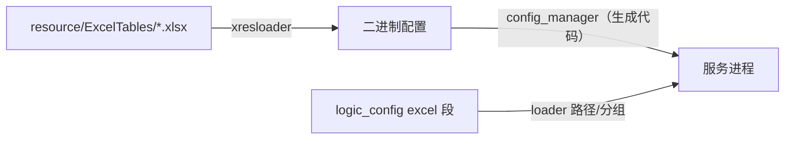

# 配置系统

框架有两条配置通道：**atapp YAML 配置**（实例启动参数）与 **Excel 策划配置**（数值表）。

## logic_config（YAML / atapp 配置）

`src/server_frame/config/include/config/logic_config.h`：`logic_config` 单例把 atapp 配置解析为
`logic_section_cfg`，包含 `db` / `router` / `task` / `telemetry` / `excel` 等段。服务通过
`logic_config::set_server_instance_config_loader` 注入本服务的配置加载回调（见各 `*_main.cpp`），
支持 reload。

部分字段支持环境变量表达式展开（`enable_expression`），语法见部署配置文档与
`.agents/skills/configure-expression/`。

## Excel 配置（xresloader）

策划表在 `resource/ExcelTables/`（Const.xlsx、DtMq.xlsx、Item.xlsx、Rank.xlsx 等），转换配置
`resource/excel_xml/xresconv.xml.in`；由 xresloader（`third_party/xresloader/`）按
`com.struct.*.config.proto`（带 `xrescode.loader` 选项的 proto）转出二进制配置。

加载链路：

- 生成的 `config/excel/config_manager.*`（`config_manager.*.mako`）按 proto 反射解析 buffer；
- `excel_config_wrapper`（`config/src/excel_config_wrapper.cpp`）负责 buffer/version loader、`reload_all`、
  按 version 分组热更与回调；
- 便捷读取 API 由 `config_easy_api.*.mako` 生成，业务侧用 `excel_config_wrapper_reload_all` 热更；
- 每组配置有索引类（`config/include/config/excel_config_*_index.h`，如 DTMQ 的 `DChannelConfigure`）。

## 服务实例配置

每个实例的最终 YAML 由部署侧生成（atdtool 渲染 `install/**/cfg/*.yaml.tpl`，或本地 `gen_conf.py`），
关键段：

| 段 | 内容 |
| --- | --- |
| `atapp` / `atproxy` | bus id、discovery（etcd）、connector |
| `logic.db` | Redis cluster/sentinel 连接 |
| `logic.router` | 路由对象 TTL、auto save 周期 |
| `logic.task` | task 超时等 |
| `logic.telemetry` | OpenTelemetry 导出 |
| `logic.excel` | 配置 loader 与分组 |
