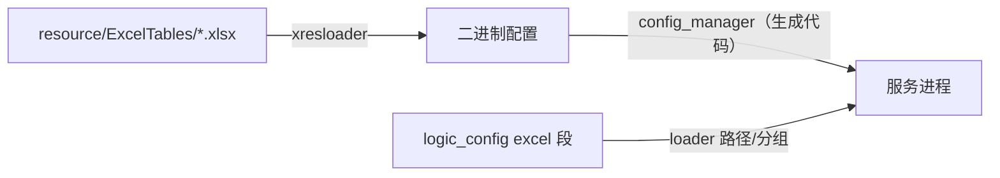

# 配置系统

框架有两条配置通道：**atapp YAML 配置**（实例启动参数）与 **Excel 策划配置**（数值表）。

## 快速上手

运行参数按[服务端配置](../development/server-config)修改 values；
数值表按[Excel 配置](../development/excel-config)编辑并导出。
两者都可沿用已有加载流程；下文说明加载、分组和配置段的设计。

## 定制与详细设计

### logic_config（YAML / atapp 配置）

`src/server_frame/config/include/config/logic_config.h`：`logic_config` 单例把 atapp 配置解析为
`logic_section_cfg`，包含 `db` / `router` / `task` / `telemetry` / `excel` 等段。服务通过
`logic_config::set_server_instance_config_loader` 注入本服务的配置加载回调（见各 `*_main.cpp`），
支持 reload。

部分字段支持环境变量表达式展开（`enable_expression`），语法见部署配置文档与
`.agents/skills/configure-expression/`。

### Excel 配置（xresloader）

策划表在 `resource/ExcelTables/`（Const.xlsx、DtMq.xlsx、Item.xlsx、Rank.xlsx 等）。
表格转换项登记在 `src/server_frame/protocol/public/xresconv.xml`；
`resource/excel_xml/xresconv.xml.in` 提供全局工具和路径配置。由 xresloader（`third_party/xresloader/`）按
`com.struct.*.config.proto`（带 `xrescode.loader` 选项的 proto）转出二进制配置。

加载链路：

```mermaid
flowchart LR
    X["resource/ExcelTables/*.xlsx"] -->|xresloader| B[二进制配置]
    B -->|config_manager（生成代码）| S[服务进程]
    L[logic_config excel 段] -->|loader 路径/分组| S
```

- 生成的 `config/excel/config_manager.*`（`config_manager.*.mako`）按 proto 反射解析 buffer；
- `excel_config_wrapper`（`config/src/excel_config_wrapper.cpp`）负责 buffer/version loader、`reload_all`、
  按 version 分组热更与回调；
- 便捷读取 API 由 `config_easy_api.*.mako` 生成，业务侧用 `excel_config_wrapper_reload_all` 热更；
- 普通索引由 loader 声明生成；`excel_config_*_index.h` 用于业务自定义派生数据，例如 DTMQ 的 `DChannelConfigure`。

### 服务实例配置

每个实例的最终 YAML 由 atdtool 渲染 `install/cloud-native/charts/**/cfg/*.yaml.tpl` 生成。
本地入口为 `generate_config.sh/.ps1`，输入是叠加的 values 配置，
关键段：

| 段 | 内容 |
| --- | --- |
| `atapp` / `atproxy` | bus id、discovery（etcd）、connector |
| `logic.db` | Redis cluster/sentinel 连接 |
| `logic.router` | 路由对象 TTL、auto save 周期 |
| `logic.task` | task 超时等 |
| `logic.telemetry` | OpenTelemetry 导出 |
| `logic.excel` | 配置 loader 与分组 |
