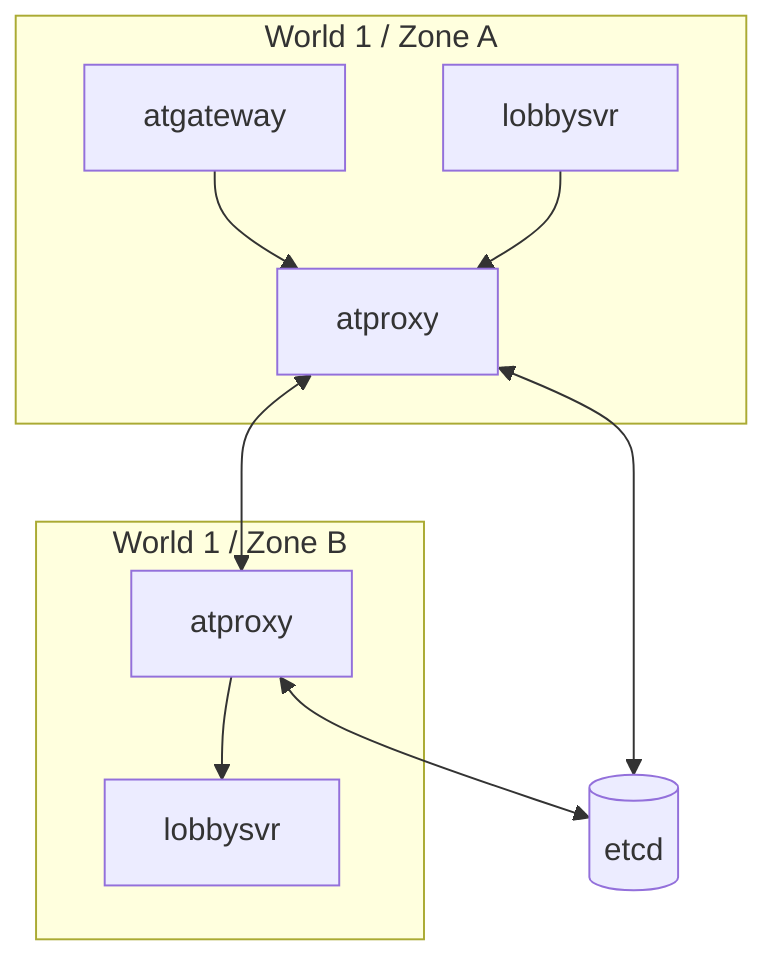

# 网关与代理（atgateway / atproxy）

## atgateway

位置：`atframework/service/atgateway`。客户端接入网关，职责：

- **密钥交换**：ECDH/DH 握手（也支持直连明文或不加密）；
- **加密与压缩**：会话级加密、可选压缩；
- **流量控制**：每个客户端独立的限流与握手超时；
- **路由切换**：支持客户端在逻辑服务间迁移（`send_set_router`）。

客户端协议为 FlatBuffers 定义的 **atgateway v2 协议**（规范见
`atframework/service/atgateway/protocol/PROTOCOL.md`），客户端侧 SDK 在 `atframework/export/` 与
`src/robot/atframework/`（`libatgw_protocol_sdk.fbs`）。

网关不解析业务消息体：上行时把 `CSMsg` 连同 `(gateway_node_id, session_id)` 封装为
`gateway::server_message` 经 atbus 投递给目标服务；下行时按 session 路由回客户端。

## atproxy

位置：`atframework/service/atproxy`。跨服务组代理：

- 使用 **etcd** 做服务发现与在线检测（lease + watch）；
- 不同 world/zone 的服务通过 atproxy 互相寻址与转发；
- 服务（含 atproxy 自身）通过 etcd 注册节点信息，`ss_msg_dispatcher` 的 discovery provider 据此解析
  目标节点。

调试工具：`src/tools/etcd-watcher`（watch etcd key 变化）、`src/tools/etcd-atproxy-ls`（列出注册的
atproxy 节点）。

## 连接拓扑

同 zone 内服务可直连（`enable_direct_connection` values profile），跨 zone 流量默认经 atproxy 转发。
