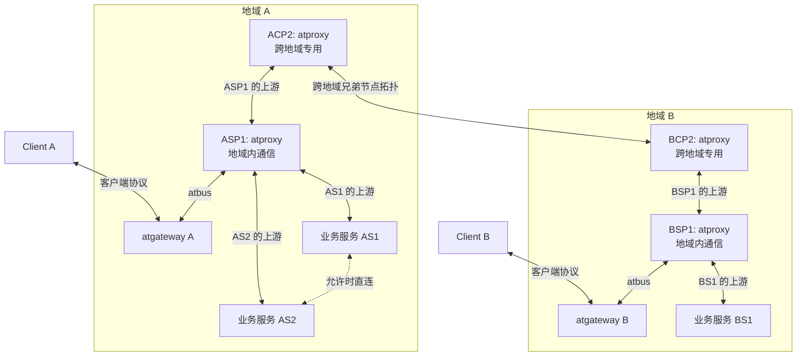
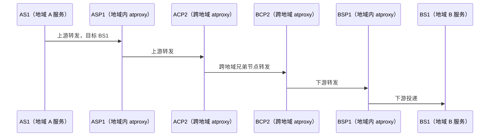
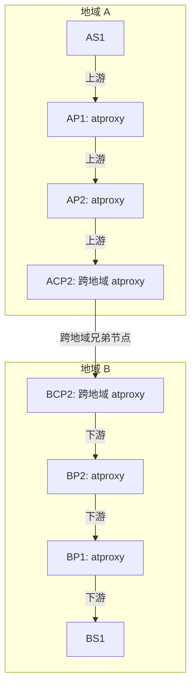

# 网关与代理（atgateway / atproxy）

## 快速上手

1. 按[运行与部署](../getting-started/run-deploy)启动 atgateway、atproxy 和目标业务服务。
2. 通过 values 配置 etcd 地址、网关监听和目标服务；用[robot](../services/robot)验证连接、登录与业务请求。
3. 普通接入使用已有网关协议 SDK，无需修改握手或通信模板。

## 定制与详细设计

### atgateway

位置：`atframework/service/atgateway`。客户端接入网关，职责：

- **密钥交换**：ECDH/DH 握手（也支持直连明文或不加密）；
- **加密与压缩**：会话级加密、可选压缩；
- **流量控制**：每个客户端独立的限流与握手超时；
- **路由切换**：支持客户端在逻辑服务间迁移（`send_set_router`）。

客户端协议为 FlatBuffers 定义的 **atgateway v2 协议**（规范见
`atframework/service/atgateway/protocol/PROTOCOL.md`），客户端侧 SDK 在 `atframework/export/` 与
`src/robot/atframework/`（`libatgw_protocol_sdk.fbs`）。

网关不解析业务消息体：上行时把 `CSMsg` 连同 `(gateway_node_id, session_id)` 封装为
`gateway::server_message` 经 atbus 投递给目标服务；下行时按 session 路由回客户端。

### atproxy

位置：`atframework/service/atproxy`。服务间通信代理：

- 使用 **etcd** 做服务发现与在线检测（lease + watch），发布节点及拓扑信息；
- 支持树形上下游关系：业务服务连接区域内 atproxy，atproxy 可以继续连接上级 atproxy；
- 支持跨国际大区域（地域）通信：各地域的专用 atproxy 作为地域内代理的上游，地域之间通过这些专用代理互通；
- 服务（含 atproxy 自身）通过 etcd 注册节点信息，`ss_msg_dispatcher` 的 discovery provider 据此解析目标节点，
  atbus 根据拓扑选择直连、上游或下游转发。

调试工具：`src/tools/etcd-watcher`（watch etcd key 变化）、`src/tools/etcd-atproxy-ls`（列出注册的
atproxy 节点）。

### 连接拓扑

Client 与 atgateway 建立客户端协议连接；atgateway 再通过 atbus 与业务服务通信。
atproxy 承担服务端节点间的转发。下图中的“地域”表示部署地域，可跨国家；它与业务 `world_id`、`zone_id`
没有固定的一一对应关系。

```mermaid
flowchart TB
    CA[Client A] <-->|客户端协议| GWA
    CB[Client B] <-->|客户端协议| GWB
    subgraph RegionA[地域 A]
      ACP2["ACP2: atproxy<br/>跨地域专用"]
      ASP1["ASP1: atproxy<br/>地域内通信"]
      GWA[atgateway A]
      AS1[业务服务 AS1]
      AS2[业务服务 AS2]
      ACP2 <-->|ASP1 的上游| ASP1
      ASP1 <-->|atbus| GWA
      ASP1 <-->|AS1 的上游| AS1
      ASP1 <-->|AS2 的上游| AS2
      AS1 <-.->|允许时直连| AS2
    end
    subgraph RegionB[地域 B]
      BCP2["BCP2: atproxy<br/>跨地域专用"]
      BSP1["BSP1: atproxy<br/>地域内通信"]
      GWB[atgateway B]
      BS1[业务服务 BS1]
      BCP2 <-->|BSP1 的上游| BSP1
      BSP1 <-->|atbus| GWB
      BSP1 <-->|BS1 的上游| BS1
    end
    ACP2 <-->|跨地域兄弟节点拓扑| BCP2
```

实线表示双向通信关系，虚线表示可选直连。地域内 AS1 与 AS2 可经共同上游 ASP1 通信，符合直连策略时也可直连；
atgateway 与业务服务也可按策略直连。etcd 提供发现与拓扑信息，业务消息不经过 etcd。

AS1 向 BS1 发请求时，在上述代理部署与连接策略下，逐跳路径为：

```mermaid
sequenceDiagram
    participant AS1 as AS1（地域 A 服务）
    participant ASP1 as ASP1（地域内 atproxy）
    participant ACP2 as ACP2（跨地域 atproxy）
    participant BCP2 as BCP2（跨地域 atproxy）
    participant BSP1 as BSP1（地域内 atproxy）
    participant BS1 as BS1（地域 B 服务）
    AS1->>ASP1: 上游转发，目标 BS1
    ASP1->>ACP2: 上游转发
    ACP2->>BCP2: 跨地域兄弟节点转发
    BCP2->>BSP1: 下游转发
    BSP1->>BS1: 下游投递
```

即 `AS1 -> ASP1 -> ACP2 -> BCP2 -> BSP1 -> BS1`。响应按反向路径返回；已有直连可缩短路径。

### 多级代理与部署配置

代理树可以继续增加层级。例如，AP1/BP1 负责服务所在的局部通信，AP2/BP2 汇聚地域内通信，ACP2/BCP2
专门负责跨地域连接。AS1 与 BS1 的路径相应扩展为：

```mermaid
flowchart TB
    subgraph RegionA[地域 A]
      AS1[AS1] -->|上游| AP1[AP1: atproxy]
      AP1 -->|上游| AP2[AP2: atproxy]
      AP2 -->|上游| ACP2[ACP2: 跨地域 atproxy]
    end
    subgraph RegionB[地域 B]
      BCP2[BCP2: 跨地域 atproxy] -->|下游| BP2[BP2: atproxy]
      BP2 -->|下游| BP1[BP1: atproxy]
      BP1 -->|下游| BS1[BS1]
    end
    ACP2 -->|跨地域兄弟节点| BCP2
```

普通使用只需按[服务端配置](../development/server-config)覆盖 values，无需修改 CMake 或模板：

- 用 `atapp.atbus.policy.remote_proxy` 设置节点的上游地址。使用显式上游时关闭 `enable_local_proxy`，
  避免本地代理设置优先覆盖它；地域内代理也可用此配置连接跨地域代理。
- 用 `atapp.atbus.configure.topology.rule` 和 `topology.data.label` 设置直连条件与拓扑标签。
  直连由 `allow_direct_connection`、标签等条件共同决定，不能仅凭“同 zone”判断。
- 跨地域专用代理需要可互达的监听地址及匹配的拓扑策略。atproxy 会注入 `atapp_type=atproxy` 标签；
  未指定 `atproxy_region` 时，会使用 `local` 并补充匹配条件。部署跨地域层时显式设置该标签及匹配规则，
  将地域内代理连接与跨地域代理连接按部署需求区分开。
- 生成配置后检查 `atapp.bus.proxy`、监听地址和 `topology`，再验证地域内、跨地域及反向请求。

配置默认值见 `install/cloud-native/values/default/global.yaml` 和 `atproxy.yaml`。
定制转发规则时再查阅 `atframework/service/atproxy/atproxy_manager.cpp`、
`atframework/libatbus/src/atbus_topology.cpp` 的 `get_relation`，以及 `atbus_node.cpp` 的下一跳选择实现。
