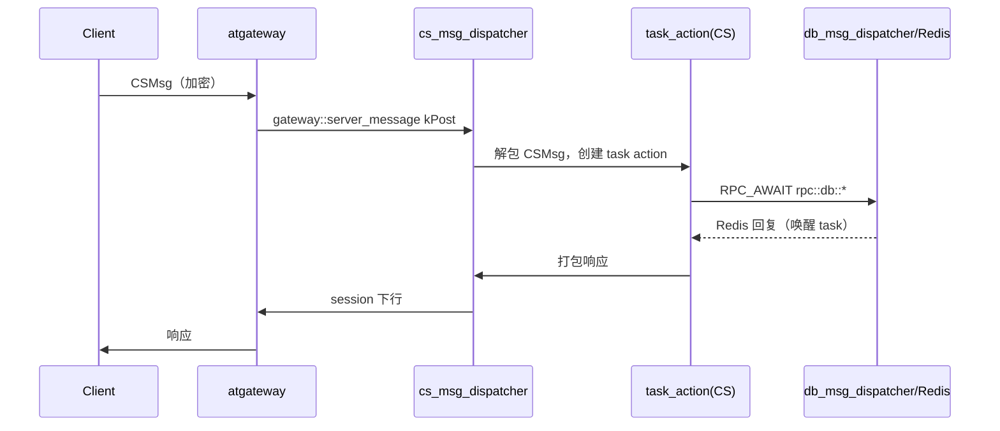

# 消息流与线程模型

## 事件循环

每个服务进程的 main（如 `src/lobbysvr/service/app/lobbysvr_main.cpp`）执行：

1. 构造 `atfw::atapp::app`；
2. `logic_server_setup_common`（`src/server_frame/logic/logic_server_setup.cpp`）装配公共模块、事件回调与
   service discovery 索引；
3. `app.add_module(cs_msg_dispatcher::me(), ss_msg_dispatcher::me(), db_msg_dispatcher::me(), 业务module...)`；
4. `app.run(uv_default_loop(), argc, argv, nullptr)`。

所有 atbus 收发、Redis 回复、定时器、DNS 查询都在这一个 libuv loop 上回调；耗时操作一律封装为协程 task，
`co_await`（或 libcopp 等价宏）挂起等待，由 dispatcher 按 `task_id + sequence` 唤醒。

## 客户端消息流（CS）

`cs_msg_dispatcher` 处理 `gateway::server_message` 四类：`kAddSession`（创建 session）、`kPost`（上行消息，
启动 CS task action）、`kRemoveSession`（登出）、`kSetRouterRsp`。下行由 `session::send_msg_to_client` /
`cs_msg_dispatcher::send_data / broadcast_data / send_kickoff / send_set_router` 回传 atgateway。

## 服务间消息流（SS）

- 调用端代码由 `rpc_call_api_for_ss.*.mako` 生成：组装 `SSMsg` → `ss_msg_dispatcher::send_to_proc`（按
  bus id / 名字 / discovery node）→ `app::send_message` → atbus；跨服务组可经 atproxy 转发。
- 支持 unary / stream / no-wait / broadcast / metadata / user / router 变体；broadcast 可按 type、zone、
  metadata 索引寻址。
- 响应经 `internal::wait_and_unpack_ss_response` 按 `destination_task_id + sequence` 唤醒等待中的 task。
- `ss_msg_dispatcher` 内嵌 DNS lookup（`uv_getaddrinfo` + `custom_resume`），供按需解析对端地址。

## 数据库消息流

`db_msg_dispatcher` 基于 hiredis-happ 管理 Redis cluster 与 raw（sentinel）双通道连接，支持 SCRIPT LOAD 与
内嵌 Lua（CAS、KL 索引裁剪）；回复解包后唤醒对应 task。详见[数据层](data-layer)。

## 挂起/唤醒原语

| 原语 | 位置 | 用途 |
| --- | --- | --- |
| `rpc::wait` | `rpc/rpc_utils.h` | 等待 SSMsg / db_message（可带 timeout），支持多 waiter |
| `rpc::custom_wait` / `rpc::custom_resume` | `rpc/rpc_utils.h` | 按 type 地址 + sequence 挂起/唤醒（DNS、router 等自定义唤醒） |
| `rpc::async_invoke` | `rpc/rpc_async_invoke.h` | 把任意 callable 包装为真实 task 启动 |
| `RPC_AWAIT_*` / `RPC_RETURN_*` | `rpc/rpc_common_types.h` | 屏蔽 std-coroutine / libcopp 双实现差异的宏 |
