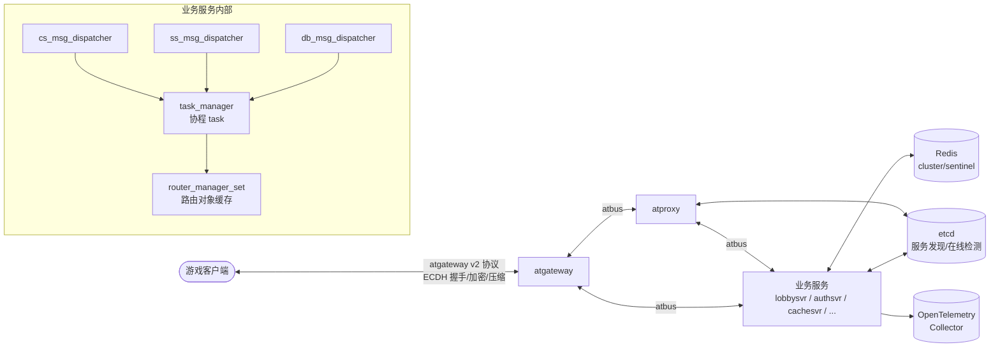

# 架构总览

## 组件关系

主链路：**Client → atgateway → atproxy → service → dispatcher → task action → data/DB**。

- **atgateway**（`atframework/service/atgateway`）：管理客户端连接，负责 ECDH/DH 密钥交换、加密、压缩、
  限流与路由切换。
- **atproxy**（`atframework/service/atproxy`）：跨服务通信代理，使用 etcd 做服务发现与在线检测。
- **业务服务**（`src/*svr/`、`src/component/*/`）：统一装配自 `src/server_frame/`，通过 dispatcher 将消息
  转为协程 task action 执行。

## 分层视图

| 层 | 位置 | 职责 |
| --- | --- | --- |
| 接入层 | atgateway / atproxy | 客户端接入、跨服转发、服务发现 |
| 框架层 | `src/server_frame/` | dispatcher、task、router、rpc、config、data、telemetry |
| 组件层 | `src/component/` | dtmq、distributed_transaction、rank、orbit 等可复用服务 + SDK |
| 业务层 | `src/*svr/` | 登录（authsvr）、大厅（lobbysvr）、缓存（cachesvr）等业务逻辑 |
| 数据层 | Redis（`db_msg_dispatcher`） | KV/KL/CAS 原语 + 由 `*.table.proto` 生成的 DB 接口 |
| 部署层 | `install/` | Helm chart / Docker / 裸机脚本，atdtool 渲染 |

## vendored 框架库（atframework/）

| 库 | 职责 |
| --- | --- |
| `atframe_utils` | 基础工具：日志、算法、协程封装、分布式系统原语（WAL 等） |
| `libatbus` | 服务器间通信总线 |
| `libatapp` | 服务器应用框架：模块管理、事件循环、配置、连接器 |
| `service/atproxy` / `service/atgateway` | 内置接入服务 |
| `cmake-toolset` | 跨平台 CMake 工具链与第三方 ports |

## 单线程协程模型

全仓库没有 worker 线程概念：所有 IO（atbus、Redis、定时器、DNS）都挂在同一个 libuv loop 上，业务并发完全
由协程 task 承载。`PROJECT_SERVER_FRAME_USE_STD_COROUTINE` 开关在 C++20 协程与 libcopp cotask 两套实现间
切换，由 `task_type_traits.h` 统一抽象，业务代码无需感知差异。
