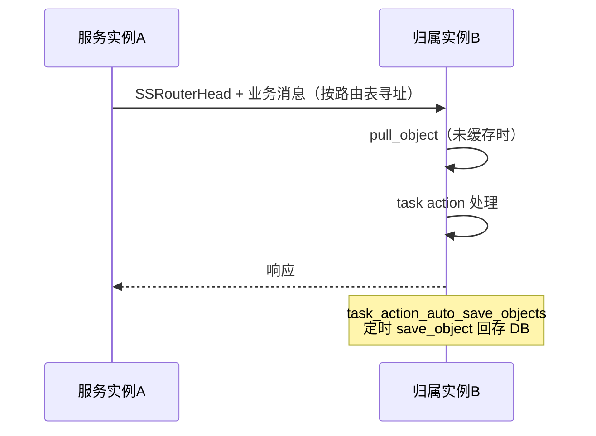

# 路由系统（router）

路由系统解决"有状态对象在哪个服务实例上"的问题：对象（如用户、队伍）按 key 路由到归属实例，并在内存中
缓存、定时回存。

## 核心类

| 类 | 位置 | 职责 |
| --- | --- | --- |
| `router_object_base` / `router_object<T>` | `src/server_frame/router/` | 路由对象基类：`pull_object`/`save_object`（协程 RPC）、TTL、降级 |
| `router_manager_base` / `router_manager<TCache, TObj, TPrivData>` | `router/router_manager.h` | 对象管理器：`mutable_cache`/`mutable_object`、事件回调 |
| `router_manager_set` | `router/router_manager_set.h` | 单例：按 type_id 管理全部 manager、auto save/close/transfer 定时器、metrics |
| `router_user_cache` / `router_user_manager` | `router/router_user_*` | 用户路由特化（`user_cache` 对象、`pull_online_server`） |

对象 key = `type_id + zone_id + object_id`。

## 对象存取

```cpp
auto mgr = router_manager_set::me()->get_manager<MyManager>(type_id);
// 拉取对象（未缓存则走 pull_object 协程 RPC 从 DB/源实例加载）
auto obj = RPC_AWAIT_TYPE_RESULT(mgr->mutable_object(ctx, zone_id, object_id));
// 修改后标记脏，由 task_action_auto_save_objects 定时回存（save_object）
```

- 同一 key 的 IO 经 `io_schedule_order_` 串行化，避免并发读写竞争；
- 对象有 TTL 与降级策略，长时间未访问自动关闭（`router_close_manager_set`）。

## 路由寻址与迁移

- 寻址**不是一致性哈希**：由 DB 路由表 + 在线探测决定归属实例，`router_manager_base::send_msg` 填充
  `SSRouterHead`，按路由缓存解析目标 server，物理传输仍走 `ss_msg_dispatcher::send_to_proc`；
- 迁移：`RouterService` 的 `router_transfer` / `router_update_sync` RPC（生成 handler 在
  `router/handle_ss_rpc_routerservice.atfw.gen.*`），配合 `task_action_router_transfer` /
  `task_action_router_update_sync` 完成对象在实例间的转移与路由表更新。

## 消息流


