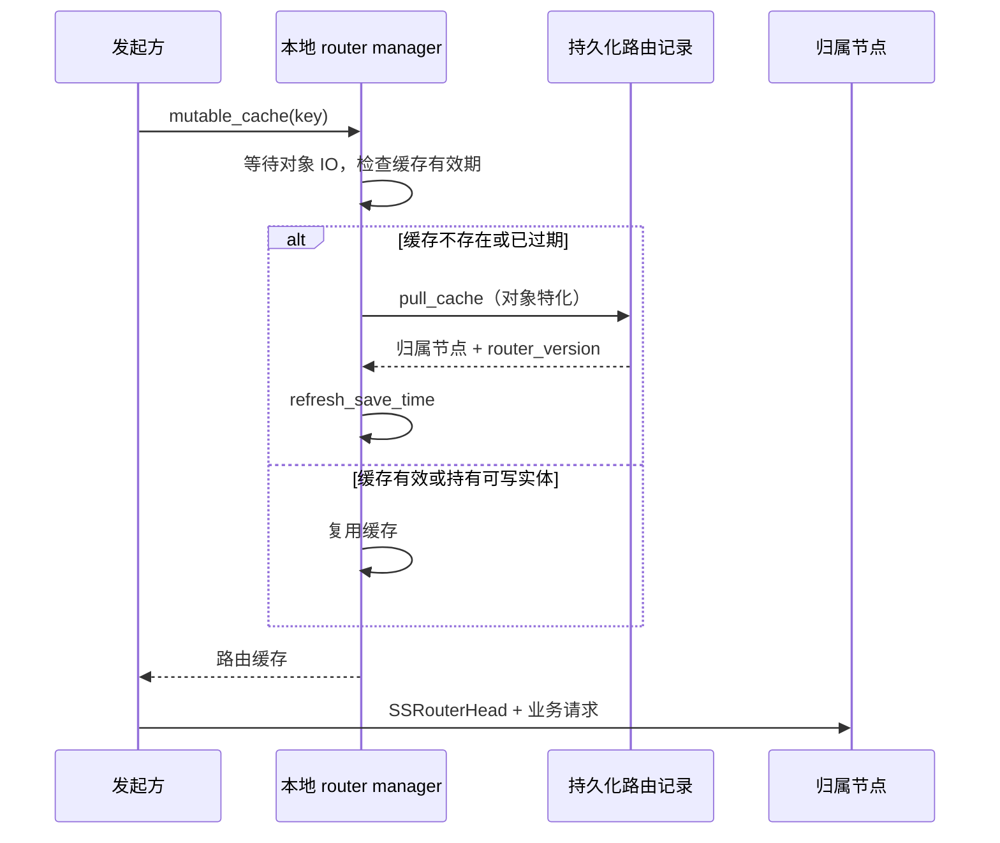
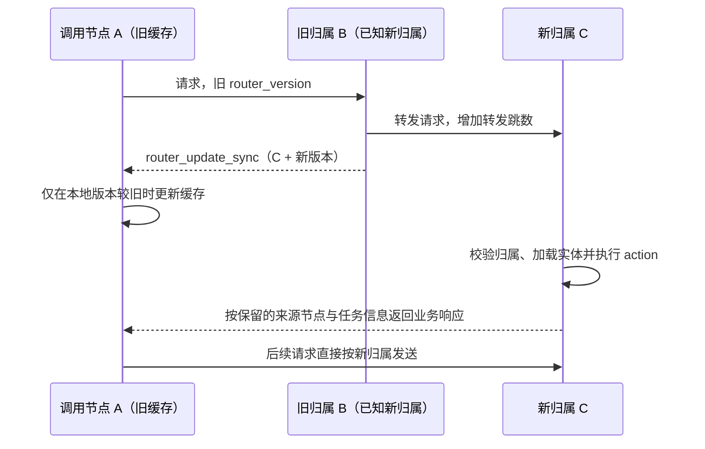
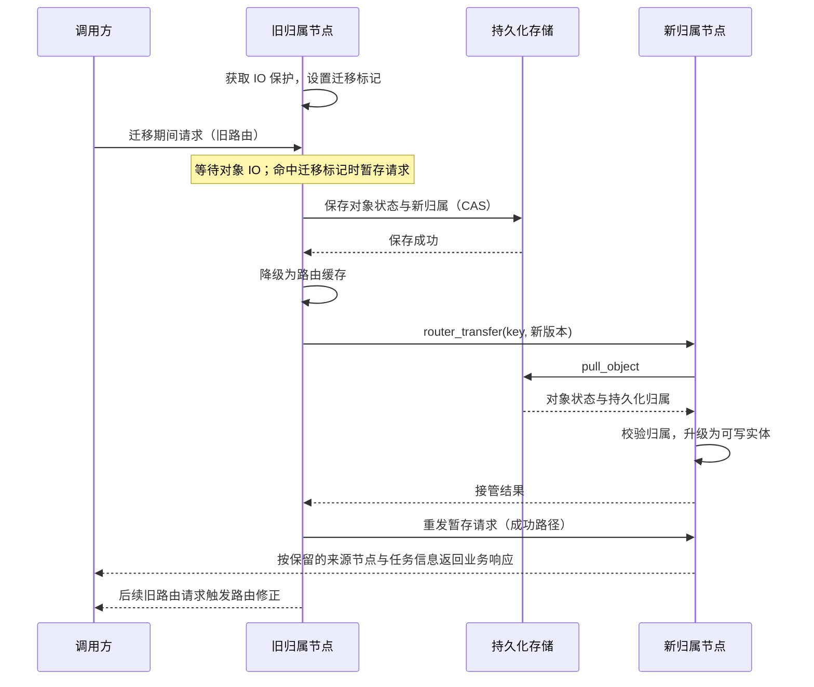
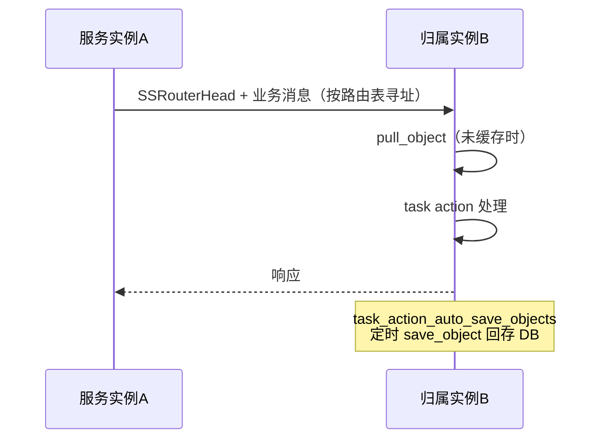

# 路由系统（router）

路由系统解决"有状态对象在哪个服务实例上"的问题：对象（如用户、队伍）按 key 路由到归属实例，并在内存中
缓存、定时回存。

## 快速上手

1. 使用已有服务 SDK 的路由接口，例如大厅用户或好友 SDK，沿用现有对象类型和 manager。
2. 在业务 action 中调用 SDK；通过[服务端配置](../development/server-config)调整已有路由 TTL 和保存周期。
3. 验证同一对象的读取、修改与保存。新增对象类型或改变迁移语义时，才需实现新的 router 特化。

## 定制与详细设计

### 核心类

| 类 | 位置 | 职责 |
| --- | --- | --- |
| `router_object_base` / `router_object<T>` | `src/server_frame/router/` | 路由对象基类：`pull_object`/`save_object`（协程 RPC）、TTL、降级 |
| `router_manager_base` / `router_manager<TCache, TObj, TPrivData>` | `router/router_manager.h` | 对象管理器：`mutable_cache`/`mutable_object`、事件回调 |
| `router_manager_set` | `router/router_manager_set.h` | 单例：按 type_id 管理全部 manager、定时保存、空闲回收、关闭任务与 metrics |
| `router_user_cache` / `router_user_manager` | `router/router_user_*` | 用户路由特化（`user_cache` 对象、`pull_online_server`） |

对象 key = `type_id + zone_id + object_id`。

### 对象存取

已有 manager 的 `mutable_object` 返回 `rpc::result_code_type`，通过输出引用返回对象。
调用时传入完整对象 key 和该 manager 要求的私有参数，并用 `RPC_AWAIT_CODE_RESULT` 检查结果。
`router_manager_set::get_manager(type_id)` 返回基类指针；类型专用调用沿用对应 SDK 的 manager 接口。
签名见 `src/server_frame/router/router_manager.h`；好友接入参照
`src/friendsvr/sdk/management/router/router_friend_manager.h`。

- 同一对象的拉取、保存、移除和迁移 IO 通过 `io_task_guard` 与 `io_schedule_order_` 排队。
  业务 action 中的其他操作仍需遵守对应服务的并发约束。
- `router_manager_set` 的定时器安排空闲对象降级、缓存回收与保存；进程关闭时，
  `task_action_router_close_manager_set` 批量保存并移除实体。

### 路由记录与寻址

路由记录保存对象的归属节点和 `router_version`。它在各服务节点上有本地缓存；只有归属节点持有可写实体。
持久化结构由对象特化决定：用户使用 `table_login_lock`，好友使用 `table_friend.router_lock`。
路由版本用于判断缓存的新旧，DB 的 CAS 版本用于保护持久化写入，两者不能混用。

`router_manager_base::send_msg` 获取路由缓存，把对象 key、路由版本和发送节点写入 `SSRouterHead`，
再通过 `ss_msg_dispatcher::send_to_proc` 发送。下层按直连或 atproxy 拓扑选择物理路径，见
[网关与代理](gateway-proxy)。对象路由决定“谁持有对象”，atproxy 拓扑决定“怎样到达该节点”。

已有对象按持久化归属寻址。对于允许自动创建实体、但尚无归属的对象，manager 可提供默认落点。
例如 `router_friend_manager::get_default_router_server_id` 使用服务发现中的一致性哈希选择 ready 节点，
优先选择同 zone 的好友管理服务，找不到时再选择全局同类型服务。
因此，一致性哈希可以参与首次落点选择，最终归属仍以成功持久化的路由记录为准。

### 路由表过期刷新

这里的“路由表过期”指本地路由缓存超过有效期。它与持久化归属锁超时、内存对象空闲回收是不同的流程。

1. 发起方按 key 调用 `mutable_cache`。缓存不存在时创建缓存对象；已存在时先等待该对象的 IO，
   再检查有效性，允许复用其他任务刚完成的刷新结果。
2. 非可写缓存满足 `last_save_time + cache_update_interval < 当前时间` 时失效。
   可写实体在此检查中直接有效，不因路由缓存刷新周期而重新拉取自己的数据。
3. 缓存失效时调用 `internal_pull_cache`，在 IO 保护下执行对象特化的 `pull_cache`，
   从持久化记录读取归属节点及版本。成功后更新 `last_save_time`，后续请求复用该结果。
4. 刷新失败时按错误类型结束或重试。`EN_ROUTER_EAGAIN` 使用 `cache_retry_interval` 内的随机等待，
   `mutable_cache` 的尝试次数由 `retry_max_ttl` 限制；超时、取消、记录不存在等错误直接返回。
5. 发送时归属节点为 0，会再尝试拉取一次；允许自动创建实体时可选择默认节点。
   发送失败时通过 `is_target_server_available` 判断是否清除本地目标并再次寻址，该判断的当前限制见下文。
   `send_msg_raw` 最多尝试发送两次，不能无限等待节点恢复。

```mermaid
sequenceDiagram
    participant A as 发起方
    participant M as 本地 router manager
    participant DB as 持久化路由记录
    participant B as 归属节点
    A->>M: mutable_cache(key)
    M->>M: 等待对象 IO，检查缓存有效期
    alt 缓存不存在或已过期
      M->>DB: pull_cache（对象特化）
      DB-->>M: 归属节点 + router_version
      M->>M: refresh_save_time
    else 缓存有效或持有可写实体
      M->>M: 复用缓存
    end
    M-->>A: 路由缓存
    A->>B: SSRouterHead + 业务请求
```

刷新在访问缓存时触发，不是到期后向所有节点广播刷新。后台定时器另行处理空闲缓存和实体：
`cache_free_timeout` 用于回收未访问的缓存，`object_free_timeout` 用于安排空闲实体保存并降级，
`object_save_interval` 用于周期保存。

以下为 `svr.protocol.config.proto` 中的默认值，部署 values 可以覆盖：

| `logic.router` 字段 | 默认值 | 用途 |
| --- | --- | --- |
| `cache_update_interval` | `1800s` | 非可写路由缓存有效期 |
| `cache_free_timeout` | `600s` | 空闲缓存回收 |
| `object_free_timeout` | `1500s` | 空闲实体降级；好友特化也用它判断归属锁超时 |
| `object_save_interval` | `600s` | 实体周期保存 |
| `cache_retry_interval` / `object_retry_interval` | `256ms` | 拉取遇到 `EN_ROUTER_EAGAIN` 时的等待间隔上限 |
| `retry_max_ttl` | `3` | manager 拉取的尝试次数上限 |
| `transfer_max_ttl` | `16` | 路由请求转发跳数上限 |

`transfer_max_ttl` 限制对象路由转发次数，与 atbus 每条消息的传输 TTL 分开计数。

### 路由表自动修正与传播

接收服务在执行业务 action 前，由 `task_action_ss_req_base::filter_router_msg` 检查路由：

- 收到的 `router_version` 高于本地版本时，移除旧缓存并重新读取，避免继续使用旧归属。
- 归属为本机但可写实体缺失时，调用 `mutable_object` 重新加载数据并升级为实体，处理重启后只剩持久化归属的情况。
- 归属为其他节点时，把请求转发给该节点并增加 `router_transfer_ttl`；达到上限后返回错误，防止循环转发。
  成功转发的旧节点不执行该业务 action，也不发送它的普通响应。
- 归属为 0 时，允许自动创建实体的 manager 可尝试接管；其他 manager 可通过 `pull_online_server` 查询归属。
  该接口的行为取决于特化，当前 `router_user_manager` 实现仅返回 0，不能视为所有对象都有在线探测能力。

接收端的修复循环当前最多尝试三次。转发或暂存分支成功后，如果本地路由版本高于收到的版本，
会向 `get_request_node_id()` 返回的**请求来源节点**发送 `RouterService.router_update_sync`。
普通对象路由转发保留 `SSMsgHead.node_id` 和来源任务信息，因此这个目标通常仍是原调用方；
它不一定是上一跳持有路由缓存的节点。
同步接收方只更新已经存在、且版本更旧的本地缓存；缓存不存在则忽略，也不会覆盖更新的版本。
此 RPC 更新内存路由，不修改持久化归属记录。

```mermaid
sequenceDiagram
    participant A as 调用节点 A（旧缓存）
    participant B as 旧归属 B（已知新归属）
    participant C as 新归属 C
    A->>B: 请求，旧 router_version
    B->>C: 转发请求，增加转发跳数
    B-->>A: router_update_sync（C + 新版本）
    A->>A: 仅在本地版本较旧时更新缓存
    C->>C: 校验归属、加载实体并执行 action
    C-->>A: 按保留的来源节点与任务信息返回业务响应
    A->>C: 后续请求直接按新归属发送
```

图中同步与业务响应可以交错到达。修正由处理转发的节点按需通知请求来源，不要求先更新全网缓存。
直接命中本机可写实体的分支会提前返回，不一定发送同步通知。
没有经过修正通知的节点，之后通过缓存过期刷新或再次转发收敛。

归属锁失效还需对象特化处理。例如好友 `fix_router_timeout` 在读取记录时检查另一节点的
`router_save_timepoint + object_free_timeout`；超时则在本次读到的数据中清除旧归属。
随后 `pull_object` 尝试用 DB CAS 写入本机归属和更高的路由版本，成功后才能持有可写实体。
仅收到服务下线事件或清除本地缓存，并不等于已经释放持久化归属锁。

### 路由对象转移

对可迁移对象，使用具体 manager 的 `transfer(ctx, key/obj, 目标节点, need_notify, 私有参数)`。
对象数据通过持久化存储交接，`router_transfer` 通知携带对象 key 和路由信息，不携带完整内存对象。

1. 旧节点获取对象 IO 保护，等待之前的对象 IO 完成，确认实体可写，并设置 `EN_ROFT_TRANSFERING`
   和移除实体标记。同一对象的后续 IO 等待交接；命中迁移标记的接收请求进入 `transfer_pending_`，
   当前接收 action 停止处理并关闭普通响应。
2. 执行移除前回调，`remove_object` 将目标节点写入路由信息并增加版本，再调用对象特化的 `save_object`
   保存状态和归属。成功后旧节点降级为缓存，执行移除后回调。
   特化必须正确实现归属检查、DB CAS 和版本更新；通用 manager 不替代这些持久化约束。
3. 目标非 0 且 `need_notify=true` 时，旧节点等待 `RouterService.router_transfer` 响应。
   目标 handler 检查已知版本；需要接管时调用 `mutable_object` 从持久化存储加载，确认本机归属并升级。
   若已有不低于通知版本的记录、但归属不在本机，则返回 `EN_ROUTER_IN_OTHER_SERVER`。
4. 成功路径遍历暂存列表，按新的归属重发请求，再释放迁移标记与 IO 保护。
   仍使用旧路由的调用方通过转发和 `router_update_sync` 逐步改用新节点。

```mermaid
sequenceDiagram
    participant A as 调用方
    participant O as 旧归属节点
    participant DB as 持久化存储
    participant N as 新归属节点
    O->>O: 获取 IO 保护，设置迁移标记
    A->>O: 迁移期间请求（旧路由）
    Note over O: 等待对象 IO；命中迁移标记时暂存请求
    O->>DB: 保存对象状态与新归属（CAS）
    DB-->>O: 保存成功
    O->>O: 降级为路由缓存
    O->>N: router_transfer(key, 新版本)
    N->>DB: pull_object
    DB-->>N: 对象状态与持久化归属
    N->>N: 校验归属，升级为可写实体
    N-->>O: 接管结果
    O->>N: 重发暂存请求（成功路径）
    N-->>A: 按保留的来源节点与任务信息返回业务响应
    O-->>A: 后续旧路由请求触发路由修正
```

此图表示启用通知、保存和接管成功时的交接顺序。`need_notify=false` 不等待目标预加载；
目标为 0 表示释放归属，后续是否自动接管取决于 manager，不能等同于指定目标的热迁移。

### 零断流与高可用的条件

有序迁移通过“等待对象 IO、持久化交接、旧节点转发、按版本修正缓存”保持对象请求的连续处理。
调用方无需等所有节点更新路由，也无需因对象归属变化而主动重建客户端连接。
迁移期间请求可能增加排队与转发延迟；“零断流”要求这些延迟仍在请求超时时间内。

要让这一流程提供业务上的零断流，需要同时满足以下条件：

- **对象状态可交接**：对象特化持久化所有需要恢复的状态，并用 DB CAS 与归属校验防止旧节点继续写入。
  非持久化的任务、会话绑定和外部资源需要自己的交接流程。
- **交接期间节点可用**：旧节点保留转发能力直到交接结束，新节点、存储与通信链路可用，
  停机宽限时间覆盖保存、加载与请求处理。进程关闭任务的保存/降级不等同于自动迁移到指定节点。
- **客户端会话可延续**：atgateway 保留客户端连接，业务按需用 `send_set_router` 切换会话目标，
  并转移业务会话绑定。对象路由更新不会自动完成网关会话交接。
- **请求失败有恢复方式**：业务处理明确的迁移错误和超时，重试涉及状态修改的操作时使用幂等键或去重机制。
  通用路由转发不提供持久化消息队列，也不保证业务恰好执行一次。

突然崩溃时，其他节点可以按对象特化的规则重新读取、修复归属并恢复实体，但内存暂存请求和未保存状态
不随进程存活。因此，高可用恢复与有序迁移的零断流条件应分别验证。

#### 当前实现边界

`router_user_manager::on_evt_remove_object` 与 `on_evt_object_removed` 会移除关联 session；
直接沿用此用户特化不能保证客户端会话不断开。需要连续会话迁移的服务，应实现对应的会话交接回调。

当前通用实现还有以下分支需要修正并通过迁移测试：

- `router_manager::transfer` 的暂存重发分支在 `send_msg_raw` 返回非负时还会调用
  `send_transfer_msg_failed`，返回负值时仅记录日志；目标通知失败会直接返回，未在该分支清空暂存列表。
- `router_manager_base::send_msg` 命中迁移标记后把消息换入暂存列表，随后仍调用 `send_msg_raw`，
  缺少暂存后的直接返回。
- `ss_msg_dispatcher::is_target_server_available` 对远程节点返回发现查询结果的取反值，
  与接口名称表达的可用性相反；不能据此承诺“节点下线后立即清除旧路由并成功接管”。

本页说明已有机制与使用条件。上述缺口修复前，不能承诺迁移期间每个 RPC 连续成功或无条件零丢失。

### 消息流

```mermaid
sequenceDiagram
    participant A as 服务实例A
    participant B as 归属实例B
    A->>B: SSRouterHead + 业务消息（按路由表寻址）
    B->>B: pull_object（未缓存时）
    B->>B: task action 处理
    B-->>A: 响应
    Note over B: task_action_auto_save_objects<br/>定时 save_object 回存 DB
```

实现入口：`src/server_frame/router/router_manager.h`、`router_manager_base.cpp`、`router_object_base.cpp`、
`router_manager_set.cpp`，以及 `src/server_frame/dispatcher/task_action_ss_req_base.cpp`。
迁移/同步接收端见 `router/action/task_action_router_transfer.cpp` 与 `task_action_router_update_sync.cpp`；
好友持久化与容灾实现见 `src/friendsvr/sdk/management/router/router_friend_cache.cpp`。
