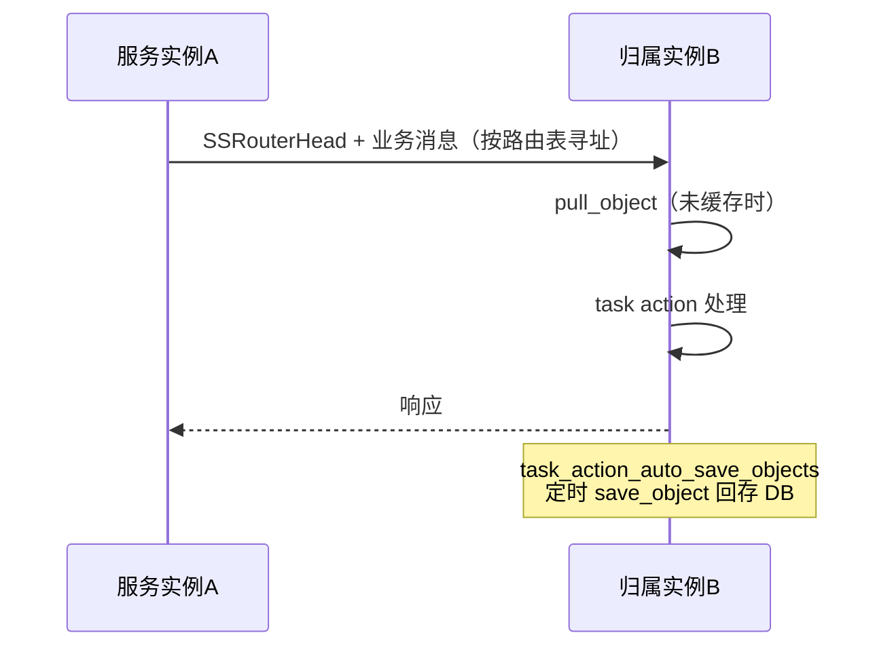

# 路由系统（router）

路由系统解决"有状态对象在哪个服务实例上"的问题：对象（如用户、队伍）按 key 路由到归属实例，并在内存中
缓存、定时回存。

## 快速上手

1. 使用已有服务 SDK 的路由接口，例如大厅用户或好友 SDK，沿用现有对象类型和 manager。
2. 在业务 action 中调用 SDK；通过[服务端配置](../development/server-config)调整已有路由 TTL 和保存周期。
3. 验证同一对象的读取、修改与保存。新增对象类型或改变迁移语义时，才需实现新的 router 特化。

## 定制与详细设计

### 核心类

| 类 | 位置 | 职责 |
| --- | --- | --- |
| `router_object_base` / `router_object<T>` | `src/server_frame/router/` | 路由对象基类：`pull_object`/`save_object`（协程 RPC）、TTL、降级 |
| `router_manager_base` / `router_manager<TCache, TObj, TPrivData>` | `router/router_manager.h` | 对象管理器：`mutable_cache`/`mutable_object`、事件回调 |
| `router_manager_set` | `router/router_manager_set.h` | 单例：按 type_id 管理全部 manager、auto save/close/transfer 定时器、metrics |
| `router_user_cache` / `router_user_manager` | `router/router_user_*` | 用户路由特化（`user_cache` 对象、`pull_online_server`） |

对象 key = `type_id + zone_id + object_id`。

### 对象存取

已有 manager 的 `mutable_object` 返回 `rpc::result_code_type`，通过输出引用返回对象。
调用时传入完整对象 key 和该 manager 要求的私有参数，并用 `RPC_AWAIT_CODE_RESULT` 检查结果。
`router_manager_set::get_manager(type_id)` 返回基类指针；类型专用调用沿用对应 SDK 的 manager 接口。
签名见 `src/server_frame/router/router_manager.h`；好友接入参照
`src/friendsvr/sdk/management/router/router_friend_manager.h`。

- 同一 key 的 IO 经 `io_schedule_order_` 串行化，避免并发读写竞争；
- 对象有 TTL 与降级策略，长时间未访问自动关闭（`router_close_manager_set`）。

### 路由寻址与迁移

- 寻址**不是一致性哈希**：由 DB 路由表 + 在线探测决定归属实例，`router_manager_base::send_msg` 填充
  `SSRouterHead`，按路由缓存解析目标 server，物理传输仍走 `ss_msg_dispatcher::send_to_proc`；
- 迁移：`RouterService` 的 `router_transfer` / `router_update_sync` RPC（生成 handler 在
  `router/handle_ss_rpc_routerservice.atfw.gen.*`），配合 `task_action_router_transfer` /
  `task_action_router_update_sync` 完成对象在实例间的转移与路由表更新。

### 消息流

```mermaid
sequenceDiagram
    participant A as 服务实例A
    participant B as 归属实例B
    A->>B: SSRouterHead + 业务消息（按路由表寻址）
    B->>B: pull_object（未缓存时）
    B->>B: task action 处理
    B-->>A: 响应
    Note over B: task_action_auto_save_objects<br/>定时 save_object 回存 DB
```
