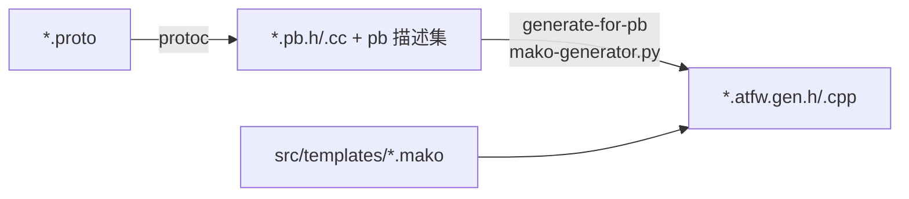

# RPC 与代码生成

## 协议即源头

所有协议以 protobuf 定义，根目录在 `src/server_frame/protocol/`：

```
protocol/
├── private/protocol/    # 仅服务端内部
│   ├── pbdesc/          # svr.protocol.proto（RouterService/LogicCommonService）、svr.*.table.proto（DB 表）
│   ├── common/  config/  extension/  log/
└── public/protocol/     # 可与客户端共享
    ├── extension/atframework.proto   # 自定义 service/rpc 选项（驱动代码生成）
    └── pbdesc/ com.protocol*.proto（CS/SS 消息）、com.struct*.proto（数据结构）
```

**生成物一律重新生成，不手工编辑**（`*.atfw.gen.{h,cpp}`、`*.pb.{h,cc}`、config/db 代码）。

## 自定义选项（atframework.proto）

驱动生成的扩展选项分布在三个文件：

- `public/protocol/extension/atframework.proto`：`atframework.service_options`（`module_name` 等）与
  `atframework.rpc_options`（`api_name`、`allow_no_wait` 等）；
- `protocol/extension/xrescode_extensions_v3.proto`：`xrescode.loader` 选项，标记 Excel 配置加载器；
- `private/protocol/extension/svr.database.extension.proto`：DB 表/索引扩展（KV/KL/CAS/TTL），供 db 模板使用。

## 生成流水线



- `src/server_frame/generate_proto_source.cmake` / `generate_proto_utility.cmake`：protoc 编译；
- `src/tools/generate-for-pb/mako-generator.py`：读取 pb 描述集，按各 CMakeLists 中声明的规则
  （服务名 + 模板 + 输出路径）批量渲染；
- `src/tools/generate_for_pb_utility.cmake`：CMake 侧的模板调用封装。

## 模板清单（src/templates/）

| 模板 | 生成物 |
| --- | --- |
| `handle_ss_rpc.*.mako` | SS RPC 注册函数 `register_handles_for_<service>` |
| `task_action_ss_rpc.*.mako` | 每个 SS RPC 方法的服务端 task action 骨架 |
| `rpc_call_api_for_ss.*.mako` | SS RPC 客户端调用 API（unary/stream/no-wait/broadcast/metadata/user/router 变体）与 per-RPC 全名接口 |
| `handle_cs_rpc.*.mako` / `task_action_cs_rpc.*.mako` | 客户端 RPC 的 handler 与 task action |
| `session_downstream_api_for_cs.*.mako` | 服务器→客户端 session 下行推送 API 与 per-RPC 全名接口 |
| `package_request_api_for_simulator.*.mako` | robot/模拟器用的 CS 请求打包 API |
| `task_action_no_msg.*.mako` | 无消息任务 Action（配合 `src/generate-nomsg-task.sh`） |
| `db_interface.*.mako` / `db_rpc_redis(.kv/.kl).*.mako` | Redis 数据库访问层（`rpc/db/local_db_interface.atfw.gen.*`） |
| `config_manager.*.mako` / `config_set.*.mako` / `config_easy_api.*.mako` | Excel 配置加载框架与便捷读取 API |

orbit 组件另有专用模板：`src/component/orbit/sdk/server/template/`（同样生成 per-RPC 全名接口）。

SS/CS/orbit 模板均为每个 RPC 生成 `<service> 命名空间内` 的 `gsl::string_view get_full_name_of_<rpc>()`
（声明在 `<service>.atfw.gen.h`），返回线上 wire 全名（SS/CS 为 `包.服务/方法`，orbit fork 为其点分协议名）。
向 `test.ss()` 注册 mock、断言调用历史等需要 RPC 全名的场景应使用 SS/CS 模板的该接口而非硬编码字符串（见
[RPC 单元测试](../development/rpc-unit-test.md)）；orbit fork 的 getter 返回点分全名，且 orbit RPC 经 orbit
transport 不走 SS 引擎，不可用于 `test.ss()`。

## RPC 调用端 API 形态

生成的调用端返回可 `co_await` 的对象：

```cpp
// unary：挂起等待响应
auto res = RPC_AWAIT_CODE_RESULT(rpc::SomeService::some_rpc(ctx, req, ...));

// no-wait（rpc_options.allow_no_wait）：只发不等
// stream：服务端流式推送（如 dtmq 的 channel_event_sync）
```

错误处理约定：框架级失败走 `rpc::result_code_type`（含 HTTP 风格错误码与 PB 解包错误），业务错误码定义在
`svr.const.err.proto` / `com.const.proto`。
