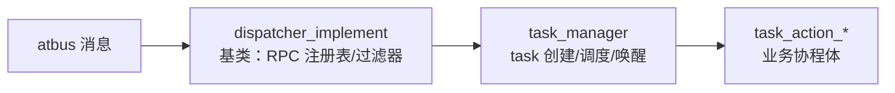

# 任务与分发（dispatcher / task action）

## 三层结构



- **dispatcher_implement**（`src/server_frame/dispatcher/dispatcher_implement.h`）：atapp module 基类，维护
  `rpc_task_action_set_t`（RPC 名 → task action creator）。注册表由 Mako 生成的
  `register_handles_for_<service>()` 填充。
- **三个单例 dispatcher**：
  | dispatcher | 处理消息 |
  | --- | --- |
  | `cs_msg_dispatcher` | atgateway 上行的客户端消息（CS RPC） |
  | `ss_msg_dispatcher` | 服务间 `SSMsg`（SS RPC） |
  | `db_msg_dispatcher` | Redis 连接与回复 |
- **task_manager**（`dispatcher/task_manager.h`）：task 的创建、超时管理、按 `timeout + type + sequence`
  索引的 generic start/resume 生成器。

## task action 基类

| 基类 | 用途 |
| --- | --- |
| `task_action_base` | 所有 action 的基类：`operator()` 协程体、超时、trace、result code |
| `task_action_cs_req_base` | 客户端请求：session 校验、响应打包 |
| `task_action_ss_req_base` | 服务间请求：`prepare_handle` 链、SS 响应打包 |
| `task_action_no_req_base` | 无请求触发的定时/自驱动任务（如 `task_action_auto_save_objects`） |

典型 action 实现模式：

```cpp
class task_action_example : public task_action_ss_req_base<ExampleReq, ExampleRsp> {
 public:
  result_type operator()() override {
    // 1. 校验与读请求
    // 2. RPC_AWAIT_CODE_RESULT(rpc::db::xxx(...)) 挂起等待 DB/SS
    // 3. 组装响应并 RPC_RETURN_CODE(0)
  }
};
```

生成器只产出骨架；业务在 `hook_handle()` / `operator()` 中填充逻辑，保留 `// ` 标记区间内的
自定义代码不会被重新生成覆盖。

## 双协程实现

`task_type_traits.h`（`dispatcher/task_type_traits.h`）统一抽象两套后端：

- **C++20 协程**（`PROJECT_SERVER_FRAME_USE_STD_COROUTINE=ON`）：`copp::generator_future/callable_future`，
  `RPC_AWAIT_TYPE_RESULT(x)` 即 `co_await x`；
- **libcopp cotask**：走 `rpc_result_guard` 惰性 poller。

业务代码只使用 `RPC_AWAIT_*` / `RPC_RETURN_*` 宏与 `rpc::result_code_type / rpc_result<T>` 类型，不直接
感知后端差异。

## 内置 task action

`src/server_frame/logic/action/` 提供框架级 action：`set_server_time`、`player_logout`、
`reload_remote_server_configure`、`async_invoke` 等；`src/server_frame/router/action/` 提供路由相关
action（auto save、close、transfer、update_sync）。
