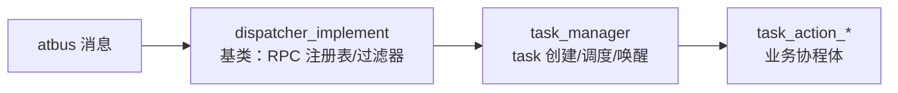

# 任务与分发（dispatcher / task action）

## 快速上手

1. 按[RPC 上手](../development/add-rpc-task)声明方法并生成 action。
2. 在 `operator()` 实现业务，通过 `RPC_AWAIT_*` 等待异步结果，用 `RPC_RETURN_*` 返回。
3. 沿用标准服务已有 handler 注册与 dispatcher 初始化；不要手动重复注册每个方法。

## 定制与详细设计

### 三层结构

```mermaid
flowchart LR
    A[atbus 消息] --> D[dispatcher_implement<br/>基类：RPC 注册表/过滤器]
    D --> TM[task_manager<br/>task 创建/调度/唤醒]
    TM --> TA[task_action_*<br/>业务协程体]
```

- **dispatcher_implement**（`src/server_frame/dispatcher/dispatcher_implement.h`）：atapp module 基类，维护
  `rpc_task_action_set_t`（RPC 名 → task action creator）。注册表由 Mako 生成的
  `register_handles_for_<service>()` 填充。
- **三个单例 dispatcher**：
  | dispatcher | 处理消息 |
  | --- | --- |
  | `cs_msg_dispatcher` | atgateway 上行的客户端消息（CS RPC） |
  | `ss_msg_dispatcher` | 服务间 `SSMsg`（SS RPC） |
  | `db_msg_dispatcher` | Redis 连接与回复 |
- **task_manager**（`dispatcher/task_manager.h`）：task 的创建、超时管理、按 `timeout + type + sequence`
  索引的 generic start/resume 生成器。

### task action 基类

| 基类 | 用途 |
| --- | --- |
| `task_action_base` | 所有 action 的基类：`operator()` 协程体、超时、trace、result code |
| `task_action_cs_req_base` | 客户端请求：session 校验、响应打包 |
| `task_action_ss_req_base` | 服务间请求：`prepare_handle` 链、SS 响应打包 |
| `task_action_ss_rpc_base<Req, Rsp>` | 生成的 SS RPC action 使用的类型化请求/响应基类 |
| `task_action_no_req_base` | 无请求触发的定时/自驱动任务（如 `task_action_auto_save_objects`） |

生成的 action 在 `operator()` 中通过 `get_request_body()` 读取请求，用 `get_response_body()` 填充响应，
再以 `RPC_RETURN_CODE` 返回。可直接使用的示例见[RPC 上手](../development/add-rpc-task)。

默认生成规则只在业务骨架不存在时创建文件；业务在 `operator()` 中填充逻辑。
已有骨架整文件保留，自动生成的 handler/API 则会更新。
RPC 签名变化后需手工同步已有业务骨架，不能依赖标记区间自动迁移。

### 双协程实现

`task_type_traits.h`（`dispatcher/task_type_traits.h`）统一抽象两套后端：

- **C++20 协程**（`PROJECT_SERVER_FRAME_USE_STD_COROUTINE=ON`）：`copp::generator_future/callable_future`，
  `RPC_AWAIT_TYPE_RESULT(x)` 即 `co_await x`；
- **libcopp cotask**：异步等待通过有栈协程挂起/恢复，`rpc_result` 用 poller 保存结果，`rpc_result_guard` 包装返回值。

业务代码只使用 `RPC_AWAIT_*` / `RPC_RETURN_*` 宏与 `rpc::result_code_type / rpc_result<T>` 类型，不直接
感知后端差异。需要 RPC 回包时用 `RPC_AWAIT_CODE_RESULT` 或 `RPC_AWAIT_TYPE_RESULT` 等待完成，
不关注结果时也要用 `RPC_AWAIT_IGNORE_RESULT` 显式等待。宏定义见 `src/server_frame/rpc/rpc_common_types.h`，
用法见[等待 RPC 完成](../development/add-rpc-task#await-rpc)。

### 内置 task action

`src/server_frame/logic/action/` 提供框架级 action：`set_server_time`、`user_logout`、
`reload_remote_server_configure`、`async_invoke` 等；`src/server_frame/router/action/` 提供路由相关
action（auto save、close、transfer、update_sync）。
