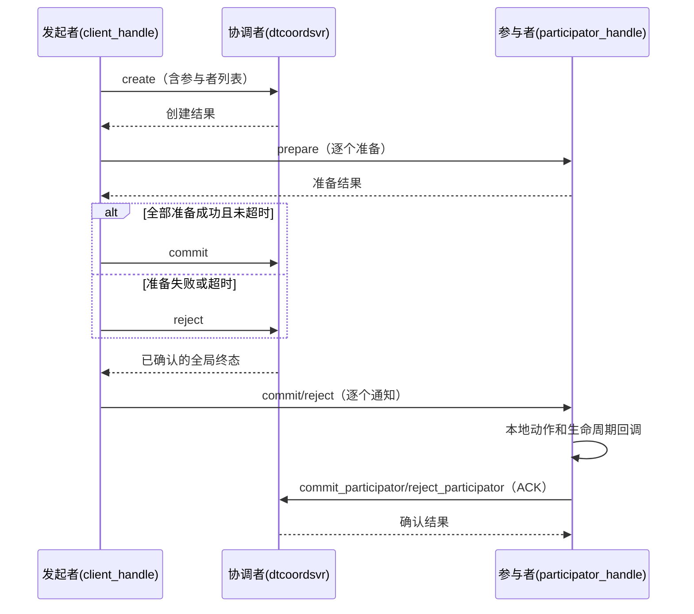

# 分布式事务（distributed_transaction）

提供普通事务和 `force_commit` 两种模式。普通事务由发起者准备参与者、请求协调者记录全局决议，
再通知参与者执行本地动作并确认。`force_commit` 在 prepare 中执行动作，不创建协调者记录。

位置：`src/component/distributed_transaction/`（README 见该目录）。

## 组成

| 部分 | 位置 | 说明 |
| --- | --- | --- |
| `dtcoordsvr` | `dtcoordsvr/` | 协调者服务：`transaction_manager` + 一组 task action |
| SDK | `sdk/` | `transaction_client_handle`（发起者）、`transaction_participator_handle`（参与者）、`transaction_api` |
| 协议 | `protocol/` | `distributed_transaction.proto`、`dtcoordsvr_config.proto` |

## 协调者 RPC（task action）

`create` / `commit` / `reject` / `query` / `remove` / `commit_participator` / `reject_participator`。

## 流程

未确认全局终态时，client 先有限次查询，不以失败调用的部分副本响应决定通知方向。
已确认的全局终态不会因后续本地动作或通知失败而反转。

## 事件与状态

下表按普通模式收到直接通知的正常路径列出回调触发时的状态。若查询或快照已包含终态，保留该终态。

| 路径 | 回调及其触发时状态 |
| --- | --- |
| 普通 prepare | `on_start_running(PREPARED)` |
| 普通 commit | `do_event(COMMITING)` → `on_finish_running(COMMITING)` → `on_finished(COMMITING)` → `on_commited(COMMITING)` |
| 普通 reject | `on_finish_running(REJECTING)` → `on_finished(REJECTING)` → `on_rejected(REJECTING)` |
| `force_commit` prepare 成功 | `on_start_running(PREPARED)` → `do_event(COMMITING)` → `on_finish_running(COMMITING)` → `on_finished(COMMITING)` → `on_commited(COMMITED)` |
| `force_commit` 动作失败 | `on_start_running(PREPARED)` → `do_event(COMMITING)` → `on_finish_running(COMMITING)`；client 拒绝通知单独触发 `undo_event` |

普通模式的完成通知返回后才启动 ACK；ACK 成功后本地状态进入 `COMMITED`/`REJECTED` 并清理记录。
普通模式的启动回调返回前不启动恢复；此时重入 commit/reject 返回 `EN_SYS_BUSY`，不会推进回调正在观察的状态。
启动回调报错或任务超时后仍按原截止时间恢复，重载快照不会重放启动回调。
普通模式 `on_finished` 失败会有限次重试，耗尽则清理且不发送 ACK；`force_commit` 只记录该回调错误并继续。
`force_commit` 不登记 running/finished 或恢复定时器，补偿只由当前 client 调用有限次尝试。
两种模式都在 `on_start_running` 前锁定 `lock_resource`；`do_event` 返回后、`on_finish_running` 前解锁。
`force_commit` 动作失败或任务退出时也会清理锁。
接入方必须保证 `do_event`、`undo_event` 和需要恢复的回调幂等，并一致保存业务数据与 SDK 快照。
回调须在内部捕获 C++ 异常并返回错误码；当前协程框架不转换未捕获的 `throw`，它可能越过 `noexcept` 边界终止进程。
SDK 的失败恢复针对返回错误、任务超时和取消。
`force_commit` 的显式 `lock` 会登记资源锁，直接调用者须在本次调用结束前用 storage 句柄 `unlock`。
`check_writable` 及其 vtable 回调同步返回 `int32_t` 错误码，不切出协程。

## 运维注意

client 每次派发 prepare 前及最后一次 prepare 返回后检查原截止时间，超时后进入拒绝或补偿流程。
一次 submit 固定持有入口处的 storage，并在调用结束时释放；回调替换调用者指针不会将后续状态写到新对象。
同一 storage 在途重入返回 `EN_TRANSACTION_ALREADY_RUN`，不改写事务和输出集合，包括通过不同 handle 提交。
同一 handle 可同时提交不同 storage；调用结束后仍可恢复提交尚未确认决议的事务。
客户端 `storage_type` 包装 protobuf 数据（`data`）和私有提交标记，提交标记不参与序列化。
调用方须保证 client handle 在调用结束前有效。提交入口按单线程协程使用，不提供线程同步。
协调者 DB TTL 使用 `expire_timepoint + transaction_expire_grace_duration` 的剩余时间，受
`transaction_max_ttl` 限制（默认 30 天，上限 3 年）。Redis 接收相对秒数，实际删除时间还受取整、请求排队和过期清理影响。
创建沿用 `insert → set_ttl`，TTL 失败时尝试删除新记录并返回原错误；保存沿用 `replace`。
这些独立 DB 调用不提供跨进程原子性保证。同 UUID 重放保留终态和参与者确认。
同一协调者进程内，同 UUID 的创建、读取、保存和删除通过缓存对象的 `io_task` 串行执行，等待结束后重新检查缓存身份。
调用者超时不清除仍在执行的 IO；删除须等待真实 IO 完成。在途 IO 暂缓 LRU 淘汰，完成后恢复正常淘汰，不改变 DB TTL。
删除在等待结束后，以当前缓存记录的 `memory_only` 和复制配置为准；强制 remove 在没有缓存时使用请求 metadata。
参与者 ACK 的原缓存已失效或被替换时，返回 `EN_SYS_NOTFOUND`。
内存事务只移除缓存；持久化事务从对应 DB 分区删除，非复制事务使用分区 0，复制事务使用本服务分区。
DB 删除成功或记录已不存在后移除缓存，并使旧句柄失效。删除失败保留已有数据的缓存；无缓存删除所建的空占位在 IO 收尾时清理。
同一 IO 任务重入同 UUID 的管理接口返回 `EN_SYS_RPC_CALL_NOT_READY`，避免等待自身。

恢复批次逐条释放已处理对象，不因后续事务等待而继续持有。协调者 `stop()` 拒绝新建和读取，保留已有缓存供在途任务收尾；
`cleanup()` 阶段清空缓存并使旧句柄失效。停服时，在途创建完成 TTL 设置后清除创建占位，在途读取返回停服错误并清空输出句柄。
已持久化数据继续按 DB TTL 清理。
不可写或任务退出后，未处理事务在清理或重新排期时释放批次引用，不等任务完成回调返回。

query 输出和 reject 请求都可复用。复制查询只合并本次响应；普通 reject 清除旧的 `force_commit` 补偿数据。

开启单元测试及 RPC hooks 后，构建组件的六个测试目标并运行
`ctest --test-dir <BUILD_DIR> -L distributed-transaction --output-on-failure`。
用例覆盖两种模式的状态、事件顺序、回调任务超时、批次对象释放和停服在途 IO；真实 Redis 故障转移与
跨进程网络分区仍需集成验证。详细契约见组件 README。
