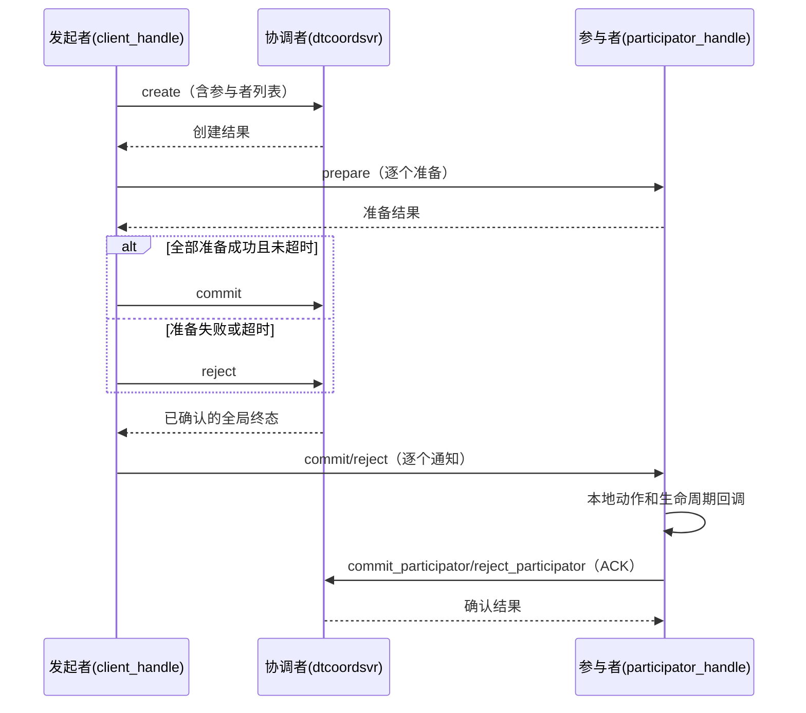

# 分布式事务（distributed_transaction）

提供普通事务和 `force_commit` 两种模式。普通事务由发起者准备参与者、请求协调者记录全局决议，
再通知参与者执行本地动作并确认。`force_commit` 在 prepare 中执行动作，不创建协调者记录。

位置：`src/component/distributed_transaction/`（README 见该目录）。

## 组成

| 部分 | 位置 | 说明 |
| --- | --- | --- |
| `dtcoordsvr` | `dtcoordsvr/` | 协调者服务：`transaction_manager` + 一组 task action |
| SDK | `sdk/` | `transaction_client_handle`（发起者）、`transaction_participator_handle`（参与者）、`transaction_api` |
| 协议 | `protocol/` | `distributed_transaction.proto`、`dtcoordsvr_config.proto` |

## 协调者 RPC（task action）

`create` / `commit` / `reject` / `query` / `remove` / `commit_participator` / `reject_participator`。

## 流程

未确认全局终态时，client 先有限次查询，不以失败调用的部分副本响应决定通知方向。
已确认的全局终态不会因后续本地动作或通知失败而反转。

## 事件与状态

下表按普通模式收到直接通知的正常路径列出回调触发时的状态。若查询或快照已包含终态，保留该终态。

| 路径 | 回调及其触发时状态 |
| --- | --- |
| 普通 prepare | `on_start_running(PREPARED)` |
| 普通 commit | `do_event(COMMITING)` → `on_finish_running(COMMITING)` → `on_finished(COMMITING)` → `on_commited(COMMITING)` |
| 普通 reject | `on_finish_running(REJECTING)` → `on_finished(REJECTING)` → `on_rejected(REJECTING)` |
| `force_commit` prepare 成功 | `on_start_running(PREPARED)` → `do_event(COMMITING)` → `on_finish_running(COMMITING)` → `on_finished(COMMITING)` → `on_commited(COMMITED)` |
| `force_commit` 动作失败 | `on_start_running(PREPARED)` → `do_event(COMMITING)` → `on_finish_running(COMMITING)`；client 拒绝通知单独触发 `undo_event` |

普通模式的完成通知返回后才启动 ACK；ACK 成功后本地状态进入 `COMMITED`/`REJECTED` 并清理记录。
普通模式 `on_finished` 失败会有限次重试，耗尽则清理且不发送 ACK；`force_commit` 只记录该回调错误并继续。
`force_commit` 不登记 running/finished、SDK 资源锁或恢复定时器，补偿只由当前 client 调用有限次尝试。
接入方必须保证 `do_event`、`undo_event` 和需要恢复的回调幂等，并一致保存业务数据与 SDK 快照。

## 运维注意

client 每次派发 prepare 前及最后一次 prepare 返回后检查原截止时间，超时后进入拒绝或补偿流程。
协调者 DB TTL 使用 `expire_timepoint + transaction_expire_grace_duration` 的剩余时间，受
`transaction_max_ttl` 限制（默认 30 天，上限 3 年）。

恢复批次逐条释放已处理对象，不因后续事务等待而继续持有。协调者 `stop()` 拒绝新建和读取，保留已有缓存供在途任务收尾；
`cleanup()` 阶段清空缓存并使旧句柄失效。在途创建完成 TTL 设置后不会加入缓存，在途读取返回停服错误并清空输出句柄。
已持久化数据继续按 DB TTL 清理。

开启单元测试及 RPC hooks 后，构建组件的六个测试目标并运行
`ctest --test-dir <BUILD_DIR> -L distributed-transaction --output-on-failure`。
用例覆盖两种模式的状态、事件顺序、回调任务超时、批次对象释放和停服在途 IO；真实 Redis 故障转移与
跨进程网络分区仍需集成验证。详细契约见组件 README。
