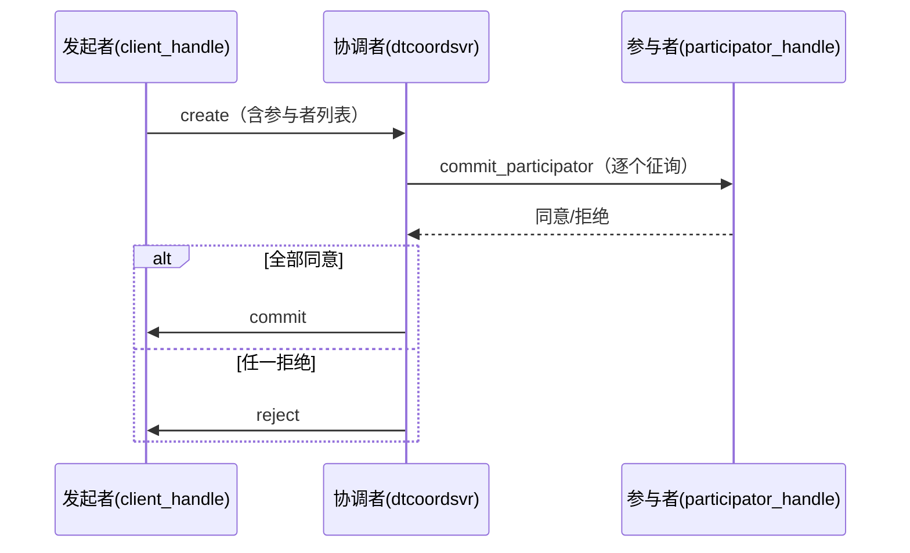

# 分布式事务（distributed_transaction）

提供跨服务的两阶段提交（2PC）风格事务：发起者创建事务，多个参与者提交或拒绝，协调者收敛结果。

位置：`src/component/distributed_transaction/`（README 见该目录）。

## 组成

| 部分 | 位置 | 说明 |
| --- | --- | --- |
| `dtcoordsvr` | `dtcoordsvr/` | 协调者服务：`transaction_manager` + 一组 task action |
| SDK | `sdk/` | `transaction_client_handle`（发起者）、`transaction_participator_handle`（参与者）、`transaction_api` |
| 协议 | `protocol/` | `distributed_transaction.proto`、`dtcoordsvr_config.proto` |

## 协调者 RPC（task action）

`create` / `commit` / `reject` / `query` / `remove` / `commit_participator` / `reject_participator`。

## 流程

## 运维注意

协调者的自动清理时间必须大于"容忍值 + 最大事务等待时间"（见组件 README），否则进行中事务可能被提前
清理。
