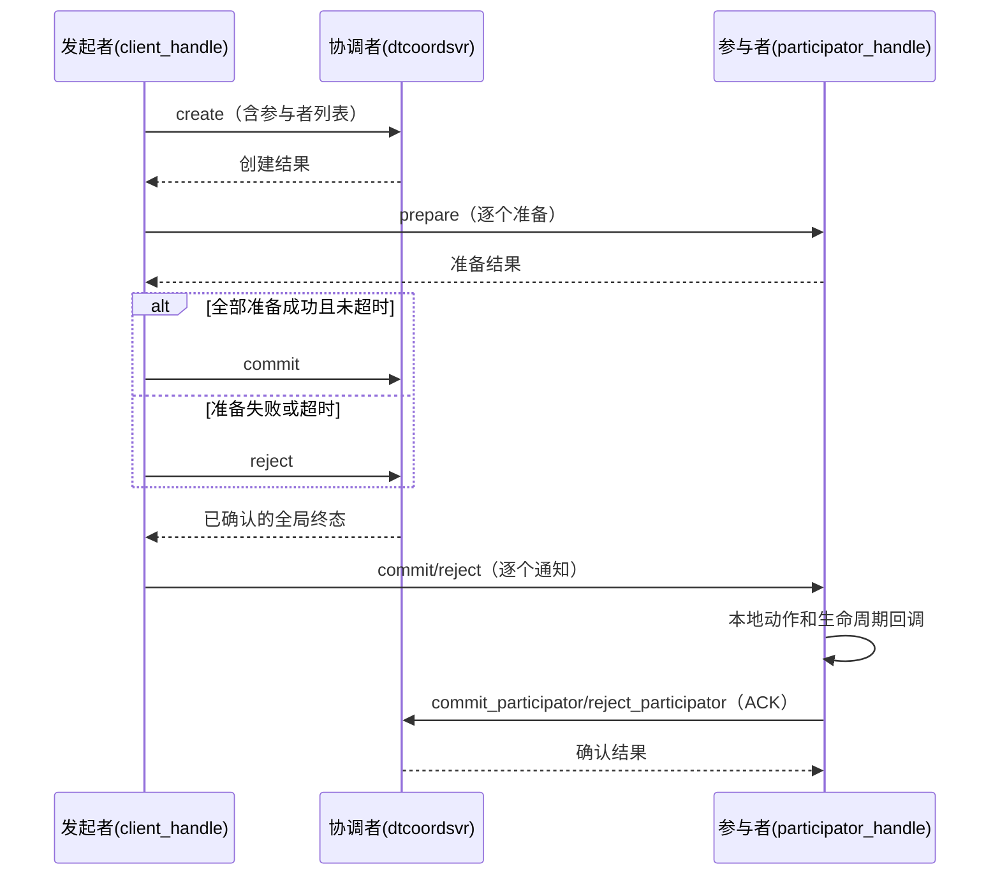

# 分布式事务（distributed_transaction）

提供普通事务和 `force_commit` 两种模式。普通事务由发起者准备参与者、请求协调者记录全局决议，
再通知参与者执行本地动作并确认。`force_commit` 在 prepare 中执行动作，不创建协调者记录。

位置：`src/component/distributed_transaction/`（README 见该目录）。

## 快速上手

1. 启用 `dtcoordsvr` 并准备 Redis；使用对应 chart 的事务超时、恢复与清理配置。
2. 消费方 `USE_COMPONENTS` 加入 `distributed-transaction-sdk`；
   使用 `sdk/transaction_client_handle.h`、`transaction_participator_handle.h`
   和 `rpc/transaction/transaction_api.h`。
3. 参照组件 README 的接入契约实现业务参与者回调，准备参与者、资源 key 和事务数据，
   由 client handle 提交。业务数据与参与者快照需一致保存。
4. 先验证正常提交，再验证 prepare 失败后的拒绝；本地动作与恢复回调必须幂等。
   需要事务语义时先使用普通模式，并核对下面的全局决议与失败恢复规则。

## 定制与详细设计

### 组成

| 部分 | 位置 | 说明 |
| --- | --- | --- |
| `dtcoordsvr` | `dtcoordsvr/` | 协调者服务：`transaction_manager` + 一组 task action |
| SDK | `sdk/` | `transaction_client_handle`（发起者）、`transaction_participator_handle`（参与者）、`transaction_api` |
| 协议 | `protocol/` | `distributed_transaction.proto`、`dtcoordsvr_config.proto` |

### 协调者 RPC（task action）

`create` / `commit` / `reject` / `query` / `remove` / `commit_participator` / `reject_participator`。

### 流程

```mermaid
sequenceDiagram
    participant C as 发起者(client_handle)
    participant D as 协调者(dtcoordsvr)
    participant P as 参与者(participator_handle)
    C->>D: create（含参与者列表）
    D-->>C: 创建结果
    C->>P: prepare（逐个准备）
    P-->>C: 准备结果
    alt 全部准备成功且未超时
        C->>D: commit
    else 准备失败或超时
        C->>D: reject
    end
    D-->>C: 已确认的全局终态
    C->>P: commit/reject（逐个通知）
    P->>P: 本地动作和生命周期回调
    P->>D: commit_participator/reject_participator（ACK）
    D-->>P: 确认结果
```

未确认全局终态时，client 先有限次查询，不以失败调用的部分副本响应决定通知方向。
已确认的全局终态不会因后续本地动作或通知失败而反转。

资源冲突、复制、失败恢复、回调状态与运行契约见[分布式事务白皮书](../whitepaper/distributed-transactions)。
接入时同时核对组件 README 中的回调与参数说明。
