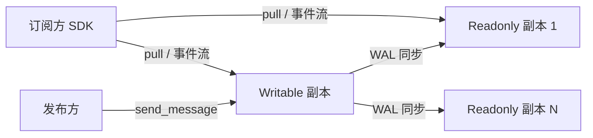

# 分布式消息队列（dtmq）

dtmq 提供游戏内高频消息频道（聊天、队伍、公会广播等）能力：频道订阅、消息收发、历史消息拉取，
以及基于 WAL 的主从复制与频道迁移。

位置：`src/component/dtmq/`（设计笔记见 `dtmq-proxysvr/Note.md`）。

## 组成

| 部分 | 位置 | 说明 |
| --- | --- | --- |
| `dtmq-proxysvr` | `dtmq/dtmq-proxysvr/` | 入口服务：频道管理、消息持久化、订阅者分发（当前版本数据层集成一体，TODO 拆分） |
| 协议 | `dtmq/protocol/` | `dtmq_proxy.proto`（服务协议）、`dtmq_proxy.config.proto`（配置） |
| `dtmq-common-sdk` | `dtmq/sdk/common/` | 频道哈希/副本选择算法（`dtmq_algorithm`） |
| `dtmq-proxy-sdk` | `dtmq/sdk/proxy/` | 客户端 API 与进程内订阅者 |

## 服务协议（DtmqProxysvrService）

`dtmq_proxy.proto`（package `atframework.dtmq`，module_name `"dtmq"`），全部 `allow_no_wait: true`：

`subscribe` / `unsubscribe` / `send_message` / `transfer_channel` / `destroy_channel` / `update` /
`reset_lock` / `find_message` / `page_query_message` / `pull`。

另有 `DtmqProxysvrNotifyService::channel_event_sync(stream SSChannelEventSync)`：服务端**流式**推送频道
增量消息/全量快照给订阅者所在节点。

## 数据模型

- 频道结构定义在公共协议 `src/server_frame/protocol/public/protocol/pbdesc/com.struct.dtmq.proto`：
  `DChannelMetadata` / `DChannelRuntime` / `DChannelMessage(Detail)` / `DChannelSnapshot` /
  `DChannelSubscribeNode` / `DChannelSyncPoint`；
- 订阅者 key 形如 `U:{zone}:{user}` / `T:{team}` / `G:{guild}`，带心跳 sequence + hash；
- 乐观锁：`channel_lock_checker`（CAS），`reset_lock` 解锁；
- 频道类型配置经 Excel（`com.struct.dtmq.config.proto` 的 `ExcelDtmqChannelType`：`channel_type`、
  `show_max_log_count`、`readonly_replicate_count`），由 `excel_config_dtmq_index.cpp` 加载为
  `DChannelConfigure`；
- DB 落地：`table_dtmq_channel_record`（生成的 `rpc::db::dtmq_channel_record` Redis 接口）。

## 副本与路由

- 每个频道 1 个 Writable 副本 + N 个 Readonly 副本（`readonly_replicate_count` 可配）；
- 目标节点选择：`rpc::dtmq::get_target_server_id(s)` 按频道 key 哈希 + HPA 就绪发现
  （`logic_hpa_discovery_select_mode::kReady`）；
- readonly 与 writable 同节点时以 writable 为准（`replicate_index > 0` 除外）；
- 支持频道迁移（`transfer_channel`）、扩缩容时订阅者合并/反订阅、Writable⇄Readonly 升降级、迁移窗口期
  转发。

## WAL 主从同步

`dtmq-proxysvr/data/mq_channel_wal_handle.{h,cpp}` 包装 atframe_utils 的
`distributed_system::wal_publisher / wal_subscriber`（单线程模式），日志按
`DChannelMessageDetail::CommandCase` 分类 merge；与 rank 组件的 `rank_wal_handle` 是同一套机制。
`SSChannelUpdateReq` 支持 `compact_sequence` 日志压缩。

## 客户端 SDK

- `dtmq_client_api`：`get_target_server_id(s)`、`send_message`、`find_message`、`page_query_message`、
  `normalize_replicate_index`；
- `dtmq_client_subscriber`：进程内共享订阅者（`shared_subscriber`）：本地 WAL 日志缓存、乐观锁/快照/
  消息回调、心跳、接收 `channel_event_sync` 事件流。

## 业务接入示例（lobbysvr）

`src/lobbysvr/service/` 链接 `dtmq-proxy-sdk`，为 `DtmqProxysvrNotifyService` 生成 handler
（`app/handle_ss_rpc_dtmqproxysvrnotifyservice.atfw.gen.*`），在 `lobbysvr_main.cpp` 中
`register_handles_for_dtmqproxysvrnotifyservice()`；`logic/dtmq/task_action_channel_event_sync.*`
接收频道事件流并下发给客户端。
