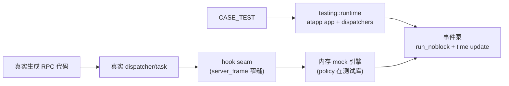

# RPC 单元测试（离线 mock）

`src/tools/rpc-unit-test` 是本工程的 RPC 级单元测试支持库：在普通进程内启动一个最小 atapp runtime，用内存 mock
引擎替代全部外部依赖（SS/DNS/CS/DB/UUID/resource/HPA/telemetry），让业务代码的真实 RPC 路径（dispatcher、
task、协程、生成 API）可以在单测中被驱动和断言，无需 Redis、etcd、atbus 或系统 DNS。库 API 命名空间是
`atframework::testing`。

## 适用范围与构建开关

- 适用：service/component 逻辑的离线单元测试、router/SS/CS/DB 生成 API 的契约测试。
- 非目标：真实网络/存储的集成测试、性能测试、跨进程测试。
- 所有测试 executable 只使用 atframe_utils 私有测试框架（`CASE_TEST`/`CASE_EXPECT_*`），不引入 GTest。

单元测试 seam 由 `PROJECT_SERVER_FRAME_ENABLE_UNIT_TEST_HOOKS` 整体门控（`cmake_dependent_option`，默认跟随
`BUILD_TESTING OR PROJECT_ENABLE_UNITTEST`）。hooks-off 的生产构建中：无测试状态、无热路径分支、无 `mock`
符号、无测试库依赖；生产 fallback 一直保留，只有 fixture 显式安装 hook 后才接管。所有 `mock` 子命名空间接口
（生成 SS/DB mock、HPA 功能 mock）同样被宏整体裁剪。

## 工作原理



- **发现与传输在 atapp 层注入**：mock discovery 节点写入 global discovery，注册 `mock://` connector 捕获出站
  字节；不修改 `logic_server_setup`，从而同时验证按 id/name/type-zone/metadata/broadcast 的真实选择逻辑。
- **seam 与策略分离**：server_frame 只加最小、无策略的 hook（registry + generation token），匹配规则、内存
  数据、响应脚本、历史与诊断全部在测试库；生产逻辑不依赖测试库。每个 seam 的 registry 只在其拥有代码的
  production DLL 的一个 `.cpp` 中定义（核心在 `server_frame`、Excel provider 在 `server_frame-config`、
  Orbit client 在其 SDK），不做 header-local static/跨 DLL 复制。
- **生成 mock 类型擦除桥接**：`<service>::mock`、`<db>::mock` 编译进 server_frame/服务自身 TU，**不链接**
  测试库，经 `src/server_frame/rpc/unit_test/mock_engine_bridge.h` 的槽转发；桥接为空时降级为 no-op。
- **事件泵与 generation 屏障**：`runtime::pump_once()` 依次做 `time_utility::update()` → `run_noblock()` →
  `++pump_generation` → 各引擎 `deliver_pending()` → 再一次 `run_noblock()`。出站记录在第 N 代捕获、第 N+2
  代才可被消费，保证调用 task 先注册 waiter，避免“响应早于 waiter”竞态。

默认行为（未注册规则时）：

- **单向通知类**（SS stream/no-wait/broadcast、CS 下行 data/kickoff/set-router）：记录并成功（结果丢弃）。
- **需响应类**（SS unary/wait 变体、DNS lookup、HPA pull）：立即返回明确错误码并输出诊断，不静默等待超时。
- **DB**：默认空的内存 backend（读取返回项目 record-not-found 码）；所有已支持操作都有真实内存语义。

## 快速开始

CMake（`src/tools/rpc-unit-test/cmake/ProjectRpcUnitTest.cmake`，私有框架说明见[单元测试](testing)）：

```cmake
project_add_rpc_unit_test(
  TARGET ${PROJECT_NAME}-my-component-unit-test
  COMPONENT my-component
  CATEGORY component          # component（默认）| sdk | service
  SOURCES "my_test.cpp"
  LINK_LIBRARIES my-component-lib
  FEATURES SS DNS DB
  LABELS fast
  TIMEOUT 120)
```

最小用例（`src/tools/rpc-unit-test/test/example_readme.cpp` 逐字编译执行，保证与真实 API 一致）：

```cpp
CASE_TEST(my_component, hello) {
  atfw::testing::runtime test;
  atfw::testing::runtime_options options;
  options.features = {atfw::testing::feature::ss};
  CASE_EXPECT_EQ(0, test.start(options));
  if (!test.is_running()) {
    return;  // CASE_EXPECT_* 非致命：前置失败后必须显式 return。
  }

  auto task = test.run_task("hello", std::chrono::seconds{2},
                            [](rpc::context &) -> rpc::result_code_type { RPC_RETURN_CODE(0); });
  if (!task.empty()) {
    auto result = test.wait(task, std::chrono::seconds{5});
    CASE_EXPECT_TRUE(result.task_exited);
    CASE_EXPECT_EQ(0, result.result_code);
  }
  CASE_EXPECT_EQ(0, test.stop());  // stop() 幂等；非零即期望校验/残留失败。
}
```

要点：单进程同时只允许一个 active runtime（app/dispatcher/task 单例）；`run_task` 体用
`RPC_AWAIT_*`/`RPC_RETURN_CODE` 跑真实 task；断言放在 `wait()` 之后。

## 使用指南

`runtime_options.features` 决定模块/hook 集合（`ss/dns/cs/db/uuid/resource/router/orbit/hpa/telemetry`）；CMake
`FEATURES` 只负责校验/链接/打标签，不隐式决定每个 case 行为。

### 服务发现 + SS

```cpp
atfw::testing::mock_node node;
node.set_id(0x130001).set_name("remote").set_type_id(4097).set_type_name("remote-type").set_zone_id(1);
node.add_label("hpa_scaling_ready", "1");  // 经 logic_hpa_discovery_select 选节点的消费者需要同名标签
auto remote = test.discovery().add_node(node);
logic_server_last_common_module()->reload();  // 注入后 reload 一次，回放节点进 discovery index

auto rule = test.ss().mock(
    rpc::my_service::packer::get_full_name_of_my_method(), Req::descriptor()->full_name(),
    Rsp::descriptor()->full_name(),
    [](const atfw::testing::ss_request_view &request, google::protobuf::Message &response)
        -> rpc::result_code_type {
      const auto &req = static_cast<const Req &>(request.body);
      static_cast<Rsp &>(response).set_echo("hello " + req.payload());
      RPC_RETURN_CODE(0);
    });
// RPC 全名用生成接口 rpc::<module>::packer::get_full_name_of_<rpc>()（gsl::string_view，声明在
// <service>.atfw.gen.h），不要硬编码 "pkg.MyService/my_method" 字符串。
// 生成层等价：<service>::mock::my_method(handler)，typed 首参 rpc::context&。
test.ss().expect(rpc::my_service::packer::get_full_name_of_my_method()).times(1).to_node(0x130001);
```

SS handler 返回 `rpc::result_code_type`，可以是协程并用 `RPC_AWAIT_CODE_RESULT` 等待嵌套 RPC。规则选项
`ss_rule_options`：`match_node_id`、`times`（FIFO 脚本）、`delay_generations`、`no_response`、
`malformed_type_url`/`malformed_body`。

### Router / DNS / UUID / resource / CS / raw transport

- **Router**：`test.router_manager()` + `router_test_object` 把 router object 寻址到 mock 节点；router RPC 与
  unary SS 同链（`mock://` connector），不改 Mako。
- **DNS**：`test.dns().mock_a(domain, ip)` / `mock(records)` / `mock_error(domain)`；hook 在 `uv_getaddrinfo`
  之前，测试不产生系统 DNS 请求。
- **DB**：默认即完整 presence-aware 内存 backend（field merge/CAS/KL/TTL，语义对齐 Redis/Lua），无需注册规则；
  生成层 per-table typed handler（`rpc::db::<ns>::mock::<interface>`）与引擎层 `test.db().mock_table(name)` 回调
  可覆盖单个接口，未覆盖的回落内存 backend。raw entry API（`set_raw_kv`/`append_raw_kl`/`set_raw_ttl`）用于
  CAS 版本种子/精确 bytes。
- **UUID**：`generate_global_increase_id`/`generate_global_unique_id` 经 DB `inc_field` 流入 DB mock
  （号段缓存跨 case 延续，不要断言绝对 id 值）；`generate_standard_uuid*`/`generate_short_uuid` 是纯本地函数、
  无需 mock。`feature::uuid` 当前不做额外 runtime 装配。
- **resource**：`test.resource()` 提供 path→bytes/version/version_error 内存 loader，`reload()` 驱动真实
  manager 完整 reload/index。
- **CS**：`test.cs()` / `mock_client` 模拟 gateway 客户端（add/post/remove/set-router-rsp），上行走真实
  dispatch/action，下行 data/kick/set-router/broadcast 全部可捕获，无 atbus。
- **raw transport**：`test.transport()` 提供 id/name/discovery/consistent-hash/random/round-robin/metadata/
  broadcast 全维度规则与调用历史。

### 覆盖优先级与严格默认

DB 覆盖顺序：生成层 typed handler → 引擎层 per-table 回调 → 内存 backend；默认不允许真实 Redis passthrough。
两类默认（单向记录+丢弃 / 需响应快速失败）都可用 per-rule 选项覆盖（如把 stream 显式设为 fail 做负向断言）。

## 关键语义与不变量

- `delay_generations`：`0` 表示在观察到请求的那个 pump 完成；`N` 表示额外延迟 `N` 个完整 pump（SS/DNS 一致）。
- 引擎投递按**到期顺序**而非 FIFO；投递会同步恢复协程，任务可重入引擎（两阶段 drain，见
  `src/tools/rpc-unit-test/src/detail/pending_drain.h`）。
- DB 内存后端对齐 Redis/Lua golden contract：`EXPIRE`/`PERSIST` 对缺失 key 是成功 no-op（非错误）；CAS
  `real_version == 0` 接受任意期望版本并写入版本 1；已有记录只接受相等版本（成功 +1，冲突返回
  `EN_DB_OLD_VERSION` 并回写当前版本）；KV set 只合并 present fields；KL 索引单调不复用；`inc_field` 从 0 创建。
- 修改引擎/hook seam 的更深入不变量见 `.agents/skills/rpc-unit-test/references/engine-invariants.md`。

## 外部依赖离线矩阵

runtime 生成的配置保证离线：禁止 etcd、bus.proxy、主机名 listen（用数字 IP 或 shm/unix）、OTLP gRPC/HTTP
exporter、prometheus push/pull exporter、固定端口（配置即 fail-fast）。telemetry 默认 noop 零网络，可选
otlp_file 导出；HPA 默认零网络，启用时自动安装 prometheus pull hook，预置指标经公开回调链注入，未配置答案报错。

## 生命周期 / Timeout / 隔离

- 每个 `CASE_TEST` 独立 `runtime`：`start()` 建隔离 app/task/引擎，`stop()` 校验期望并按 deadline teardown；
  单进程内 fixture 串行，连续 fixture 不得残留 app/task/session/静态状态（引擎规则 RAII + unbind 统一清理）。
- Timeout 四层：RPC timeout < task timeout（`run_task` 参数）< runtime hard timeout（`wait` 参数）< CTest
  timeout（`TIMEOUT`）。hard timeout 会 poison 当前 runtime 并 kill-all 任务，此后只能 `stop()`，不能复用。
- telemetry/冲突配置用例必须独占 executable（进程生命周期状态），用 `project_add_rpc_unit_test` 多 target 拆分。

## 常见失败诊断

- 未匹配 RPC：快速失败，日志列出调用名与已注册规则；检查 RPC 全名与 `match_node_id`。
- response sequence 错误/不唤醒：确认 handler 返回 0 且响应类型与注册一致；stream/no-wait 不回响应。
- task 未进入 wait：`run_task` 返回空 handle 时打印 `task.get_diagnostic()`。
- 残留 session/task：`stop()` 诊断会列出；检查是否在 task 内遗漏 `RPC_RETURN_CODE`。
- `mock` 注册返回空 handle：`get_diagnostic()`（未绑引擎、类型名错误、RPC 名格式错误）。

## 构建与运行

```powershell
cmake --build build_jobs_cmake_tools --target atf4g-co-rpc-unit-test-selftest --parallel 12
ctest --test-dir build_jobs_cmake_tools -L rpc-unit-test --output-on-failure
# 过滤单 case：build_jobs_cmake_tools/publish/bin/atf4g-co-rpc-unit-test-selftest.exe -r "rpc_unit_test.<case>"
```

## 参考

- 完整 API 与示例：`src/tools/rpc-unit-test/README.md`
- AI agent 流程化指引：`.agents/skills/rpc-unit-test/SKILL.md`
- 引擎/hook seam 不变量：`.agents/skills/rpc-unit-test/references/engine-invariants.md`
