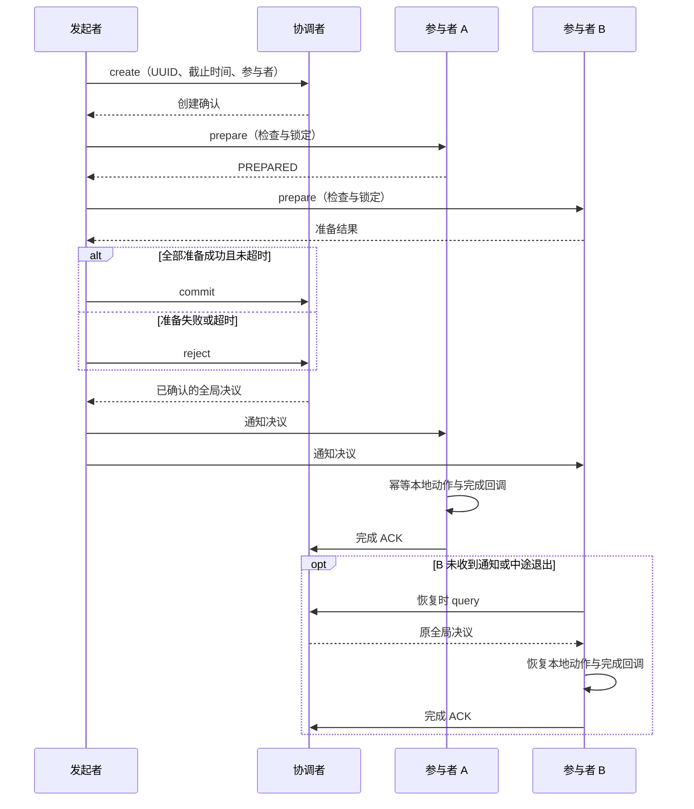

# 分布式事务设计

分布式事务协调多个资源所有者对同一次操作作出共同决议，并让未完成的参与者能够恢复。
最小接入步骤见[分布式事务组件](../components/distributed-transaction)。本篇讨论普通模式的执行边界、
冲突处理及异常恢复，也说明 `force_commit` 和内存模式的差异。

## 要解决的问题

跨服务操作可能同时修改订单、资产或成员状态。每个资源所有者都能检查和保存自己的数据，
但一次 RPC 成功不能证明其他参与者已完成，RPC 超时也不能证明远端没有执行。
若调用方直接把超时视为拒绝，可能出现一个参与者已提交而另一个参与者开始补偿。

需要分别记录“是否准备好”“全局决定提交还是拒绝”“本地动作是否完成”“完成是否已确认”。
全局决议确定后不能因通知失败而反转。本地状态恢复后应查询决议，继续同方向的幂等动作。
业务还须规定资源锁、数据与事务快照的一致保存方法，以及外部副作用的去重规则。

## 协调者、参与者与模式

`transaction_client_handle` 发起操作，`dtcoordsvr` 保存决议和参与者确认，
`transaction_participator_handle` 管理本地资源锁、运行记录、完成记录与恢复。
协调者缓存加速访问，持久化普通事务通过 Redis 数据接口保存；缓存不是独立的决议来源。

| 模式 | 决议与执行 | 故障边界 |
| --- | --- | --- |
| 普通持久化事务 | 创建协调记录，准备参与者，确认全局决议后执行本地动作 | 按持久化记录恢复；依赖 DB、快照与幂等接入 |
| 普通 `memory_only` 事务 | 保留普通协议，不持久化协调者记录 | 协调缓存丢失后不能获得同等的决议恢复保证 |
| `force_commit` | prepare 中执行动作，不创建协调者记录 | 无 running/finished 记录和后台恢复定时器；当前 client 仅有限次尝试补偿 |

`memory_only` 与 `force_commit` 是不同选项。`force_commit` 的中途故障可能留下部分已执行动作，
不能把它描述为完整的持久化事务或自动可靠的 Saga。需要强恢复语义时先使用普通持久化模式。

## 普通事务的决议流程

client 在每次 prepare 派发前及最后一次 prepare 返回后检查原截止时间。
决议调用失败时，部分副本返回的数据不能直接决定通知方向；client 先有限次查询。
只有已确认的全局终态才用于普通模式的完成通知。

“全局提交”表示动作应提交，不表示所有业务副作用已经落地。
参与者在完成通知返回后启动 ACK；ACK 成功后才进入本地最终完成状态并清理记录。
业务查询若需要区分已决定与已执行，应显式暴露这两个阶段。

## 资源冲突与 Wound-Wait

参与者按资源 key 锁定本地对象。当前实现使用准备时间排序，时间相同时以 UUID 字典序排序；
优先级较高的请求可伤害仍可伤害的持锁事务。已经进入完成阶段的持锁记录不能被伤害。
这是一种冲突优先级规则，不提供跨机器时钟精度或外部一致性的保证。

一次请求涉及多个资源时，先只读检查全部冲突。只要有一个持锁者不能被伤害，
就返回可重试的资源抢占错误，不修改其他锁，也不登记请求者的新锁。
全部检查通过后才处理冲突并登记资源，避免失败请求留下部分锁变更。

被伤害的事务保存独立标记，不能只凭本地冲突写入全局拒绝；它仍需按协调者决议恢复。
client 的冲突重试保留原 UUID、准备时间和已准备参与者集合，并受次数与原截止时间限制。
需要观察冲突次数、持锁时长和恢复延迟，防止热点资源持续重试消耗吞吐量。

## 数据一致性与失败恢复

参与者的业务数据、SDK 快照和已执行标记应在同一可恢复保存边界内提交。
否则重启后可能“业务已变更但快照仍待执行”，或“快照已完成但业务未保存”。
对外部系统的操作采用业务幂等键、可查询结果或可靠事件记录；SDK 不自动让任意外部调用恰好执行一次。

| 故障位置 | 恢复处理 | 不可作出的推断 |
| --- | --- | --- |
| prepare 返回丢失 | 发起者尝试拒绝收尾；参与者按确认决议完成或超时恢复 | 超时不等于远端没有锁定资源 |
| commit/reject 结果未确认 | 有限次查询协调者，未确认时保留未知状态 | 不能用失败调用的部分响应决定终态 |
| 本地动作与完成回调已成功，ACK 丢失 | 按完成标记重试同方向 ACK，不重放已成功回调 | ACK 失败不能反转决议 |
| 协调者查询缺少足够成功副本 | 保持未确认并按恢复规则重试 | 少于要求的响应不能当作全局不存在 |
| 查询为 NOTFOUND 或记录已过期 | 按接入契约处理无法确认的事务并告警 | 不应统一解释为已拒绝并发送拒绝 ACK |
| 恢复回调连续失败 | 使用有限重试，记录未完成结果 | 清理内存记录不等于业务成功或全局确认 |

当前普通模式的 `on_finished` 重试耗尽后清理本地记录且不发 ACK。
接入方需要为这类未确认结果配置告警与人工或业务修复入口，不能把“支持恢复”理解为所有失败都会无限自动重试。

## 复制、保留与保证范围

复制 API 的读和写都等待配置的 R 个成功响应，候选副本数为 N。
若 `2R > N`，完成读与完成写的响应集合存在交集；还需保证操作访问相同副本集合。
这个交集条件不能单独证明协调者实现了 Raft/Paxos 共识或数据库级外部一致性。
当前合并逻辑对冲突终态优先保留提交并记录严重不一致，不能用该合并规则替代防止冲突决议的设计。

协调记录按原过期时间加宽限期计算剩余 TTL，并受最大 TTL 限制。
参与者的恢复次数与间隔另行配置，业务幂等记录由业务管理。
保留期应覆盖业务允许的重试和恢复时间；删除后的旧 UUID 重放不能依靠已删除的记录去重。
创建记录与设置 TTL 是独立 DB 调用，不提供跨进程原子性。

## 参考与实现

实现入口为 `src/component/distributed_transaction/sdk/`、`dtcoordsvr/logic/transaction_manager.cpp`
和 `protocol/protocol/pbdesc/distributed_transaction.proto`。组件 README 是回调与参数契约的详细入口。

[Percolator 论文](https://research.google/pubs/large-scale-incremental-processing-using-distributed-transactions-and-notifications/)
可用于理解分布式事务与增量处理的组合；其存储与通知机制不等同于本框架。
[Spanner 论文](https://research.google/pubs/spanner-googles-globally-distributed-database-2/)
讨论全局数据库与时间不确定性；本框架不提供其 TrueTime 或外部一致性保证。

## SDK 回调与运行契约

### 事件与状态

下表按普通模式收到直接通知的正常路径列出回调触发时的状态。若查询或快照已包含终态，保留该终态。

| 路径 | 回调及其触发时状态 |
| --- | --- |
| 普通 prepare | `on_start_running(PREPARED)` |
| 普通 commit | `do_event(COMMITING)` → `on_finish_running(COMMITING)` → `on_finished(COMMITING)` → `on_commited(COMMITING)` |
| 普通 reject | `on_finish_running(REJECTING)` → `on_finished(REJECTING)` → `on_rejected(REJECTING)` |
| `force_commit` prepare 成功 | `on_start_running(PREPARED)` → `do_event(COMMITING)` → `on_finish_running(COMMITING)` → `on_finished(COMMITING)` → `on_commited(COMMITED)` |
| `force_commit` 动作失败 | `on_start_running(PREPARED)` → `do_event(COMMITING)` → `on_finish_running(COMMITING)`；client 拒绝通知单独触发 `undo_event` |

普通模式的完成通知返回后才启动 ACK；ACK 成功后本地状态进入 `COMMITED`/`REJECTED` 并清理记录。
普通模式的启动回调返回前不启动恢复；此时重入 commit/reject 返回 `EN_SYS_BUSY`，不会推进回调正在观察的状态。
启动回调报错或任务超时后仍按原截止时间恢复，重载快照不会重放启动回调。
普通模式 `on_finished` 失败会有限次重试，耗尽则清理且不发送 ACK；`force_commit` 只记录该回调错误并继续。
`force_commit` 不登记 running/finished 或恢复定时器，补偿只由当前 client 调用有限次尝试。
两种模式都在 `on_start_running` 前锁定 `lock_resource`；`do_event` 返回后、`on_finish_running` 前解锁。
`force_commit` 动作失败或任务退出时也会清理锁。
接入方必须保证 `do_event`、`undo_event` 和需要恢复的回调幂等，并一致保存业务数据与 SDK 快照。
回调须在内部捕获 C++ 异常并返回错误码；当前协程框架不转换未捕获的 `throw`，它可能越过 `noexcept` 边界终止进程。
SDK 的失败恢复针对返回错误、任务超时和取消。
`force_commit` 的显式 `lock` 会登记资源锁，直接调用者须在本次调用结束前用 storage 句柄 `unlock`。
`check_writable` 及其 vtable 回调同步返回 `int32_t` 错误码，不切出协程。

### 运维注意

client 每次派发 prepare 前及最后一次 prepare 返回后检查原截止时间，超时后进入拒绝或补偿流程。
一次 submit 固定持有入口处的 storage，并在调用结束时释放；回调替换调用者指针不会将后续状态写到新对象。
同一 storage 在途重入返回 `EN_TRANSACTION_ALREADY_RUN`，不改写事务和输出集合，包括通过不同 handle 提交。
同一 handle 可同时提交不同 storage；调用结束后仍可恢复提交尚未确认决议的事务。
客户端 `storage_type` 包装 protobuf 数据（`data`）和私有提交标记，提交标记不参与序列化。
调用方须保证 client handle 在调用结束前有效。提交入口按单线程协程使用，不提供线程同步。
协调者 DB TTL 使用 `expire_timepoint + transaction_expire_grace_duration` 的剩余时间，受
`transaction_max_ttl` 限制（默认 30 天，上限 3 年）。Redis 接收相对秒数，实际删除时间还受取整、请求排队和过期清理影响。
创建沿用 `insert → set_ttl`，TTL 失败时尝试删除新记录并返回原错误；保存沿用 `replace`。
这些独立 DB 调用不提供跨进程原子性保证。同 UUID 重放保留终态和参与者确认。
同一协调者进程内，同 UUID 的创建、读取、保存和删除通过缓存对象的 `io_task` 串行执行，等待结束后重新检查缓存身份。
调用者超时不清除仍在执行的 IO；删除须等待真实 IO 完成。在途 IO 暂缓 LRU 淘汰，完成后恢复正常淘汰，不改变 DB TTL。
删除在等待结束后，以当前缓存记录的 `memory_only` 和复制配置为准；强制 remove 在没有缓存时使用请求 metadata。
参与者 ACK 的原缓存已失效或被替换时，返回 `EN_SYS_NOTFOUND`。
内存事务只移除缓存；持久化事务从对应 DB 分区删除，非复制事务使用分区 0，复制事务使用本服务分区。
DB 删除成功或记录已不存在后移除缓存，并使旧句柄失效。删除失败保留已有数据的缓存；无缓存删除所建的空占位在 IO 收尾时清理。
同一 IO 任务重入同 UUID 的管理接口返回 `EN_SYS_RPC_CALL_NOT_READY`，避免等待自身。

恢复批次逐条释放已处理对象，不因后续事务等待而继续持有。协调者 `stop()` 拒绝新建和读取，保留已有缓存供在途任务收尾；
`cleanup()` 阶段清空缓存并使旧句柄失效。停服时，在途创建完成 TTL 设置后清除创建占位，在途读取返回停服错误并清空输出句柄。
已持久化数据继续按 DB TTL 清理。
不可写或任务退出后，未处理事务在清理或重新排期时释放批次引用，不等任务完成回调返回。

query 输出和 reject 请求都可复用。复制查询只合并本次响应；普通 reject 清除旧的 `force_commit` 补偿数据。

开启单元测试及 RPC hooks 后，构建组件的六个测试目标并运行
`ctest --test-dir <BUILD_DIR> -L distributed-transaction --output-on-failure`。
用例覆盖两种模式的状态、事件顺序、回调任务超时、批次对象释放和停服在途 IO；真实 Redis 故障转移与
跨进程网络分区仍需集成验证。详细契约见组件 README。
