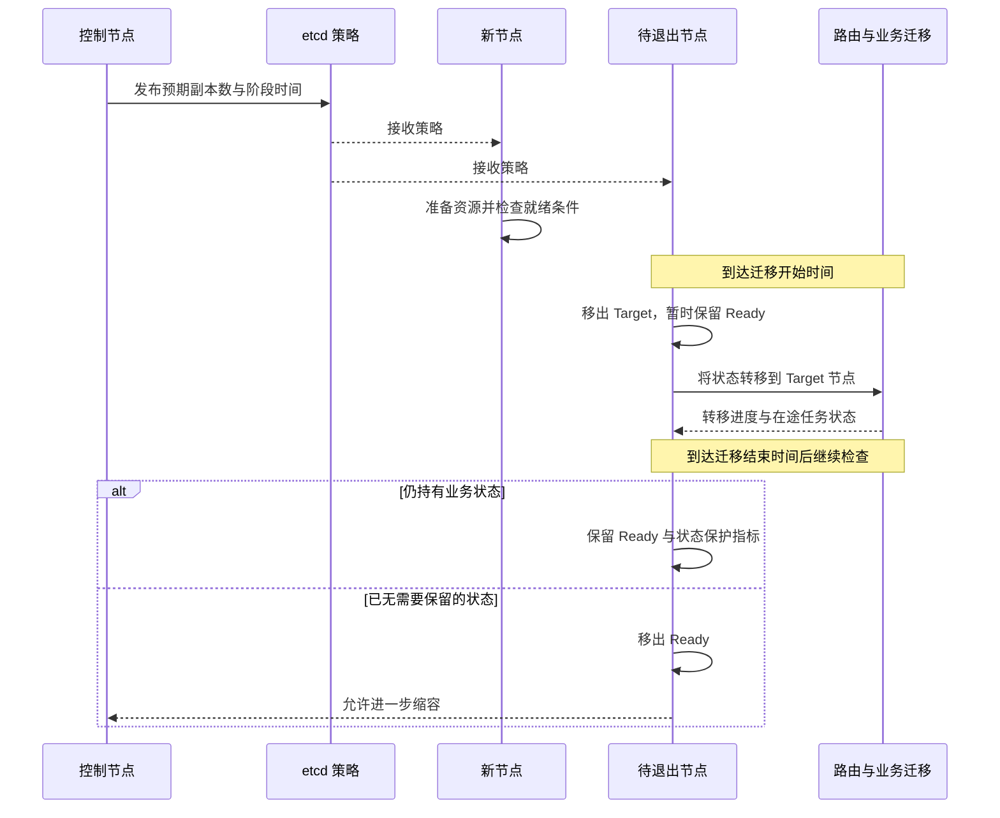
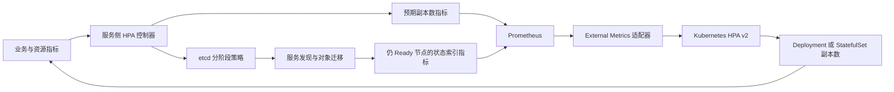

# HPA 控制器设计

框架的 HPA 控制器将指标驱动的副本建议与有状态服务的准备、迁移和退出过程连接起来。
它在服务进程内运行，提供 Prometheus 查询、策略、服务发现标签和检查回调；
Kubernetes 场景还需部署指标适配器和原生 HPA，不能只开启服务侧配置就完成扩缩容。

## 要解决的问题

无状态请求可以在副本变更后重新负载均衡。有状态节点可能持有频道、队伍、路由缓存、任务和会话，
直接减少副本会让状态丢失或在途请求失败。新副本也不能仅因进程已启动就立即接收全部业务。

控制必须回答三个问题：需要多少容量、哪些节点应承接新的状态、哪些旧节点仍要继续服务。
框架用预期副本数、Target 集合和 Ready 集合分别表达这些阶段。

## 指标到副本建议

内置 policy 支持 CPU、主线程 CPU、内存、近期任务数和控制器状态，也可配置自定义 policy。
对配置了正阈值的聚合负载，副本建议可表达为 `ceil(聚合负载 / 每副本目标负载)`，
多项 policy 使用较大的建议，再按伸缩规则、稳定窗口和最小/最大副本数处理。
扩容与缩容阈值分别配置，允许保留中间稳定区间。

该计算要求指标语义正确：总量配每副本目标值，不能把单个节点的均值当作总量直接相除。
非数值、缺失、陈旧和覆盖不全的输入需要按[动态策略设计](observability-policy)处理。
复杂业务可通过自定义 discovery provider 的副本建议接口接入业务算法。

当前默认 values 为 `install/cloud-native/values/default/modules/hpa.yaml`：
服务侧 controller 启用，最小副本数为 2，拉取间隔 20 秒、失败重试间隔 5 秒，
扩容与缩容稳定窗口均为 60 秒；`cloudnative.autoscaling.enable` 默认关闭。
这些是部署 values，不等于 protobuf 未填写字段时的默认值，项目覆盖配置可能不同。

## Target 与 Ready 分阶段切换

实际发现标签为 `hpa_scaling_target` 和 `hpa_scaling_ready`。
`logic_hpa_discovery_select_mode::kReady` 用于正常请求选择，`kTarget` 用于选择状态最终应迁往的节点。
Target 不是 Kubernetes readiness probe，也不等同于 Ready。

策略中的 `replicate_start_delay`、`replicate_period`、`scaling_delay` 为迁移和伸缩安排时间。
到达开始时间，待退出节点先移出 Target；到达结束时间后，若 `set_on_stateful_checking`
返回 true（仍持有状态），继续保留 Ready。未注册该检查时不能获得业务状态清空保护。
新节点的业务就绪条件通过 `set_on_ready_checking` 接入，必须根据资源与数据实际可用情况返回结果。

“零断流”还依赖[路由对象转移](../architecture/router)的单写入权、版本修正、转发、在途请求排空、
连接保留和新节点可达。Target/Ready 只是控制过程的一部分。
时钟延迟、网络分区、节点强制终止和外部执行器的超时需要单独验证，不能由标签宣称任意故障下零断流。

## 与 Kubernetes HPA 的衔接

| 指标 | 当前实现语义 | 适配要求 |
| --- | --- | --- |
| 预期副本数，默认名 `hpa_expect_replicas` | 控制节点报告阶段对应的副本建议 | 按目标工作负载聚合有效序列，使用最大建议，不能把重复控制节点的建议求和 |
| 状态索引，默认名 `hpa_stateful_index` | 节点 Ready 时报告索引，否则报告 0 | 取仍需保留节点的最大索引，作为缩容下限 |

云原生节点的索引在代码中为 `pod_index + 1`，即一基序号，不需要适配器再次加一。
非云原生场景按目标发现列表生成一基排序。该指标来自 Ready 状态，不直接统计节点中的业务对象数量，
保护效果依赖正确注册状态检查。指标导出后的完整名称和单位后缀需按实际 exporter 核对。

对从零开始、按末尾序号缩容的 [StatefulSet](https://kubernetes.io/docs/concepts/workloads/controllers/statefulset/)，
最大 Ready 索引能阻止仍持有状态的高序号 Pod 被正常缩容删除。
若使用非零 `spec.ordinals.start`，需同时核对控制器的分布计算与指标适配，不能直接把索引当作副本数。
Deployment 不承诺按此序号删除 Pod，需要额外的排空与终止协调，不能照搬该保护假设。

[Kubernetes HPA](https://kubernetes.io/docs/concepts/workloads/autoscaling/horizontal-pod-autoscale/)
使用 custom/external metrics 时需要相应 API 与适配器，多指标采用最大的副本建议。
将“绝对目标副本数”接入时，还要匹配 [HPA v2 API](https://kubernetes.io/docs/reference/kubernetes-api/autoscaling/horizontal-pod-autoscaler-v2/)
的指标类型与 target 语义，避免又乘一次当前副本数。
例如适配器提供工作负载的绝对建议 N 时，可设计 External `AverageValue` 目标为 1 来得到 N 的建议，
并分别提供状态保护建议；需用实际适配器返回值验证计算，随后仍受 HPA 的上下限与稳定规则影响。
本仓库的服务侧控制器不直接修改 Kubernetes 工作负载的副本字段。

## 接入与故障验证

1. 使用现有 values 配置查询地址、目标工作负载、阈值、上下限与稳定时间；先只观察副本建议。
2. 注册业务 Ready 与状态检查，接入 Target 分布变化和路由迁移。确认旧节点迁移期间仍能服务。
3. Kubernetes 部署适配器和 HPA，验证两个指标均只覆盖目标工作负载；裸机或其他环境接入实际扩缩容执行器。
4. 在状态清空、指标更新、HPA 执行和进程退出各阶段验证失败处理，再开放自动缩容。

| 故障 | 应验证的行为 |
| --- | --- |
| 查询失败、旧指标或部分节点缺失 | 不因未知输入误缩容，有告警和上次有效策略 |
| 控制节点切换、重复策略 | 决策与应用幂等，不反复创建或回收资源 |
| 迁移慢于配置窗口 | 状态检查保留节点，排空完成后才解除保护 |
| 进程被强制杀死 | 按 DB、WAL 和路由恢复契约处理，识别与正常排空的区别 |
| 指标适配器或 etcd 不可用 | 策略与执行状态可观察，恢复后重新校验实际副本和对象分布 |

实现位于 `src/server_frame/logic/hpa/`，协议位于 `svr.hpa.config.proto`，
部署模板为 `install/cloud-native/charts/libapp/templates/_atapp.logic.hpa.yaml.tpl`。
现有 HPA 单元测试覆盖指标拉取回调链；跨进程迁移、指标适配器与 Kubernetes 删除顺序需集成验证。
