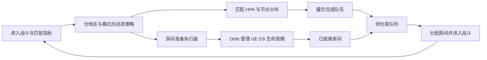

# 指标驱动的应用场景

本篇给出通用的业务接入设计。指标名、公式和策略载荷用于说明接入方式，交易行与战斗业务流程需要按项目实现。
它们使用[动态策略管线](observability-policy)、[HPA 控制器](hpa-controller)、[WAL](wal-replication)
和[路由迁移](../architecture/router)，将业务需求转换为可观察、可执行的调整。

## 场景一：按订单量调整订单撮合副本

### 问题与指标

订单量变化会影响撮合队列和等待时间。CPU 低不一定表示容量充足，可能是单个商品分区拥堵，
也可能是资源锁冲突或下游变慢。仅扩大副本数不能解决无法拆分的热点分区。

| 指标 | 含义 | 聚合范围 |
| --- | --- | --- |
| 待撮合订单数 B | 尚未完成的积压 Gauge | 按地区、订单分区汇总；每个订单只计一次 |
| 新增有效订单速率 λ | Counter 的窗口 rate | 排除重复重试，区分订单类型 |
| 可持续每副本吞吐 μ | 在可接受延迟下的完成能力 | 用稳定窗口或压测结果，包含冲突和下游限制 |
| 等待时长、失败、锁冲突 | 业务效果与瓶颈 | 有界分区标签，分位数从直方图桶计算 |
| 副本就绪与迁移进度 | 可用容量和执行阶段 | 只统计实际可服务节点 |

### 容量决策与执行

若希望在 T 秒内消化积压，可以用 `N = ceil((λ + B / T) / μ)` 作为候选建议，
再与 CPU、内存和延迟要求取较大建议，并限制在最小/最大副本数内。
μ 必须大于零且来自可信测量；该公式假设订单可分配且吞吐近似可加，热点分区不满足时应先调整分区。
T 表示清理队列积压的时间目标，单个订单的等待时间另行统计。

扩容时创建副本、恢复分区状态并检查就绪，再更新目标分布。缩容时先停止向退出节点分配新分区，
迁移已有订单和检查点，保留旧节点处理在途请求，最后解除 Ready 保护。
单个订单的成交或撤单仍由业务状态机、幂等键和必要的事务协调，扩缩容不能改变其互斥规则。

先以“只计算建议”模式记录 N、实际副本数和队列变化，再开启有界扩容，最后开放缩容。
验收时检查等待时间、积压清理时间和每订单处理成本；同时注入查询缺失、重试订单、热点分区和迁移中的成交请求。

## 场景二：按搜索分布调整索引与视图

### 问题与指标

不同搜索条件的使用频率差异很大。为所有组合建索引会增加内存、更新成本和构建时间，
索引不足又会让高频查询反复扫描。需要根据搜索分布调整索引集合与业务查询视图数量。
副本数影响可并行处理的查询量，索引选择影响单次查询的扫描量与索引维护成本。

把查询归类到有限的过滤维度、排序方式、商品类别和地区，观察请求速率、命中率、扫描量、延迟、
索引大小、更新速率和更新扇出。原始搜索串、用户 ID、订单 ID 不作为 metrics 标签。
需要更细的分布时在离线或受限采样数据中分析，再发布有限分类。

### 选择、构建与切换

候选索引的收益可按 `查询速率 × 节省的查询成本 − 更新速率 × 增加的维护成本 − 内存成本` 比较。
各项需转换为可比较的成本或分别设资源上限，不能直接将毫秒、字节和次数相减。
在内存、构建并发与维护开销限制内选择高收益索引，并要求收益持续一段时间才变更。

策略载荷可指定版本、启用的索引类别、视图数量和资源上限。
执行器先按一致快照构建，再追赶 WAL。切换前确认索引完整性、检查点和查询语义，
通过后发布新版本；旧查询仍使用旧版本，排空后回收。回滚时保留能追赶或重建的旧版本，不能仅回写一个失效版本号。

收益低、样本不足或指标过期时维持当前集合，避免不断构建与删除。
验证查询结果等价、P95、内存、写入放大和构建期间的业务延迟，同时覆盖订单更新、撤单和快照之后的增量。
WAL 支持同步机制，业务仍需实现索引算法、版本执行器和查询一致性条件。

## 场景三：按进战斗频率控制匹配与房间准备

### 问题与控制对象

战斗高峰包含三个不同需求：匹配撮合吞吐、匹配节点的地区/模式分布、可立即使用的战斗房间。
DS 启动有延迟，只在队列积压后创建进程可能已经无法满足等待目标。
预创建过多又会占用主机和进程资源，不能把“增加匹配副本”和“增加房间”合并成同一个动作。

| 控制对象 | 关键指标 | 策略输出 |
| --- | --- | --- |
| 匹配撮合服务 | 有效入队速率、待匹配人数、撮合耗时、CPU | 副本数与地区/模式的目标分布 |
| 战斗房间排队 | 已匹配队伍数、待分房队伍、等待时长 | 分房速率、队列限制及明确的超载处理 |
| 房间预创建 | 房间需求速率、可用/启动中数量、启动耗时、主机余量 | 目标空闲房间数、创建并发和主机分配 |

指标按地区、模式、地图等有界组合聚合。玩家进入次数先去重，区分取消、重入和实际形成战斗的请求。
玩家速率转换为房间速率时使用该模式的实际成组规则和成组率，不能简单认为一个玩家需要一个房间。

### 提前准备与分阶段执行

令 λ_room 为房间需求速率，L 为房间启动耗时的目标分位数，D 为采集到策略生效的延迟，
R 为额外备用房间数。可以用 `W_target = ceil(λ_room × (L + D)) + R` 估计目标准备量。
用 `create_count = max(0, W_target − 可用房间 − 启动中房间)` 计算新增量，
并受创建并发、主机容量和成本上限限制；不能每个周期重复创建 W_target 个房间。

匹配节点调整通过 HPA 与业务分片迁移执行；队伍和匹配规则沿用原业务约束。
房间执行器给创建任务分配幂等 ID，记录启动中、就绪、已分配和失败状态，
由 Orbit 的 controller/agent 等能力管理 UE DS 生命周期。房间需求预测、分房队列与重试策略需要业务接入，
不能认为启用 Orbit 就自动获得整条流程。

突发高峰时先利用已就绪房间，同时增加有上限的创建任务。
容量不足时排队或按产品规则返回明确结果；降低预测值时先停止新建并回收未使用资源，不终止仍在进行的战斗。
验收指标为入队到进战斗的等待时间、房间启动成功率、闲置成本和队伍规则正确性；
覆盖启动超时、重复创建回应、跨地区不均衡、控制延迟和主机容量耗尽。

## 三个场景共同的接入顺序

先定义指标与决策不变量，设置输入有效期与资源上限。使用只记录建议的模式验证输入和计算，
再逐步允许执行器调整，并监听实际完成结果。每次策略应可查询、可去重、可回滚。

索引改变会影响撮合吞吐，匹配加速会增加房间需求；各控制器需要考虑相互影响和执行延迟。
避免同一指标被多个控制器重复补偿，缩容与资源回收采用更保守的窗口。
自动调整的效果应结合业务延迟、成功率、资源成本，以及实际副本数与建议的差异共同评价。

接入入口为[自定义动态策略](observability-policy)、[dtmq](../components/dtmq)、
[匹配与组队](../components/matching-team)、[Orbit](../components/orbit)和[测试指南](../development/testing)。
