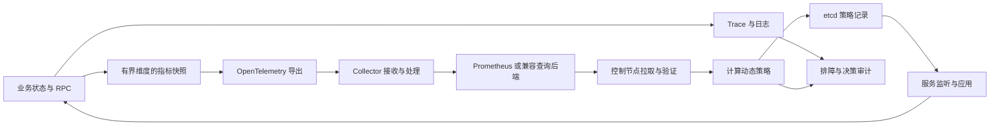

# 可观测性与动态策略

可观测性不仅用于排障，也为容量与业务策略提供输入。框架将指标采集、Prometheus 查询、策略计算、
etcd 发布和服务监听连接起来，支持副本数以外的业务参数。最小导出配置见[可观测性快速上手](../architecture/telemetry)。

## 要解决的问题

静态配置难以适应订单积压、搜索热点和战斗高峰。仅按 CPU 扩容也无法区分“请求多”与“索引效率低”，
更无法决定应增加撮合副本、调整索引，还是预创建房间。
有效的控制需要知道指标代表什么、何时采集、涵盖哪些节点，以及策略多久才能产生效果。

Trace 用来定位一条调用链的耗时与失败，日志记录对象和操作结果，metrics 表达一组请求或资源的统计。
控制策略主要使用聚合 metrics；异常决策再通过 trace 和日志追查。
不要把每条 trace 的对象标识搬到 metrics 标签中。

## 采集、关联与成本

框架在 task action 与 `rpc_context` 中管理 trace，上下文随 SS RPC 传播，Redis 调用作为子 span。
协程切换时同一线程会交替运行不同任务，因此不能只用线程局部的“当前 span”推断业务上下文。
跨线程或异步回调应显式传递对应上下文，避免把其他协程的调用关联进来。



OpenTelemetry 异步指标回调可能在采集线程执行。HPA policy 的 observer 在 SDK 指标锁保护下调用，
该锁不保护业务对象。推荐由业务线程更新原子值或发布不可变快照，采集回调只读取这些数据；
回调内不等待 RPC、不切换协程，也不遍历正在修改的容器。

| 成本来源 | 设计方法 |
| --- | --- |
| 高频事件逐次导出 | 在业务端累加计数或直方图，按采集周期导出 |
| 标签组合持续增加 | 只保留地区、模式、有限分桶等有界维度；用户、订单、原始搜索串写入日志 |
| Collector 或后端变慢 | 设置有限队列、批处理与重试，监控导出失败和丢弃量 |
| 控制与业务争用线程 | 采集快照，异步查询，将策略应用排入业务执行流程 |

每一种标签组合都会产生独立时序，参见 [Prometheus 指标命名实践](https://prometheus.io/docs/practices/naming/)。
[OpenTelemetry Metrics SDK](https://opentelemetry.io/docs/specs/otel/metrics/sdk/) 的 View 可限制保留属性；
实际支持项以集成的 SDK 版本为准。这里的 View 是指标处理配置，与交易行的业务查询视图不同。
[Collector pipeline](https://opentelemetry.io/docs/collector/architecture/) 可分离接收、处理与导出，但有限队列不能保证任意故障下零丢失。

## 自定义策略的最小接入

已有 CPU、内存等策略只需调整 values；增加新的业务指标与决策时需要少量业务接入，使用现有接口即可，
无需修改生成模板或 CMake 的实现。以仅由业务回调决策的指标为例，values 中 `modules/hpa.yaml` 可加入：

```yaml
rule:
  custom:
    - metrics_name: "market_pending_orders"
      aggregation: EN_HPA_POLICY_AGGREGATION_SUM
      scaling_up_value: 0
      scaling_down_value: 0
```

`market_pending_orders` 需由业务定义并注册。零阈值使该项不直接计算副本建议，缺失指标应按未知输入处理。
完整策略字段由 `svr.hpa.config.proto` 定义。

1. 定义指标的单位、类型、聚合维度和更新方式，在 `set_on_setup_custom_policy` 回调中注册
   `add_observer_int64`、`add_observer_double` 或已有指标观察接口。
2. 创建 `create_custom_discovery`，在 setup 回调中 `reset_policy` 并使用 `add_pull_policy` 重新关联所需 policy。
   配置重载后重新关联，不能继续持有已清理的旧 policy。
3. 注册 `add_event_on_pull_instant` 或 `add_event_on_pull_range` 和错误处理。
   验证输入后，由选定控制节点计算策略，通过 discovery 的 `set_value` 发布。
4. 服务通过 `add_event_on_changed` 监听相应 key 或子 key，校验版本和参数范围，幂等应用并报告结果。
   不同业务域使用不同 discovery 名称或子 key。

policy 支持显式查询，也支持按指标、聚合、函数和 selector 构造 PromQL。
跨服务查询时检查自动注入的服务类型等 selector；按需使用 `without_auto_selectors` 并明确补上地区、工作负载和环境范围。
否则可能查询不到目标服务，或把其他区域、其他工作负载的指标一起计算。

## 指标语义与决策条件

| 输入 | 用法 | 必须检查的条件 |
| --- | --- | --- |
| Gauge：队列长度、可用房间 | 当前资源或积压快照 | 时间戳、覆盖节点、是否重复统计同一资源 |
| Counter：订单到达、进入战斗 | 用窗口内 rate 估计速率 | 重启归零、窗口长度、采集缺口 |
| Histogram：等待与启动耗时 | 用分桶聚合计算分位数 | 分桶一致，先聚合桶再求分位数 |
| 策略应用结果 | 判断决策是否真正生效 | 策略版本、完成阶段、失败原因 |

Prometheus 的 [HTTP 查询 API](https://prometheus.io/docs/prometheus/latest/querying/api/) 提供 instant/range 查询。
采样延迟、空向量、失败、NaN 和过期值都应作为不同输入状态处理。
有数据不等于数据足够新；当前 policy 的 ready 状态也不能代替业务的新鲜度检查。
延迟分位数用 [histogram_quantile](https://prometheus.io/docs/prometheus/latest/querying/functions/) 计算，不能平均各节点的 P95。

接入方案应设置最大数据年龄、最小覆盖范围、上下限、变化幅度和稳定窗口。
输入未知时保留上次有效策略或进入明确的安全策略，尤其禁止将缺失值直接解释为可以缩容。
这些业务条件需要自行实现，不能假设每个自定义 policy 都已自动具备。

业务自行定义策略载荷，可包含业务版本、输入时间范围、有效期、目标参数与原因。
执行者拒绝旧版本和非法值，先准备资源，再切换流量，最后报告实际结果。
计算周期至少考虑采集、查询、发布和执行总延迟；在上一次调整未生效前继续调整容易形成振荡。

## 控制节点与传播边界

当前控制器按工作负载的发现列表选择主控制节点，并在切换后等待拉取周期再发布。
自定义 discovery 使用 etcd KV 写入和 watch 传播；`set_value` 当前不是带租约代次的 CAS 发布。
如果业务要求网络分区下严格禁止多个控制者写入，应另外设计租约、代次或 CAS 检查，不能只依赖列表排序。

[etcd API 保证](https://etcd.io/docs/v3.6/learning/api_guarantees/) 区分 KV 读写与 watch 的语义。
监听者仍要处理重连、历史压缩和重新读取当前值，按 revision 或业务版本防止旧值覆盖新策略。
存储自身的一致性不会自动让执行器只执行一次。

## 验证与实现入口

先观察指标和只记录策略建议，再开放有界调整，最后启用自动控制。
验证正常高峰、采集缺失、延迟响应、控制节点切换、重复或乱序策略、执行器失败与回滚。
同时记录输入年龄、策略变更次数、建议与实际差异、应用耗时和业务效果。

采集与 trace 位于 `src/server_frame/rpc/telemetry/`；策略、查询和监听位于
`src/server_frame/logic/hpa/logic_hpa_{controller,policy,discovery}.*` 与 `pull/prometheus/`。
`src/server_frame/test/server_frame_test_hpa.cpp` 验证拉取、解析、回调与 ready 链路，
不包含真实指标后端、Kubernetes 扩缩容或业务策略收敛验证。
副本控制见 [HPA 控制器](hpa-controller)，业务参数控制见[三个应用场景](metric-driven-scenarios)。
