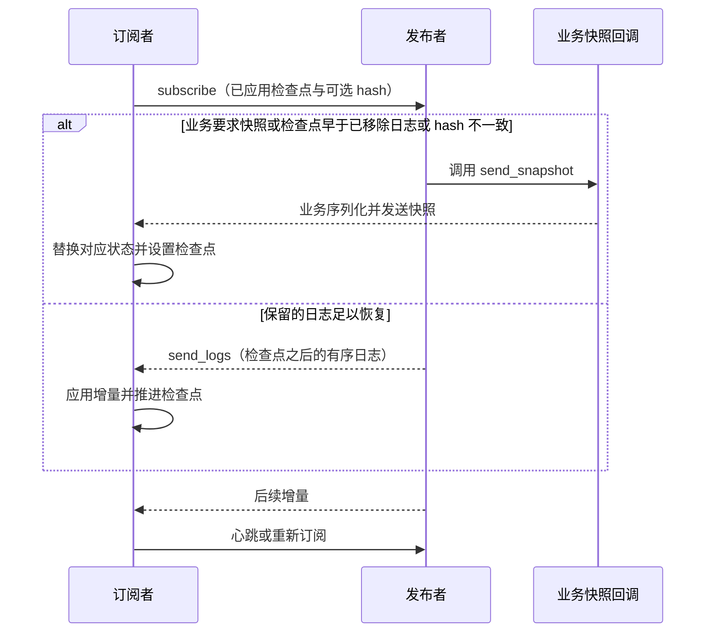

# WAL 与状态复制

WAL（Write-Ahead Log）组件用有序日志描述对象的变化，使订阅者能够重放增量、检测不同步并恢复状态。
这里提供的是日志管理和同步算法，存储与传输通过回调接入；组件本身不保证日志先落盘再确认。
使用消息频道可先看[dtmq 快速上手](../components/dtmq)。

## 要解决的问题

一个队伍、频道或订单可能同时被资源所有者、成员、查询服务和客户端观察。
不同角色需要的内容不同：所有者需要完整状态，查询服务需要派生索引，成员只需要允许公开的字段。
逐次广播完整对象会增加带宽；只发送事件又无法帮助长时间离线或刚加入的订阅者恢复。

并发操作还需要顺序。例如匹配成功与取消、出售与撤单，必须先由资源所有者确定有效变化，
再发布已接受的事件。WAL 复制该顺序，不替业务决定冲突结果，也不让多个独立写入者自动达成共识。

## 日志、检查点与快照

| 数据 | 作用 | 接入要求 |
| --- | --- | --- |
| 日志 key | 比较变化的先后次序，定位增量范围 | 为同一对象提供稳定的可比较顺序；可比较不等于必须连续整数 |
| 动作类型与内容 | 选择回调并更新业务状态 | 重放所需输入完整，重复处理不会重复产生外部副作用 |
| 检查点 | 表明订阅者已应用到哪里 | 与实际已应用状态一致，不能在动作完成前提前推进 |
| 校验值 | 检测相同检查点下的内容差异 | 配置一致的计算方法；SDK 提供可选 hash 回调 |
| 快照 | 表示某个检查点的完整可恢复状态 | 状态与检查点一致，覆盖对应订阅者需要的全部字段 |

发布者通过 `wal_object` 的 action delegate 应用日志，通过 `wal_publisher` 向订阅者发送日志或快照。
`wal_client` 管理接收、订阅和心跳。业务提供日志 key、动作、快照序列化、传输和可选校验回调。
IO 与算法分离，便于在不同服务中复用同一同步逻辑。

## 增量同步与自动修复

发布者先检查业务的强制快照回调，再判断检查点是否早于 `last_removed`。
检查点对应的日志仍存在，且订阅请求提供 hash、发布者配置完整 hash 回调时，才比较该日志的校验值；
不一致则调用 `send_snapshot`。其他情况调用 `send_logs` 发送检查点之后的保留日志，没有增量时只回复订阅结果。

客户端支持订阅心跳、失败重试间隔和要求首次快照。`on_receive_snapshot` 由业务恢复状态；
SDK 不直接读取存储，也不负责生成快照。接入方须保持状态和检查点一致，并按回调契约替换快照覆盖的数据。
dtmq 的快照回调调用 `wal.load`，由其 load 回调恢复频道数据及日志。

## 保留、压缩与订阅分发

日志保留时间和数量决定允许增量追赶的范围。超过该范围的订阅者通过快照恢复，
因此应同时考虑日志空间、快照大小、恢复耗时和最慢订阅者。日志 GC 不代表业务数据可以删除。

| 当前接入 | 日志保留与压缩方式 |
| --- | --- |
| WAL 算法库 | 按配置的日志年龄和数量执行 GC，记录已移除日志的边界 |
| dtmq | 用 `gc_expire_duration`、`gc_log_count` 和 `max_log_count` 配置保留范围；`compact_sequence` 提供状态日志裁剪入口 |
| 组队房间 | 在频道自定义数据中保存当前房间状态，并通过频道 update 提交状态与压缩位置 |

进程内共享订阅者可让多个本地使用者复用一次上游订阅，减少跨进程分发。
dtmq 已提供进程内订阅 SDK，不要求每个玩家直接建立独立的跨服务 WAL 连接。

## 持久化与所有者迁移

WAL 算法库通过回调接入 load/dump 和传输，不自带磁盘刷写协议。
dtmq 通过 `mq_channel` 的 IO 任务将频道记录保存到 Redis，并使用脏版本安排后续保存；
WAL 的 `on_log_added`、`on_log_removed` 回调会标记频道脏状态。因此日志同步成功不等于 Redis 已保存完成。

dtmq 按服务发现和 HPA Target/Ready 集合计算频道副本分布，使用频道快照、订阅者合并和请求转发完成迁移。
它有自己的 `mq_channel` / `mq_channel_manager`，不使用通用 router 对象的归属交接流程。
通用对象的保存与迁移另见[路由详细设计](../architecture/router)。
具体业务的恢复能力取决于其保存周期、快照内容及迁移实现，不能仅由 WAL 算法推导持久性或单写入权保证。

## 验证与实现入口

| 接入验证项 | 检查内容 |
| --- | --- |
| 增量、重复投递、重新订阅 | 检查日志 key 过滤与业务动作的重放结果 |
| 检查点早于 GC 边界、可校验的 hash 不一致 | 检查快照回调及后续增量衔接 |
| 保存前退出、重启恢复 | 核对真实存储中的状态与日志，确认允许的未保存范围 |
| 频道迁移与订阅者合并 | 核对目标数据、订阅信息和旧节点转发 |

算法实现位于 `atframework/atframe_utils/include/distributed_system/wal_*.h`。
对应测试为 `atframework/atframe_utils/test/case/wal_object_test.cpp`、`wal_publisher_test.cpp` 和 `wal_client_test.cpp`。
服务接入可查看 `src/component/dtmq/dtmq-proxysvr/data/mq_channel_wal_handle.*`、
`src/component/rank/rank_board_svr/logic/rank_wal_handle.*` 与 `src/teamsvr/service/room/logic/room/`。
算法测试不能代替真实存储的落盘、故障转移和跨进程迁移验证。
