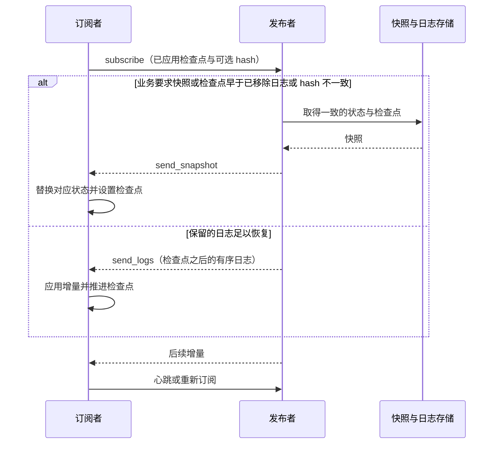

# WAL 与状态复制

WAL（Write-Ahead Log）用有序日志描述对象的变化，使订阅者能够重放增量、检测不同步并恢复状态。
框架提供可复用的算法与回调；是否先持久化再确认、如何防止旧所有者写入，由存储和业务接入决定。
使用消息频道可先看[dtmq 快速上手](../components/dtmq)。

## 要解决的问题

一个队伍、频道或订单可能同时被资源所有者、成员、查询服务和客户端观察。
不同角色需要的内容不同：所有者需要完整状态，查询服务需要派生索引，成员只需要允许公开的字段。
逐次广播完整对象会增加带宽；只发送事件又无法帮助长时间离线或刚加入的订阅者恢复。

并发操作还需要顺序。例如匹配成功与取消、出售与撤单，必须先由资源所有者确定有效变化，
再发布已接受的事件。WAL 复制该顺序，不替业务决定冲突结果，也不让多个独立写入者自动达成共识。

## 日志、检查点与快照

| 数据 | 作用 | 接入要求 |
| --- | --- | --- |
| 日志 key | 比较变化的先后次序，定位增量范围 | 为同一对象提供稳定的可比较顺序；可比较不等于必须连续整数 |
| 动作类型与内容 | 选择回调并更新业务状态 | 重放所需输入完整，重复处理不会重复产生外部副作用 |
| 检查点 | 表明订阅者已应用到哪里 | 与实际已应用状态一致，不能在动作完成前提前推进 |
| 校验值 | 检测相同检查点下的内容差异 | 配置一致的计算方法；SDK 提供可选 hash 回调 |
| 快照 | 表示某个检查点的完整可恢复状态 | 状态与检查点一致，覆盖对应订阅者需要的全部字段 |

发布者通过 `wal_object` 的 action delegate 应用日志，通过 `wal_publisher` 向订阅者发送日志或快照。
`wal_client` 管理接收、订阅和心跳。业务提供日志 key、动作、快照序列化、传输和可选校验回调。
IO 与算法分离，便于在不同服务中复用同一同步逻辑。

## 增量同步与自动修复

当前发布者在订阅检查点早于 `last_removed`、配置的 hash 校验失败或业务要求强制同步时选择快照，
否则发送检查点后的保留日志。客户端有订阅心跳和失败重试间隔，也支持要求快照。
快照接收回调应替换对应数据，不能把旧状态与完整快照简单叠加。

接入时还要解决快照与增量交界处的竞态：记录快照对应的检查点，先恢复快照，再应用更晚的日志。
为对象重建定义代次，避免复用旧检查点误跳过新对象的变化。SDK 的 key 比较和忽略范围不能替代业务的代次设计。
外部通知、扣款等副作用需要独立的幂等键或事务记录，不能仅凭“这条日志已经接收”保证只执行一次。

## 保留、压缩与订阅分发

日志保留时间和数量决定允许增量追赶的范围。超过该范围的订阅者通过快照恢复，
因此应同时考虑日志空间、快照大小、恢复耗时和最慢订阅者。日志 GC 不代表业务数据可以删除。

| 内容类型 | 可采用的压缩方式 | 不能省略的条件 |
| --- | --- | --- |
| 当前状态，例如成员属性 | 合并为一致快照，保留近期增量 | 快照包含完整当前状态，接收方支持全量替换 |
| 每次都必须处理的事件，例如结算记录 | 保留事件或写入独立事件存储 | 消费确认、重放与去重满足业务保留要求 |
| 查询索引或通知视图 | 从快照重建，再追赶日志 | 派生数据的版本和检查点可校验 |

进程内共享订阅者可让多个本地使用者复用一次上游订阅，减少跨进程分发。
中继仍需记录上游与下游进度，并限制缓冲区；慢订阅者超出保留范围时改用快照，避免无限积压。
dtmq 已提供进程内订阅 SDK，不要求每个玩家直接建立独立的跨服务 WAL 连接。

## 持久化与所有者迁移

WAL 算法库通过回调接入 load/dump 和传输，不自带磁盘刷写协议。
接入方若要求确认后重启不丢数据，应设计并验证以下次序：验证写入权、持久化日志和恢复所需状态、
成功后确认及发布；失败时返回可重试状态。异步批量落盘的确认边界和允许丢失范围需要单独说明。

dtmq 使用频道记录、DB CAS 和路由管理维护可写所有者，并向只读副本同步日志。
迁移时要让新所有者恢复状态与检查点、追赶增量，再切换写入权。
旧所有者的在途写入须由版本或 CAS 拒绝。只修改服务发现地址不足以保证单写入者。
对象转移、转发和会话连续性见[路由详细设计](../architecture/router)。

WAL 负责单个资源的变化流；多个资源需要共同提交时使用[分布式事务](distributed-transactions)。
可在事务确认后的幂等动作中更新状态与日志，但业务数据、日志和参与者快照的保存边界必须一致。

## 验证与实现入口

| 检查 | 预期结果 |
| --- | --- |
| 重复投递、重新订阅 | 状态不重复变化，外部副作用不重复执行 |
| 检查点已被 GC、hash 不一致 | 转为快照并继续接收后续增量 |
| 快照生成时仍有新写入 | 快照检查点与增量衔接，无遗漏或旧状态回写 |
| 持久化完成后回应丢失、重启重放 | 重试能识别同一操作，状态与承诺的持久性一致 |
| 迁移、旧所有者延迟写入 | 新所有者可恢复，旧版本写入被拒绝 |
| 慢订阅者、扇出峰值 | 缓冲区有上限，可观测同步延迟和快照回退次数 |

算法实现位于 `atframework/atframe_utils/include/distributed_system/wal_*.h`。
对应测试为 `atframework/atframe_utils/test/case/wal_object_test.cpp`、`wal_publisher_test.cpp` 和 `wal_client_test.cpp`。
服务接入可查看 `src/component/dtmq/dtmq-proxysvr/data/mq_channel_wal_handle.*`、
`src/component/rank/rank_board_svr/logic/rank_wal_handle.*` 与 `src/teamsvr/service/room/logic/room/`。
算法测试不能代替真实存储的落盘、故障转移和跨进程迁移验证。
