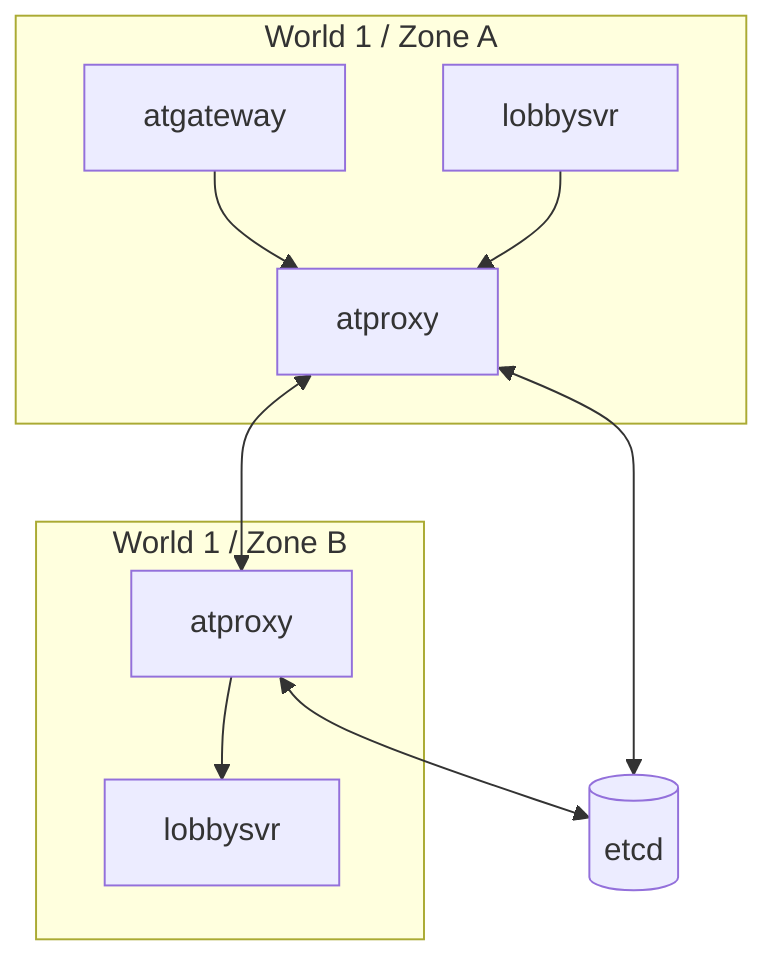

# Gateway and Proxy (atgateway / atproxy)

## atgateway

Location: `atframework/service/atgateway`. The client access gateway, responsible for:

- **Key exchange**: ECDH/DH handshake (direct plaintext or no encryption is also supported);
- **Encryption and compression**: per-session encryption, optional compression;
- **Traffic control**: independent rate limiting and handshake timeout per client;
- **Router switching**: supports migrating clients between logic services (`send_set_router`).

The client protocol is the **atgateway v2 protocol** defined with FlatBuffers (see the specification at
`atframework/service/atgateway/protocol/PROTOCOL.md`); the client-side SDK lives in `atframework/export/` and
`src/robot/atframework/` (`libatgw_protocol_sdk.fbs`).

The gateway does not parse business message bodies: upstream, it wraps `CSMsg` together with
`(gateway_node_id, session_id)` into a `gateway::server_message` and delivers it to the target service via atbus;
downstream, it routes responses back to the client by session.

## atproxy

Location: `atframework/service/atproxy`. Cross-service-group proxy:

- Uses **etcd** for service discovery and online detection (lease + watch);
- Services in different worlds/zones address and forward to each other through atproxy;
- Services (including atproxy itself) register their node information in etcd, and the discovery provider of
  `ss_msg_dispatcher` resolves target nodes based on it.

Debug tools: `src/tools/etcd-watcher` (watch etcd key changes), `src/tools/etcd-atproxy-ls` (list registered
atproxy nodes).

## Connection Topology

Services within the same zone can connect directly (`enable_direct_connection` values profile); cross-zone
traffic is forwarded through atproxy by default.
