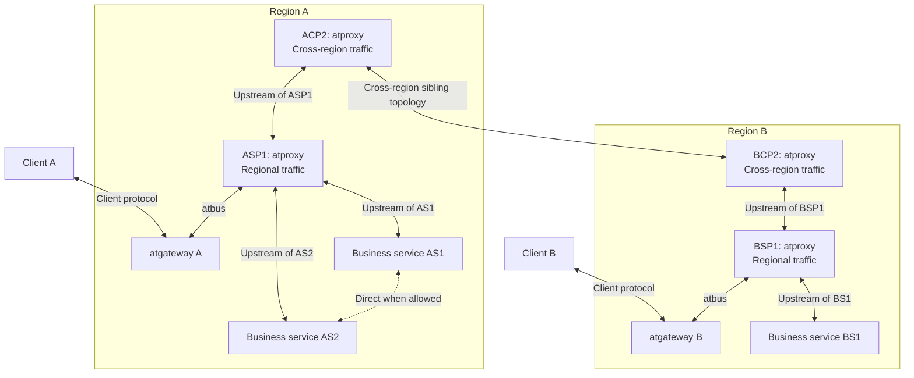
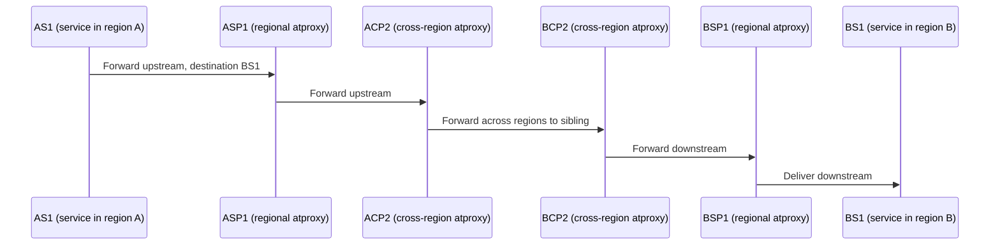
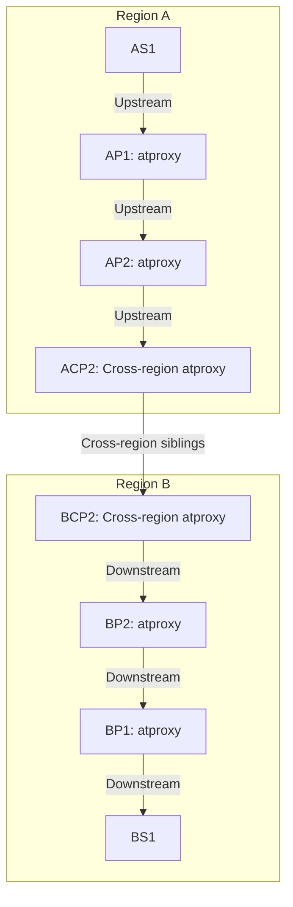

# Gateway and Proxy (atgateway / atproxy)

## Quick Start

1. [Start](../getting-started/run-deploy) atgateway, atproxy, and the target business service.
2. Configure etcd, gateway listeners, and the target service through values; verify connection/login/requests with [robot](../services/robot).
3. Use existing gateway protocol SDKs for ordinary integration; no handshake or transport template changes are needed.

## Customization and Design

### atgateway

Location: `atframework/service/atgateway`. The client access gateway, responsible for:

- **Key exchange**: ECDH/DH handshake (direct plaintext or no encryption is also supported);
- **Encryption and compression**: per-session encryption, optional compression;
- **Traffic control**: independent rate limiting and handshake timeout per client;
- **Router switching**: supports migrating clients between logic services (`send_set_router`).

The client protocol is the **atgateway v2 protocol** defined with FlatBuffers (see the specification at
`atframework/service/atgateway/protocol/PROTOCOL.md`); the client-side SDK lives in `atframework/export/` and
`src/robot/atframework/` (`libatgw_protocol_sdk.fbs`).

The gateway does not parse business message bodies: upstream, it wraps `CSMsg` together with
`(gateway_node_id, session_id)` into a `gateway::server_message` and delivers it to the target service via atbus;
downstream, it routes responses back to the client by session.

### atproxy

Location: `atframework/service/atproxy`. Proxy for communication between services:

- Uses **etcd** for service discovery and online detection (lease + watch), publishing node and topology information;
- Supports a tree of upstream/downstream nodes: business services connect to regional proxies, which can connect to higher-level proxies;
- Supports communication across international regions: dedicated cross-region proxies serve as upstreams for regional proxies and connect regions;
- Services (including atproxy itself) register in etcd. The discovery provider of `ss_msg_dispatcher` resolves target nodes,
  and atbus uses topology to select a direct connection or upstream/downstream forwarding.

Debug tools: `src/tools/etcd-watcher` (watch etcd key changes), `src/tools/etcd-atproxy-ls` (list registered
atproxy nodes).

### Connection Topology

Client connects to atgateway using the client protocol; atgateway communicates with business services through atbus.
atproxy forwards traffic between server nodes. A region below is a deployment region, potentially in another country;
it does not have a fixed one-to-one mapping to the business `world_id` or `zone_id`.

```mermaid
flowchart TB
    CA[Client A] <-->|Client protocol| GWA
    CB[Client B] <-->|Client protocol| GWB
    subgraph RegionA[Region A]
      ACP2["ACP2: atproxy<br/>Cross-region traffic"]
      ASP1["ASP1: atproxy<br/>Regional traffic"]
      GWA[atgateway A]
      AS1[Business service AS1]
      AS2[Business service AS2]
      ACP2 <-->|Upstream of ASP1| ASP1
      ASP1 <-->|atbus| GWA
      ASP1 <-->|Upstream of AS1| AS1
      ASP1 <-->|Upstream of AS2| AS2
      AS1 <-.->|Direct when allowed| AS2
    end
    subgraph RegionB[Region B]
      BCP2["BCP2: atproxy<br/>Cross-region traffic"]
      BSP1["BSP1: atproxy<br/>Regional traffic"]
      GWB[atgateway B]
      BS1[Business service BS1]
      BCP2 <-->|Upstream of BSP1| BSP1
      BSP1 <-->|atbus| GWB
      BSP1 <-->|Upstream of BS1| BS1
    end
    ACP2 <-->|Cross-region sibling topology| BCP2
```

Solid lines show bidirectional communication; dashed lines show optional direct connections. Within region A,
AS1 and AS2 communicate through their common upstream ASP1, or directly when policy allows it.
atgateway may also connect directly to business services. etcd supplies discovery and topology information;
business messages do not pass through etcd.

With the deployment and connection policies shown above, a request from AS1 to BS1 follows this path:

```mermaid
sequenceDiagram
    participant AS1 as AS1 (service in region A)
    participant ASP1 as ASP1 (regional atproxy)
    participant ACP2 as ACP2 (cross-region atproxy)
    participant BCP2 as BCP2 (cross-region atproxy)
    participant BSP1 as BSP1 (regional atproxy)
    participant BS1 as BS1 (service in region B)
    AS1->>ASP1: Forward upstream, destination BS1
    ASP1->>ACP2: Forward upstream
    ACP2->>BCP2: Forward across regions to sibling
    BCP2->>BSP1: Forward downstream
    BSP1->>BS1: Deliver downstream
```

The path is `AS1 -> ASP1 -> ACP2 -> BCP2 -> BSP1 -> BS1`. Responses follow the reverse path;
existing direct connections can shorten it.

### Multiple Proxy Levels and Deployment Configuration

The proxy tree can have additional levels. For example, AP1/BP1 handle local communication around service nodes,
AP2/BP2 aggregate regional traffic, and ACP2/BCP2 handle cross-region connections. The path expands to:

```mermaid
flowchart TB
    subgraph RegionA[Region A]
      AS1[AS1] -->|Upstream| AP1[AP1: atproxy]
      AP1 -->|Upstream| AP2[AP2: atproxy]
      AP2 -->|Upstream| ACP2[ACP2: Cross-region atproxy]
    end
    subgraph RegionB[Region B]
      BCP2[BCP2: Cross-region atproxy] -->|Downstream| BP2[BP2: atproxy]
      BP2 -->|Downstream| BP1[BP1: atproxy]
      BP1 -->|Downstream| BS1[BS1]
    end
    ACP2 -->|Cross-region siblings| BCP2
```

For ordinary deployment, override values as described in [server configuration](../development/server-config);
no CMake or template changes are needed:

- Set the upstream address with `atapp.atbus.policy.remote_proxy`. Disable `enable_local_proxy` when specifying an
  upstream explicitly, because the local proxy setting takes precedence. Regional proxies can use this setting to connect to cross-region proxies.
- Set direct-connection conditions and topology labels through `atapp.atbus.configure.topology.rule` and
  `topology.data.label`. `allow_direct_connection`, labels, and other conditions determine eligibility;
  sharing a zone alone is insufficient.
- Dedicated cross-region proxies need reachable listeners and matching topology policies. atproxy injects the
  `atapp_type=atproxy` label. When `atproxy_region` is unspecified, it uses `local` and adds a matching condition.
  Explicitly configure that label and matching rules for the cross-region layer, distinguishing regional connections
  from cross-region connections according to the deployment.
- Check the generated `atapp.bus.proxy`, listeners, and `topology`, then verify regional, cross-region, and reverse requests.

Defaults are in `install/cloud-native/values/default/global.yaml` and `atproxy.yaml`.
For custom forwarding rules, see `atframework/service/atproxy/atproxy_manager.cpp`, `get_relation` in
`atframework/libatbus/src/atbus_topology.cpp`, and next-hop selection in `atbus_node.cpp`.
