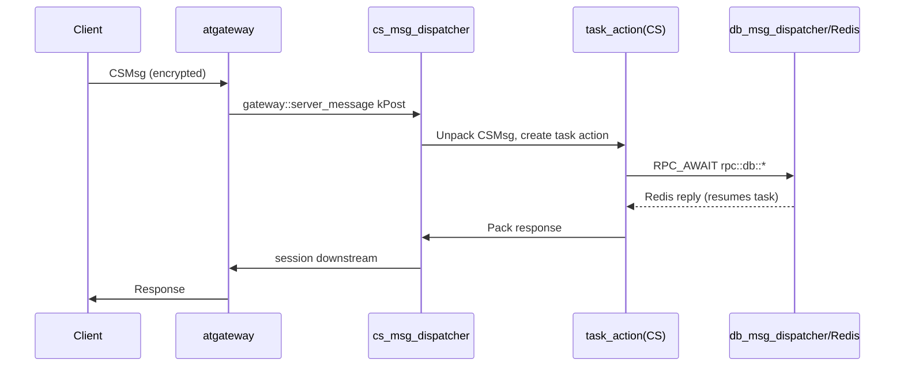

# Message Flow and Threading Model

## Event Loop

The main function of each service process (e.g. `src/lobbysvr/service/app/lobbysvr_main.cpp`) performs:

1. Constructs `atfw::atapp::app`;
2. `logic_server_setup_common` (`src/server_frame/logic/logic_server_setup.cpp`) assembles common modules, event
   callbacks, and the service discovery index;
3. `app.add_module(cs_msg_dispatcher::me(), ss_msg_dispatcher::me(), db_msg_dispatcher::me(), business modules...)`;
4. `app.run(uv_default_loop(), argc, argv, nullptr)`.

All atbus send/receive, Redis replies, timers, and DNS queries are invoked back on this single libuv loop;
time-consuming operations are always wrapped as coroutine tasks, which suspend via `co_await` (or the libcopp
equivalent macros) and are resumed by the dispatcher using `task_id + sequence`.

## Client Message Flow (CS)

`cs_msg_dispatcher` handles the four types of `gateway::server_message`: `kAddSession` (create session), `kPost`
(upstream message, starts a CS task action), `kRemoveSession` (logout), and `kSetRouterRsp`. Downstream messages
are returned to atgateway via `session::send_msg_to_client` / `cs_msg_dispatcher::send_data / broadcast_data /
send_kickoff / send_set_router`.

## Inter-Service Message Flow (SS)

- The caller-side code is generated by `rpc_call_api_for_ss.*.mako`: it assembles an `SSMsg` →
  `ss_msg_dispatcher::send_to_proc` (by bus id / name / discovery node) → `app::send_message` → atbus;
  cross-service-group traffic can be forwarded through atproxy.
- Supports unary / stream / no-wait / broadcast / metadata / user / router variants; broadcast can be addressed
  by type, zone, or metadata index.
- Responses resume the waiting task via `internal::wait_and_unpack_ss_response` using
  `destination_task_id + sequence`.
- `ss_msg_dispatcher` embeds DNS lookup (`uv_getaddrinfo` + `custom_resume`) to resolve peer addresses on demand.

## Database Message Flow

`db_msg_dispatcher` manages Redis cluster and raw (sentinel) dual-channel connections based on hiredis-happ,
supports SCRIPT LOAD and embedded Lua (CAS, KL index trimming); replies are unpacked and then resume the
corresponding task. See [Data Layer](data-layer) for details.

## Suspend/Resume Primitives

| Primitive | Location | Purpose |
| --- | --- | --- |
| `rpc::wait` | `rpc/rpc_utils.h` | Wait for SSMsg / db_message (optionally with timeout), supports multiple waiters |
| `rpc::custom_wait` / `rpc::custom_resume` | `rpc/rpc_utils.h` | Suspend/resume by type address + sequence (custom wakeups such as DNS, router) |
| `rpc::async_invoke` | `rpc/rpc_async_invoke.h` | Wrap any callable and start it as a real task |
| `RPC_AWAIT_*` / `RPC_RETURN_*` | `rpc/rpc_common_types.h` | Macros that hide the differences between the std-coroutine and libcopp implementations |
