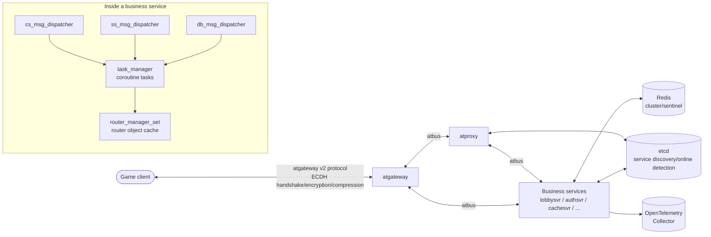

# Architecture Overview

## Component Relationships

Main path: **Client → atgateway → atproxy → service → dispatcher → task action → data/DB**.

- **atgateway** (`atframework/service/atgateway`): manages client connections, responsible for ECDH/DH key
  exchange, encryption, compression, rate limiting, and router switching.
- **atproxy** (`atframework/service/atproxy`): cross-service communication proxy, using etcd for service
  discovery and online detection.
- **Business services** (`src/*svr/`, `src/component/*/`): uniformly assembled from `src/server_frame/`; the
  dispatcher converts messages into coroutine task actions for execution.

## Layered View

| Layer | Location | Responsibility |
| --- | --- | --- |
| Access layer | atgateway / atproxy | Client access, cross-service forwarding, service discovery |
| Framework layer | `src/server_frame/` | dispatcher, task, router, rpc, config, data, telemetry |
| Component layer | `src/component/` | Reusable services + SDKs such as dtmq, distributed_transaction, rank, orbit |
| Business layer | `src/*svr/` | Business logic such as login (authsvr), lobby (lobbysvr), cache (cachesvr) |
| Data layer | Redis (`db_msg_dispatcher`) | KV/KL/CAS primitives + DB interfaces generated from `*.table.proto` |
| Deployment layer | `install/` | Helm chart / Docker / bare-metal scripts, rendered by atdtool |

## Vendored Framework Libraries (atframework/)

| Library | Responsibility |
| --- | --- |
| `atframe_utils` | Base utilities: logging, algorithms, coroutine wrappers, distributed-system primitives (WAL, etc.) |
| `libatbus` | Inter-server communication bus |
| `libatapp` | Server application framework: module management, event loop, configuration, connectors |
| `service/atproxy` / `service/atgateway` | Built-in access services |
| `cmake-toolset` | Cross-platform CMake toolchain and third-party ports |

## Single-Threaded Coroutine Model

There is no worker thread concept anywhere in the repository: all IO (atbus, Redis, timers, DNS) is attached to
the same libuv loop, and business concurrency is entirely carried by coroutine tasks. The
`PROJECT_SERVER_FRAME_USE_STD_COROUTINE` switch toggles between the C++20 coroutine and libcopp cotask
implementations, unified behind `task_type_traits.h` so business code does not need to be aware of the difference.
