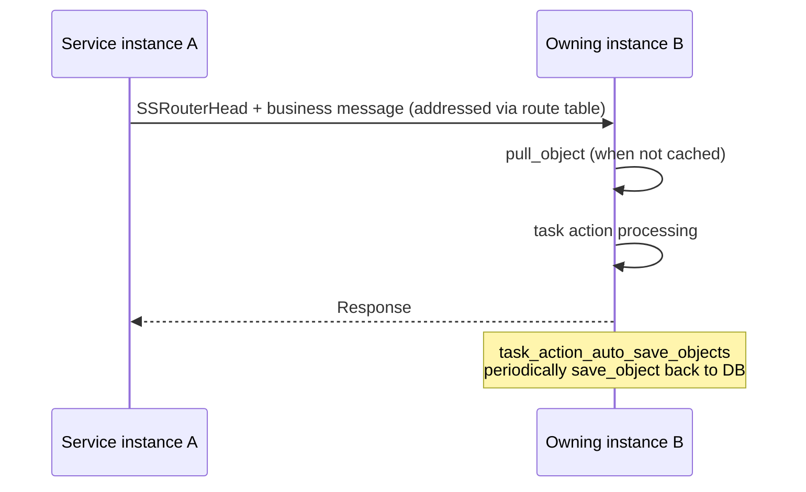

# Router System (router)

The router system answers the question "which service instance owns this stateful object": objects (such as
players or teams) are routed by key to their owning instance, cached in memory, and periodically saved back.

## Core Classes

| Class | Location | Responsibility |
| --- | --- | --- |
| `router_object_base` / `router_object<T>` | `src/server_frame/router/` | Router object base: `pull_object`/`save_object` (coroutine RPCs), TTL, degradation |
| `router_manager_base` / `router_manager<TCache, TObj, TPrivData>` | `router/router_manager.h` | Object manager: `mutable_cache`/`mutable_object`, event callbacks |
| `router_manager_set` | `router/router_manager_set.h` | Singleton: manages all managers by type_id, auto save/close/transfer timers, metrics |
| `router_player_cache` / `router_player_manager` | `router/router_player_*` | Player routing specialization (`player_cache` object, `pull_online_server`) |

Object key = `type_id + zone_id + object_id`.

## Object Access

```cpp
auto mgr = router_manager_set::me()->get_manager<MyManager>(type_id);
// Pull the object (if not cached, loads from DB/source instance via the pull_object coroutine RPC)
auto obj = RPC_AWAIT_TYPE_RESULT(mgr->mutable_object(ctx, zone_id, object_id));
// After modification, mark dirty; task_action_auto_save_objects periodically saves back (save_object)
```

- IO for the same key is serialized through `io_schedule_order_` to avoid concurrent read/write races;
- Objects have TTL and degradation policies; objects not accessed for a long time are automatically closed
  (`router_close_manager_set`).

## Router Addressing and Migration

- Addressing is **not consistent hashing**: ownership is determined by the DB route table plus online probing.
  `router_manager_base::send_msg` fills in the `SSRouterHead`, resolves the target server via the route cache,
  and physical transmission still goes through `ss_msg_dispatcher::send_to_proc`;
- Migration: the `router_transfer` / `router_update_sync` RPCs of `RouterService` (generated handlers in
  `router/handle_ss_rpc_routerservice.atfw.gen.*`), together with `task_action_router_transfer` /
  `task_action_router_update_sync`, transfer objects between instances and update the route table.

## Message Flow


