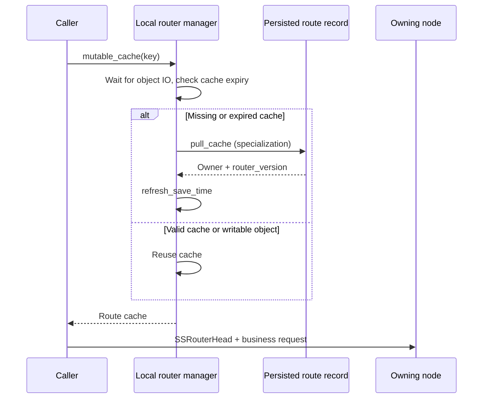
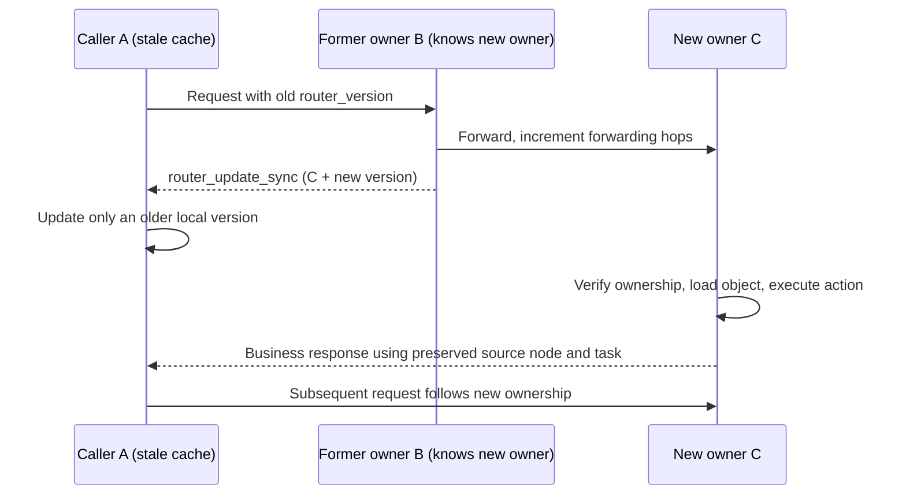
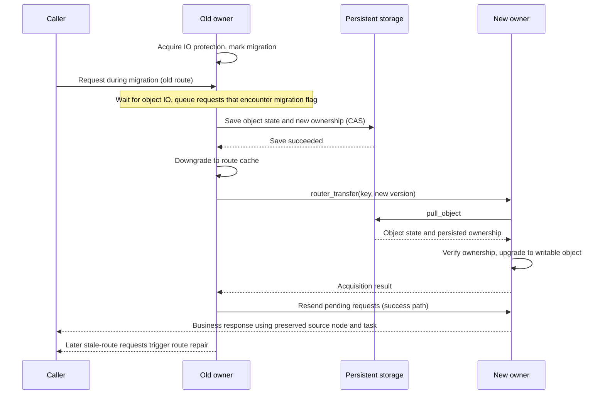
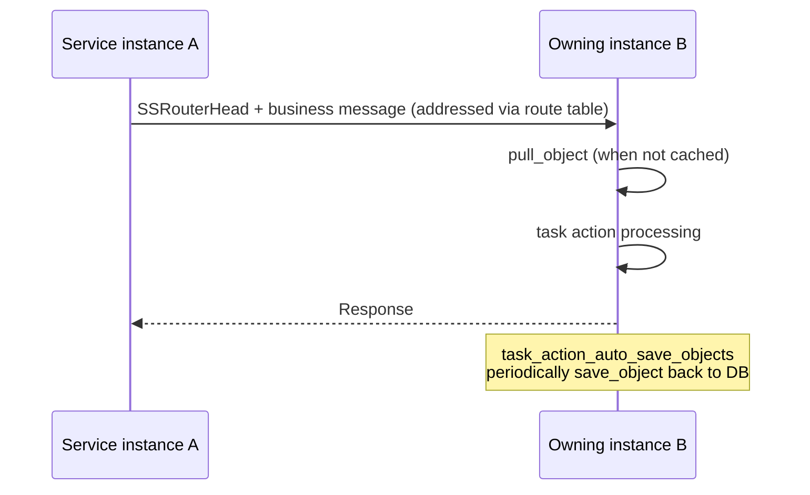

# Router System (router)

The router system answers the question "which service instance owns this stateful object": objects (such as
users or teams) are routed by key to their owning instance, cached in memory, and periodically saved back.

## Quick Start

1. Use existing routed service SDK APIs, such as lobby users or friends, retaining their object types/managers.
2. Call them from business actions; change existing TTL/save intervals through [server configuration](../development/server-config).
3. Verify reads, changes, and saves for the same object. Implement a router specialization for a new object type or migration semantics.

## Customization and Design

### Core Classes

| Class | Location | Responsibility |
| --- | --- | --- |
| `router_object_base` / `router_object<T>` | `src/server_frame/router/` | Router object base: `pull_object`/`save_object` (coroutine RPCs), TTL, degradation |
| `router_manager_base` / `router_manager<TCache, TObj, TPrivData>` | `router/router_manager.h` | Object manager: `mutable_cache`/`mutable_object`, event callbacks |
| `router_manager_set` | `router/router_manager_set.h` | Singleton: manages managers by type_id, periodic saves, idle cleanup, shutdown tasks, and metrics |
| `router_user_cache` / `router_user_manager` | `router/router_user_*` | User routing specialization (`user_cache` object, `pull_online_server`) |

Object key = `type_id + zone_id + object_id`.

### Object Access

An existing manager's `mutable_object` returns `rpc::result_code_type` and writes the object through an output reference.
Pass the full object key and required private parameters, then check the result with `RPC_AWAIT_CODE_RESULT`.
`router_manager_set::get_manager(type_id)` returns a base-class pointer; use the SDK's typed manager API for specialized calls.
See `src/server_frame/router/router_manager.h` for signatures and
`src/friendsvr/sdk/management/router/router_friend_manager.h` for friend integration.

- Pull, save, removal, and migration IO for the same object is queued through `io_task_guard` and `io_schedule_order_`.
  Other operations in business actions must still follow the service's concurrency rules.
- `router_manager_set` timers schedule idle object degradation, cache cleanup, and saves. During process shutdown,
  `task_action_router_close_manager_set` saves and removes objects in batches.

### Route Records and Addressing

A route record stores the owning node and `router_version`. Service nodes cache it locally; only the owning node
holds a writable object. The specialization defines persistence: users use `table_login_lock`, while friends use
`table_friend.router_lock`. The route version orders cache updates; the DB CAS version protects persistent writes.
These versions are not interchangeable.

`router_manager_base::send_msg` obtains the route cache, fills `SSRouterHead` with the object key, route version,
and sending node, then sends through `ss_msg_dispatcher::send_to_proc`. The lower layer selects a direct connection
or atproxy path; see [Gateway and Proxy](gateway-proxy). Object routing determines the owner; proxy topology determines
how to reach that node.

Existing objects follow persisted ownership. A manager that allows automatic object creation can provide a default
node for an object without an owner. For example, `router_friend_manager::get_default_router_server_id` selects a
ready node using consistent hashing over service discovery, preferring friend management services in the same zone
and falling back to the global set of that service type. Consistent hashing can therefore select an initial node;
the successfully persisted route record determines final ownership.

### Expired Route Cache Refresh

Route cache expiry concerns the local cached route. Persistent ownership lock expiry and idle memory cleanup
follow separate procedures.

1. The caller invokes `mutable_cache` by key. A missing cache object is created; for an existing object, the call
   waits for object IO before checking validity, allowing it to reuse a refresh just completed by another task.
2. A non-writable cache expires when `last_save_time + cache_update_interval < current time`. A writable object
   passes this check directly and does not reload its own data because of the route cache interval.
3. For an expired cache, `internal_pull_cache` calls the specialization's `pull_cache` under IO protection to read
   persisted ownership and version. Success updates `last_save_time`, and subsequent calls reuse that result.
4. Refresh errors terminate or retry according to error type. `EN_ROUTER_EAGAIN` waits for a randomized interval
   bounded by `cache_retry_interval`; `retry_max_ttl` limits `mutable_cache` attempts. Timeouts, cancellations,
   missing records, and similar terminal errors return immediately.
5. A send with owner ID 0 tries another pull, then may select a default node if automatic object creation is allowed.
   On send failure, `is_target_server_available` determines whether to clear the local target before resolving again;
   see its current limitation below. `send_msg_raw` attempts sending at most twice and does not wait indefinitely for recovery.

```mermaid
sequenceDiagram
    participant A as Caller
    participant M as Local router manager
    participant DB as Persisted route record
    participant B as Owning node
    A->>M: mutable_cache(key)
    M->>M: Wait for object IO, check cache expiry
    alt Missing or expired cache
      M->>DB: pull_cache (specialization)
      DB-->>M: Owner + router_version
      M->>M: refresh_save_time
    else Valid cache or writable object
      M->>M: Reuse cache
    end
    M-->>A: Route cache
    A->>B: SSRouterHead + business request
```

Refresh happens when the cache is accessed; expiry does not broadcast a refresh to all nodes. Background timers
separately handle idle caches and objects: `cache_free_timeout` schedules cache cleanup, `object_free_timeout`
schedules idle object saves and degradation, and `object_save_interval` schedules periodic saves.

These defaults are declared in `svr.protocol.config.proto`; deployment values can override them:

| `logic.router` field | Default | Purpose |
| --- | --- | --- |
| `cache_update_interval` | `1800s` | Non-writable route cache validity |
| `cache_free_timeout` | `600s` | Idle cache cleanup |
| `object_free_timeout` | `1500s` | Idle object degradation; the friend specialization also uses it for ownership lock expiry |
| `object_save_interval` | `600s` | Periodic object saves |
| `cache_retry_interval` / `object_retry_interval` | `256ms` | Maximum wait interval after `EN_ROUTER_EAGAIN` during pulls |
| `retry_max_ttl` | `3` | Maximum manager pull attempts |
| `transfer_max_ttl` | `16` | Maximum routed request forwarding hops |

`transfer_max_ttl` counts object route forwarding separately from the atbus transport TTL for each message.

### Automatic Route Repair and Propagation

Before running a business action, `task_action_ss_req_base::filter_router_msg` checks the request's route:

- If the incoming `router_version` exceeds the local version, it removes the stale cache and reads it again.
- If the route points to this node but its writable object is missing, it invokes `mutable_object` to reload and
  upgrade the object, handling restart recovery where only persisted ownership remains.
- If another node owns the object, it forwards the request and increments `router_transfer_ttl`; the hop limit
  prevents forwarding loops. A node that successfully forwards does not run the business action or send its ordinary response.
- If the owner is 0, a manager allowing automatic object creation may claim ownership. Other managers may use
  `pull_online_server` to look up an owner. This depends on the specialization: current `router_user_manager`
  simply returns 0, so online probing is not available for every object type.

The receiver's repair loop currently makes at most three attempts. After a successful forwarding or pending-queue
branch, a node with a route version newer than the received version sends `RouterService.router_update_sync`
to the **request source node** returned by `get_request_node_id()`. Ordinary object route forwarding preserves
`SSMsgHead.node_id` and source task information, so this target normally remains the original caller, rather than
necessarily being the preceding node with a route cache. The receiver updates only an existing local cache with an older version.
It ignores missing caches and does not overwrite newer versions. This RPC updates memory, not persisted ownership.

```mermaid
sequenceDiagram
    participant A as Caller A (stale cache)
    participant B as Former owner B (knows new owner)
    participant C as New owner C
    A->>B: Request with old router_version
    B->>C: Forward, increment forwarding hops
    B-->>A: router_update_sync (C + new version)
    A->>A: Update only an older local version
    C->>C: Verify ownership, load object, execute action
    C-->>A: Business response using preserved source node and task
    A->>C: Subsequent request follows new ownership
```

Synchronization and business responses may arrive in either order. Nodes handling forwarding notify the request
source on demand; this does not require updating every node first. A request that directly matches a local writable object returns
early and does not necessarily send a synchronization notification. Other nodes converge through cache expiry or
forwarding a later request.

Ownership lock expiry also requires specialization support. For friends, `fix_router_timeout` checks another node's
`router_save_timepoint + object_free_timeout` when reading a record and clears expired ownership in that loaded copy.
`pull_object` then attempts a DB CAS write of local ownership with a higher route version. Only a successful claim
allows a writable object. A discovery event reporting a node offline, or clearing a local cache, does not release
the persisted ownership lock by itself.

### Route Object Transfer

For a transferable object, use its manager's `transfer(ctx, key/obj, target node, need_notify, private parameters)`.
Persistence carries the object state; the `router_transfer` notification carries its key and route information,
not the complete in-memory object.

1. The old node obtains object IO protection, waits for previous object IO, verifies writability, and sets
   `EN_ROFT_TRANSFERING` and the removal flag. Subsequent object IO waits for the handoff. Received requests that
   encounter the migration flag enter `transfer_pending_`; their receiving action stops processing and disables its ordinary response.
2. After the pre-removal callback, `remove_object` changes the route to the target and increments its version,
   then calls the specialization's `save_object` to persist state and ownership. Success downgrades the old object
   to a cache and runs the post-removal callback. The specialization must implement ownership checks, DB CAS,
   and version updates; the generic manager does not replace those persistence constraints.
3. For a nonzero target with `need_notify=true`, the old node awaits `RouterService.router_transfer`. The target
   handler checks its known version; when acquisition is needed, it calls `mutable_object` to load persisted state,
   confirm local ownership, and upgrade. A known record at least as new as the notification but owned elsewhere
   results in `EN_ROUTER_IN_OTHER_SERVER`.
4. The success path iterates pending requests and resends them using the new route, then releases migration flags
   and IO protection. Callers retaining the old route gradually switch through forwarding and `router_update_sync`.

```mermaid
sequenceDiagram
    participant A as Caller
    participant O as Old owner
    participant DB as Persistent storage
    participant N as New owner
    O->>O: Acquire IO protection, mark migration
    A->>O: Request during migration (old route)
    Note over O: Wait for object IO, queue requests that encounter migration flag
    O->>DB: Save object state and new ownership (CAS)
    DB-->>O: Save succeeded
    O->>O: Downgrade to route cache
    O->>N: router_transfer(key, new version)
    N->>DB: pull_object
    DB-->>N: Object state and persisted ownership
    N->>N: Verify ownership, upgrade to writable object
    N-->>O: Acquisition result
    O->>N: Resend pending requests (success path)
    N-->>A: Business response using preserved source node and task
    O-->>A: Later stale-route requests trigger route repair
```

This diagram shows the handoff order with notification enabled and successful persistence and acquisition.
`need_notify=false` does not wait for target preloading. Target 0 releases ownership; subsequent automatic
acquisition depends on the manager and is different from migration to a specific node.

### Conditions for Uninterrupted Traffic and High Availability

Orderly migration combines waiting for object IO, a persistent handoff, forwarding by the old node, and cache
correction by version to keep processing requests. Callers need not wait for all route caches to update or
reconnect clients solely because object ownership changes. Queuing and forwarding can increase latency;
uninterrupted traffic requires that latency to remain within request deadlines.

The following conditions are required for this flow to provide uninterrupted business traffic:

- **Transferable state**: the specialization persists all required recovery state and uses DB CAS and ownership
  checks to prevent writes from a former owner. In-memory tasks, session bindings, and external resources need their own handoff.
- **Available handoff participants**: the old node retains forwarding capability until handoff completes; the new
  node, storage, and links stay available. Shutdown grace covers saving, loading, and processing. Shutdown saves
  and degradation alone do not migrate objects to a specific node.
- **Session continuity**: atgateway retains client connections while the business service switches session targets
  with `send_set_router` as needed and transfers business session bindings. Object route updates do not perform this gateway session handoff.
- **Request recovery**: business code handles migration errors and timeouts, using idempotency keys or deduplication
  when retrying state-changing operations. Generic routing supplies neither a persistent message queue nor exactly-once business execution.

After an abrupt crash, other nodes can reload, repair ownership, and recover objects according to their specialization.
In-memory pending requests and unsaved state do not survive the process. High availability recovery and uninterrupted
orderly migration therefore require separate validation.

#### Current Implementation Limits

`router_user_manager::on_evt_remove_object` and `on_evt_object_removed` remove the associated session.
This user specialization does not guarantee uninterrupted client sessions; services requiring session continuity
must implement suitable session handoff callbacks.

The generic implementation also has these paths requiring correction and migration tests:

- In `router_manager::transfer` pending replay, a nonnegative `send_msg_raw` result also calls
  `send_transfer_msg_failed`, while a negative result only logs an error. Target notification failure returns
  early without draining the pending list in that branch.
- `router_manager_base::send_msg` swaps a message into the pending list when migration is marked, but then still
  calls `send_msg_raw` instead of returning after queuing.
- For remote nodes, `ss_msg_dispatcher::is_target_server_available` returns the negated discovery lookup result,
  contrary to the availability expressed by its name. Immediate route invalidation and successful takeover after
  a node goes offline cannot be promised based on this check.

This page describes available mechanisms and their conditions. Until these gaps are fixed, successful completion
of every RPC during migration or unconditional freedom from data loss cannot be guaranteed.

### Message Flow

```mermaid
sequenceDiagram
    participant A as Service instance A
    participant B as Owning instance B
    A->>B: SSRouterHead + business message (addressed via route table)
    B->>B: pull_object (when not cached)
    B->>B: task action processing
    B-->>A: Response
    Note over B: task_action_auto_save_objects<br/>periodically save_object back to DB
```

Implementation entry points: `src/server_frame/router/router_manager.h`, `router_manager_base.cpp`,
`router_object_base.cpp`, `router_manager_set.cpp`, and `src/server_frame/dispatcher/task_action_ss_req_base.cpp`.
Transfer/synchronization receivers are in `router/action/task_action_router_transfer.cpp` and
`task_action_router_update_sync.cpp`; friend persistence and recovery are in
`src/friendsvr/sdk/management/router/router_friend_cache.cpp`.
