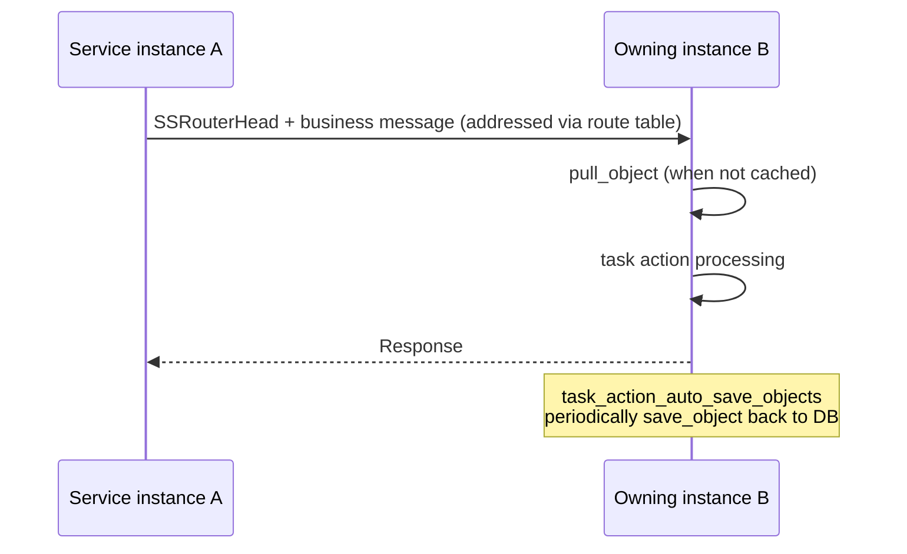

# Router System (router)

The router system answers the question "which service instance owns this stateful object": objects (such as
users or teams) are routed by key to their owning instance, cached in memory, and periodically saved back.

## Quick Start

1. Use existing routed service SDK APIs, such as lobby users or friends, retaining their object types/managers.
2. Call them from business actions; change existing TTL/save intervals through [server configuration](../development/server-config).
3. Verify reads, changes, and saves for the same object. Implement a router specialization for a new object type or migration semantics.

## Customization and Design

### Core Classes

| Class | Location | Responsibility |
| --- | --- | --- |
| `router_object_base` / `router_object<T>` | `src/server_frame/router/` | Router object base: `pull_object`/`save_object` (coroutine RPCs), TTL, degradation |
| `router_manager_base` / `router_manager<TCache, TObj, TPrivData>` | `router/router_manager.h` | Object manager: `mutable_cache`/`mutable_object`, event callbacks |
| `router_manager_set` | `router/router_manager_set.h` | Singleton: manages all managers by type_id, auto save/close/transfer timers, metrics |
| `router_user_cache` / `router_user_manager` | `router/router_user_*` | User routing specialization (`user_cache` object, `pull_online_server`) |

Object key = `type_id + zone_id + object_id`.

### Object Access

An existing manager's `mutable_object` returns `rpc::result_code_type` and writes the object through an output reference.
Pass the full object key and required private parameters, then check the result with `RPC_AWAIT_CODE_RESULT`.
`router_manager_set::get_manager(type_id)` returns a base-class pointer; use the SDK's typed manager API for specialized calls.
See `src/server_frame/router/router_manager.h` for signatures and
`src/friendsvr/sdk/management/router/router_friend_manager.h` for friend integration.

- IO for the same key is serialized through `io_schedule_order_` to avoid concurrent read/write races;
- Objects have TTL and degradation policies; objects not accessed for a long time are automatically closed
  (`router_close_manager_set`).

### Router Addressing and Migration

- Addressing is **not consistent hashing**: ownership is determined by the DB route table plus online probing.
  `router_manager_base::send_msg` fills in the `SSRouterHead`, resolves the target server via the route cache,
  and physical transmission still goes through `ss_msg_dispatcher::send_to_proc`;
- Migration: the `router_transfer` / `router_update_sync` RPCs of `RouterService` (generated handlers in
  `router/handle_ss_rpc_routerservice.atfw.gen.*`), together with `task_action_router_transfer` /
  `task_action_router_update_sync`, transfer objects between instances and update the route table.

### Message Flow

```mermaid
sequenceDiagram
    participant A as Service instance A
    participant B as Owning instance B
    A->>B: SSRouterHead + business message (addressed via route table)
    B->>B: pull_object (when not cached)
    B->>B: task action processing
    B-->>A: Response
    Note over B: task_action_auto_save_objects<br/>periodically save_object back to DB
```
