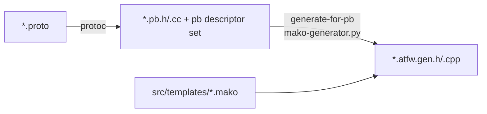

# RPC and Code Generation

## Quick Start

For RPC, protocol, Excel, or database changes, select a task in the [development quick start](../development/overview).
Existing declarations drive generation; routine extensions need no new templates. Use the design sections below for generation changes.

## Customization and Design

### Protocol as the Source of Truth

Business RPC and data protocols use protobuf. Shared framework protocols live in `src/server_frame/protocol/`;
services and components have their own `protocol/` directories. The atgateway client wire protocol uses FlatBuffers.

```
protocol/
├── private/protocol/    # Server-internal only
│   ├── pbdesc/          # svr.protocol.proto (RouterService/LogicCommonService), svr.*.table.proto (DB tables)
│   ├── common/  config/  extension/  log/
└── public/protocol/     # Shareable with clients
    ├── extension/atframework.proto   # Custom service/rpc options (drive code generation)
    └── pbdesc/ com.protocol*.proto (CS/SS messages), com.struct*.proto (data structures)
```

**All generated artifacts are regenerated, never edited by hand** (`*.atfw.gen.{h,cpp}`, `*.pb.{h,cc}`,
config/db code).

### Custom Options

The extension options that drive code generation are spread across three files:

- `public/protocol/extension/atframework.proto`: `atframework.service_options` (`module_name`, etc.) and
  `atframework.rpc_options` (`api_name`, `allow_no_wait`, etc.);
- `protocol/extension/xrescode_extensions_v3.proto`: the `xrescode.loader` option, marking Excel config loaders;
- `private/protocol/extension/svr.database.extension.proto`: DB table/index extensions (KV/KL/CAS/TTL), used by
  the db templates.

### Generation Pipeline


```mermaid
flowchart LR
    P["*.proto"] -->|protoc| PB["*.pb.h/.cc + pb descriptor set"]
    PB -->|generate-for-pb<br/>mako-generator.py| G["*.atfw.gen.h/.cpp"]
    T["src/templates/*.mako"] --> G
```

- `src/server_frame/generate_proto_source.cmake` / `generate_proto_utility.cmake`: protoc compilation;
- `src/tools/generate-for-pb/mako-generator.py`: reads the pb descriptor set and renders in bulk according to the
  rules declared in each CMakeLists (service name + template + output path);
- `src/tools/generate_for_pb_utility.cmake`: CMake-side wrapper for invoking templates.

### Template Inventory (src/templates/)

| Template | Generated artifact |
| --- | --- |
| `handle_ss_rpc.*.mako` | SS RPC registration function `register_handles_for_<service>` (generated under the `app/` entry-point directory; the service declaration routes it via `MAIN_DIRECTORIES` into `MAIN_SOURCES`/`MAIN_HEADERS`, compiled into the service executable, not the private static library) |
| `task_action_ss_rpc.*.mako` | Server-side task action skeleton for each SS RPC method |
| `rpc_call_api_for_ss.*.mako` | SS RPC client call APIs (unary/stream/no-wait/broadcast/metadata/user/router variants) and per-RPC full-name accessors |
| `handle_cs_rpc.*.mako` / `task_action_cs_rpc.*.mako` | Handlers and task actions for client RPCs |
| `session_downstream_api_for_cs.*.mako` | Server→client session downstream push APIs and per-RPC full-name accessors |
| `package_request_api_for_simulator.*.mako` | CS request packing APIs for the robot/simulator |
| `task_action_no_msg.*.mako` | No-message task actions (used with `src/generate-nomsg-task.sh`) |
| `db_interface.*.mako` / `db_rpc_redis(.kv/.kl).*.mako` | Redis database access layer (`rpc/db/local_db_interface.atfw.gen.*`) |
| `config_manager.*.mako` / `config_set.*.mako` / `config_easy_api.*.mako` | Excel config loading framework and convenient read APIs |

The orbit component has its own dedicated templates: `src/component/orbit/sdk/server/template/` (they also
generate per-RPC full-name accessors).

The SS template generates `gsl::string_view get_full_name_of_<rpc>()` inside the `packer` sub-namespace (alongside
`pack_<rpc>`/`unpack_<rpc>`, declared in `<service>.atfw.gen.h`), returning the on-wire full RPC name
(`package.Service/method`). The CS template generates it in the same `packer` sub-namespace. The orbit fork also
uses the `packer` sub-namespace, returning its dotted protocol name.
When registering SS mocks or asserting call history via `test.ss()`, use the
SS/CS-template accessor instead of a hardcoded string (see [RPC unit testing](../development/rpc-unit-test.md)); the
orbit-fork getter returns its dotted name and orbit RPCs traverse orbit transport (not the SS engine), so it must not
be passed to `test.ss()`.

### RPC Caller API Shape

RPCs requiring a response await completion and obtain results through `RPC_AWAIT_CODE_RESULT` or `RPC_AWAIT_TYPE_RESULT`.
Even when the response or return value is unused, use `RPC_AWAIT_IGNORE_RESULT` to explicitly await and ignore it.
These macros adapt C++20 and traditional stackful coroutines; see [awaiting RPC completion](../development/add-rpc-task#await-rpc).

`allow_no_wait` permits send-only APIs. SS methods with a streaming request or response generate notification APIs,
such as `channel_event_sync`; each call sends an SSMsg rather than opening a persistent gRPC-style stream.
Use generated headers for exact return types, target parameters, and namespaces.

Framework calls return integer error codes; `rpc::result_code_type` wraps results that require coroutine waits
and is not an HTTP status type. System, atbus, and DB errors are defined in `svr.const.err.proto`;
client business errors are defined in `com.const.proto`. Check business result fields in responses separately.
