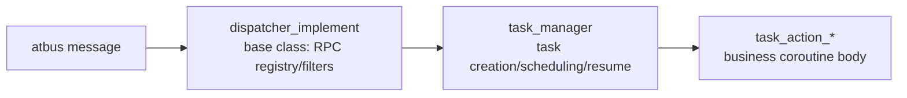

# Tasks and Dispatching (dispatcher / task action)

## Three-Layer Structure



- **dispatcher_implement** (`src/server_frame/dispatcher/dispatcher_implement.h`): atapp module base class,
  maintains `rpc_task_action_set_t` (RPC name → task action creator). The registry is populated by the
  Mako-generated `register_handles_for_<service>()`.
- **Three singleton dispatchers**:
  | dispatcher | Handles |
  | --- | --- |
  | `cs_msg_dispatcher` | Client messages upstreamed from atgateway (CS RPC) |
  | `ss_msg_dispatcher` | Inter-service `SSMsg` (SS RPC) |
  | `db_msg_dispatcher` | Redis connections and replies |
- **task_manager** (`dispatcher/task_manager.h`): task creation, timeout management, and a generic start/resume
  generator indexed by `timeout + type + sequence`.

## task action Base Classes

| Base class | Purpose |
| --- | --- |
| `task_action_base` | Base of all actions: `operator()` coroutine body, timeout, trace, result code |
| `task_action_cs_req_base` | Client requests: session validation, response packing |
| `task_action_ss_req_base` | Inter-service requests: `prepare_handle` chain, SS response packing |
| `task_action_no_req_base` | Timer/self-driven tasks without a triggering request (e.g. `task_action_auto_save_objects`) |

Typical action implementation pattern:

```cpp
class task_action_example : public task_action_ss_req_base<ExampleReq, ExampleRsp> {
 public:
  result_type operator()() override {
    // 1. Validate and read the request
    // 2. RPC_AWAIT_CODE_RESULT(rpc::db::xxx(...)) suspends to wait for DB/SS
    // 3. Assemble the response and RPC_RETURN_CODE(0)
  }
};
```

The generator only produces skeletons; business logic is filled into `hook_handle()` / `operator()`. Custom code
inside the `// ` marked regions is preserved and will not be overwritten by regeneration.

## Dual Coroutine Implementations

`task_type_traits.h` (`dispatcher/task_type_traits.h`) provides a unified abstraction over the two backends:

- **C++20 coroutines** (`PROJECT_SERVER_FRAME_USE_STD_COROUTINE=ON`): `copp::generator_future/callable_future`,
  `RPC_AWAIT_TYPE_RESULT(x)` is simply `co_await x`;
- **libcopp cotask**: goes through the `rpc_result_guard` lazy poller.

Business code only uses the `RPC_AWAIT_*` / `RPC_RETURN_*` macros and the
`rpc::result_code_type / rpc_result<T>` types, without directly perceiving backend differences.

## Built-in task actions

`src/server_frame/logic/action/` provides framework-level actions: `set_server_time`, `player_logout`,
`reload_remote_server_configure`, `async_invoke`, etc.; `src/server_frame/router/action/` provides router-related
actions (auto save, close, transfer, update_sync).
