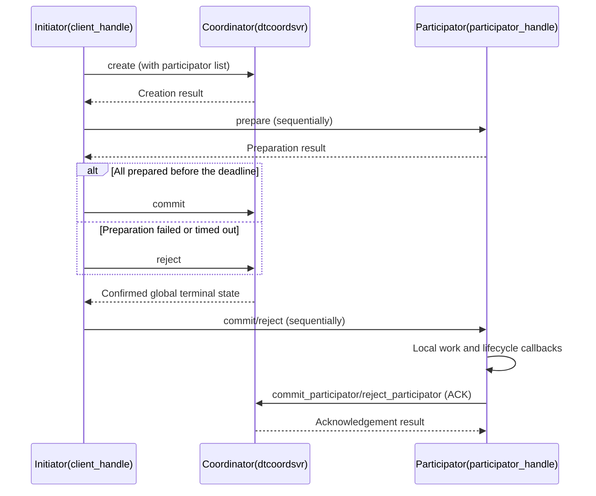

# Distributed Transaction (distributed_transaction)

Supports normal transactions and `force_commit`. In normal mode, the initiator prepares participators, asks the
coordinator to record the global decision, then notifies participators to execute and acknowledge local work.
`force_commit` executes during prepare without creating a coordinator record.

Location: `src/component/distributed_transaction/` (see the README in that directory).

## Composition

| Part | Location | Description |
| --- | --- | --- |
| `dtcoordsvr` | `dtcoordsvr/` | Coordinator service: `transaction_manager` + a set of task actions |
| SDK | `sdk/` | `transaction_client_handle` (initiator), `transaction_participator_handle` (participator), `transaction_api` |
| Protocol | `protocol/` | `distributed_transaction.proto`, `dtcoordsvr_config.proto` |

## Coordinator RPC (task action)

`create` / `commit` / `reject` / `query` / `remove` / `commit_participator` / `reject_participator`.

## Flow

When the global terminal state is unconfirmed, the client performs bounded queries. Partial replica responses from a
failed call cannot decide notification direction. Later local or delivery failures cannot reverse a confirmed decision.

## Events and States

This table shows callback entry states for normal mode with direct notifications. A terminal state already learned
from a query or snapshot is preserved.

| Path | Callbacks and their entry states |
| --- | --- |
| Normal prepare | `on_start_running(PREPARED)` |
| Normal commit | `do_event(COMMITING)` → `on_finish_running(COMMITING)` → `on_finished(COMMITING)` → `on_commited(COMMITING)` |
| Normal reject | `on_finish_running(REJECTING)` → `on_finished(REJECTING)` → `on_rejected(REJECTING)` |
| Successful `force_commit` prepare | `on_start_running(PREPARED)` → `do_event(COMMITING)` → `on_finish_running(COMMITING)` → `on_finished(COMMITING)` → `on_commited(COMMITED)` |
| Failed `force_commit` action | `on_start_running(PREPARED)` → `do_event(COMMITING)` → `on_finish_running(COMMITING)`; the client's reject notification separately invokes `undo_event` |

Normal mode starts ACK only after the completion notification returns. Successful ACK advances the local state to
`COMMITED`/`REJECTED` and removes the record. Failed `on_finished` calls have bounded retries; exhaustion removes the
record without ACK. `force_commit` logs that callback error and continues.
Normal recovery starts after the start callback returns. Commit/reject reentry during that callback returns
`EN_SYS_BUSY`, preserving the state it observes. Callback errors and task timeouts still allow recovery at the original
deadline; snapshot reload does not replay the start callback.
`force_commit` registers no running/finished entries or recovery timers; compensation is bounded by the current client call.
Both modes acquire `lock_resource` before `on_start_running` and release the locks after `do_event` returns, before
`on_finish_running`. A failed action or an exiting task also releases the locks in `force_commit` mode. Integrations must make `do_event`, `undo_event`, and recoverable callbacks idempotent and
save business data consistently with the SDK snapshot.
Callbacks must catch C++ exceptions internally and return error codes. The coroutine framework does not convert
uncaught throws to RPC errors; crossing a `noexcept` task boundary terminates the process. SDK recovery covers returned
errors, task timeouts, and cancellation.
Explicit `lock` calls register resource locks in `force_commit` mode; direct callers must call `unlock` with the storage
handle before their operation ends. `check_writable` and its vtable callback return an `int32_t` error code synchronously
and do not suspend the coroutine.

## Operational Notes

The client checks the original deadline before every prepare and after the last prepare returns, then rejects or
compensates on expiry. Each submit retains its initial storage until the call ends. Replacing the caller's pointer in
a callback cannot redirect subsequent state changes to another object. Reentry on the same active storage returns
`EN_TRANSACTION_ALREADY_RUN` without changing transaction state or output sets, including submissions through different
handles. One handle can submit different storage objects concurrently; an unresolved transaction can still be
resubmitted after the earlier call ends. The client's `storage_type` wraps protobuf data (`data`) and a private submission
flag that is not serialized. The caller must keep the client handle alive until the call completes. Submission assumes
single-threaded coroutine execution and provides no thread synchronization.

Coordinator DB TTL uses the remaining time until
`expire_timepoint + transaction_expire_grace_duration`, bounded by `transaction_max_ttl` (30 days by default,
3 years maximum). Redis receives a relative number of seconds; rounding, request queuing, and Redis expiration
processing also affect the actual deletion time. Creation uses the existing `insert` followed by `set_ttl`;
a TTL error triggers a best-effort delete of the new record and returns the original error. Saving uses `replace`.
These separate DB calls provide no cross-process atomicity guarantee. Replaying the same UUID preserves the terminal
state and participant acknowledgements. Within one coordinator process, creates, reads, saves, and deletes for the same
UUID run serially through the cache entry's `io_task`. Waiters recheck the current cache identity after waiting.
A caller timeout leaves active IO registered; deletion waits for that IO to finish. LRU eviction skips entries with
active IO and resumes after completion, without changing the DB TTL.
After waiting, deletion uses the current cached record's `memory_only` and replication configuration. An explicit
remove uses the request metadata when no cache entry remains. A participant ACK returns `EN_SYS_NOTFOUND` if its
original cache entry was invalidated or replaced. Memory-only transactions only remove the cache entry.
Persistent transactions delete from DB zone 0 without replication, or the service's local zone with replication.
A successful DB deletion or an already absent record removes the cache entry and invalidates old handles. A failed
deletion retains an existing populated cache entry; an empty placeholder created for an uncached deletion is cleared
when its IO task finishes. Reentry from the same IO task for its own UUID returns `EN_SYS_RPC_CALL_NOT_READY` to avoid
waiting on itself.

Recovery batches release processed objects individually instead of retaining them while later transactions wait.
Coordinator `stop()` rejects new creates and reads while keeping existing cache entries available for active tasks to
finish. The `cleanup()` phase clears the cache and invalidates old handles. During shutdown, in-flight creates finish
setting the TTL and clear their placeholders; in-flight reads return a shutdown error and clear their output handles.
Persisted data remains subject to its DB TTL.
When writability is lost or a task exits, unprocessed entries release their batch references after cleanup or
rescheduling, before the task completion callback returns.

Query outputs and reject requests can be reused. Replicated queries merge only current responses; normal rejection
clears any earlier `force_commit` compensation data.

With unit tests and RPC hooks enabled, build the component's six test targets and run
`ctest --test-dir <BUILD_DIR> -L distributed-transaction --output-on-failure`.
Tests cover both modes' states, event order, callback task timeouts, batch object release, and IO during shutdown.
Real Redis failover and network partitions across processes still require integration testing. See the component
README for the full contract.
