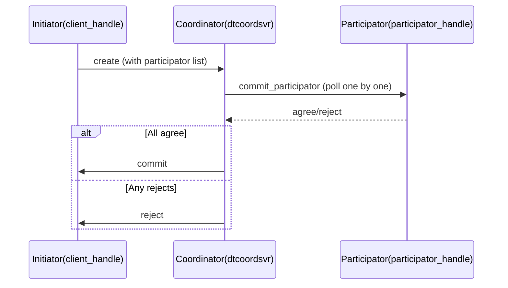

# Distributed Transaction (distributed_transaction)

Provides two-phase commit (2PC) style transactions across services: the initiator creates a transaction,
multiple participators commit or reject, and the coordinator converges the result.

Location: `src/component/distributed_transaction/` (see the README in that directory).

## Composition

| Part | Location | Description |
| --- | --- | --- |
| `dtcoordsvr` | `dtcoordsvr/` | Coordinator service: `transaction_manager` + a set of task actions |
| SDK | `sdk/` | `transaction_client_handle` (initiator), `transaction_participator_handle` (participator), `transaction_api` |
| Protocol | `protocol/` | `distributed_transaction.proto`, `dtcoordsvr_config.proto` |

## Coordinator RPC (task action)

`create` / `commit` / `reject` / `query` / `remove` / `commit_participator` / `reject_participator`.

## Flow

## Operational Notes

The coordinator's automatic cleanup time must be greater than "tolerance value + maximum transaction wait
time" (see the component README); otherwise in-progress transactions may be cleaned up prematurely.
