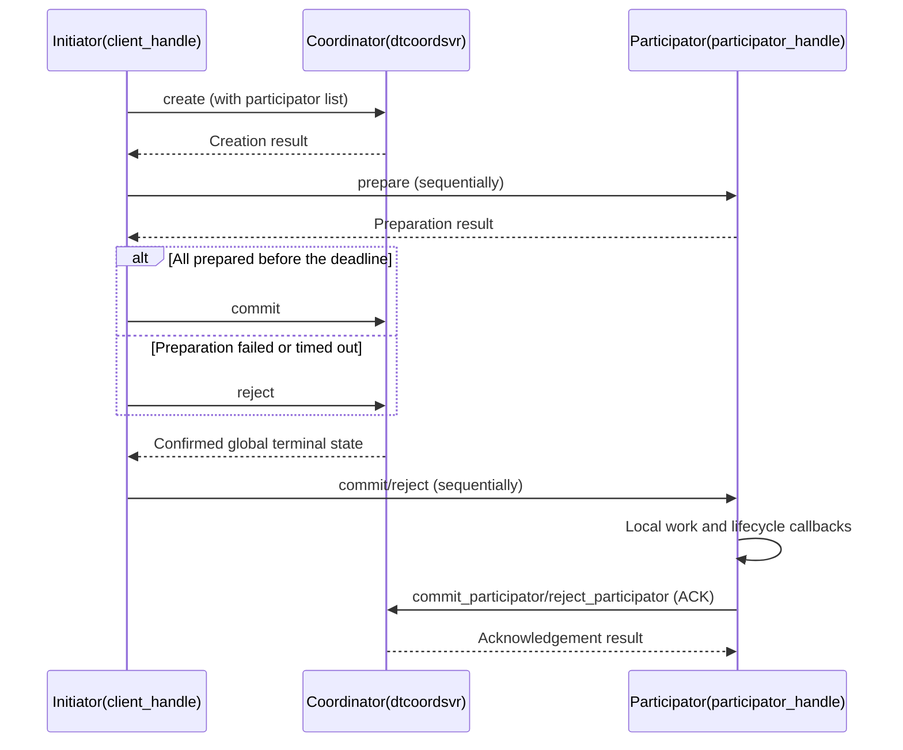

# Distributed Transaction (distributed_transaction)

Supports normal transactions and `force_commit`. In normal mode, the initiator prepares participators, asks the
coordinator to record the global decision, then notifies participators to execute and acknowledge local work.
`force_commit` executes during prepare without creating a coordinator record.

Location: `src/component/distributed_transaction/` (see the README in that directory).

## Composition

| Part | Location | Description |
| --- | --- | --- |
| `dtcoordsvr` | `dtcoordsvr/` | Coordinator service: `transaction_manager` + a set of task actions |
| SDK | `sdk/` | `transaction_client_handle` (initiator), `transaction_participator_handle` (participator), `transaction_api` |
| Protocol | `protocol/` | `distributed_transaction.proto`, `dtcoordsvr_config.proto` |

## Coordinator RPC (task action)

`create` / `commit` / `reject` / `query` / `remove` / `commit_participator` / `reject_participator`.

## Flow

When the global terminal state is unconfirmed, the client performs bounded queries. Partial replica responses from a
failed call cannot decide notification direction. Later local or delivery failures cannot reverse a confirmed decision.

## Events and States

This table shows callback entry states for normal mode with direct notifications. A terminal state already learned
from a query or snapshot is preserved.

| Path | Callbacks and their entry states |
| --- | --- |
| Normal prepare | `on_start_running(PREPARED)` |
| Normal commit | `do_event(COMMITING)` → `on_finish_running(COMMITING)` → `on_finished(COMMITING)` → `on_commited(COMMITING)` |
| Normal reject | `on_finish_running(REJECTING)` → `on_finished(REJECTING)` → `on_rejected(REJECTING)` |
| Successful `force_commit` prepare | `on_start_running(PREPARED)` → `do_event(COMMITING)` → `on_finish_running(COMMITING)` → `on_finished(COMMITING)` → `on_commited(COMMITED)` |
| Failed `force_commit` action | `on_start_running(PREPARED)` → `do_event(COMMITING)` → `on_finish_running(COMMITING)`; the client's reject notification separately invokes `undo_event` |

Normal mode starts ACK only after the completion notification returns. Successful ACK advances the local state to
`COMMITED`/`REJECTED` and removes the record. Failed `on_finished` calls have bounded retries; exhaustion removes the
record without ACK. `force_commit` logs that callback error and continues.
`force_commit` registers no running/finished entries, SDK resource locks, or recovery timers; compensation is bounded
by the current client call. Integrations must make `do_event`, `undo_event`, and recoverable callbacks idempotent and
save business data consistently with the SDK snapshot.

## Operational Notes

The client checks the original deadline before every prepare and after the last prepare returns, then rejects or
compensates on expiry. Coordinator DB TTL uses the remaining time until
`expire_timepoint + transaction_expire_grace_duration`, bounded by `transaction_max_ttl` (30 days by default,
3 years maximum).

Recovery batches release processed objects individually instead of retaining them while later transactions wait.
Coordinator `stop()` rejects new creates and reads while keeping existing cache entries available for active tasks to
finish. The `cleanup()` phase clears the cache and invalidates old handles. In-flight creates finish setting DB TTL
without entering the cache; in-flight reads return a shutdown error and clear their output handles.
Persisted data remains subject to its DB TTL.

With unit tests and RPC hooks enabled, build the component's six test targets and run
`ctest --test-dir <BUILD_DIR> -L distributed-transaction --output-on-failure`.
Tests cover both modes' states, event order, callback task timeouts, batch object release, and IO during shutdown.
Real Redis failover and network partitions across processes still require integration testing. See the component
README for the full contract.
