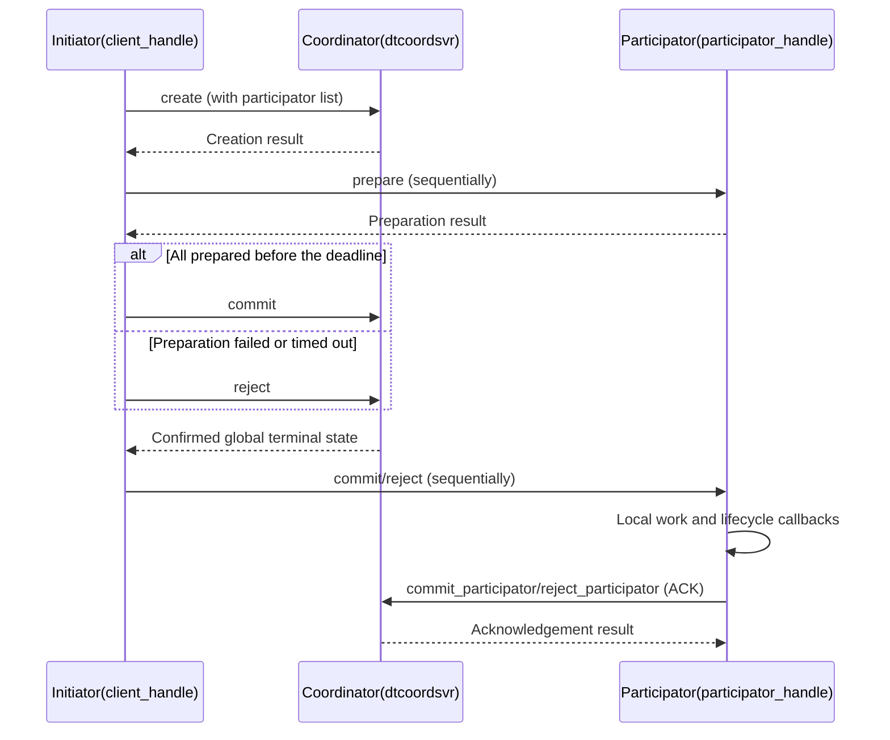

# Distributed Transaction (distributed_transaction)

Supports normal transactions and `force_commit`. In normal mode, the initiator prepares participators, asks the
coordinator to record the global decision, then notifies participators to execute and acknowledge local work.
`force_commit` executes during prepare without creating a coordinator record.

Location: `src/component/distributed_transaction/` (see the README in that directory).

## Quick Start

1. Enable `dtcoordsvr` and prepare Redis; configure transaction timeout, recovery, and cleanup in its chart.
2. Add `distributed-transaction-sdk` to `USE_COMPONENTS`; use
   `sdk/transaction_client_handle.h`, `transaction_participator_handle.h`, and `rpc/transaction/transaction_api.h`.
3. Implement participant callbacks using the component README's contract, prepare participants, resource
   keys, and transaction data, then submit through the client handle. Persist business data consistently with participant snapshots.
4. Verify a normal commit and rejection after a prepare failure. Local actions/recovery callbacks must
   be idempotent. Start with normal transaction mode and follow the decision/recovery rules below.

## Customization and Design

### Composition

| Part | Location | Description |
| --- | --- | --- |
| `dtcoordsvr` | `dtcoordsvr/` | Coordinator service: `transaction_manager` + a set of task actions |
| SDK | `sdk/` | `transaction_client_handle` (initiator), `transaction_participator_handle` (participator), `transaction_api` |
| Protocol | `protocol/` | `distributed_transaction.proto`, `dtcoordsvr_config.proto` |

### Coordinator RPC (task action)

`create` / `commit` / `reject` / `query` / `remove` / `commit_participator` / `reject_participator`.

### Flow

```mermaid
sequenceDiagram
    participant C as Initiator(client_handle)
    participant D as Coordinator(dtcoordsvr)
    participant P as Participator(participator_handle)
    C->>D: create (with participator list)
    D-->>C: Creation result
    C->>P: prepare (sequentially)
    P-->>C: Preparation result
    alt All prepared before the deadline
        C->>D: commit
    else Preparation failed or timed out
        C->>D: reject
    end
    D-->>C: Confirmed global terminal state
    C->>P: commit/reject (sequentially)
    P->>P: Local work and lifecycle callbacks
    P->>D: commit_participator/reject_participator (ACK)
    D-->>P: Acknowledgement result
```

When the global terminal state is unconfirmed, the client performs bounded queries. Partial replica responses from a
failed call cannot decide notification direction. Later local or delivery failures cannot reverse a confirmed decision.

See [Distributed Transaction Design](../whitepaper/distributed-transactions) for conflicts, replication,
recovery, callback states, and runtime contracts. Also follow the component README for callbacks and parameters.
