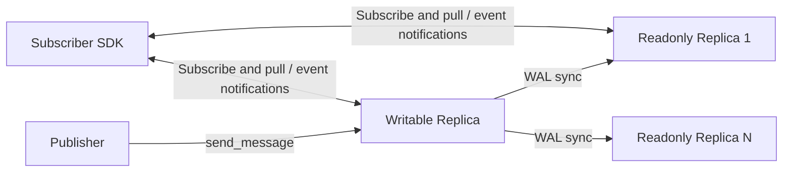

# Distributed Message Queue (dtmq)

dtmq provides high-frequency in-game message channels (chat, team, guild broadcasts, etc.): channel
subscription, message send/receive, historical message fetching, plus WAL-based master-slave replication and
channel migration.

Location: `src/component/dtmq/` (see design notes in `dtmq-proxysvr/Note.md`).

## Quick Start

1. Enable `dtmq-proxysvr` and prepare Redis. Use channel types from
   `resource/ExcelTables/DtMq.xlsx` and [export configuration](../development/excel-config).
2. Add `dtmq-proxy-sdk` to `USE_COMPONENTS`; use
   `src/component/dtmq/sdk/proxy/rpc/dtmq/dtmq_client_api.h` and `dtmq_client_subscriber.h`.
3. For event streams, follow the lobby's `DtmqProxysvrNotifyService` registration and deliver events
   through `logic/dtmq/task_action_channel_event_sync` to subscribers.
4. Verify subscribing, sending, notifications, and history queries. Use the API's creation option for
   absent channels; set history retention and replicas for your workload.

## Customization and Design

See the [WAL and State Replication whitepaper](../whitepaper/wal-replication) for ordering, snapshot repair,
compaction, and persistence boundaries. The following describes dtmq protocols and SDK integration.

### Composition

| Part | Location | Description |
| --- | --- | --- |
| `dtmq-proxysvr` | `dtmq/dtmq-proxysvr/` | Channel management, message persistence, subscriber distribution |
| Protocol | `dtmq/protocol/` | `dtmq_proxy.proto` (service protocol), `dtmq_proxy.config.proto` (configuration) |
| `dtmq-common-sdk` | `dtmq/sdk/common/` | Channel hashing/replica selection algorithms (`dtmq_algorithm`) |
| `dtmq-proxy-sdk` | `dtmq/sdk/proxy/` | Client API and in-process subscriber |

### Service Protocol (DtmqProxysvrService)

`dtmq_proxy.proto` (package `atframework.dtmq`, module_name `"dtmq"`), waiting modes follow each method’s options and SDK declarations:

`subscribe` / `unsubscribe` / `send_message` / `transfer_channel` / `destroy_channel` / `update` /
`reset_lock` / `find_message` / `page_query_message` / `pull`.

`DtmqProxysvrNotifyService::channel_event_sync(stream SSChannelEventSync)` sends SS notifications containing
channel increments or snapshots to subscriber nodes. `stream` means no ordinary response is awaited.

### Data Model

- Channel structures are defined in the public protocol
  `src/server_frame/protocol/public/protocol/pbdesc/com.struct.dtmq.proto`:
  `DChannelMetadata` / `DChannelRuntime` / `DChannelMessage(Detail)` / `DChannelSnapshot` /
  `DChannelSubscribeNode` / `DChannelSyncPoint`;
- Subscriber keys look like `U:{zone}:{user}` / `T:{team}` / `G:{guild}`, carrying a heartbeat sequence +
  hash;
- Channel optimistic locking: `channel_lock_checker` compares the expected holder and resets the lock as requested;
  `reset_lock` provides the update API. The channel-record index does not enable DB CAS;
- Channel type configuration comes from Excel (`ExcelDtmqChannelType` in `com.struct.dtmq.config.proto`:
  `channel_type`, `show_max_log_count`, `readonly_replicate_count`), loaded by
  `excel_config_dtmq_index.cpp` as `DChannelConfigure`;
- DB persistence: `table_dtmq_channel_record` (the generated `rpc::db::dtmq_channel_record` Redis
  interface).

### Replicas and Routing

```mermaid
flowchart LR
    Pub[Publisher] -->|send_message| W[Writable Replica]
    W -->|WAL sync| R1[Readonly Replica 1]
    W -->|WAL sync| R2[Readonly Replica N]
    Sub[Subscriber SDK] <-->|Subscribe and pull / event notifications| R1
    Sub <-->|Subscribe and pull / event notifications| W
```

- Each channel has 1 writable replica + N readonly replicas (`readonly_replicate_count` is configurable);
- Target node selection: `rpc::dtmq::get_target_server_id(s)` hashes by channel key + HPA ready discovery
  (`logic_hpa_discovery_select_mode::kReady`);
- When readonly and writable are on the same node, writable takes precedence (except when
  `replicate_index > 0`);
- Supports channel migration (`transfer_channel`), subscriber merging/unsubscription during scale-out/in,
  writable⇄readonly promotion/demotion, and forwarding during the migration window.

### WAL Master-Slave Sync

`dtmq-proxysvr/data/mq_channel_wal_handle.{h,cpp}` wraps atframe_utils'
`distributed_system::wal_publisher / wal_client` in single-thread mode, using `wal_subscriber` for publisher-side
subscriber records. `DChannelMessageDetail::CommandCase` selects each log's action delegate. The rank component's
`rank_wal_handle` also reuses this WAL library. `SSChannelUpdateReq` supports log compaction via `compact_sequence`.

### Client SDK

- `dtmq_client_api`: `get_target_server_id(s)`, `send_message`, `find_message`, `page_query_message`,
  `normalize_replicate_index`;
- `dtmq_client_subscriber`: in-process shared subscriber (`shared_subscriber`): local WAL log cache,
  optimistic lock/snapshot/message callbacks, heartbeat, and receiving the `channel_event_sync` event
  stream.

### Business Integration Example (lobbysvr)

`src/lobbysvr/service/` links `dtmq-proxy-sdk`, generates handlers for `DtmqProxysvrNotifyService`
(`app/handle_ss_rpc_dtmqproxysvrnotifyservice.atfw.gen.*`), and calls
`register_handles_for_dtmqproxysvrnotifyservice()` in `lobbysvr_main.cpp`;
`logic/dtmq/task_action_channel_event_sync.*` receives the channel event stream and delivers it to clients.
