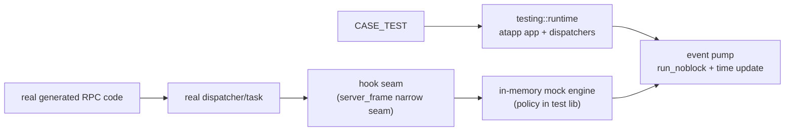

# RPC Unit Testing (Offline Mock)

`src/tools/rpc-unit-test` is the RPC-level unit test support library: it boots a minimal atapp runtime in a normal
process and replaces every external dependency (SS/DNS/CS/DB/UUID/resource/HPA/telemetry) with in-memory mock engines,
so real RPC paths in business code (dispatcher, task, coroutines, generated API) can be driven and asserted in unit
tests without Redis, etcd, atbus, or system DNS. The library API namespace is `atframework::testing`.

## Scope and build switch

- Use for: offline unit tests of service/component logic and contract tests of router/SS/CS/DB generated APIs.
- Not for: integration tests with real network/storage, performance tests, or cross-process tests.
- Every test executable uses only the atframe_utils private test framework (`CASE_TEST`/`CASE_EXPECT_*`), not GTest.

Unit test seams are gated as a whole by `PROJECT_SERVER_FRAME_ENABLE_UNIT_TEST_HOOKS` (a `cmake_dependent_option`,
default following `BUILD_TESTING OR PROJECT_ENABLE_UNITTEST`). In a hooks-off production build: no test state, no
hot-path branches, no `mock` symbols, no test library dependency; the production fallback is always preserved and a
seam only takes over once a fixture installs a hook. All `mock` sub-namespace interfaces (generated SS/DB mock, HPA
feature mock) are likewise stripped by the macro.

## How it works



- **Discovery and transport are injected at the atapp layer**: mock discovery nodes are written into the global
  discovery set and a `mock://` connector captures outbound bytes; `logic_server_setup` is not modified, so the real
  id/name/type-zone/metadata/broadcast selection logic is exercised end to end.
- **Seam and policy are separated**: server_frame only adds minimal, policy-free hooks (registry + generation token);
  matching rules, in-memory data, response scripts, history and diagnostics all live in the test library, and
  production logic does not depend on the test library. Each seam's registry is defined in a single `.cpp` of the
  production DLL that owns the code (core in `server_frame`, Excel provider in `server_frame-config`, Orbit client in
  its SDK); no header-local statics or cross-DLL copies.
- **Type-erased bridge for generated mock**: `<service>::mock` and `<db>::mock` are compiled into server_frame/service
  TUs and do **not** link the test library; they forward through the slots in
  `src/server_frame/rpc/unit_test/mock_engine_bridge.h` and degrade to no-op when the bridge is empty.
- **Event pump and generation barrier**: `runtime::pump_once()` runs `time_utility::update()` → `run_noblock()` →
  `++pump_generation` → each engine's `deliver_pending()` → a second `run_noblock()`. An outbound record captured at
  generation N is consumable at N+2, so the calling task registers its waiter before the mock responds, avoiding a
  "response before waiter" race.

Default behavior when no rule is registered:

- **One-way** (SS stream/no-wait/broadcast, CS downstream data/kickoff/set-router): record and succeed (result dropped).
- **Response-required** (SS unary/wait variants, DNS lookup, HPA pull): return an explicit error code immediately with
  a diagnostic, never a silent wait-to-timeout.
- **DB**: an empty in-memory backend by default (reads return the project record-not-found code); every supported
  operation has real in-memory semantics.

## Quick start

CMake (`src/tools/rpc-unit-test/cmake/ProjectRpcUnitTest.cmake`; see [Unit Testing](testing) for the private framework):

```cmake
project_add_rpc_unit_test(
  TARGET ${PROJECT_NAME}-my-component-unit-test
  COMPONENT my-component
  CATEGORY component          # component (default) | sdk | service
  SOURCES "my_test.cpp"
  LINK_LIBRARIES my-component-lib
  FEATURES SS DNS DB
  LABELS fast
  TIMEOUT 120)
```

Minimal case (`src/tools/rpc-unit-test/test/example_readme.cpp` compiles and runs it verbatim, keeping it in sync
with the real API):

```cpp
CASE_TEST(my_component, hello) {
  atfw::testing::runtime test;
  atfw::testing::runtime_options options;
  options.features = {atfw::testing::feature::ss};
  CASE_EXPECT_EQ(0, test.start(options));
  if (!test.is_running()) {
    return;  // CASE_EXPECT_* is non-fatal: you MUST return early after a precondition failure.
  }

  auto task = test.run_task("hello", std::chrono::seconds{2},
                            [](rpc::context &) -> rpc::result_code_type { RPC_RETURN_CODE(0); });
  if (!task.empty()) {
    auto result = test.wait(task, std::chrono::seconds{5});
    CASE_EXPECT_TRUE(result.task_exited);
    CASE_EXPECT_EQ(0, result.result_code);
  }
  CASE_EXPECT_EQ(0, test.stop());  // stop() is idempotent; non-zero means failed expectation or leftover state.
}
```

Key points: only one active runtime per process (app/dispatcher/task singletons); the `run_task` body runs a real task
with `RPC_AWAIT_*`/`RPC_RETURN_CODE`; put assertions after `wait()`.

### Invoke an inbound SS action directly

When testing a known `task_action_ss_rpc_base` implementation, use `<atframework/testing/ss_action.h>` instead of
rebuilding an `SSMsg` and driving `task_manager` in every test:

```cpp
atfw::testing::ss_action_invoke_options invoke_options{
    rpc::my_service::packer::get_full_name_of_my_method()};
invoke_options.source.node_id = source_node_id;
invoke_options.source.node_name = "my-test-source";
invoke_options.source.source_task_id = source_task_id;
invoke_options.source.sequence = source_sequence;

auto task = test.run_task(
    "my_inbound_action", std::chrono::seconds{2},
    [request, invoke_options](rpc::context &ctx) -> rpc::result_code_type {
      RPC_RETURN_CODE(RPC_AWAIT_CODE_RESULT(
          atfw::testing::invoke_ss_action<task_action_my_method>(ctx, request, invoke_options)));
    });
```

The helper performs real SSMsg serialization/unpacking and action create/start/wait, and the runtime must enable
`feature::ss`. The request type is fixed by `TAction::rpc_request_type`; pass only the generated
`packer::get_full_name_of_<rpc>()`. Before creating the action, the helper verifies that both protobuf request and
response descriptors match the named method. Request and options are copied into the coroutine frame, so temporaries
cannot dangle.

The return value is the action's final task result, not a business code stored in the response protobuf. Zero source IDs
represent an anonymous/system source; set all relevant fields explicitly for `forward_rpc`, tracing, replies, or
source-sensitive authorization tests. The helper creates the template-selected action directly and therefore does not
test the dispatcher's RPC-to-action registration lookup. Use raw transport/dispatcher APIs for registry, unknown-RPC,
or malformed type URL/body/envelope tests. Compiled usage and contract tests live in `test/example_readme.cpp` and
`test/rpc_unit_test_ss_action.cpp`; `src/component/dtmq/test/dtmq_test_task_forward.cpp` is a forwarding example.

## Usage guide

`runtime_options.features` decides the module/hook set (`ss/dns/cs/db/uuid/resource/router/orbit/hpa/telemetry`); the
CMake `FEATURES` argument only validates/links/labels and never decides per-case behavior.

### Service discovery + SS

```cpp
atfw::testing::mock_node node;
node.set_id(0x130001).set_name("remote").set_type_id(4097).set_type_name("remote-type").set_zone_id(1);
node.add_label("hpa_scaling_ready", "1");  // consumers that select via logic_hpa_discovery_select need this label
auto remote = test.discovery().add_node(node);
logic_server_last_common_module()->reload();  // reload once after injection to replay nodes into the discovery index

auto rule = test.ss().mock(
    rpc::my_service::packer::get_full_name_of_my_method(), Req::descriptor()->full_name(),
    Rsp::descriptor()->full_name(),
    [](const atframework::testing::ss_request_view &request, google::protobuf::Message &response)
        -> rpc::result_code_type {
      const auto &req = static_cast<const Req &>(request.body);
      static_cast<Rsp &>(response).set_echo("hello " + req.payload());
      RPC_RETURN_CODE(0);
    });
// Use the generated rpc::<module>::packer::get_full_name_of_<rpc>() (gsl::string_view, declared in
// <service>.atfw.gen.h) instead of a hardcoded "pkg.MyService/my_method" string.
// Generated equivalent: <service>::mock::my_method(handler), typed first arg rpc::context&.
test.ss().expect(rpc::my_service::packer::get_full_name_of_my_method()).times(1).to_node(0x130001);
```

An SS handler returns `rpc::result_code_type` and may be a coroutine awaiting nested RPC via `RPC_AWAIT_CODE_RESULT`.
Rule options (`ss_rule_options`): `match_node_id`, `times` (FIFO script), `delay_generations`, `no_response`,
`malformed_type_url`/`malformed_body`.

### Router / DNS / UUID / resource / CS / raw transport

- **Router**: `test.router_manager()` + `router_test_object` address the router object to a mock node; router RPC shares
  the unary SS chain (`mock://` connector) without touching Mako.
- **DNS**: `test.dns().mock_a(domain, ip)` / `mock(records)` / `mock_error(domain)`; the hook sits before
  `uv_getaddrinfo`, so tests issue no system DNS requests.
- **DB**: a complete presence-aware in-memory backend by default (field merge/CAS/KL/TTL, semantics aligned with
  Redis/Lua) with no rule registration needed; generated per-table typed handlers (`rpc::db::<ns>::mock::<interface>`)
  and engine-level `test.db().mock_table(name)` callbacks can override individual interfaces, with everything else
  falling back to the in-memory backend. Raw entry APIs (`set_raw_kv`/`append_raw_kl`/`set_raw_ttl`) seed CAS versions
  or exact bytes.
- **UUID**: `generate_global_increase_id`/`generate_global_unique_id` flow into the DB mock through `inc_field` (the
  pool cache persists across cases, so do not assert absolute id values); `generate_standard_uuid*`/
  `generate_short_uuid` are pure local functions needing no mock. `feature::uuid` currently adds no runtime wiring.
- **resource**: `test.resource()` provides a path→bytes/version/version_error in-memory loader, and `reload()` drives
  the real manager through a full reload/index pass.
- **CS**: `test.cs()` / `mock_client` simulate a gateway client (add/post/remove/set-router-rsp); upstream goes through
  the real dispatch/action, and downstream data/kick/set-router/broadcast are all captured, without atbus.
- **raw transport**: `test.transport()` exposes rules and call history across id/name/discovery/consistent-hash/
  random/round-robin/metadata/broadcast.

### Override priority and strict defaults

DB override order: generated typed handler → engine-level per-table callback → in-memory backend; real-Redis
passthrough is disallowed by default. Both default behaviors (one-way record+drop / response-required fast-fail) can be
overridden per rule (e.g. explicitly mark a stream as `fail` for negative assertions).

## Key semantics and invariants

- `delay_generations`: `0` completes in the pump that observed the request; `N` delays the response by `N` extra full
  pump generations (consistent across SS and DNS).
- Engines deliver in **due order, not FIFO**; delivery resumes coroutines synchronously and a task may re-enter the
  engine (two-phase drain, see `src/tools/rpc-unit-test/src/detail/pending_drain.h`).
- The DB in-memory backend aligns with the Redis/Lua golden contract: `EXPIRE`/`PERSIST` on a missing key is a
  successful no-op (not an error); CAS with `real_version == 0` accepts any expected version and writes version 1; an
  existing record only accepts an equal version (success → +1, conflict → `EN_DB_OLD_VERSION` and write back the
  current version); KV set merges only present fields; KL indexes are monotonic and never reused; `inc_field` creates
  from 0.
- Deeper invariants for modifying the engines/hook seams live in
  `.agents/skills/rpc-unit-test/references/engine-invariants.md`.

## External-dependency offline matrix

The runtime-generated config guarantees offline behavior: no etcd, no bus.proxy, no hostname listen (use numeric IP or
shm/unix), no OTLP gRPC/HTTP exporters, no prometheus push/pull exporters, no fixed ports (config fail-fasts). Telemetry
defaults to noop with zero network, with optional otlp_file export; HPA defaults to zero network, and enabling it
installs the default prometheus pull hook that injects preset metrics through the public callback chain, reporting an
error when no answer is configured.

## Lifecycle / timeout / isolation

- Each `CASE_TEST` owns an independent `runtime`: `start()` builds an isolated app/task/engines, `stop()` verifies
  expectations and tears down under a deadline; fixtures run serially in one process, and consecutive fixtures must not
  leak app/task/session/static state (engine rules RAII + unbind cleanup).
- Four timeout layers: RPC timeout < task timeout (`run_task` arg) < runtime hard timeout (`wait` arg) < CTest timeout
  (`TIMEOUT`). A hard timeout poisons the runtime and kills all tasks; it can then only `stop()`, not be reused.
- Fixtures with conflicting telemetry configs must occupy their own executables (process-lifetime state), split with
  `project_add_rpc_unit_test` multi-target.

## Common failure diagnosis

- Unmatched RPC: fast-fail, with the log listing the call name and registered rules; check the RPC full name and
  `match_node_id`.
- Wrong response sequence / not resuming: confirm the handler returns 0 and the response type matches the registration;
  stream/no-wait sends no response.
- Task never reached wait: `run_task` returning an empty handle — print `task.get_diagnostic()`.
- Leftover session/task: listed in the `stop()` diagnostic; check for a missing `RPC_RETURN_CODE` in the task.
- `mock` registration returned an empty handle: `get_diagnostic()` (engine not bound, wrong type name, wrong RPC name
  format).

## Build and run

```powershell
cmake --build build_jobs_cmake_tools --target atf4g-co-rpc-unit-test-selftest --parallel 12
ctest --test-dir build_jobs_cmake_tools -L rpc-unit-test --output-on-failure
# Filter one case: build_jobs_cmake_tools/publish/bin/atf4g-co-rpc-unit-test-selftest.exe -r "rpc_unit_test.<case>"
```

## References

- Full API and examples: `src/tools/rpc-unit-test/README.md`
- AI agent procedural guide: `.agents/skills/rpc-unit-test/SKILL.md`
- Engine/hook-seam invariants: `.agents/skills/rpc-unit-test/references/engine-invariants.md`
