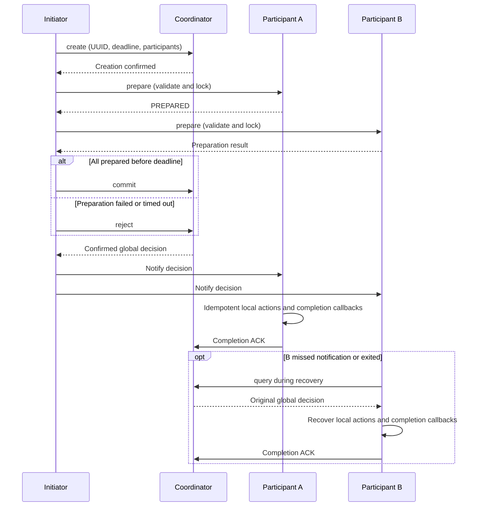

# Distributed Transaction Design

Distributed transactions coordinate a shared decision across resource owners and let unfinished participants
recover. Minimal integration steps are in the [component guide](../components/distributed-transaction).
This paper covers normal-mode execution boundaries, conflicts, and recovery, plus the differences between
`force_commit` and memory-only transactions.

## Problems to Solve

A cross-service operation can change orders, assets, or membership. Each owner can validate and persist local
data, but one successful RPC does not prove every participant finished. A timeout does not prove the remote
operation was never executed. Treating timeout as rejection can make one participant compensate after another committed.

Track preparation, the global commit/reject decision, local execution, and acknowledgement separately.
Once confirmed, a global decision cannot reverse because notification failed. After recovering local state,
query the decision and continue idempotent actions in that direction. Business integrations must also define
locks, consistent data/snapshot persistence, and deduplication for external effects.

## Coordinator, Participants, and Modes

`transaction_client_handle` initiates operations, `dtcoordsvr` stores decisions and acknowledgements, and
`transaction_participator_handle` manages local locks, running/finished records, and recovery. Coordinator caches
accelerate access; persistent normal transactions use Redis data APIs. The cache is not an independent decision source.

| Mode | Decision and execution | Failure boundary |
| --- | --- | --- |
| Normal persistent transaction | Create coordinator record, prepare participants, execute after confirming the global decision | Recover from persisted records; requires DB, snapshots, and idempotent integration |
| Normal `memory_only` transaction | Normal protocol without persisted coordinator records | Loss of coordinator cache removes equivalent decision-recovery guarantees |
| `force_commit` | Execute during prepare without creating a coordinator record | No running/finished records or background recovery timers; only bounded compensation by the current client |

`memory_only` and `force_commit` are different options. A failure during `force_commit` can leave partially
executed actions. It is neither a full persistent transaction nor an automatically reliable Saga. Start with
normal persistent mode when recovery guarantees are required.

## Normal Transaction Decisions

The client checks the original deadline before every prepare dispatch and after the last prepare returns.
Partial responses from a failed decision call cannot determine notification direction; the client performs
bounded queries first. Normal-mode completion notifications require a confirmed global terminal decision.

“Globally committed” means actions must commit, not that all business effects are already durable.
Participants start ACK after completion notifications return. Successful ACK advances the local terminal state
and removes records. Queries needing to distinguish decision from execution should expose both stages explicitly.

## Resource Conflicts and Wound-Wait

Participants lock local objects by resource key. The current implementation orders by preparation time, then
lexicographic UUID for ties. Higher-priority requests can wound eligible holders; holders already in the completion
phase cannot be wounded. This priority rule does not guarantee cross-machine clock precision or external consistency.

For a request involving multiple resources, all conflicts are checked read-only first. If any holder cannot be
wounded, the request returns a retryable resource-preemption error without changing other locks or registering
new requester locks. Only a successful preflight permits conflict handling and resource registration, preventing
partial lock changes on failure.

A wounded transaction keeps a separate marker. Local conflict alone cannot write a global rejection; recovery
still follows the coordinator's decision. Conflict retries retain the original UUID, preparation time, and already
prepared participant set, bounded by retry count and the original deadline. Observe conflict counts, lock duration,
and recovery lag to detect hot resources consuming throughput through retries.

## Data Consistency and Recovery

Business data, SDK snapshots, and execution markers need one recoverable persistence boundary. Otherwise restart
can reveal changed business data with a pending snapshot, or a completed snapshot with missing business writes.
External operations need business idempotency keys, queryable outcomes, or reliable event records. The SDK cannot
automatically execute arbitrary external calls exactly once.

| Failure | Recovery | Invalid inference |
| --- | --- | --- |
| Lost prepare response | The initiator attempts rejection; participants complete according to the confirmed decision or recover on timeout | Timeout does not mean the remote owner acquired no locks |
| Unconfirmed commit/reject response | Bounded coordinator queries, preserving unknown state | Partial responses from failed calls cannot choose the terminal state |
| Local action and completion callbacks succeeded, ACK lost | Retry ACK in the same direction using the completion marker; do not replay successful callbacks | ACK failure cannot reverse the decision |
| Too few successful coordinator replicas | Keep the outcome unconfirmed and retry under recovery rules | Insufficient responses do not establish global absence |
| NOTFOUND or expired record | Handle unconfirmable transactions under the integration contract and alert | Do not universally interpret this as rejection or send a rejection ACK |
| Repeated recovery callback failures | Bounded retries and recorded unfinished outcomes | Local cleanup is not business success or global acknowledgement |

In current normal mode, exhausting `on_finished` retries removes the local record without ACK. Configure alerts
and business/manual repair for such outcomes. Recovery support does not imply unlimited automatic retries for all failures.

## Replication, Retention, and Guarantees

Replicated reads and writes both wait for R successful responses from N candidates. With `2R > N`, completed
read/write response sets intersect, provided they access the same replica set. Intersection alone does not prove
Raft/Paxos consensus or database external consistency. Current merging favors commit on contradictory terminal
records and reports serious inconsistency; this merge rule cannot replace prevention of conflicting decisions.

Coordinator TTL uses remaining time until the original expiration plus grace, bounded by maximum TTL.
Participant recovery attempts and intervals are configured separately; business code manages its deduplication records.
Retention must cover allowed retries/recovery; deleted records cannot deduplicate a later replay of the old UUID. Record
creation and TTL assignment are separate DB calls without cross-process atomicity.

## References and Implementation

Entry points are `src/component/distributed_transaction/sdk/`, `dtcoordsvr/logic/transaction_manager.cpp`, and
`protocol/protocol/pbdesc/distributed_transaction.proto`. The component README details callbacks and parameter contracts.

The [Percolator paper](https://research.google/pubs/large-scale-incremental-processing-using-distributed-transactions-and-notifications/)
discusses combining transactions and incremental processing; its storage and notification mechanisms differ from
this framework. The [Spanner paper](https://research.google/pubs/spanner-googles-globally-distributed-database-2/)
discusses a global database and time uncertainty; this framework does not provide its TrueTime or external-consistency guarantees.

## SDK Callbacks and Runtime Contracts

### Events and States

This table shows callback entry states for normal mode with direct notifications. A terminal state already learned
from a query or snapshot is preserved.

| Path | Callbacks and their entry states |
| --- | --- |
| Normal prepare | `on_start_running(PREPARED)` |
| Normal commit | `do_event(COMMITING)` → `on_finish_running(COMMITING)` → `on_finished(COMMITING)` → `on_commited(COMMITING)` |
| Normal reject | `on_finish_running(REJECTING)` → `on_finished(REJECTING)` → `on_rejected(REJECTING)` |
| Successful `force_commit` prepare | `on_start_running(PREPARED)` → `do_event(COMMITING)` → `on_finish_running(COMMITING)` → `on_finished(COMMITING)` → `on_commited(COMMITED)` |
| Failed `force_commit` action | `on_start_running(PREPARED)` → `do_event(COMMITING)` → `on_finish_running(COMMITING)`; the client's reject notification separately invokes `undo_event` |

Normal mode starts ACK only after the completion notification returns. Successful ACK advances the local state to
`COMMITED`/`REJECTED` and removes the record. Failed `on_finished` calls have bounded retries; exhaustion removes the
record without ACK. `force_commit` logs that callback error and continues.
Normal recovery starts after the start callback returns. Commit/reject reentry during that callback returns
`EN_SYS_BUSY`, preserving the state it observes. Callback errors and task timeouts still allow recovery at the original
deadline; snapshot reload does not replay the start callback.
`force_commit` registers no running/finished entries or recovery timers; compensation is bounded by the current client call.
Both modes acquire `lock_resource` before `on_start_running` and release the locks after `do_event` returns, before
`on_finish_running`. A failed action or an exiting task also releases the locks in `force_commit` mode. Integrations must make `do_event`, `undo_event`, and recoverable callbacks idempotent and
save business data consistently with the SDK snapshot.
Callbacks must catch C++ exceptions internally and return error codes. The coroutine framework does not convert
uncaught throws to RPC errors; crossing a `noexcept` task boundary terminates the process. SDK recovery covers returned
errors, task timeouts, and cancellation.
Explicit `lock` calls register resource locks in `force_commit` mode; direct callers must call `unlock` with the storage
handle before their operation ends. `check_writable` and its vtable callback return an `int32_t` error code synchronously
and do not suspend the coroutine.

### Operational Notes

The client checks the original deadline before every prepare and after the last prepare returns, then rejects or
compensates on expiry. Each submit retains its initial storage until the call ends. Replacing the caller's pointer in
a callback cannot redirect subsequent state changes to another object. Reentry on the same active storage returns
`EN_TRANSACTION_ALREADY_RUN` without changing transaction state or output sets, including submissions through different
handles. One handle can submit different storage objects concurrently; an unresolved transaction can still be
resubmitted after the earlier call ends. The client's `storage_type` wraps protobuf data (`data`) and a private submission
flag that is not serialized. The caller must keep the client handle alive until the call completes. Submission assumes
single-threaded coroutine execution and provides no thread synchronization.

Coordinator DB TTL uses the remaining time until
`expire_timepoint + transaction_expire_grace_duration`, bounded by `transaction_max_ttl` (30 days by default,
3 years maximum). Redis receives a relative number of seconds; rounding, request queuing, and Redis expiration
processing also affect the actual deletion time. Creation uses the existing `insert` followed by `set_ttl`;
a TTL error triggers a best-effort delete of the new record and returns the original error. Saving uses `replace`.
These separate DB calls provide no cross-process atomicity guarantee. Replaying the same UUID preserves the terminal
state and participant acknowledgements. Within one coordinator process, creates, reads, saves, and deletes for the same
UUID run serially through the cache entry's `io_task`. Waiters recheck the current cache identity after waiting.
A caller timeout leaves active IO registered; deletion waits for that IO to finish. LRU eviction skips entries with
active IO and resumes after completion, without changing the DB TTL.
After waiting, deletion uses the current cached record's `memory_only` and replication configuration. An explicit
remove uses the request metadata when no cache entry remains. A participant ACK returns `EN_SYS_NOTFOUND` if its
original cache entry was invalidated or replaced. Memory-only transactions only remove the cache entry.
Persistent transactions delete from DB zone 0 without replication, or the service's local zone with replication.
A successful DB deletion or an already absent record removes the cache entry and invalidates old handles. A failed
deletion retains an existing populated cache entry; an empty placeholder created for an uncached deletion is cleared
when its IO task finishes. Reentry from the same IO task for its own UUID returns `EN_SYS_RPC_CALL_NOT_READY` to avoid
waiting on itself.

Recovery batches release processed objects individually instead of retaining them while later transactions wait.
Coordinator `stop()` rejects new creates and reads while keeping existing cache entries available for active tasks to
finish. The `cleanup()` phase clears the cache and invalidates old handles. During shutdown, in-flight creates finish
setting the TTL and clear their placeholders; in-flight reads return a shutdown error and clear their output handles.
Persisted data remains subject to its DB TTL.
When writability is lost or a task exits, unprocessed entries release their batch references after cleanup or
rescheduling, before the task completion callback returns.

Query outputs and reject requests can be reused. Replicated queries merge only current responses; normal rejection
clears any earlier `force_commit` compensation data.

With unit tests and RPC hooks enabled, build the component's six test targets and run
`ctest --test-dir <BUILD_DIR> -L distributed-transaction --output-on-failure`.
Tests cover both modes' states, event order, callback task timeouts, batch object release, and IO during shutdown.
Real Redis failover and network partitions across processes still require integration testing. See the component
README for the full contract.
