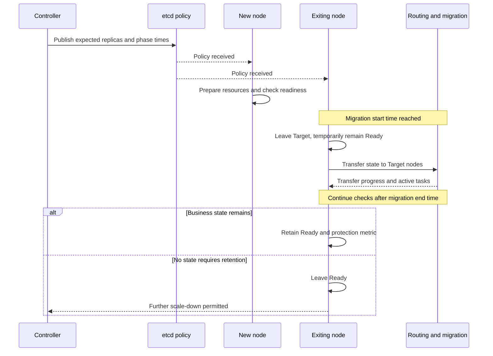
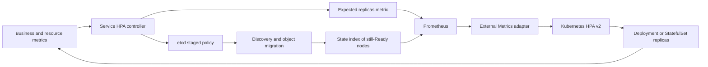

# HPA Controller Design

The framework HPA controller connects metric-driven replica recommendations with stateful preparation, migration,
and exit. It runs in service processes and provides Prometheus queries, policies, discovery labels, and checks.
Kubernetes deployments also need a metrics adapter and native HPA; enabling service configuration alone does not scale workloads.

## Problems to Solve

Stateless requests can rebalance after replica changes. Stateful nodes may own channels, teams, routing caches,
tasks, and sessions; immediate scale-down can lose state or fail active requests. New processes also need more
than successful startup before accepting all business traffic.

Control must answer how much capacity is needed, which nodes should own new state, and which old nodes must keep
serving. Expected replicas, Target membership, and Ready membership express these separate stages.

## Metrics to Replica Recommendations

Built-in policies cover CPU, main-thread CPU, memory, recent task counts, and controller status, with custom
policies available. For a positive integer sample V and positive threshold T, current code calculates
`(V - 1) / T + 1`, equivalent to rounding up. Multiple policies use the larger recommendation, followed by
scaling rules, stabilization, and minimum/maximum replica bounds. Separate up/down thresholds allow a stable middle range.

Metric semantics must match: pair totals with per-replica targets rather than dividing a per-node average as if
it were total load. Handle nonnumeric, missing, stale, and incomplete inputs under the
[dynamic-policy design](observability-policy). Complex business algorithms can use custom discovery providers'
replica interfaces to integrate their own algorithms.

Current defaults in `install/cloud-native/values/default/modules/hpa.yaml` enable the service controller with
minimum replicas 2, pull interval 20 seconds, retry interval 5 seconds, and 60-second up/down stabilization windows.
`cloudnative.autoscaling.enable` is false. These are deployment values, not protobuf defaults for unset fields;
project overrides can differ.

## Staged Target and Ready Changes

Actual discovery labels are `hpa_scaling_target` and `hpa_scaling_ready`.
`logic_hpa_discovery_select_mode::kReady` selects nodes for normal requests; `kTarget` selects final destinations
for state. Target is neither a Kubernetes readiness probe nor equivalent to Ready.

`replicate_start_delay`, `replicate_period`, and `scaling_delay` schedule migration/scaling phases. Exiting nodes
leave Target at the start time. After the end time, a true `set_on_stateful_checking` result (state remains)
preserves Ready. Without that registered check, business-state protection is unavailable. New-node business
readiness uses `set_on_ready_checking`, based on actual resource/data availability.
Initial setup allows approximately one minute of waiting. Without a Ready check, the node can become Ready when
that time expires; this does not establish business-data readiness. Resource preparation and state transfers in
the diagram are business implementations; HPA label changes do not automatically migrate arbitrary objects.

Uninterrupted service also depends on [router transfers](../architecture/router): single-writer ownership, version
repair, forwarding, draining active requests, retained connections, and reachable destinations. Target/Ready are
part of that process. Clock delays, partitions, forced termination, and executor timeouts need separate testing;
labels alone cannot guarantee uninterrupted service under every failure.

## Kubernetes HPA Integration

The metrics adapter and Kubernetes HPA in the diagram are deployment additions; the repository does not supply
their complete configuration.

| Metric | Current meaning | Adapter requirement |
| --- | --- | --- |
| Expected replicas, default `hpa_expect_replicas` | Controller reports the phase-appropriate recommendation | Scope to the workload and use the maximum valid recommendation; never sum duplicate controller recommendations |
| State index, default `hpa_stateful_index` | Node reports its index while Ready, otherwise zero | Use the maximum retained index as a scale-down floor |

Cloud-native code uses `pod_index + 1`, a one-based index; adapters must not add one again. Non-native deployments
use one-based ordering in the target discovery list. This metric derives from Ready rather than directly counting
business objects, so protection depends on registered checks. Verify exported metric names and unit suffixes with
the actual exporter.

For [StatefulSets](https://kubernetes.io/docs/concepts/workloads/controllers/statefulset/) starting at zero and
removing the highest ordinals first, maximum Ready index protects high-ordinal Pods still owning state during
normal scale-down. Nonzero `spec.ordinals.start` requires checking controller distribution and metric adaptation;
the index cannot directly represent replica count. Deployments do not promise this deletion ordering; they need
additional draining and termination coordination.

[Kubernetes HPA](https://kubernetes.io/docs/concepts/workloads/autoscaling/horizontal-pod-autoscale/) needs appropriate
APIs/adapters for custom/external metrics and takes the largest recommendation across metrics. Absolute desired
replica counts must match [HPA v2 API](https://kubernetes.io/docs/reference/kubernetes-api/autoscaling/horizontal-pod-autoscaler-v2/)
metric/target semantics to avoid multiplying by current replicas again. The
service-side controller does not directly patch Kubernetes workload replica fields.

## Integration and Failure Validation

1. Configure query endpoints, workload scope, thresholds, bounds, and stabilization through existing values;
   first observe recommendations only.
2. Register business readiness/state checks and integrate Target changes with routing transfers. Ensure old
   nodes continue serving during migration.
3. Deploy Kubernetes adapters/HPA and verify both metrics cover only the target workload. Other environments
   need an actual scaling executor.
4. Test failures through state removal, metric updates, HPA execution, and process exit before enabling scale-down.

The table lists deployment integration checks; existing unit tests do not cover these complete fault workflows.

| Failure | Behavior to validate |
| --- | --- |
| Failed queries, stale metrics, missing nodes | No unsafe shrink from unknown input; alerts and last valid policy |
| Controller changes or duplicate policies | Idempotent decisions/application without repeated resource creation/removal |
| Migration exceeds the configured window | State checks retain nodes until draining completes |
| Forced process termination | Check data against the service's persistence/recovery implementation, distinguished from normal draining |
| Adapter or etcd unavailable | Observable policy/execution status; revalidate replicas and ownership after recovery |

Implementation is in `src/server_frame/logic/hpa/`, with `svr.hpa.config.proto` and deployment template
`install/cloud-native/charts/libapp/templates/_atapp.logic.hpa.yaml.tpl`. Existing HPA unit tests cover metric callback chains;
cross-process migration, metrics adapters, and Kubernetes deletion order need integration validation.
