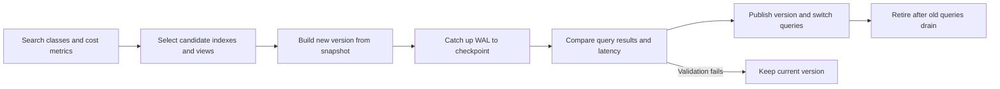
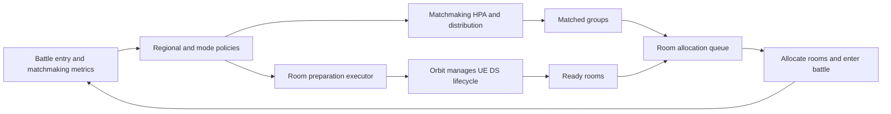

# Metric-Driven Scenarios

These are generic business integration designs. Metric names, formulas, and payloads illustrate integration;
implement the trading and battle workflows for your project. They combine [dynamic policies](observability-policy),
[HPA](hpa-controller), [WAL](wal-replication), and [routing transfers](../architecture/router) to turn business
demand into observable, executable changes.

## Scenario One: Scale Order Matching by Order Volume

### Problem and Metrics

Order volume changes affect matching backlog and waiting time. Low CPU may hide a hot product partition, lock
conflicts, or slow dependencies. More replicas alone cannot solve an indivisible hot partition.

| Metric | Meaning | Aggregation scope |
| --- | --- | --- |
| Pending orders B | Gauge of unfinished backlog | Region/order partitions; count each order once |
| Valid arrival rate λ | Window rate from a Counter | Deduplicate retries and distinguish order types |
| Sustainable per-replica throughput μ | Completion capacity at acceptable latency | Stable windows or load tests, including conflicts/dependencies |
| Waiting, failures, lock conflicts | Business outcomes and bottlenecks | Bounded partition labels; quantiles from histogram buckets |
| Replica readiness and migration | Usable capacity and execution phase | Count actually serving nodes |

### Capacity Decisions and Execution

To drain backlog within T seconds, use `N = ceil((λ + B / T) / μ)` as a candidate. Combine it with CPU, memory,
and latency recommendations using the maximum, then apply replica bounds. μ must be positive and measured
reliably. The formula assumes distributable orders and approximately additive throughput; adjust partitions
first when hotspots violate this. T is the backlog-drain time goal; measure individual order waiting times separately.

Scale up by creating replicas, restoring partition state, and checking readiness before changing distribution.
Scale down by stopping new partition assignments, transferring existing orders/checkpoints, retaining old nodes
for active requests, then removing Ready protection. Sale/withdrawal exclusivity still belongs to business state
machines, idempotency keys, and required transactions; scaling cannot change those rules.

Begin by recording N, actual replicas, and queue changes without executing. Enable bounded scale-up before
scale-down. Validate waiting time, backlog drain time, and per-order cost; inject missing queries, retry orders,
hot partitions, and sales during migration.

## Scenario Two: Adjust Indexes and Views by Search Distribution

### Problem and Metrics

Search conditions differ greatly in frequency. Indexing every combination increases memory, update cost, and
build time; too few indexes repeatedly scan for common queries. Adapt index sets and business query-view counts
to search distribution. Replica counts affect concurrent query capacity; index choices affect per-query scan volume
and index maintenance cost.

Classify queries into bounded filtering dimensions, ordering modes, product categories, and regions. Observe
request rates, hit rates, scanned volume, latency, index sizes, update rates, and update fanout. Raw search
strings, user IDs, and order IDs are not metric labels. Analyze finer distributions offline or with bounded
sampling before publishing a finite classification.

### Selection, Construction, and Switching

Compare candidate benefit as `query rate × saved query cost − update rate × added maintenance cost − memory cost`.
Convert terms into comparable costs or use separate resource limits; do not directly subtract milliseconds,
bytes, and counts. Select useful indexes within memory, build-concurrency, and maintenance limits, requiring
sustained benefit before changing them.

Payloads can specify versions, enabled index classes, view counts, and resource bounds. Executors build from a
consistent snapshot and catch up WAL. Validate completeness, checkpoints, and query semantics before publishing
the new version. Existing queries retain their old version until drained. Rollback needs an old version that can
catch up or rebuild; writing an unusable old version number is insufficient.

Keep the current set when benefit is low, samples insufficient, or inputs stale. Validate equivalent results,
P95, memory, write amplification, and business latency during construction, including order updates, withdrawals,
and increments after the snapshot. WAL provides synchronization; businesses supply index algorithms, version
executors, and query-consistency conditions.

## Scenario Three: Control Matchmaking and Room Preparation by Battle Entry

### Problem and Control Targets

Battle peaks create three demands: matchmaking throughput, regional/mode distribution, and immediately available
rooms. DS startup takes time, so creating processes only after backlog appears may miss waiting-time goals.
Excess preparation consumes hosts/processes. Matchmaking replicas and room counts need separate actions.

| Target | Key metrics | Policy output |
| --- | --- | --- |
| Matchmaking service | Valid entry rate, queued players, matching latency, CPU | Replicas and region/mode distribution |
| Room allocation queue | Matched groups, groups awaiting rooms, waiting time | Allocation rate, queue limits, explicit overload behavior |
| Room preparation | Room demand rate, available/starting rooms, startup time, host capacity | Spare-room targets, creation concurrency, placement |

Use bounded region/mode/map combinations. Deduplicate player entries and distinguish cancellation, re-entry,
and actual battle demand. Convert player rate to room rate using mode-specific grouping rules and formation
rates, rather than assuming one room per player.

### Advance Preparation and Staged Execution

Let λ_room be room demand rate, L a target startup-latency quantile, D collection-to-application delay, and R extra
reserve rooms. Estimate prepared capacity with `W_target = ceil(λ_room × (L + D)) + R`. Compute additional rooms
as `create_count = max(0, W_target − available rooms − rooms starting)`, bounded by creation concurrency, host
capacity, and cost. Do not create W_target new rooms every cycle.

Matchmaking changes use HPA and business shard transfers while preserving team/matching rules. Room executors
assign idempotent creation IDs and track starting, ready, allocated, and failed states. Orbit controller/agent
capabilities manage UE DS lifecycles; forecasting, allocation queues, and retries still need business integration.
Enabling Orbit does not supply the entire pipeline.

During bursts, use ready rooms while starting bounded creation tasks. At capacity limits, queue or return an
explicit product-defined result. Falling demand stops new creation and reclaims unused resources without
terminating active battles. Validate entry-to-battle latency, startup success, idle cost, and team-rule correctness;
cover startup timeouts, duplicate responses, regional imbalance, control delays, and exhausted hosts.

## Common Integration Order

Define metrics and invariants, input validity, and resource bounds first. Record recommendations without executing
to validate inputs/calculation, gradually enable executors, and watch actual completion. Policies need queryable
state, deduplication, and rollback.

Index changes affect matching throughput; faster matchmaking increases room demand. Account for controller
interactions and execution delays. Avoid multiple controllers compensating for the same metric; use conservative
windows for shrinking/reclamation. Evaluate business latency, success rates, resource costs, and the difference
between actual replicas and recommendations together.

Integration entry points are [custom dynamic policies](observability-policy), [dtmq](../components/dtmq),
[matchmaking and teams](../components/matching-team), [Orbit](../components/orbit), and the
[testing guide](../development/testing).
