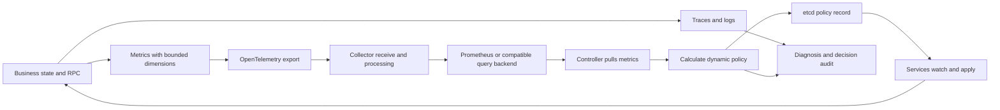

# Observability and Dynamic Policies

Observability supports capacity and business decisions as well as diagnosis. The framework connects metric
collection, Prometheus queries, policy calculation, etcd publication, and service watches, supporting business
parameters beyond replica counts. Minimal export configuration is in the [observability quick start](../architecture/telemetry).

## Problems to Solve

Static configuration struggles with order backlogs, search hotspots, and battle peaks. CPU-only scaling cannot
distinguish more requests from inefficient indexes, or decide between matching replicas, index changes, and
prepared rooms. Effective control needs metric meaning, collection time, node coverage, and execution delay.

Traces locate latency/failures in a call chain, logs record objects and outcomes, and metrics summarize requests
or resources. Policies mainly consume aggregate metrics; traces and logs explain abnormal decisions.
Do not copy per-trace object identifiers into metric labels.

## Collection, Correlation, and Cost

The framework manages traces in task actions and `rpc_context`, propagating context through SS RPCs with Redis
calls as child spans. A thread interleaves multiple coroutines, so thread-local “current span” alone cannot identify
business context. Pass the appropriate context explicitly across threads/async callbacks to avoid associating
another coroutine's calls.

OpenTelemetry asynchronous metric callbacks may run on a collection thread. HPA policy observers execute under
the SDK metrics lock, which does not protect business objects. Have the business thread update atomics or publish
immutable snapshots; collection callbacks only read them. Never wait for RPCs, suspend coroutines, or traverse
mutating containers inside these callbacks.

| Cost source | Design response |
| --- | --- |
| Exporting every high-frequency event | Accumulate counters/histograms locally and export per collection cycle |
| Increasing label combinations | Keep bounded region/mode/bucket dimensions; log users, orders, and raw search strings |
| Slow Collector or backend | Bounded queues, batching, retries, export-failure/drop metrics |
| Control competing with business threads | Snapshot collection, asynchronous queries, scheduled business-side application |

Every distinct label combination creates a separate time series; see [Prometheus naming practices](https://prometheus.io/docs/practices/naming/).
[OpenTelemetry Metrics SDK](https://opentelemetry.io/docs/specs/otel/metrics/sdk/) Views can limit retained attributes;
verify support in the integrated SDK version. These Views configure metrics and differ from trading query views.
[Collector pipelines](https://opentelemetry.io/docs/collector/architecture/) separate receiving, processing, and export;
bounded queues cannot guarantee no loss under arbitrary failures.

## Minimal Custom-Policy Integration

Existing CPU/memory policies use values configuration. New business metrics/decisions require a small business
integration using existing APIs, without changing code-generation templates or CMake implementation. Declare business
metrics through `rule.custom` in values' `modules/hpa.yaml`; fields are defined in `svr.hpa.config.proto`. Business code
supplies metric names and algorithms; the repository has no built-in trading-order metric. Positive `scaling_up_value`
and `scaling_down_value` thresholds participate in default replica calculations. Leave thresholds nonpositive when
not using those calculations.

1. Define units, type, aggregation dimensions, and updates. Register `add_observer_int64`, `add_observer_double`,
   or existing observation APIs in `set_on_setup_custom_policy`.
2. Create `create_custom_discovery`. In its setup callback, call `reset_policy` and `add_pull_policy` to associate
   required policies again. Rebind after configuration reload instead of retaining a cleaned-up policy.
3. Register `add_event_on_pull_instant` or `add_event_on_pull_range` and error handling. After validating input,
   the selected controller computes and publishes through discovery's `set_value`.
4. Register `add_event_on_changed` and call `watch` to start watching the key or directory, then apply received
   business policies. Discovery's `set_value` accepts a string; business code defines the payload, validation,
   and application results.

Policies support explicit queries or generated PromQL using metric names, aggregation, functions, and selectors.
For cross-service queries, check automatically injected service-type selectors. Use `without_auto_selectors` as
needed and explicitly restore region, workload, and environment scope. Otherwise queries may miss the intended
services or combine unrelated workloads/regions.

## Metric Semantics and Decision Conditions

| Input | Use | Required checks |
| --- | --- | --- |
| Gauge: queue size, available rooms | Current resources/backlog | Timestamp, coverage, duplicate resource counting |
| Counter: orders arriving, battle entry | Window rate | Resets after restart, window length, collection gaps |
| Histogram: waiting/startup latency | Quantiles from aggregated buckets | Compatible buckets, aggregate before calculating quantiles |
| Policy application outcome | Confirm execution | Policy version, completion stage, failure reason |

The Prometheus [HTTP query API](https://prometheus.io/docs/prometheus/latest/querying/api/) supports instant/range
queries. Sampling delays, empty vectors, failures, NaN, and stale values are different input states. Having data
does not establish freshness; policy ready state cannot replace business freshness checks. Use
[histogram_quantile](https://prometheus.io/docs/prometheus/latest/querying/functions/) for latency quantiles,
rather than averaging per-node P95 values.

Define maximum data age, minimum coverage, bounds, change limits, and stabilization windows. Unknown inputs retain
the last valid policy or enter an explicit safe policy, especially avoiding scale-down based on missing-as-zero
data. Implement these business conditions explicitly; they are not automatic in every custom policy.

These validity and application checks are integration requirements; the SDK provides no uniform business-policy
payload or execution workflow.

## Controller Selection and Propagation

The built-in HPA controller chooses a primary from the workload's discovery list and waits for a pull cycle after
switching before publishing. Custom discovery callbacks and publication timing belong to the integration;
`set_value` does not automatically check whether the caller is primary. Custom discovery uses etcd KV writes/watches;
`set_value` is not a CAS publication
with a lease epoch. If partitions must strictly prevent multiple writers, add lease, epoch, or CAS enforcement
rather than relying on list ordering alone.
`set_value` returning true means the asynchronous request started, not that etcd saved it or business code applied it.

Currently `create_custom_discovery` uses inconsistent registration keys, instance paths, and
`find_custom_discovery` / `remove_custom_discovery` lookup paths. Different names within the same domain also
construct the same instance path. Correct and validate these paths before integration; names alone do not provide
independent policy publication/watch namespaces in the current implementation.

[etcd API guarantees](https://etcd.io/docs/v3.6/learning/api_guarantees/) distinguish KV operations from watch
semantics. Watchers must still handle reconnection, compacted history, and re-reading current values, using
revisions/business versions to prevent stale overwrites. Store consistency does not make execution exactly once.

## Validation and Implementation

Integration validation should cover collection gaps, delayed responses, controller changes, duplicate policies,
and business application failures. These are suggested checks, not existing business algorithms, monitoring metrics,
or fault tests supplied by the repository.

Collection/traces live in `src/server_frame/rpc/telemetry/`; policies, queries, and watches live in
`src/server_frame/logic/hpa/logic_hpa_{controller,policy,discovery}.*` and `pull/prometheus/`.
`src/server_frame/test/server_frame_test_hpa.cpp` covers pulling, parsing, callbacks, and readiness.
Real backends, Kubernetes scaling, and business-policy convergence require integration testing. See [HPA Controller](hpa-controller) for replicas
and [the three scenarios](metric-driven-scenarios) for business parameters.
