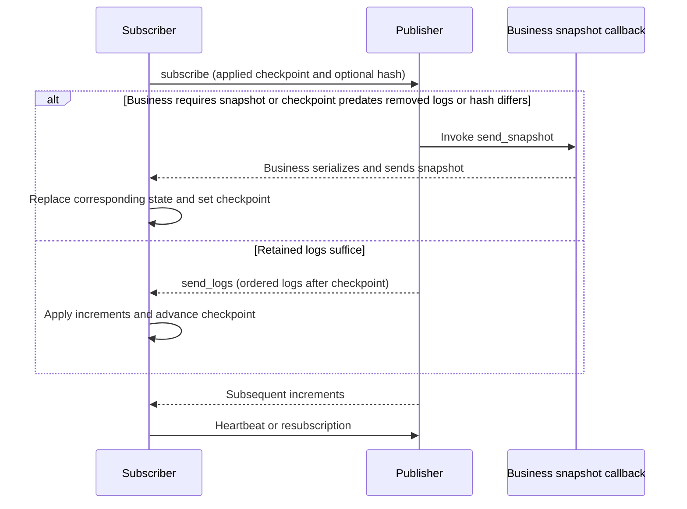

# WAL and State Replication

The WAL (Write-Ahead Log) component describes object changes as ordered logs so subscribers can replay increments,
detect divergence, and recover. It provides log management and synchronization algorithms, with storage and transport
supplied through callbacks; it does not guarantee persistence before acknowledgement. For message channels, start
with the [dtmq quick start](../components/dtmq).

## Problems to Solve

A team, channel, or order may be observed by its owner, members, query services, and clients. Each role needs
different data: owners need full state, query services need derived indexes, and members need permitted public
fields. Broadcasting full objects on every change wastes bandwidth; events alone cannot restore a new subscriber
or one that has been offline too long.

Concurrent actions also need ordering. Match completion versus cancellation, or sale versus withdrawal, must first
be resolved by the resource owner, which publishes accepted changes. WAL replicates that order; it neither decides
business conflicts nor creates consensus among independent writers.

## Logs, Checkpoints, and Snapshots

| Data | Purpose | Integration requirement |
| --- | --- | --- |
| Log key | Order changes and locate incremental ranges | Stable comparable order within an object; keys need not be consecutive integers |
| Action type and payload | Select callbacks and update state | Complete replay inputs and no duplicated external effects |
| Checkpoint | Identify applied progress | Match actual applied state; never advance before the action completes |
| Checksum | Detect divergence at the same checkpoint | Consistent calculation; optional hash callbacks are available |
| Snapshot | Recover complete state at a checkpoint | Consistent state/checkpoint and all fields needed by the subscriber |

Publishers apply logs through `wal_object` action delegates and send logs or snapshots through `wal_publisher`.
`wal_client` manages receipt, subscriptions, and heartbeats. Business callbacks provide keys, actions, snapshot
serialization, transport, and optional checksums. Separating IO from algorithms lets services reuse the same
synchronization logic.

## Incremental Synchronization and Repair

The publisher first checks the business callback for a forced snapshot, then whether the checkpoint predates
`last_removed`. It compares checksums only when the checkpoint's log still exists, the request supplies a hash,
and all publisher hash callbacks are configured. A mismatch invokes `send_snapshot`. Otherwise `send_logs` sends
retained logs after the checkpoint; with no increments, only the subscription result is returned.

Clients support subscription heartbeats, retry intervals, and requiring an initial snapshot. Business code restores
state through `on_receive_snapshot`; the SDK neither reads storage directly nor creates snapshots. Keep state and
checkpoints consistent and replace the snapshot's data according to the callback contract. The dtmq snapshot callback
calls `wal.load`, whose load callback restores channel data and logs.

## Retention, Compaction, and Distribution

Log age/count limits determine how far subscribers can catch up incrementally. Subscribers beyond that range
recover through snapshots. Balance log storage, snapshot size, recovery time, and the slowest subscriber.
Log GC does not authorize deletion of business data.

| Current integration | Retention and compaction |
| --- | --- |
| WAL algorithms | GC uses configured log age/count and records the removed-log boundary |
| dtmq | `gc_expire_duration`, `gc_log_count`, and `max_log_count` configure retention; `compact_sequence` provides state-log compaction |
| Team rooms | Store current room state in channel custom data and submit state/compaction progress through channel updates |

An in-process shared subscriber lets local consumers reuse an upstream subscription and reduces cross-process
fanout. dtmq provides an in-process subscriber SDK;
each player need not establish a separate cross-service WAL connection.

## Persistence and Ownership Transfer

The WAL algorithm library connects load/dump and transport through callbacks without a disk-flush protocol.
dtmq saves channel records to Redis through `mq_channel` IO tasks and schedules saves using dirty versions.
WAL's `on_log_added` and `on_log_removed` callbacks mark the channel dirty, so successful log synchronization
does not mean Redis persistence has completed.

dtmq calculates replica distribution from discovery and HPA Target/Ready sets. Migration uses channel snapshots,
subscriber merging, and request forwarding. Its `mq_channel` / `mq_channel_manager` do not use the generic router
object ownership-transfer flow. See [router design](../architecture/router) separately for generic objects.
Business recovery depends on save intervals, snapshot contents, and migration implementation; WAL algorithms alone
cannot establish durability or single-writer guarantees.

## Validation and Implementation

| Integration validation | What to check |
| --- | --- |
| Increments, duplicate delivery, resubscription | Log-key filtering and business replay results |
| Checkpoint predates GC boundary or a verifiable hash differs | Snapshot callbacks and subsequent increments |
| Exit before saving and recovery after restart | State/logs in actual storage and permitted unsaved changes |
| Channel migration and subscriber merging | Destination data, subscriptions, and old-node forwarding |

Algorithms live in `atframework/atframe_utils/include/distributed_system/wal_*.h`. Tests include
`atframework/atframe_utils/test/case/wal_object_test.cpp`, `wal_publisher_test.cpp`, and `wal_client_test.cpp`.
Service integrations include `src/component/dtmq/dtmq-proxysvr/data/mq_channel_wal_handle.*`,
`src/component/rank/rank_board_svr/logic/rank_wal_handle.*`, and `src/teamsvr/service/room/logic/room/`.
Algorithm tests do not replace real-storage durability, failover, or cross-process migration validation.
