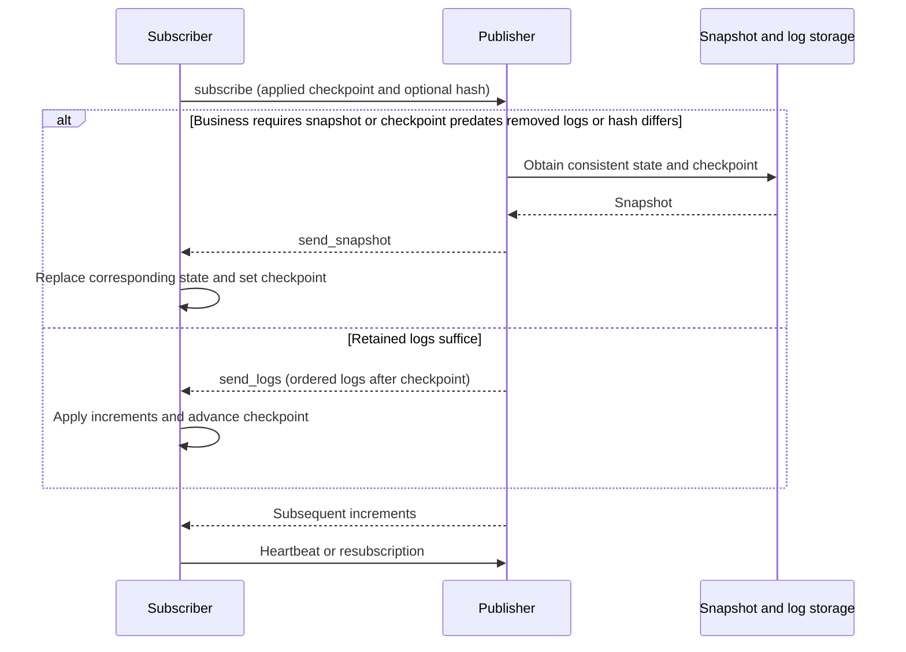

# WAL and State Replication

WAL (Write-Ahead Log) describes object changes as ordered logs so subscribers can replay increments, detect
divergence, and recover. The framework provides reusable algorithms and callbacks; storage and business integration
determine durability before acknowledgement and rejection of writes from old owners. For message channels, start
with the [dtmq quick start](../components/dtmq).

## Problems to Solve

A team, channel, or order may be observed by its owner, members, query services, and clients. Each role needs
different data: owners need full state, query services need derived indexes, and members need permitted public
fields. Broadcasting full objects on every change wastes bandwidth; events alone cannot restore a new subscriber
or one that has been offline too long.

Concurrent actions also need ordering. Match completion versus cancellation, or sale versus withdrawal, must first
be resolved by the resource owner, which publishes accepted changes. WAL replicates that order; it neither decides
business conflicts nor creates consensus among independent writers.

## Logs, Checkpoints, and Snapshots

| Data | Purpose | Integration requirement |
| --- | --- | --- |
| Log key | Order changes and locate incremental ranges | Stable comparable order within an object; keys need not be consecutive integers |
| Action type and payload | Select callbacks and update state | Complete replay inputs and no duplicated external effects |
| Checkpoint | Identify applied progress | Match actual applied state; never advance before the action completes |
| Checksum | Detect divergence at the same checkpoint | Consistent calculation; optional hash callbacks are available |
| Snapshot | Recover complete state at a checkpoint | Consistent state/checkpoint and all fields needed by the subscriber |

Publishers apply logs through `wal_object` action delegates and send logs or snapshots through `wal_publisher`.
`wal_client` manages receipt, subscriptions, and heartbeats. Business callbacks provide keys, actions, snapshot
serialization, transport, and optional checksums. Separating IO from algorithms lets services reuse the same
synchronization logic.

## Incremental Synchronization and Repair

The current publisher selects a snapshot when the requested checkpoint predates `last_removed`, configured hash
validation fails, or business logic forces synchronization. Otherwise it sends retained logs after the checkpoint.
Clients support subscription heartbeats, retry intervals, and requesting a snapshot. Snapshot callbacks should
replace the corresponding data rather than merge full snapshots into stale state.

Integration must also resolve races at the snapshot/log boundary: record the snapshot checkpoint, restore the
snapshot, then apply newer logs. Define object generations so a reused checkpoint cannot skip a recreated object's
changes. SDK key comparisons and ignore ranges do not replace generation design. External notifications or payments
need separate idempotency keys or transaction records; receiving a log once is not an exactly-once side-effect guarantee.

## Retention, Compaction, and Distribution

Log age/count limits determine how far subscribers can catch up incrementally. Subscribers beyond that range
recover through snapshots. Balance log storage, snapshot size, recovery time, and the slowest subscriber.
Log GC does not authorize deletion of business data.

| Content | Possible compaction | Required condition |
| --- | --- | --- |
| Current state, such as member attributes | Consistent snapshot plus recent increments | Complete current state and support for full replacement |
| Events that must each be processed, such as settlement records | Retain events or use a separate event store | Acknowledgement, replay, and deduplication meet business retention requirements |
| Query indexes or notification views | Rebuild from snapshot, then catch up | Validate derived-data versions and checkpoints |

An in-process shared subscriber lets local consumers reuse an upstream subscription and reduces cross-process
fanout. Relays still need upstream/downstream progress and bounded buffers. Slow subscribers switch to snapshots
when retention is exceeded rather than accumulating unlimited backlog. dtmq provides an in-process subscriber SDK;
each player need not establish a separate cross-service WAL connection.

## Persistence and Ownership Transfer

The WAL algorithm library connects load/dump and transport through callbacks without a disk-flush protocol.
If acknowledgement promises survival across restart, design and verify this order: validate write ownership,
persist logs and recovery state, then acknowledge and publish. Failures remain retryable. Asynchronous batched
persistence needs its own acknowledgement boundary and documented loss allowance.

dtmq uses channel records, DB CAS, and routing to maintain a writable owner while replicating logs to read-only
replicas. During migration the new owner restores state/checkpoints and catches up before ownership switches.
Versions or CAS must reject delayed writes from the old owner. Changing discovery addresses alone cannot ensure
one writer. See [router design](../architecture/router) for transfers, forwarding, and session continuity.

WAL handles changes within one resource. Use [distributed transactions](distributed-transactions) when multiple
resources must commit together. Idempotent actions after transaction confirmation can update state and logs, but
business data, logs, and participant snapshots need a consistent persistence boundary.

## Validation and Implementation

| Check | Expected result |
| --- | --- |
| Duplicate delivery and resubscription | No repeated state changes or external effects |
| Checkpoint removed by GC or hash mismatch | Snapshot recovery followed by subsequent increments |
| New writes during snapshot creation | Consistent checkpoint/log boundary without omissions or stale overwrites |
| Lost response after persistence and replay after restart | Retries recognize the operation and honor promised durability |
| Migration and delayed old-owner writes | New owner recovers; old-version writes are rejected |
| Slow subscribers and fanout peaks | Bounded buffers, observable lag and snapshot fallback counts |

Algorithms live in `atframework/atframe_utils/include/distributed_system/wal_*.h`. Tests include
`atframework/atframe_utils/test/case/wal_object_test.cpp`, `wal_publisher_test.cpp`, and `wal_client_test.cpp`.
Service integrations include `src/component/dtmq/dtmq-proxysvr/data/mq_channel_wal_handle.*`,
`src/component/rank/rank_board_svr/logic/rank_wal_handle.*`, and `src/teamsvr/service/room/logic/room/`.
Algorithm tests do not replace real-storage durability, failover, or cross-process migration validation.
