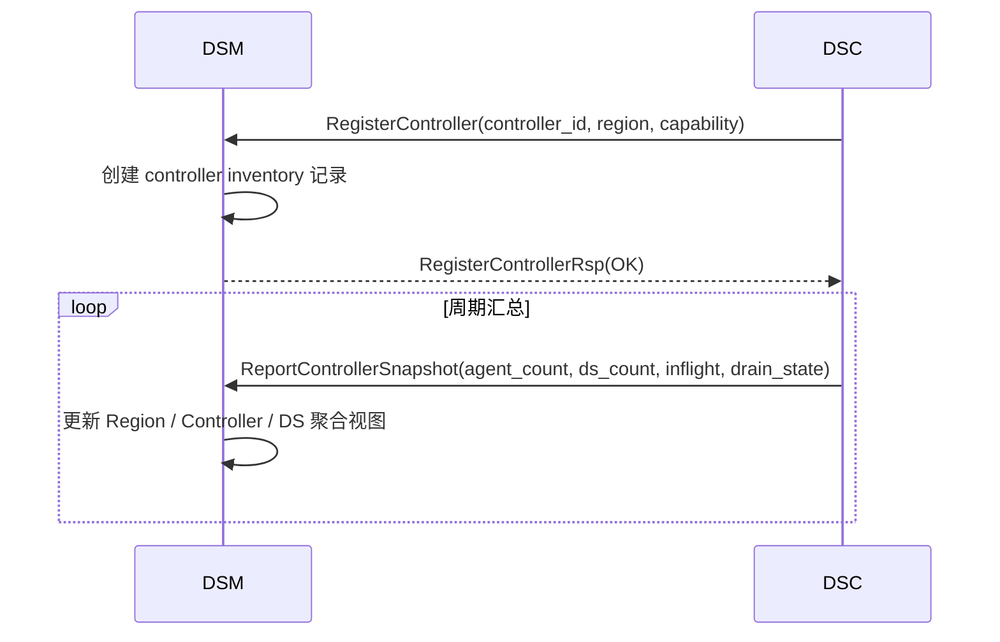
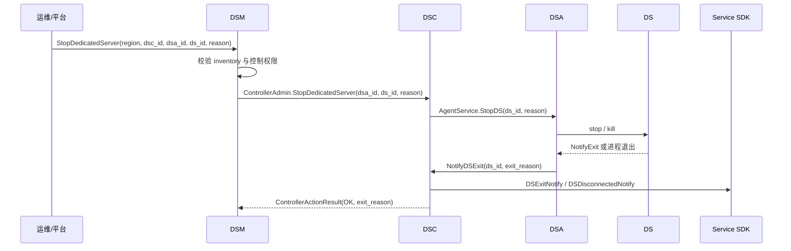
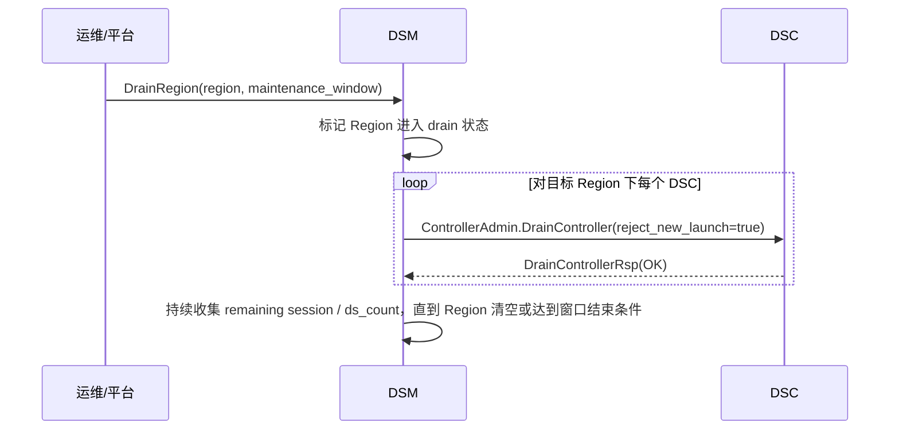

# atorbit DSM 设计文档

> Dedicated Server Manager (DSM)
>
> 版本：v0.1 Draft | 日期：2026-04-27
>
> 本文档补充 DSM 在 atorbit 中的控制平面职责；业务热路径仍以 [guide.md](guide.md) 中的 DSA / DSC / SDK 设计为准。

---

## 1. 设计目标

DSM 是 atorbit 的全局管理平面，目标不是替代 DSC，而是把跨 Region、跨 Controller 的运维能力独立出来：

- 汇聚多 Region DSC 的 inventory、健康状态、运行策略和故障摘要。
- 为平台 / 运维侧提供统一入口，执行 `query inventory`、`drain controller`、`drain region`、`stop dedicated server`、`reconcile routing plan`。
- 把 DSC / DSA / DS / 双侧 SDK 的完整链路补成闭环：业务消息走 DSC，运维动作走 DSM。
- 保持 DSM 不进入外部服务 ↔ DS 的业务热路径，避免把控制平面压力引入消息转发链路。

---

## 2. 责任边界

| 组件 | 责任 | 不负责 |
|------|------|--------|
| DSM | 全局 inventory、控制动作、Region / Controller 策略、审计与运维查询 | 不直接转发 Service ↔ DS 业务消息 |
| DSC | DS 调度、会话路由、消息转发、外部服务连接管理 | 不负责跨 Region 全局策略编排 |
| DSA | DS 进程管理、本地 channel、心跳与退出归因 | 不负责全局 topology 视图 |
| Service SDK | 启动 DS、向 DS 收发消息、接收 DS 断链 / 退出事件 | 不直接调用 DSM 控制接口 |
| DS SDK | 连接 DSA、收发消息、主动停止自身 | 不直接感知 DSC / DSM |

---

## 3. 核心能力

### 3.1 全局 Inventory 聚合

DSM 维护三层视图：

- Region 视图：每个 Region 的 DSC 数量、可用 DSA 数量、运行中 DS 数量、drain 状态。
- Controller 视图：每个 DSC 的健康状态、管理范围、活跃 session、in-flight launch、buffer 占用。
- DS 视图：`(region, dsc_id, dsa_id, ds_id)` 唯一定位、owner、运行状态、退出原因、最后活跃时间。

DSM 的 inventory 来自 DSC 的周期汇总上报，而不是直接监听 DS 或 DSA 的业务链路。

### 3.2 运维控制动作

DSM 首批控制动作包括：

- `QueryInventory`：按 Region、DSC、DSA、DS、owner 查询当前清单。
- `DrainController`：把单个 DSC 切入 drain 模式，停止接受新的 LaunchDS / 新会话，并等待存量 DS 回收。
- `DrainRegion`：对整个 Region 下发批量 drain 策略，用于维护、扩缩容切换或灰度迁移。
- `StopDedicatedServer`：按 `(dsa_id, ds_id)` 或全局 inventory key 主动停止某个 DS。
- `ApplyRoutingPlan`：切换 Region 的默认路由策略、黑名单 Controller、维护窗口配置。

### 3.3 与 Service SDK / DS SDK 的关系

DSM 不直接暴露给业务 SDK，但 DSM 的控制动作会反映到 SDK 感知的事件上：

- DSM 触发 `StopDedicatedServer` 时，最终会落到 `DSA -> DS stop`，Service SDK 收到 `OnDSExited` 或 `OnDSDisconnected`。
- DSM 触发 `DrainController` / `DrainRegion` 时，新 LaunchDS 会被拒绝或迁移到其他 Region；已运行 DS 的断链 / 退出也会通过 DSC 通知到 Service SDK。
- DS SDK 继续只与 DSA 通信；如果 DSM 策略要求回收 DS，DSA 会把控制动作转成本地 stop 或退出流程。

---

## 4. 关键时序

### 4.1 DSC 向 DSM 上报拓扑



### 4.2 DSM 主动停止某个 DS



### 4.3 DSM 下发 Region Drain



---

## 5. 协议与目录建议

DSM 文档层面建议补一条独立协议与代码树：

```text
proto/
  manager.proto

pseudocode/dsm/
  service/
    app/
    rpc/
    logic/action/
  topology/
  control/
```

建议首批方法：

- `RegisterController`
- `ReportControllerSnapshot`
- `QueryInventory`
- `StopDedicatedServer`
- `DrainController`
- `DrainRegion`
- `ApplyRoutingPlan`

---

## 6. 完整能力闭环

当 DSM 补齐后，atorbit 的端到端闭环是：

1. Service SDK 连接 DSC，发起 `LaunchDS`。
2. DSC 选择 DSA，DSA 拉起 DS，DS SDK 与 DSA 建立本地 channel。
3. Service SDK 与 DS SDK 通过 DSC / DSA 完成收发消息。
4. DS 正常退出、异常退出、DSA 断线或 DSM 主动 stop / drain 时，Service SDK 收到统一的断链或退出事件。
5. DSM 负责全局运维动作、聚合 inventory 和审计，但不进入业务热路径。