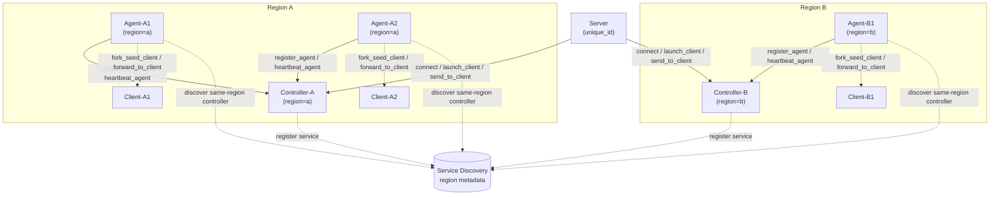
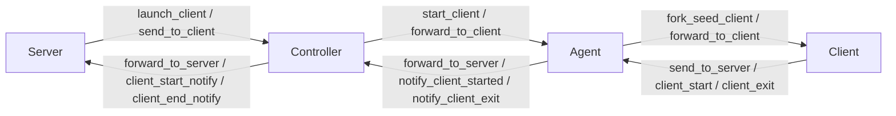
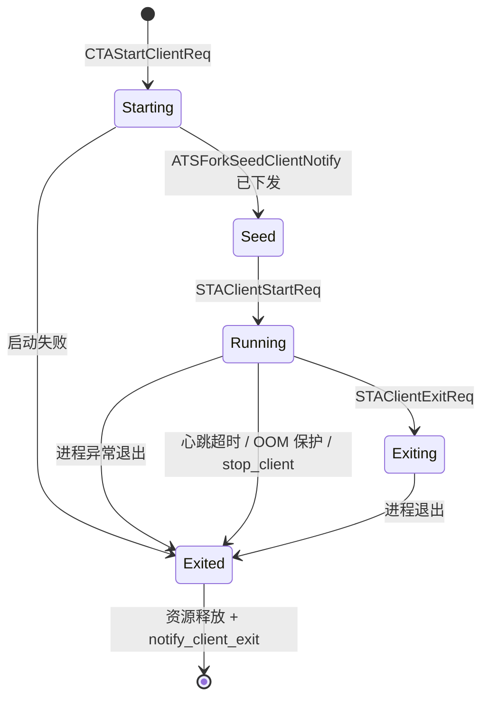
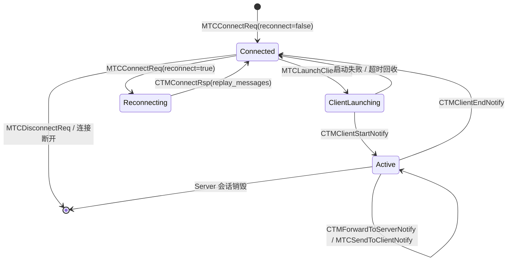
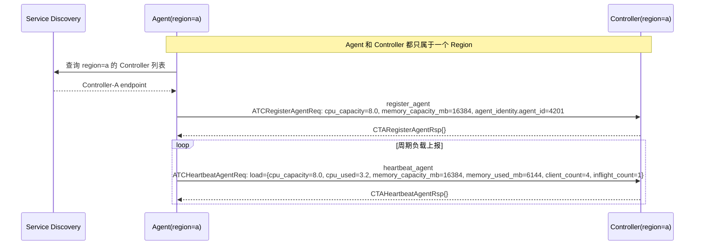
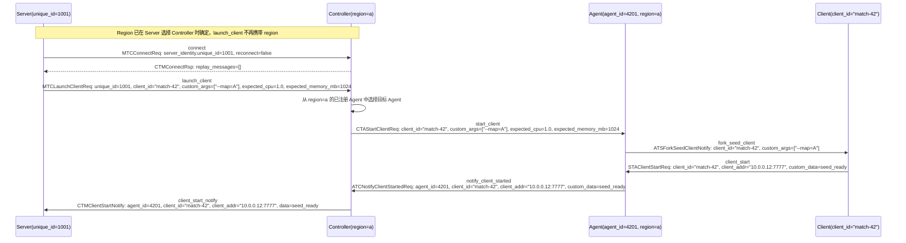
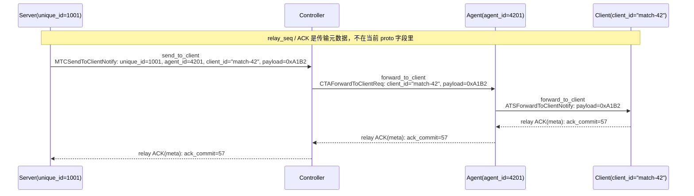
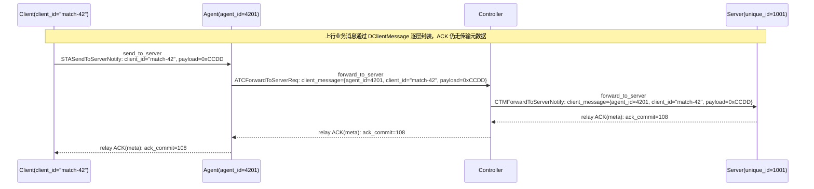
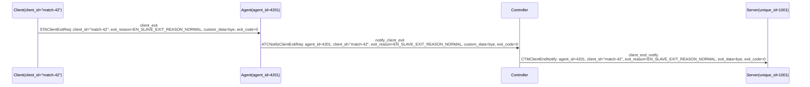
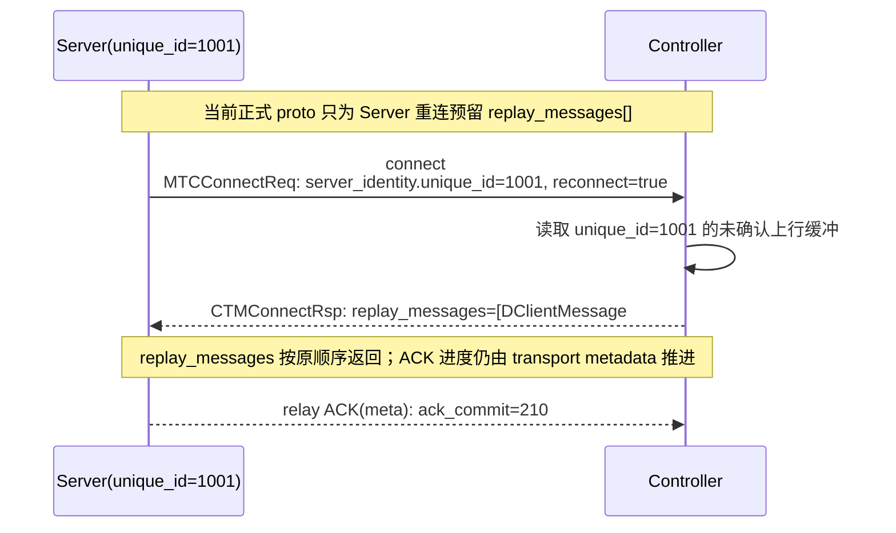

# atorbit Agent/Controller/Server/Client 设计文档

> 版本：v0.3 Protocol-Aligned | 日期：2026-04-29
>
> 本文档以 `src/component/orbit` 下的正式 `.proto` 为协议事实源。
>

---

## 1. 概述

atorbit 当前围绕四类正式角色组织：

- **Agent**：单 Pod 内的执行代理，负责托管和管理多个 Client 运行实例。
- **Controller**：同 Region 的集中调度与路由节点，负责承接 Server 请求、选择 Agent、汇聚 Client 生命周期事件。
- **Server**：上游业务服务，通过 `DServerIdentity.unique_id` 标识自身，并通过 Controller 与 Client 交互。
- **Client**：由 Agent 启动和托管的业务实例，负责心跳、上行消息、启动完成通知和退出通知。

当前正式协议不包含 DSM 管理面；DSM 相关能力保留为未来扩展，不作为本版设计事实。

---

## 2. 核心约束

| 约束 | 说明 |
| --- | --- |
| Region 归属 | **Agent 和 Controller 都只属于一个 Region**，不再使用多 Region 绑定 |
| Region 选择时机 | Region 在服务发现和连接阶段确定，不通过业务 proto 在每次请求中携带 |
| Controller 管理范围 | Controller 只管理与自己同 Region 的 Agent |
| Client 归属 | Client 继承其所属 Agent 和上游 Controller 的 Region |
| Server 接入方式 | Server 通过选择目标 Region 的 Controller 建连；`launch_client` 不再携带 `region` 参数 |
| 通信模型 | 业务负载走 `Server -> Controller -> Agent -> Client` 和反向路径 |
| 协议事实源 | 以 `orbit.common.proto`、`client_service.proto`、`agent_service.proto`、`controller_service.proto`、`server_service.proto` 为准 |
| ACK / 重传 | 当前不在正式 proto 字段中，作为协议外的传输层约定独立实现 |
| 实现技术栈 | 当前工程以 C++17、libatbus、libatapp 为主 |

### 2.1 单 Region 绑定说明

当前 proto 中没有 Region 字段，这并不表示 Region 消失，而是表示 Region 从“业务消息字段”收敛成“部署和连接上下文”：

- Agent 启动配置中只允许一个 Region。
- Controller 启动配置中只允许一个 Region。
- Agent 只从服务发现中筛选与自身同 Region 的 Controller 并建立连接。
- Controller 只接受与自身 Region 匹配的 Agent 注册。
- Server 通过选择某个 Region 的 Controller 建连来确定后续 `launch_client` 的目标 Region，因此 `MTCLaunchClientReq` 本身不再带 `region`。

---

## 3. 架构总览

### 3.1 组件关系图



### 3.2 核心数据流



### 3.3 Region 与路由边界

- Agent 和 Controller 的 Region 绑定发生在配置和服务发现层，而不是消息体字段。
- Controller 对 Server 来说是 Region 入口；Server 选择连接哪个 Controller，就等于选择把后续 `launch_client` 请求发往哪个 Region。
- Client 不单独声明 Region，它天然落在所属 Agent 的 Region 中。

---

## 4. 正式 Proto 协议面

### 4.1 共享模型：orbit.common.proto

| 类型 | 字段 / 枚举 | 说明 |
| --- | --- | --- |
| `DServerIdentity` | `unique_id` | Server 的稳定身份标识 |
| `DAgentIdentity` | `agent_id` | Agent 的稳定身份标识 |
| `DClientId` | `client_id` | Client 的局部标识 |
| `DClientIdentity` | `agent_identity + client_id` | 全局定位一个 Client 的最小身份集合 |
| `DClientLoadSnapshot` | `cpu_used`, `memory_used_mb` | Client 自报负载 |
| `DAgentLoadSnapshot` | `cpu_capacity`, `cpu_used`, `memory_capacity_mb`, `memory_used_mb`, `client_count`, `inflight_count` | Agent 聚合负载 |
| `DClientStartArgs` | `client_id`, `custom_args[]` | Client 启动参数 |
| `DAgentClientStartArgs` | `client_start_args`, `expected_cpu`, `expected_memory_mb` | Controller 下发给 Agent 的启动参数和资源预期 |
| `DClientMessage` | `client_identity`, `payload` | 统一的 Client 业务消息封装 |
| `EnClientState` | `STARTING`, `SEED`, `RUNNING`, `EXITING` | Client 生命周期状态 |
| `EnClientExitReason` | `NORMAL`, `CRASH`, `HEARTBEAT_TIMEOUT`, `OOM_KILL`, `DRAIN_STOP`, `OPERATOR_STOP` | Client 退出原因 |

### 4.2 Client <-> Agent：client_service.proto

#### Agent -> Client

| RPC | 请求消息 | 关键参数 | 作用 |
| --- | --- | --- | --- |
| `forward_to_client` | `ATSForwardToClientNotify` | `payload` | Agent 把上游 Server 的业务消息转给 Client |
| `fork_seed_client` | `ATSForkSeedClientNotify` | `start_args.client_id`, `start_args.custom_args[]` | Agent 触发 Client 以 seed/fork 方式启动 |

#### Client -> Agent

| RPC | 请求消息 | 关键参数 | 作用 |
| --- | --- | --- | --- |
| `client_heartbeat` | `STAClientHeartbeatNotify` | `client_id`, `snapshot` | Client 周期上报负载 |
| `send_to_server` | `STASendToServerNotify` | `client_id`, `payload` | Client 发送上行业务消息 |
| `client_start` | `STAClientStartReq` | `client_id`, `client_addr`, `custom_data` | Client 启动完成通知 |
| `client_exit` | `STAClientExitReq` | `client_id`, `exit_reason`, `custom_data`, `exit_code` | Client 退出通知 |

### 4.3 Agent -> Controller：agent_service.proto

| RPC | 请求消息 | 关键参数 | 作用 |
| --- | --- | --- | --- |
| `register_agent` | `ATCRegisterAgentReq` | `cpu_capacity`, `memory_capacity_mb`, `agent_identity.agent_id` | Agent 首次注册 |
| `heartbeat_agent` | `ATCHeartbeatAgentReq` | `load` | Agent 周期上报聚合负载 |
| `notify_client_started` | `ATCNotifyClientStartedReq` | `client_identity`, `client_addr`, `custom_data` | Agent 通知 Controller 某个 Client 启动完成 |
| `notify_client_exit` | `ATCNotifyClientExitReq` | `client_identity`, `exit_reason`, `custom_data`, `exit_code` | Agent 通知 Controller 某个 Client 已退出 |
| `forward_to_server` | `ATCForwardToServerReq` | `client_message` | Agent 把 Client 业务消息转给 Controller |

### 4.4 Controller -> Agent：controller_service.proto

| RPC | 请求消息 | 关键参数 | 作用 |
| --- | --- | --- | --- |
| `start_client` | `CTAStartClientReq` | `args.client_start_args`, `args.expected_cpu`, `args.expected_memory_mb` | Controller 选择 Agent 后下发启动请求 |
| `stop_client` | `CTAStopClientReq` | `client_id`, `reason` | Controller 请求 Agent 停止某个 Client |
| `forward_to_client` | `CTAForwardToClientReq` | `client_id`, `payload` | Controller 把来自 Server 的消息转给 Agent |

### 4.5 Server <-> Controller：server_service.proto

#### Server -> Controller

| RPC | 请求消息 | 关键参数 | 作用 |
| --- | --- | --- | --- |
| `connect` | `MTCConnectReq` | `server_identity.unique_id`, `reconnect` | 建立或恢复 Server 会话 |
| `disconnect` | `MTCDisconnectReq` | `server_identity.unique_id` | 主动断开会话 |
| `launch_client` | `MTCLaunchClientReq` | `server_identity.unique_id`, `args` | 请求在当前 Controller 所属 Region 拉起 Client |
| `send_to_client` | `MTCSendToClientNotify` | `server_identity.unique_id`, `client_identity`, `payload` | 向指定 Client 发送业务消息 |

#### Controller -> Server

| RPC | 请求消息 | 关键参数 | 作用 |
| --- | --- | --- | --- |
| `forward_to_server` | `CTMForwardToServerNotify` | `client_message` | Controller 向 Server 转发 Client 业务消息 |
| `client_start_notify` | `CTMClientStartNotify` | `client_identity`, `client_addr`, `data` | Controller 通知 Client 启动成功 |
| `client_end_notify` | `CTMClientEndNotify` | `client_identity`, `exit_reason`, `exit_data`, `exit_code` | Controller 通知 Client 已退出 |
| `connect` 返回值 | `CTMConnectRsp` | `replay_messages[]` | Server 重连时回放尚未确认的上行消息 |

---

## 5. 协议外补充约定与运行时设计

### 5.1 Region 绑定约定

Region 不是当前正式 proto 字段，而是部署与连接上下文：

| 角色 | Region 绑定方式 | 是否进入 proto |
| --- | --- | --- |
| Agent | 启动配置 + 服务发现元数据 | 否 |
| Controller | 启动配置 + 服务发现元数据 | 否 |
| Server | 通过选择目标 Controller 连接间接确定 | 否 |
| Client | 继承所属 Agent 的 Region | 否 |

补充规则：

- 一个 Agent 只能向同 Region 的 Controller 发起注册和心跳。
- 一个 Controller 只能接受同 Region 的 Agent。
- 一个 Server 如需跨 Region 工作，应分别连接不同 Region 的 Controller，而不是在 `launch_client` 中携带 `region`。

### 5.2 独立的 ACK / 重传机制

当前正式 proto 只定义业务消息体，不定义 ACK、序列号和重传字段。为了支持消息可靠送达和 Server 重连回放，需要在 proto 之外增加一层传输元数据约定。

#### 5.2.1 适用范围

- 适用于业务消息转发链路：
  - `MTCSendToClientNotify`
  - `CTAForwardToClientReq`
  - `ATSForwardToClientNotify`
  - `STASendToServerNotify`
  - `ATCForwardToServerReq`
  - `CTMForwardToServerNotify`
- 不用于 `register_agent`、`heartbeat_agent`、`client_start`、`client_exit` 这类天然幂等或状态上报型消息。

#### 5.2.2 元数据模型

ACK / 重传信息不进入 protobuf body，而是放在传输层元数据或包头扩展里。逻辑上可抽象为：

```text
relay_meta {
  session_key    // 例如 server_identity.unique_id 或 client_identity
  session_epoch  // 会话代次，重连后递增
  relay_seq      // 当前消息的单调递增序号
  ack_commit     // 已连续确认到的最大序号
  ack_bits       // 最近窗口的位图确认信息
  replay_flag    // 当前消息是否为重放消息
}
```

传输载体建议：

- `Server <-> Controller`：使用 libatapp/libatbus 的消息元数据或扩展包头。
- `Controller <-> Agent`：使用 libatbus 消息元数据或扩展包头。
- `Agent <-> Client`：使用本地 channel 的帧头或 side-band header。

#### 5.2.3 发送与确认流程

1. 发送方在每个逻辑会话内为转发消息分配 `relay_seq`。
2. 消息进入发送窗口后先写入未确认缓冲，再发送 protobuf body。
3. 接收方完成解析和入队后，通过下一帧捎带 ACK，或在空闲时发送独立 ACK 元数据帧。
4. 发送方收到 ACK 后，从未确认缓冲中删除对应消息。
5. 超过 `ack_timeout` 未确认时，发送方按退避策略重传；超过 `max_retry` 后将该链路标记为失败。

#### 5.2.4 重连与回放

`server_service.proto` 已经在 `CTMConnectRsp.replay_messages[]` 中预留了回放入口，因此当前设计约定：

1. Server 断线后以 `MTCConnectReq{server_identity, reconnect=true}` 重新连接。
2. Controller 根据 `server_identity.unique_id` 找到该会话的未确认上行缓冲。
3. Controller 按原始顺序把尚未确认的 `DClientMessage` 放入 `CTMConnectRsp.replay_messages[]` 返回。
4. 重连后的 ACK 进度继续由传输层元数据推进，而不是由新的 proto 字段推进。

当前 proto **没有** 为 Agent 或 Client 定义重连回放接口，因此：

- Agent 断线默认视为重新注册。
- Client 断线默认视为退出或重新启动。
- 如果后续要支持 Agent / Client 级别的 replay，需要先扩展正式 proto。

### 5.3 运行时连接方向总结

| 发起方 | 接收方 | 方式 | 说明 |
| --- | --- | --- | --- |
| Agent | Controller | 服务发现 + `register_agent` / `heartbeat_agent` | Agent 启动后只筛选同 Region 的 Controller，并向其中一个建立稳定连接 |
| Controller | Agent | `start_client` / `forward_to_client` / `stop_client` | Controller 不主动发现跨 Region Agent，只向已注册的同 Region Agent 下发控制请求 |
| Server | Controller | SDK 建连 + `connect` / `launch_client` / `send_to_client` | Server 通过选择某个 Region 的 Controller 入口来确定业务 Region |
| Controller | Server | `forward_to_server` / `client_start_notify` / `client_end_notify` | Controller 汇聚 Client 生命周期和业务消息，再转发给归属 Server |
| Agent | Client | 本地 channel + `fork_seed_client` / `forward_to_client` | Agent 在同 Pod 内托管 Client，并负责本地启动和消息下发 |
| Client | Agent | `client_heartbeat` / `send_to_server` / `client_start` / `client_exit` | Client 只感知 Agent，不直接与 Controller 或其他 Server 交互 |

### 5.4 Agent 侧运行时设计

#### 5.4.1 部署模型

- 每个工作 Pod 启动一个 Agent 进程作为本 Pod 的托管入口。
- 一个 Agent 可以同时承载多个 Client 实例。
- Agent 只属于一个 Region；Pod 被回收时，Agent 断线由 Controller 侧清理状态。

#### 5.4.2 启动参数与容量管理

建议的 Agent 启动配置包括：

| 参数 | 类型 | 说明 |
| --- | --- | --- |
| `region` | `string` | Agent 所属的唯一 Region |
| `cpu_capacity` | `double` | Pod CPU 承载上限 |
| `memory_capacity_mb` | `double` | Pod 内存承载上限 |
| `memory_kill_threshold_mb` | `double` | 触发 OOM 保护的阈值 |
| `client_binary_path` | `string` | Client 可执行文件路径 |
| `client_preset_args[]` | `[]string` | 所有 Client 共用的预设参数 |
| `heartbeat_interval` | `duration` | 心跳采样周期 |
| `heartbeat_timeout` | `duration` | 判定 Client 无响应的超时阈值 |

容量账本沿用旧设计里“预期值 + 实际修正”的思路，但对象改为 Client：

```text
available_cpu = cpu_capacity - sum(max(expected_cpu, actual_cpu))
available_memory_mb = memory_capacity_mb - sum(max(expected_memory_mb, actual_memory_mb))
```

运行时含义：

- Controller 调度时使用 `DAgentClientStartArgs.expected_cpu` 和 `expected_memory_mb` 进行预留。
- Agent 通过 `STAClientHeartbeatNotify.snapshot` 获取 Client 实际负载。
- 当实际负载高于预期时，Agent 需要缩减对外可调度容量。
- 当 Pod 内存超过 `memory_kill_threshold_mb` 时，Agent 可以按策略优先回收内存占用最高的 Client。

#### 5.4.3 Client 生命周期管理

Agent 负责完成以下 Client 生命周期动作：

1. 接收 `CTAStartClientReq` 并校验本地容量是否足够。
2. 组合 `client_preset_args[] + DClientStartArgs.custom_args[]` 启动 Client。
3. 通过 `ATSForkSeedClientNotify` 把最终 `DClientStartArgs` 下发给 Client。
4. 接收 `STAClientStartReq` 后，向 Controller 发送 `ATCNotifyClientStartedReq`。
5. 持续接收 `STAClientHeartbeatNotify` 更新本地账本，并上报 `ATCHeartbeatAgentReq`。
6. 接收 `STAClientExitReq` 或发现进程异常退出后，向 Controller 发送 `ATCNotifyClientExitReq`。

#### 5.4.4 退出检测与心跳处理

| 场景 | 检测方式 | Agent 行为 |
| --- | --- | --- |
| 正常退出 | 收到 `STAClientExitReq` 且进程正常结束 | 释放资源并上报 `ATCNotifyClientExitReq` |
| Crash | 进程异常退出，且没有 `STAClientExitReq` | 以 `EN_SLAVE_EXIT_REASON_CRASH` 上报 |
| 心跳超时 | 超过 `heartbeat_timeout` 未收到 `STAClientHeartbeatNotify` | 强制回收 Client，并上报 `EN_SLAVE_EXIT_REASON_HEARTBEAT_TIMEOUT` |
| OOM 保护 | Pod 总内存超过保护阈值 | 按策略回收 Client，并上报 `EN_SLAVE_EXIT_REASON_OOM_KILL` |
| 控制面停止 | 收到 `CTAStopClientReq` | 触发本地停止流程，并按原因映射退出事件 |

#### 5.4.5 Agent 建议指标

| 指标名 | 类型 | 说明 |
| --- | --- | --- |
| `agent_client_count` | Gauge | 当前承载的 Client 数量 |
| `agent_cpu_used` | Gauge | 当前 CPU 使用量 |
| `agent_cpu_capacity` | Gauge | CPU 承载上限 |
| `agent_memory_used_mb` | Gauge | 当前内存使用量 |
| `agent_memory_capacity_mb` | Gauge | 内存承载上限 |
| `agent_client_start_total` | Counter | Client 启动次数 |
| `agent_client_exit_total` | Counter | Client 退出次数，按退出原因打标签 |
| `agent_heartbeat_timeout_total` | Counter | 心跳超时次数 |
| `agent_oom_kill_total` | Counter | OOM 保护触发次数 |

### 5.5 Controller 侧运行时设计

#### 5.5.1 部署模型

- Controller 是独立部署的控制服务，数量通常手动控制。
- 每个 Controller 只属于一个 Region。
- 同一 Region 可以部署多个 Controller 分摊连接和调度压力。
- Controller 之间默认不共享热状态；Agent 和 Server 会话通常落在单个 Controller 实例上。

#### 5.5.2 Agent 管理与断线清理

Controller 对同 Region Agent 的基本管理流程为：

1. 接收 `ATCRegisterAgentReq`，建立 `agent_id -> agent runtime` 管理记录。
2. 接收 `ATCHeartbeatAgentReq`，刷新该 Agent 的 `DAgentLoadSnapshot`。
3. 接收 `ATCNotifyClientStartedReq` / `ATCNotifyClientExitReq`，同步更新 Client 生命周期映射。
4. 当 Agent 连接断开时，清理该 Agent 及其全部 Client 关联状态。

Agent 断线的实现约定：

- 不主动替 Agent 执行重连恢复。
- 该 Agent 下所有 Client 都视为失效或退出。
- 依赖该 Agent 的 inflight 启动计数必须立即归零。

#### 5.5.3 调度算法与并发控制

Controller 当前 proto 虽未定义调度策略字段，但 `DAgentLoadSnapshot` 已经提供足够的调度输入：

- `cpu_capacity`
- `cpu_used`
- `memory_capacity_mb`
- `memory_used_mb`
- `client_count`
- `inflight_count`

基于这些字段，推荐的调度步骤为：

1. 先按 Region 过滤，只看与当前 Controller 同 Region 的 Agent。
2. 过滤容量不足的 Agent：
     - `cpu_capacity - cpu_used >= expected_cpu`
     - `memory_capacity_mb - memory_used_mb >= expected_memory_mb`
3. 过滤超出 inflight 限制的 Agent。
4. 按空闲资源比例或加权分数排序，优先选择余量最大的 Agent。
5. 发送 `CTAStartClientReq` 前先增加本地 inflight 计数。
6. 收到 `ATCNotifyClientStartedReq`、失败事件或 Agent 断线后回收 inflight 计数。

建议参数：

| 参数 | 说明 |
| --- | --- |
| `max_inflight_per_agent` | 单个 Agent 允许的最大 inflight 启动数 |
| `inflight_timeout` | 启动请求的超时回收时间 |
| `strategy` | 可选 `most_available` 或 `weighted_score` |

#### 5.5.4 Unique ID 路由与会话管理

Server 会话以 `DServerIdentity.unique_id` 为主键。与旧文档不同，当前正式协议中的 Client 定位键是 `DClientIdentity`，因此 Controller 的运行时会话映射建议为：

```text
server_session {
    unique_id
    connection_handle
    bound_controller_region
    owned_clients[] = DClientIdentity
    pending_replay_messages[] = DClientMessage
}

client_session {
    client_identity = {agent_identity, client_id}
    owner_unique_id
    client_addr
    state
}
```

运行时规则：

- 一个 `unique_id` 可以关联多个 Client。
- `send_to_client` 必须校验目标 `client_identity` 是否归属于当前 `unique_id`。
- `client_start_notify` 和 `client_end_notify` 用于维护 `unique_id -> DClientIdentity[]` 映射。
- `CTMConnectRsp.replay_messages[]` 只回放尚未被 Server 确认的上行消息。

#### 5.5.5 Server 建连与重连策略

Server SDK 层可以保留“指定 Region 建连”的高层接口，但 on-wire 协议统一映射为 `MTCConnectReq`：

- 首次连接：从目标 Region 的 Controller 列表中挑选一个可用实例，再发送 `connect(reconnect=false)`。
- 重连：优先回到之前记录的同一 Controller，再发送 `connect(reconnect=true)`。
- 若旧连接仍存活，是否拒绝新的同 `unique_id` 连接，属于 Controller 运行时策略，不由 proto 字段单独表达。

#### 5.5.6 转发与回放语义

| 方向 | 正式 proto | 运行时约定 |
| --- | --- | --- |
| 下行 `Server -> Client` | `MTCSendToClientNotify` -> `CTAForwardToClientReq` -> `ATSForwardToClientNotify` | 失败时返回超时或错误，不默认缓冲 |
| 上行 `Client -> Server` | `STASendToServerNotify` -> `ATCForwardToServerReq` -> `CTMForwardToServerNotify` | 可进入 `pending_replay_messages[]`，供 Server 重连后回放 |
| 启动完成 | `STAClientStartReq` -> `ATCNotifyClientStartedReq` -> `CTMClientStartNotify` | `launch_client` 接收成功不等于 Client 已可用，最终以 `client_start_notify` 为准 |
| 退出事件 | `STAClientExitReq` -> `ATCNotifyClientExitReq` -> `CTMClientEndNotify` | 退出原因最终以 Agent 汇总上报为准 |

#### 5.5.7 Controller 建议指标

| 指标名 | 类型 | 说明 |
| --- | --- | --- |
| `controller_agent_count` | Gauge | 当前管理的 Agent 数量 |
| `controller_client_count` | Gauge | 当前管理的 Client 总数 |
| `controller_server_session_count` | Gauge | 当前活跃 Server 会话数 |
| `controller_launch_request_total` | Counter | `launch_client` 请求总数 |
| `controller_launch_success_total` | Counter | Client 启动成功次数 |
| `controller_launch_fail_total` | Counter | Client 启动失败次数 |
| `controller_forward_total` | Counter | 转发消息总数，按方向打标签 |
| `controller_replay_total` | Counter | 重连回放消息总数 |
| `controller_agent_disconnect_total` | Counter | Agent 断线次数 |

### 5.6 Server SDK 语义补充

旧文档中的 SDK 行为说明在当前 proto 下需要调整为：

| SDK 语义 | 对应正式 proto / 事件 | 当前说明 |
| --- | --- | --- |
| `Connect(target_region, unique_id)` | 选择 Controller 后发送 `MTCConnectReq` | `target_region` 属于 SDK 层参数，不进入 on-wire proto |
| `LaunchClient(args)` | `MTCLaunchClientReq` | 请求被接受后不代表启动完成；最终以 `CTMClientStartNotify` 为准 |
| `SendToClient(client_identity, payload)` | `MTCSendToClientNotify` | 目标对象已从旧的复合 `(dsa_id, ds_id)` 改为 `DClientIdentity` |
| `OnClientMessage(callback)` | `CTMForwardToServerNotify` | 上行消息以 `DClientMessage` 形式回调 |
| `OnClientStarted(callback)` | `CTMClientStartNotify` | 提供 `client_identity`、`client_addr`、`data` |
| `OnClientExited(callback)` | `CTMClientEndNotify` | 提供退出原因、退出码和附带数据 |

### 5.7 状态机

#### 5.7.1 Agent 视角的 Client 状态机



#### 5.7.2 Controller 视角的 Server 会话状态机



---

## 6. 时序图

### 6.1 Agent 注册与心跳



### 6.2 Server 建连与启动 Client



### 6.3 下行消息：Server -> Controller -> Agent -> Client



### 6.4 上行消息：Client -> Agent -> Controller -> Server



### 6.5 Client 退出



### 6.6 Server 重连与回放



---

## 7. 当前不展开的内容

下列能力尚未进入正式 proto，本版设计文档只保留边界说明，不展开为既成事实：

- DSM 管理面 RPC
- Region 级运维动作
- Controller 或 Agent inventory 查询接口
- Agent / Client 级别的 reconnect replay
- 任何新的 proto 字段、序列号字段或 ACK 消息体

如果后续需要把这些能力正式化，应先更新 `src/component/orbit` 下的 `.proto`，再同步更新本设计文档。

---

## 8. 与 Agones 类方案的定位差异

### 8.1 简化对比

| 维度 | 当前 Agent/Controller 方案 | Agones / Thundernetes 一类方案 |
| --- | --- | --- |
| 调度粒度 | 一个 Agent 托管多个 Client，偏进程级密度管理 | 通常以 Pod 为主要调度单位 |
| 外部服务感知 | Server 只感知 Controller | 上层通常需要感知具体 GameServer 地址 |
| 转发模型 | `Server -> Controller -> Agent -> Client` 三跳管理面 | 更偏向客户端或上层直连实例 |
| 重连回放 | `CTMConnectRsp.replay_messages[]` 预留了 Server 上行回放入口 | 通常依赖业务层自行恢复 |
| Region 绑定 | Region 作为部署与连接上下文 | 常见做法是集群、Fleet 或 allocator 维度建模 |

### 8.2 适用场景

更适合当前方案的场景：

- 上游 Server 数量多，希望不直接维护 Client 运行地址列表。
- 业务消息偏低频管理面，能够接受经过 Controller 的额外一跳。
- 需要在单 Pod 内提升 Client 承载密度，并进行更细粒度的资源账本控制。
- 希望在 Server 重连后自动收到未确认的上行消息回放。

更适合传统 Pod/实例直连方案的场景：

- 强实时、超低延迟、希望尽量减少转发跳数。
- 每个实例都倾向独占 Pod 或虚拟机资源。
- 运维体系已经高度围绕 Kubernetes GameServer CRD 建立。