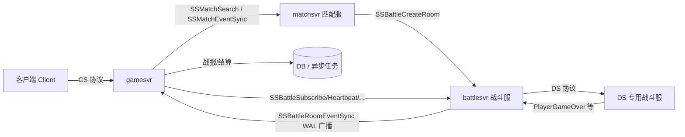
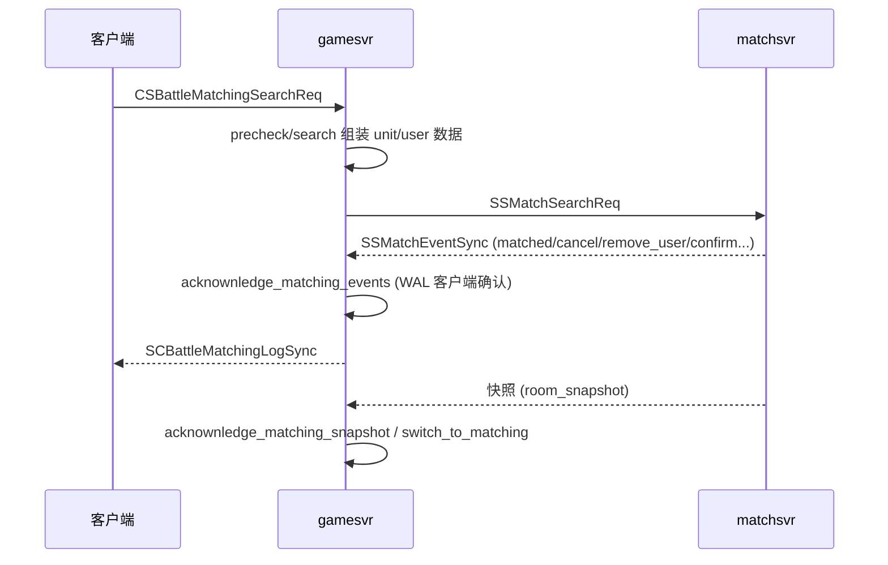
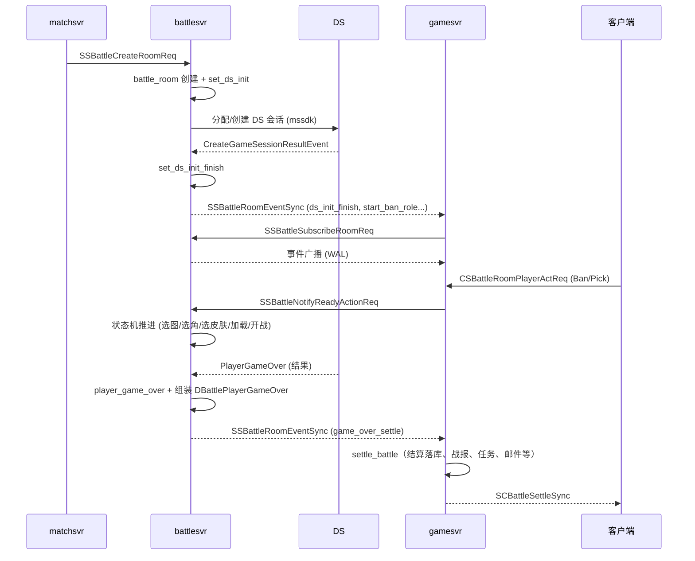

# 战斗模块功能文档（gamesvr/logic/battle 与 battlesvr）

> 目的：梳理 `src/gamesvr/logic/battle` 与 `src/battlesvr` 两块代码的完整功能逻辑，
> 作为后续「裁剪 + 迁移」的原始依据。文档以「原有功能」为准，不包含任何裁剪建议。

---

## 0. 总体架构与模块关系

### 0.1 战斗链路总览

一个完整的对战流程贯穿以下服务：



- **gamesvr** 侧负责：玩家的匹配发起/取消、匹配与战斗事件确认（WAL 客户端）、战斗订阅心跳、结算落库、战报生成、带入/带出道具与防复制、门票等业务逻辑。
- **battlesvr** 侧负责：战斗房间（battle_room）全生命周期状态机、DS（专用战斗服）分配、玩家进出房/订阅、Ban/Pick/选图/选角/加载/开战状态推进、对局结束（game over）结算组装、TrueSkill 匹配参数回写、带出装备与防复制、战斗回放数据与恢复（recover）。

### 0.2 两个目录职责对照

| 目录 | 职责 |
| --- | --- |
| `src/gamesvr/logic/battle` | 玩家维度（per-player）的战斗逻辑：匹配管理、战斗订阅、结算、战报、带入恢复 |
| `src/battlesvr/service/logic` | 房间维度（per-room）的战斗逻辑：battle_room 状态机、DS 分配、房间管理、结算组装 |

---

## 1. gamesvr/logic/battle —— 玩家侧战斗逻辑

### 1.1 文件清单与职责

| 文件 | 职责 |
| --- | --- |
| `user_battle_manager.h/.cpp` | 核心管理器：匹配全流程、战斗订阅、事件确认、结算、门票、防复制 |
| `user_battle_types.h` | 数据类型：`user_match_battle_data_reference`（对房间快照/匹配数据的只读引用） |
| `user_battle_matching_wal_handle.h/.cpp` | 匹配事件 WAL 客户端定义 |
| `user_battle_room_wal_handle.h/.cpp` | 战斗房间事件 WAL 客户端定义 |
| `user_battle_records.h/.cpp` | 战报管理：分页拉取、详情、内存缓存、DB 初始化 |
| `user_battle_record_generate.cpp` | 战报生成：结算数据 → 战报 basic/detail 组装 |
| `user_battle_bring_in_recover.h/.cpp` | 带入装备异常返还恢复（邮件发放） |
| `user_battle_manager_copy_defense_imp.cpp` | 防复制（copy defense）实现 |
| `task_action_battle_*.cpp/h` | 客户端 CS 协议处理（详见 1.8） |
| `task_action_match_event_sync.cpp/h` | 匹配服事件同步（SS 入站） |
| `task_action_battle_room_event_sync.cpp/h` | 战斗服事件同步（SS 入站） |

### 1.2 user_battle_manager —— 玩家战斗主管理器

#### 生命周期

- `create_init(ctx, version_type)`：创建默认数据（当前为空实现）。
- `login_init(ctx)`：登入时读取玩家战斗相关数据，初始化 WAL 客户端等。
- `on_logout(ctx)`：登出清理，必要时反订阅 battlesvr、退出匹配。
- `refresh_feature_limit_second(ctx)`：刷新功能限制次数。
- `init_from_table_data(ctx, player_table)`：从 DB 表数据（`TABLE_USER_DEF`）恢复战斗数据。
- `dump(...)` 系列：将内存数据序列化回 DB 结构（matching 数据、battle room 数据、战报、快照、队伍渗透信息）。
- `is_dirty()/clear_dirty()`：脏标记管理，配合快速存档。

#### 状态查询接口

- 匹配状态：`is_matching()`、`get_current_matching_id()`、`get_current_matching_server_id()`、`get_last_matching_acknowlodge_event_id()`、`get_previous_matching_id()`。
- 预搜索状态：`is_in_pre_search()`、`set_pre_search_start_timepoint()`、`get_pre_search_expired_timeport()`、`clear_pre_search()`。
- 战斗状态：`is_in_battle()`、`get_current_battle_id()`、`get_current_battle_server_id()`、`get_current_battle_start/expired_timepoint()`。
- 数据访问：`get_current_matching_user_data/unit_data/room_data()`、`get_current_matching_preview_data()`、`mutable_unit_data()/mutable_room_data()`。
- 互斥任务：`is_mutex_task_running()`、`await_mutex_task()`、`reset_mutex_task()`。

#### 匹配全流程

1. **pre_search（预搜索）**：`pre_search(ctx, level_select, limit_option, forbid_type)`。
   - `precheck_for_search`：校验已匹配/战斗中/互斥任务、关卡可用性、`check_available`、`autocomplete_parameter`、选择 matchsvr、生产环境关卡校验、`check_before_match`、禁战检查、默认角色存在性。
   - 检查门票 `check_tickets`。
   - 组队：`add_team_members_to_unit` 组装 unit，通知队友预开始匹配。
2. **start_matching（正式匹配）**：`start_matching(...)`。
   - 先 `precheck_for_search`，然后 `clear_matching` + `clear_battling` + `reset_current_level`。
   - `start_matching_assemble_request`：组队匹配 id 组装、生成 unit key、组装 deploy preview、可变 level 参数处理、OSS 日志。
   - 组装 `SSMatchSearchReq`（含 db_data、first_battle_info、last_self_quit_info），调用 `rpc::match::search`。
   - 成功后 `acknownledge_matching_snapshot` 处理快照，`start_matching_after_deal` 落地匹配数据、扣门票。
   - 失败处理：清理匹配、归还门票、取消预搜索。
3. **cancel_pre_search / async_cancel_pre_search**：取消预搜索。
4. **exit_matching / async_exit_matching**：退出匹配（含确认拒绝 `CONFIRM_REFUSE`、主动退出 `SELF_QUIT_MATCHING` 等 reason）。
5. **select_matchsvr**：按版本/region 选择匹配服实例。
6. **check_matching / async_check_matching**：匹配心跳处理（与 matchsvr 对账，含 `acknowledge_event_id`）。
7. **switch_to_matching**：匹配服切换（matching_id 变更），保存 `switch_from_matching_id_/switch_to_matching_id_`。
8. **组队匹配信息**：`set_team_matching_info/clear_team_matching_info`。

#### 匹配事件确认（WAL 客户端）

- `acknownledge_matching_events(ctx, event_logs)`：处理 matchsvr 推送的 `DMatchEventLog` 列表。
  - 过滤已 finished 的事件，组装 `SCBattleMatchingLogSync` 给客户端。
  - 对 `remove_user`（自己被移除/切换）、`cancel`、`matched` 等事件做针对性处理。
- `acknownledge_matching_events_specific_treatment_remove_user`：自己被移除时清匹配/清战斗/归还门票；`UNIT_REPLACE`/`UNIT_USER_CONFLICT` 冲突检测只更新不清理；`SWITCH` 触发 `switch_to_matching`。
- `acknownledge_matching_events_specific_treatment_each_case`：逐事件分发（match、cancel、remove_user、confirm 等）。
- `acknownledge_matching_snapshot(ctx, matching_room_snapshot)`：快照整体恢复匹配数据。
- `load_matching_data(ctx, is_switch, snapshot)`：加载/切换匹配数据。
- 支持 `user_matching_wal_client_type`（WAL 客户端）做事件落库与对账。

#### 战斗订阅与心跳

- `switch_to_battlesvr(ctx, battle_data, limit_option)`：匹配完成 → 切换到战斗。
  - 校验 private battle 重复切换；写入 `last_switch_to_battlesvr_battle_id`。
  - 拷贝 room_key/room_data 到 `db_data_matching_`，置 `MATCH_STATUS_FINISHED`，记录 unsettled battle。
  - 初始化 `user_act_list`（Ban/Pick 占位），提取自己的 deploy 信息。
  - 初始化 `battle_room_wal_client_`，清 cancel 状态，置 `has_switch_to_battlesvr`。
  - `async_subscribe_battlesvr`；刷新用户缓存；通知队伍状态；`switch_copy_defense_status_to_battle`（防复制索引）；`set_quick_save`。
- `subscribe_battlesvr(ctx)`：向 battlesvr 发 `SSBattleSubscribeRoomReq`（acknowledge_event_id=0，带 `has_switch_to_battlesvr`）。
- `unsubscribe_battlesvr(ctx)`：向 battlesvr 发 `SSBattleUnsubscribeRoomReq`。
- `send_heartbeat_to_battlesvr(ctx, acknowledge_event_id, is_from_client)`：战斗心跳，推进 `battle_room_wal_client_` 确认。
- `acknownledge_battle_room_events(ctx, event_logs, snapshot)`：处理 battlesvr 推送的 `DBattleRoomEventLog`。
  - 组装 `SCBattleRoomLogSync` 给客户端（含快照）。
  - 逐事件推进 WAL 客户端、更新 `acknowledge_event_id`、更新 `battle_room_status`。
  - 事件分发见下：
    - `acknownledge_battle_room_events_ds_init_finish`：保存 ds_token/ds 地址/gcloud_cluster_id/water_mark；版本变更标记。
    - `acknownledge_battle_room_events_cancel`：战斗取消，归还门票、重置关卡、通知队伍、private room 收尾、记录 `cancel_info`、补充 forbid 状态。
    - `acknownledge_battle_room_events_game_over_settle`：token 校验 → 反订阅 → 清战斗 → 组装 `user_async_job_battle_settlement` → `settle_battle`。
- `wait_for_async_battle_heartbeat_task`：等待异步战斗心跳任务完成。

#### 结算（settlement）

- `settle_battle(ctx, user_async_job_battle_settlement)`：
  - 幂等：`check_battle_record_key_ok` + `add_battle_record_key`，重复结算直接跳过。
  - 校验 `unsettled_battle_id` 与 battle_id 匹配，不匹配则 `report_unset_battle_id` 并跳过。
  - 存储 `DUserBattleSettlement` 到 `db_data_battle_record_.battle_settlements`。
  - 更新同玩好友、最近对战玩家；加入最近 N 场结算数据（赛季维度）。
  - `deal_gameover_result` 处理结果 → `send_battle_settle_sync_to_client` 下发 `SCBattleSettleSync`。
- `deal_gameover_result(ctx, limit_option, settle_data, gs_result)`：
  - 取角色 → `deal_gameover_result_by_actor_status_type`（按 actor 状态分流）。
  - `bring_out_oss`；更新带出道具任务价值；触发 `BATTLE_FINISH` 任务事件。
  - 词条金币逃出（pvpve 逃生额外金币）。
  - `deal_gameover_result_for_actor`（角色经验/等级/道具等，含 mithril force 特殊角色 `do_gameover_result_for_actor_mithril_force_role`、`auto_exchange_item` 自动兑换）。
  - `deal_gameover_result_for_activity_center`（运营活动中心）。
  - 穷光蛋检测、秘银商会积分结算。
- `send_battle_settle_sync_to_client`：按 `get_settle_interface`（PVE/PVP/BO5 试炼等）组装下发；非 PVE 主动退出不下发结算界面；清理背包/穿戴数据。

#### 门票（ticket）管理

- `check_tickets` / `check_and_cost_tickets`：校验并扣门票。
- `clear_tickets_stash` / `return_cost_tickets`：清理暂存/归还门票（匹配失败、取消、战斗取消时调用）。

#### 禁战 / 战斗前置校验

- `check_is_ban_battle` / `check_is_ban_battle_inner`：版本号校验、区域转换、ban 状态检查。
- `check_before_battle` / `check_before_match`：战斗/匹配前置校验。
- `check_if_active_level`：关卡激活校验。
- `get_region_by_region_transform`：区域转换。
- `get_battle_version_by_client_version` / `get_user_battle_version`：客户端版本 → 战斗版本映射。
- `check_match_ban_time_duration`：匹配 ban 时长检查。

#### 匹配参数计算（gamesvr 侧）

- `calc_current_role_comprehensive_score` / `calc_this_storage_comprehensive_score` / `calc_this_item_comprehensive_score`：按装备/背包计算角色综合战力分。
- `fetch_matching_parameter`：拉取匹配参数（含 `fetch_matching_parameter_for_is_is_thief` 盗贼判定）。
- `assemble_team_matching_parameter_mu_sigma`：TrueSkill μ/σ 组装。
- `assemble_team_matching_parameter_common`：综合分组装。
- `assemble_matching_parameter_for_challenge_model`：挑战模式参数。
- `assemble_matching_parameter_for_skill_strength`：实力分（skill_strength）参数。
- `assemble_matching_activity_parameter`：活动参数。
- `prepare_matching_first_battle_info`：首战信息。
- `generate_user_matching_parameter` / `generate_user_matching_rule` / `pack_matching_*`：打包给 matchsvr 的匹配数据。
- `get_ban_matching_user_info`：拉黑用户信息。
- `fetch_user_unlucky_data`：倒霉蛋数据。

#### 战报相关（挂在 manager 上）

- `get_battle_record_keys` / `add_battle_record_key` / `check_battle_record_key_ok` / `get_battle_record_key`：战报 key 的 LRU 缓存管理（battle_id+token）。
- `add_last_n_battle_settle_data` / `get_last_n_battle_settle_data_by_battle_id`：赛季最近 N 场结算。
- `get_teammates_from_participate_data`：从参与数据中提取队友结算信息。
- `try_player_kickoff`：服务端主动踢人。

#### 带入/带出与防复制（copy defense）

- `clear_role_item_for_copy_defense` / `async_clear_role_item_for_copy_defense_and_clear_battling`：异常场景清理角色装备。
- `write_bring_in_data` / `bring_in_oss`：与 battlesvr 保持一致地写带入数据（供错误恢复用）。
- `check_can_clear_role_item_for_copy_defense`：判定装备是否可清理。
- `switch_copy_defense_status_to_battle` / `switch_copy_defense_status_to_battle_for_items`：将穿戴/背包/小背包物品加入战斗防复制索引。

#### 赛季持久化数据

- `mutable_season_lasting_battle_data(limit_option)`：按 `DLimitOption` 存储赛季持续数据（unsettled battle、last N 结算、self_quit 信息、门票暂存等）。
- `mutable_season_last_n_battle_settle_data_pq(limit_option)`：最近 N 场结算优先队列。

### 1.3 user_battle_types.h

- `user_match_battle_data_reference`：对 `DMatchBattleData` 或 `matching_room_snapshot` 的统一只读引用（room_key、room_data、participators、robots），供 `switch_to_battlesvr` 等使用。

### 1.4 WAL 客户端（匹配 + 战斗房间）

- `user_matching_wal_client_type`：`wal_client<user_matching_data, DMatchEventLog, ..., user_battle_manager*, matching_room_snapshot>`。
  - 用于对 matchsvr 推送的事件做顺序确认、对账与落库。
- `user_battle_room_wal_client_type`：`wal_client<user_battle_room_data, DBattleRoomEventLog, ..., user_battle_manager*, battle_room_snapshot>`。
  - 用于对 battlesvr 推送的房间事件做顺序确认。
- 均提供 `create_client` 工厂函数。

### 1.5 user_battle_records —— 战报管理

- `dump_by_page(ctx, start_address, data_length, DUserBattleRecordBasics)`：分页拉取战报列表（`sorted_records_` 排序 + 分页）。
- `get_record_detail(ctx, battle_id, token, DBattleHistoryRecordDetail)`：战报详情。
- `move_add_record(ctx, battle_id, token, record)`：写入战报（内存 + 脏标记 + 容量淘汰）。
- `modify_record_basic`：低成本修改战报 basic（队友 actor_type 更新等）。
- `modify_record_detail`：预留未实现。
- `init_from_record_db` / `batch_pull_basic`：从 DB（`TABLE_PLAYER_BATTLE_RECORD_DEF`）异步初始化战报。
- `capacity_retirement`：容量淘汰策略。
- `get_record` / `mark_dirty_recored`：内部工具。
- 数据组织：`battle_record_map_t`（battle_id → token → record）二级索引。

### 1.6 user_battle_record_generate.cpp —— 战报生成

- `save_battle_record(ctx, limit_option, level_parameter, settle_data, role_ptr, teammates)`：
  - 组装 `user_battle_record_complete_data`（basic + detail）。
  - basic：level 参数、统计、actor_type、队伍大小、带出价值（`calculate_bring_out_value`）、开始时间、角色等级、存活时间、tiers_id、参与数据（拉取角色缓存）。
  - detail：参与数据（battle_data + role）、结算接口类型、PVP 分、PVP round 数据。
  - `calculate_bring_out_value` / `calculate_items_value`：带出价值/道具价值计算（含队友）。
- `update_battle_record`：队友结算异步通知后更新战报中的 actor_type。

### 1.7 user_battle_bring_in_recover —— 带入异常返还

- `bring_in_recover(ctx, user_key, battle_id, mail_template_id, is_give_soul_bound)`：
  1. 查 DB `TABLE_BATTLE_USER_BRING_DEF`。
  2. 秘银势力（`EN_FORCE_TYPE_MITHRIL_FORCE`）直接失败。
  3. 从穿戴/背包/小背包中剔除保险物品、队友归还道具、小背包带出道具（`bring_in_recover_culling_item`）。
  4. 保险拆分：解锁保险 + 附加保险费用道具（`is_give_soul_bound` 时）。
  5. 重新生成物品 GUID。
  6. 发邮件（模板 + 附件道具）`rpc::mail::add_user_mail_with_template`。
  7. OSS 埋点。

### 1.8 gamesvr 侧 CS/SS 协议处理（task_action_*）

| 协议 | 功能 |
| --- | --- |
| `task_action_battle_matching_search` | 客户端发起匹配（`CSBattleMatchingSearchReq`）→ `start_matching`，返回 matching_id、心跳间隔 |
| `task_action_battle_matching_pre_search` | 客户端发起预搜索（`CSBattleMatchingPreSearchReq`）→ `pre_search`，返回 lazy search 随机区间 |
| `task_action_battle_matching_cancel_pre_search` | 取消预搜索 → `cancel_pre_search` |
| `task_action_battle_matching_exit` | 主动退出匹配 → `exit_matching(SELF_QUIT_MATCHING)` |
| `task_action_battle_matching_confirm_refuse` | 确认阶段拒绝 → `exit_matching(CONFIRM_REFUSE)` |
| `task_action_battle_matching_heartbeat` | 匹配心跳 → `check_matching`（含 matching_id 切换兼容、非法 id 标记） |
| `task_action_battle_room_heartbeat` | 战斗房间心跳 → `send_heartbeat_to_battlesvr`（校验 battle_id） |
| `task_action_battle_room_player_act` | 玩家房间操作（Ban/Pick）→ `ban_pick_load` |
| `task_action_battle_update_setting` | 更新战斗设置 `DBattleOptions` |
| `task_action_battle_record_data_get` | 拉取战报详情 → `user_battle_records::get_record_detail` |
| `task_action_battle_fetch_battle_user_data` | 获取自己的战斗用户数据（deploy preview + ds_player_key） |
| `task_action_match_event_sync` | **入站 SS**：matchsvr 推送匹配事件 → 逐玩家 `acknownledge_matching_events` / `acknownledge_matching_snapshot`；matching_id 不匹配时自动 `rpc::match::exit` |
| `task_action_battle_room_event_sync` | **入站 SS**：battlesvr 推送房间事件 → 逐玩家 `acknownledge_battle_room_events`；玩家离线时反订阅 |

---

## 2. battlesvr/service/logic —— 战斗房间服务端逻辑

### 2.1 文件清单与职责

| 文件 | 职责 |
| --- | --- |
| `battle_room_manager.h/.cpp` | 战斗房间管理器（单例）：房间索引、状态机定时器、恢复 recover、关闭 |
| `battle_room.h/.cpp` | 战斗房间核心：状态机、玩家进出、事件广播（WAL 发布）、DS 交互、结算组装 |
| `battle_room_wal_handle.h/.cpp` | 战斗房间事件 WAL 发布者 |
| `battle_room_copy_defense_imp.cpp` | 防复制实现（battle_room 拆分文件） |
| `battle_room_match_parameter_calc_imp.cpp` | TrueSkill 匹配参数计算（battle_room 拆分文件） |
| `ds_alloc_manager.h/.cpp` | DS 分配管理器（单例）：region 分组、DSC 状态上报、DS 创建会话 |
| `ds_region_group.h/.cpp` | DS 区域分组：按权重选 region、状态上报调度 |
| `ds_region_unit.h/.cpp` | 单个 DS region：alias id、权重、状态上报 |
| `version_controller.h/.cpp` | 战斗版本控制（etcd keepalive） |
| `loot_item_limit_manger.h/.cpp` | 战利品掉落数量限制（按 zone/season/item/period） |
| `ace_sdk_mgr.h` | ACE SDK 在线心跳/在线状态上报 |
| `app/battlesvr_main.cpp` | 服务入口：注册协议、初始化各模块、tick/reload/stop |
| `action/*` | SS RPC 处理（gamesvr → battlesvr） |
| `ds_action/*` | DS RPC 处理（DS → battlesvr） |

### 2.2 battle_room_manager —— 房间管理器

#### 状态机定时器（核心）

`timer_mode_t`：`DS_INIT_TIMEOUT`、`BAN_ROLE_TIMEOUT`、`BAN_MAP_TIMEOUT`、`SELECT_MAP_TIMEOUT`、`SELECT_ROLE_TIMEOUT`、`SELECT_SKIN_WIDGET_TIMEOUT`、`LOADING_TIMEOUT`、`BATTLING_TIMEOUT`、`FINISHING_TIMEOUT`、`CANCELING_TIMEOUT`。

`add_timer` 为每个阶段注册超时回调并驱动状态推进：

```
DS_INIT --超时--> CANCEL
BAN_ROLE --超时--> BAN_MAP
BAN_MAP  --超时--> SELECTING_MAP
SELECT_MAP --超时--> SELECTING_ROLE
SELECT_ROLE --超时--> SELECTING_SKIN_WIDGET（skin 超时0则 CANCEL）
SELECT_SKIN_WIDGET --超时--> LOADING
LOADING --超时--> BATTLING
BATTLING --超时--> FINISHED
FINISHED --超时--> 移除房间
CANCEL  --超时--> 移除房间
```

- 各超时时间来自 `battle_room::get_status_timeout`、`battle_room_timeout_total_sec`、`get_map_waiting_timeout` 与配置。
- `will_*` 系列（`will_ban_map`/`will_selecting_map`/.../`will_cancel_battle`/`will_remove_battle_room`）对房间做二次校验后推进状态。

#### 房间生命周期

- `init`：初始化 timer；若配置 `is_enable_battlesvr_recover` 则 `async_recover`（启动恢复）。
- `tick`：timer tick；周期性上报战斗数量 OSS（`BattleCountFlow`）；清理过期房间（`async_close_battle_room`，reason=`EN_ERR_TIMEOUT`）。
- `add_battle_room`：加入 `room_index_by_battle_id_`（LRU map）。
- `get_battle_room` / `get_battle_room_by_check`：按 battle_id 查房间（带 double check 防误删）。
- `close_room_by_battle_id` / `async_close_battle_room`：关闭房间（含 `will_remove_battle_room` 回调、`set_cancel`）。
- `stop/cleanup`：停机清理；`print_running_battling_when_stop_server` 打印运行中战斗。
- `get_total_battling_player_count` / `get_total_battling_real_player_count`：统计（real 排除机器人）。
- `get_rand_map_id`：随机地图（按地图池配置）。

#### 恢复（recover）

- `async_recover` / `recover_load` / `batch_recover`：启动时从 DB（`table_battle_room_recover_data_blob_data`）批量恢复战斗房间。
- `is_recovering()`：恢复期间，订阅/心跳/退出等返回 `EN_ERR_BATTLE_IS_RECOVERING`。

### 2.3 battle_room —— 战斗房间核心

#### 状态机

`status_t::type`：

```
INVALID -> DS_INIT -> BAN_ROLE -> BAN_MAP -> SELECTING_MAP -> SELECTING_ROLE
        -> SELECTING_SKIN_WIDGET -> LOADING -> BATTLING -> FINISHED
        （任意阶段可 -> CANCEL / TIMEOUT）
```

- `set_status`：通过有限状态机表（`details::get_battle_room_status_finite_state_machine`）校验转移合法性。
- 各 `set_xxx` 方法：写 `DBattleRoomEventLog`（如 `start_ds_init`/`start_ban_role`/`start_pick_map`/`start_pick_role`/`start_pick_skin_widget`/`start_loading`/`start_battling`）、推进 `status_end_timepoint_`、注册对应 timer、广播事件。
  - 阶段超时=0 时自动跳过到下一阶段（除 skin widget 阶段，超时0 时等待 10 秒）。
- `set_battling`：记录 `status_battle_start_timepoint_`，触发 `async_trigger_recover_dump`（战斗开始落恢复数据）。

#### 玩家进出与订阅

- `join_player(ctx, user_key, access_token, deploy_request, deploy_response, out)`：写入 battle_setting、产出 `user_pick_skin_widget` 事件、记录 `SELECTING_SKIN_WIDGET` 就绪；全员就绪 → `set_loading`。
- `exit_room(ctx, user_key, verify_data, exit_reason, battle_result)`：若未 game over 则查 DS 状态（`rpc::ds_rpc::query_player_game_status`）；按结果处理（强行退出 `force_exit_ds`、直接 `player_game_over`、失败重试后 `game_over_by_battlesvr`）；记录 `FINISHED` 就绪，全员退出 → `set_finish`。
- `subscribe(ctx, user_key, acknowledge_event_id, is_confirm_battle, user_gamesvr_id)`：创建 WAL 订阅者；`try_set_confirm_battle`（已确认且 ds 初始化完 → `add_to_waiting_room_on_halfway` 中途入房）。
- `unsubscribe`：移除 WAL 订阅者。
- `update_player`（心跳）：WAL 订阅确认推进；未订阅则重新 subscribe + 查 DS 状态；已 gameover 拒绝心跳（`EN_ERR_BATTLE_ROOM_HEARTBEAT_FAILED_HAS_GAMEOVER`）。
- `player_kickoff`：踢人（→ 结算/移除）。
- `add_player_to_room_on_halfway`：中途加入（补位），组装 `out_participators`；`add_to_waiting_room_on_halfway` 中途进等待室；`add_halfway_player_token_event_log` 补 token 事件。

#### 房间事件广播（WAL 发布者）

- `battle_room_wal_publisher_type`：`wal_publisher<..., DBattleRoomEventLog, battle_room*, battle_room_wal_subscriber_type>`。
- `alloc_event_id` / `add_event_log`：分配单调事件 id、写入 WAL。
- `broadcast_events`：向所有订阅者广播增量事件（SSBattleRoomEventSync）。
- `groupcast_events`：按 server 定向组播。
- `dump(battle_room_snapshot&)`：生成房间快照（含 event_logs、room 数据、参与者等）。

#### DS 交互

- `set_ds_init`：进入 DS_INIT，调用 `ds_alloc_manager::alloc_ds`。
- `ds_alloc_failed`：DS 分配失败处理。
- `ds_alloc_finish_init_ds_info`：`CreateGameSessionResultEventReq` → 写 `ds_address` 等 → `set_ds_init_finish`。
- `ds_session_end(end_code)`：DS 会话结束（`ds_end`/`game_session_end_event`）→ 按结束码结算/清理。
- `player_ds_online_report` / `player_ds_online_heartbeat`：DS 上报玩家在线状态/心跳 → `AceSdkMgr::online_report/online_heartbeat`。
- `player_receive_ace_packet`：ACE 数据包转发。

#### 玩家操作（Ban/Pick 驱动状态机）

`on_receive_battle_action(ctx, user_key, DBattleReadyAction, DUserGearWearing)`：

- `kBanRole` / `kBanMap` / `kPickMap`：记录 action（暂无 ban 逻辑）。
- `kPickRole`：记录选角 + `user_pick_role` 事件；确认时存本局装备、置 `SELECTING_ROLE` 就绪，全员就绪 → `set_selecting_skin_widget`。
- `kPickSkinWidget`：记录。
- `kLoadingProgress`：记录加载进度 + `user_loading_progress` 事件；进度 100% 置 `LOADING` 就绪，全员就绪 → `set_battling`。

#### 对局结束（game over / 结算）

- `player_game_over_batch`：批量处理 `DDsUserBattleResult`（先更新统计 `update_user_statistics_actor_type/data`，再逐个 `player_game_over`）。
- `player_game_over(ctx, ds_user_result)`：
  - `gameover_assemble_data` 组装 `DBattlePlayerGameOver`（同玩列表、队伍/阵营、matching_id、ds_result、role_guid、room_key、统计、地图、limit_option）。
  - `deal_small_backpack`：合并小背包缓存数据。
  - 记录 `player_game_over_index_by_user_key_`。
  - 防复制：等待室强退 → `delete_bringin_copy_defense_deploy_preview`；否则 `check_bringin_bringout_copy_defense`。
  - `add_game_over_settle_log`（game_over_settle 事件）→ `broadcast_events`。
  - `async_add_async_jobs_send_battlle_settlement`：异步任务把 `DBattlePlayerGameOver` 发给对应 gamesvr（落库结算）。
  - 等待室强退时 `async_notify_waiting_room_self_quit` 通知 matchsvr。
  - 全部 gameover → `async_calc_new_match_parameters`（TrueSkill）。
  - OSS 埋点 `gameover_oss`；等待室强退清理索引；`async_trigger_recover_dump`。
- `player_settlement_small_backpack_cache`：缓存小背包结算数据（按 ds_user_key 去重）。
- `game_over_by_battlesvr`：服务端主动结算（查 DS 失败/玩家不在 DS 等场景）。
- `notify_battle_finish_or_cancel`：战斗完成/取消通知（含 private room `async_notify_private_room_svr`）。

#### 带入/带出与防复制（battle_room_copy_defense_imp.cpp）

- `add_bringin_copy_defense_item` / `delete_bringin_copy_defense_item`：按 item guid 维护带入物品计数（`bringin_copy_defense_`）。
- `add_bringin_copy_defense_deploy_preview` / `delete_bringin_copy_defense_deploy_preview`：按 deploy preview 批量增减。
- `check_bringin_bringout_copy_defense`：结算时校验带出物品是否可带出（`check_bringin_bringout_copy_defense_for_items`、`check_loot_bringout_copy_defense`、`check_insurance_bringout_copy_defense`）。
- `check_bringout_insurance_for_items`：保险物品带出校验。
- `copy_defense_succ_oss`：防复制成功 OSS。
- `write_bring_in_data`：写带入数据到 DB（供异常恢复）。

#### 匹配参数计算（battle_room_match_parameter_calc_imp.cpp）

- `get_raw_match_parameters`：批量拉取 `TABLE_MATCH_PARAMETER_DEF`（mu/sigma），构造 `true_skill::Player`。
- `calc_new_match_parameters` / `async_calc_new_match_parameters`：按比赛结果计算新匹配参数。
- `calc_player_rank`：排名计算。
- `calc_rank_score_for_pvpve` / `calc_rank_score_for_pvp`：按玩法结算分。
- `calc_ds_result_rank_score`：单玩家排名分。
- `write_new_match_parameters` / `async_write_player_match_parameter`：回写 DB。
- 触发条件：`has_all_player_gameover()`（全员结算完成）。

#### 其它

- `get_status_timeout` / `get_battle_room_timeout_total_sec` / `get_map_waiting_timeout` / `get_battling_timeout`：各阶段超时计算。
- `set_finish`：全员退出/超时 → 完成，通知 + recover 清理。
- `set_cancel(reason, sub_reason)`：取消（`is_cancel_battle_room_`/`cancel_info_` 记录快照信息）。
- `set_closing/set_closed/is_stopping_svr`：停机标记。
- 恢复：`trigger_recover_dump` / `recover_dump` / `recover_init` / `delete_recover_data`。

### 2.4 ds_alloc_manager —— DS 分配

- 单例；`alloc_method_t`（METHOD_DSA）；`close_status_t`（NONE/CLOSING/CLOSED）。
- `init`：`init_ds_region_group` 按配置（`tsf4g.mssdk.ds_region`）构建 region 分组，每个 region 绑定一个 mssdk 实例。
- `tick`：reload 调度；每秒 `trigger_dsc_status_report`。
- `alloc_ds(ctx, timeout, room)`：为房间分配 DS。
  - 流程：确定 region（`select_region_by_weight`）、alias_id（`get_alias_id`，按 battle_version + alias_prefix）、组装 `CreateGameSessionReq`（含 game_properties：`setup_game_properties`）、调用 mssdk 创建会话；超时/失败处理。
- `handle_ds_create_game_session_event`：创建会话结果 → 通知对应 battle_room（`ds_alloc_finish_init_ds_info`）。
- `handle_dsc_status_report`：处理 DSC 状态上报 → 更新 region 权重、触发 alias 状态上报。
- `setup_game_properties`：按 map_id/region 组装 DS 启动参数。
- `stop/prestop`：优雅关闭。

### 2.5 ds_region_group / ds_region_unit

- **ds_region_group**：一组同业务意义的 region。
  - `mutable_region_unit` / `remove_region_unit` / `region_unit`。
  - `select_region_by_weight`：按权重选择 region。
  - `trigger_dsc_status_report`：周期性向各 region 触发 DSC 状态上报。
- **ds_region_unit**：单个 region。
  - `set_weight` / `weight`：权重（来自配置或 DSC 上报）。
  - `get_alias_id(battle_version, alias_prefix)`：生成 DS alias id。
  - `trigger_dsc_status_report` / `trigger_alias_status_report`：状态上报节奏控制。
  - `handle_dsc_status_report` / `handle_alias_status_report`：处理上报（更新权重等）。

### 2.6 version_controller

- 单例；维护 `battle_version_`，通过 etcd keepalive 路径注册版本。
- `get_battle_version` / `reload_verify_version` / `enable_service`。

### 2.7 loot_item_limit_manger

- 单例；`loot_item_limit_`（zone_id → season → item_id → {item_id, period_id, count}）。
- `increase(ctx, zone_id, season, item_id, count)`：掉落计数累加（DB 异步更新）。
- `get_item_limit_cnt`：按 `ExcelLootRarePoolCntLimit` 配置检查掉落上限。
- `update_data_from_db` / `update_local_data`：从 DB 恢复/更新本地计数。
- `send_loot_item_oss`：OSS 上报。

### 2.8 ace_sdk_mgr

- `AceSdkMgr::online_heartbeat` / `online_report`：玩家在 DS 的在线心跳/在线状态上报（对接 ACE SDK 反作弊）。

### 2.9 battlesvr 侧 SS 协议处理（action/*）

| 协议 | 功能 |
| --- | --- |
| `task_action_create_room` | 创建战斗房间：生成 battle_id（uuid）、设置 battle_server_id/版本/时间戳、随机地图、组装 participants（user_key + unit 参数 + deploy_preview + ds_player_key）、构造 `battle_room`、`add_battle_room`、`set_ds_init` 开始分配 DS；失败则 `set_cancel` |
| `task_action_join_room` | 加入房间 → `join_player` + 广播 |
| `task_action_exit_room` | 退出房间 → `exit_room` + 广播 |
| `task_action_subscribe` | 订阅房间事件 → `subscribe` + 广播（恢复期返回 `EN_ERR_BATTLE_IS_RECOVERING`） |
| `task_action_unsubscribe` | 取消订阅 → `unsubscribe` + 广播 |
| `task_action_heartbeat` | 心跳 → `update_player` + 广播 |
| `task_action_get_player_info` | 预留（TODO 未实现） |
| `task_action_notify_ready_action` | 玩家 Ban/Pick 操作 → `on_receive_battle_action` + 广播 |
| `task_action_player_kickoff` | 踢人 → `player_kickoff` + 广播 |
| `task_action_add_player_to_room_on_halfway` | 中途补位 → `add_player_to_room_on_halfway` + 广播 |

### 2.10 battlesvr 侧 DS 协议处理（ds_action/*）

| 协议 | 功能 |
| --- | --- |
| `task_action_hello_world` | 连通性测试（回显 text） |
| `task_action_create_game_session_result_event` | DS 创建会话结果 → `ds_alloc_manager::handle_ds_create_game_session_event` |
| `task_action_ds_end` | DS 进程结束 → 校验 game_session_id → `ds_session_end` |
| `task_action_game_session_end_event` | 会话结束事件 → `ds_session_end` |
| `task_action_dsc_status_report` | DSC 状态上报 → `ds_alloc_manager::handle_dsc_status_report` |
| `task_action_ds_alias_status_report` | alias 状态上报（当前被注释，未生效） |
| `task_action_player_game_over` | DS 上报对局结果：先累加稀有掉落计数（`loot_item_limit_manger::increase`），再 `player_game_over_batch` |
| `task_action_player_online_report` | DS 上报玩家在线状态 → `player_ds_online_report` |
| `task_action_player_online_heartbeat` | DS 上报玩家在线心跳 → `player_ds_online_heartbeat` |

### 2.11 battlesvr_main.cpp —— 服务入口

- 注册 SS 协议（`battlesvrservice`）与 DS 协议（`dsbattleservice`）。
- 初始化模块：`battle_room_manager`、`ds_alloc_manager`、`loot_item_limit_manger`。
- `tick`：`version_controller::reload_verify_version` + 各管理器 tick。
- `reload`：reload 三个管理器。
- `stop`：打印运行中战斗、停 `battle_room_manager`、停 `ds_alloc_manager`。
- prestop 回调：`stop_new_battle`、关闭 mssdk；prestop 完成条件 = 房间数为 0 且 mssdk 已关闭。

---

## 3. 关键数据流

### 3.1 匹配流（gamesvr ↔ matchsvr）



### 3.2 战斗流（gamesvr ↔ battlesvr ↔ DS）



### 3.3 结算落库路径

battlesvr `add_game_over_settle_log` → WAL 广播 → gamesvr `acknownledge_battle_room_events_game_over_settle` → `settle_battle` → `deal_gameover_result`（角色/活动/物品）→ `send_battle_settle_sync_to_client`；同时 `user_battle_records::save_battle_record` 生成战报、`write_bring_in_data`/`TABLE_BATTLE_USER_BRING_DEF` 记录带入数据供异常恢复。

---

## 4. 依赖与注意事项（迁移时需要一并考虑）

- **WAL 机制**：gamesvr 侧使用 `wal_client`（matching + battle room），battlesvr 侧使用 `wal_publisher`，事件 id 单调递增、按 `acknowledge_event_id` 对账。迁移需保留事件顺序与断线重连语义。
- **有限状态机**：battle_room 状态转移被 `battle_room_manager::add_timer` 驱动，超时推进逻辑集中在 manager 的 timer 回调中。
- **恢复机制（recover）**：battlesvr 启动时从 DB 恢复房间（`table_battle_room_recover_data_blob_data`），恢复期间对外返回 `EN_ERR_BATTLE_IS_RECOVERING`；gamesvr 侧 `unsettled_battle_info` 用于结算对账。
- **异步任务**：结算通过 `user_async_job_battle_settlement`（异步任务）发送给 gamesvr；队友通知 `user_async_job_battle_settlement_nofity_teammate` 更新战报。
- **防复制（copy defense）**：gamesvr 与 battlesvr 各维护一份带入物品索引，逻辑需保持一致（代码注释明确注明「实现和 battlesvr 保持一致」）。
- **版本/区域**：`version_controller`（etcd）、`get_battle_version_by_client_version`、`get_region_by_region_transform`、`select_matchsvr` 涉及环境依赖。
- **外部依赖**：TrueSkill 库、mssdk（DS 分配）、ACE SDK、etcd、telemetry/OSS、邮件（`rpc::mail`）、DB 表（`TABLE_USER_DEF`、`TABLE_PLAYER_BATTLE_RECORD_DEF`、`TABLE_MATCH_PARAMETER_DEF`、`TABLE_BATTLE_USER_BRING_DEF`、`table_battle_room_recover_data_blob_data`）。
- **协议**：`battle_service.proto`（SS/DS 战斗协议）、`com.protocol.battle.pb.h`（CS 协议）、`com.struct.battle.pb.h` / `svr.struct.pb.h`（数据结构）。

---

## 5. 附录：主要数据结构速查

| 数据结构 | 说明 |
| --- | --- |
| `user_matching_data` | 玩家匹配数据（unit_data、room_data、participators、match_status 等） |
| `matching_room_snapshot` | 匹配房间快照（room 数据 + 事件 + 参与者） |
| `battle_room_snapshot` | 战斗房间快照（room 数据 + 事件 + 参与者/机器人） |
| `user_battle_room_data` | 玩家侧战斗房间数据（acknowledge_event_id、user_act_list、participator、cancel_info、battle_room_status） |
| `DBattleRoomEventLog` | 战斗房间事件日志（event_id、battle_room_status、事件体） |
| `DMatchEventLog` | 匹配事件日志 |
| `DBattlePlayerGameOver` | 单玩家对局结束数据（ds_result、参与列表、统计、地图、limit_option） |
| `user_async_job_battle_settlement` | 异步结算任务数据（room_key、level_parameter、player_game_over、时间戳） |
| `DBattleRecordKey` | 战报 key（battle_id + token 拼接，+ 时间戳） |
| `user_battle_record_complete_data` | 战报完整数据（basic + detail） |
| `DBattleUserData` | 战斗参与者数据（user_key、ds_player_key、user_parameter、deploy_preview） |
| `DBattleReadyAction` | 玩家房间操作（ban_role/ban_map/pick_map/pick_role/pick_skin_widget/loading_progress） |
| `DBattleLevelParameter` | 关卡参数（level_type/level_id/limit_option/matching_pool_id 等） |
| `DLimitOption` | 赛季隔离选项（用于分赛季存储玩家数据） |
| `user_battle_record_complete_data` | 战报（basic + detail） |
| `battle_room_copy_defense_unit` | 防复制单元（total_count + details） |
| `table_battle_room_recover_data_blob_data` | 战斗房间恢复数据 |
| `TABLE_BATTLE_USER_BRING_DEF` | 带入数据（wearing/backpack/small_backpack/保险/归还道具） |
