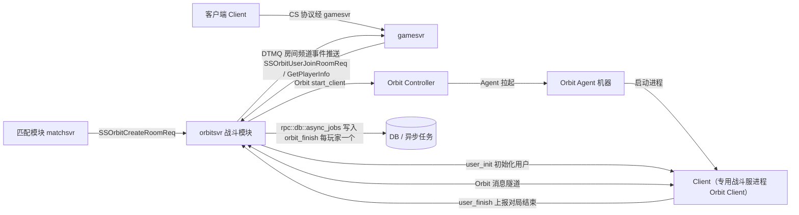
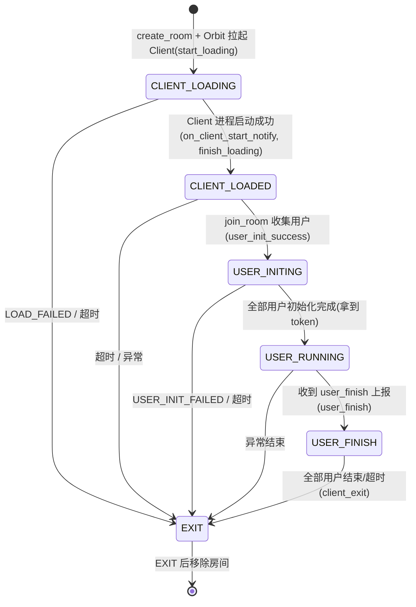
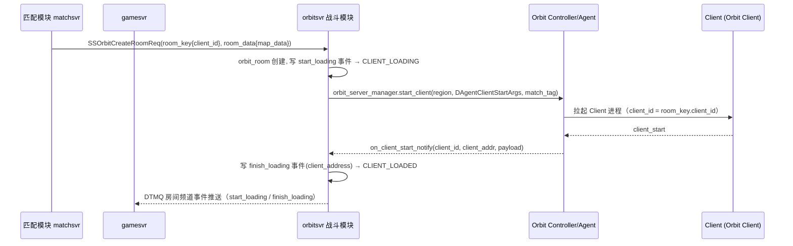
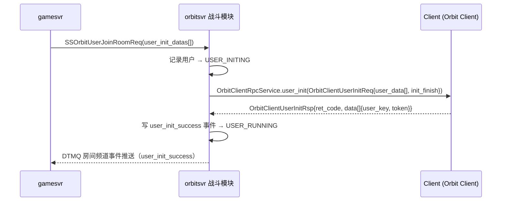
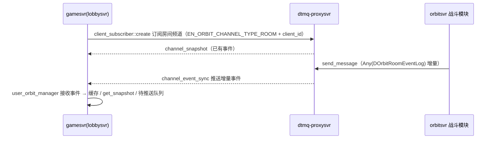
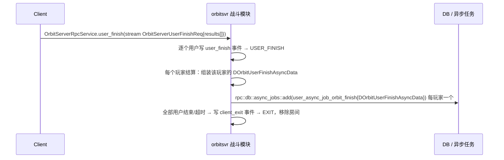

# 战斗模块裁剪设计方案（orbitsvr 内嵌战斗模块）

> 本文档基于 `battle_module_function_analysis.md`（原始功能全量梳理）按裁剪需求输出，
> 是「裁剪 + 迁移」到 `atsf4g-co` 框架的落地依据。
>
> - 原工程（代码来源）：`D:\Prx\tgf-server`
> - 目标框架（迁移目标）：`d:\Prx\atsf4g-co`
> - **承载方式**：不单独新建 `battlesvr` 服务，战斗模块内嵌到已有的 **`src/orbitsvr`**（orbitsvr 同时扮演「Orbit Server（Client 管理）」与「战斗房间宿主（room）」两个角色）。
> - **协议基线**：本文档协议部分以 `atsf4g-co` 内已按新思路落地的协议文件为准（不再逐条移植原工程旧协议）：
>   - `src/server_frame/protocol/public/protocol/pbdesc/com.struct.orbit.proto`（共享房间/用户/事件结构）
>   - `src/server_frame/protocol/public/protocol/pbdesc/com.orbit.protocol.proto`（Orbit RPC：`user_init` / `user_finish`）
>   - `src/orbitsvr/protocol/protocol/pbdesc/orbit_service.proto`（SS 服务 `OrbitsvrService`）
>   - `src/server_frame/protocol/private/protocol/pbdesc/svr.struct.proto`（结算异步任务 `orbit_finish`）
> - 目标：**只保留基础功能，跑通「建房 → Orbit 拉起 Client → 用户初始化进入 Client → 对局结束（结算数据写入异步任务）」全流程**。
> - 本文档以「裁剪后的目标功能」为准，不包含任何业务功能。
>
> **实现范围说明**
> - **matchsvr 不在本工程实现**：建房方 matchsvr（及匹配相关逻辑）在其他工程并行实现；本工程（orbitsvr）只实现被调用侧（`OrbitsvrService` 服务端 + 房间/Client/结算逻辑），协议中的 `create_room` 调用方假定为外部 matchsvr。
> - **构建/编译由使用者自行执行**：每个实现步骤的 configure/build/test 由使用者本人完成；若实现过程中需要触发构建验证，执行方应**停止当前任务**并交由使用者继续，不得擅自运行构建。
> - **命名约定**：全工程统一将「DS（专用战斗服）」概念改称 **Client**（不绑死战斗服实现）；相关回调/注释/文档一律使用 Client 命名（`on_client_start / on_client_end / on_user_finish` 等），不再出现 DS 字样。

---

## 完成进度记录（每步更新）

> 规则：本表为「当前已完成部分」的唯一权威记录；**每完成一个实现步骤，必须同步更新本表**（含日期与状态）。

| 步骤 | 内容 | 状态 | 备注 |
| --- | --- | --- | --- |
| 命名约定 | 「DS」概念统一改称「Client」；`com.orbit.protocol.proto` Client/Server 角色已修正 | ✅ 已完成 | 2026-08-04 |
| 步骤 1：协议落地 | `com.struct.orbit.proto` / `com.orbit.protocol.proto` / `orbit_service.proto` / `svr.struct.proto`（`orbit_finish`）；CMake 协议目标 + `OrbitsvrService` 生成 | ✅ 已完成 | 2026-08-04；生成文件：`handle_ss_rpc_orbitsvrservice` / `task_action_*` / `orbit_action/task_action_echo` 与 `task_action_user_finish` |
| 步骤 2：服务骨架 | `oribitsvr_main.cpp` 挂载 `OrbitsvrService` + `orbit_room_manager`；`orbit_room_manager.h/.cpp` 骨架（类名/协议/回调对齐新命名） | ✅ 已完成 | 2026-08-04；回调入口 `on_client_start / on_client_end / on_user_finish` |
| 步骤 3：WAL 搭框 | `orbit_room_wal_handle.h/.cpp`：`orbit_room_wal_publisher_type` + 工厂 + 业务接口（搭框，无具体逻辑） | ✅ 已完成 | 2026-08-04；仅接口，待 DTMQ 替换；未用参数已加 `ATFW_EXPLICIT_UNUSED_ATTR` |
| 步骤 4：Orbit Client 分配与用户初始化 | `orbit_room` 状态机（CLIENT_LOADING/LOADED/USER_INITING/RUNNING/EXIT）；`create_room` → `start_client`；`on_client_start` → `finish_loading`；`join_room` → `user_init` | ✅ 已完成 | 2026-08-04；`orbit_room.h/.cpp` 新建；`task_action_create_room` / `task_action_join_room` 已实现；`join_room` 暂按「首个 CLIENT_LOADED 房间」占位（协议缺 room_key）；阶段超时用常量占位 |
| 步骤 5：对局结束 → 每玩家结算异步任务 | `user_finish` → 每玩家 `DOrbitUserFinishAsyncData` → `orbit_finish` 落库 | ✅ 已完成 | 2026-08-04；`orbit_room::on_user_finish` + `task_action_user_finish` 已实现；orbitsvr 链接 `lobbysvr-sdk`（`rpc::async_jobs::add_jobs`）；`on_client_end` 支持指定 `exit_reason`；待构建验证 |
| 步骤 6：验证（跑通流程） | 构建/部署/冒烟/单测（构建由使用者执行） | 🔄 进行中 | 2026-08-05；已添加冒烟 CLI 命令（`orbit-create-room` / `orbit-join-room` / `orbit-user-finish` / `orbit-list-rooms` / `orbit-get-room`）；构建/部署/冒烟待使用者执行 |
| 配置 proto 化 | `orbitsvr_config.proto` + 加载流程 + namespace 常量改读配置 | ✅ 已完成 | 2026-08-07；`orbitsvr_cfg`（9 字段，含默认值）；`set_server_instance_config_loader`（`parse_configures_into("orbitsvr", "ATAPP_ORBITSVR")`，参照 authsvr）；`orbit_room.cpp` / `orbitsvr_main.cpp` 改 `get_server_instance_config<config::orbitsvr_cfg>()`；待 configure 生成 pb + 构建验证 |
| DTMQ 消费接入（gamesvr/lobbysvr 侧） | lobbysvr 新建 `user_orbit_manager`：玩家粒度 DTMQ 消费方（参考 `user_chat_manager`）——`subscribe_room/unsubscribe_room` 订阅房间频道（`EN_ORBIT_CHANNEL_TYPE_ROOM` + `room_key.client_id()`）、接收 `DOrbitRoomEventLog`、待推送队列 + `global_tick`；挂载 `player`（login_init）+ `lobbysvr_main` tick；**SS `orbit_room_event_sync` 协议已删除，事件同步完全由 DTMQ 接管**；玩家同时只能加入一个房间（切换时自动取消旧房间） | ✅ 已完成 | 2026-08-11；接入方式已对齐 user_chat_manager：orbitsvr 发送者 `send_message` 7 参（`nullptr, nullptr, true`），订阅者 create 后不立即激活回调、首次 `get_snapshot` 按需 `setup_subscriber_callback`；客户端推送留 TODO（待客户端 orbit 同步协议）；CMake `USE_COMPONENTS` 加 `orbit-common-protocol` |

---

## 0. 裁剪需求 → 处理方式对照表

| # | 裁剪需求 | 处理方式 |
| --- | --- | --- |
| 1 | gamesvr 不负责：匹配发起/取消、结算落库、战报生成、战报管理、防复制、门票 | 不迁移 gamesvr 侧战斗逻辑；结算只在 orbitsvr 侧「写入异步任务」（`user_async_job_orbit_finish`），消费方后续自主实现 |
| 2 | 不负责 TrueSkill 匹配参数回写、带出装备与防复制、战斗回放数据与恢复 | 全部移除，协议中不出现相关字段/消息 |
| 3 | 匹配部分代码不处理 | **matchsvr 在其他工程并行实现，本工程不实现**；本工程仅实现被调用侧（`OrbitsvrService`），建房方假定为外部 matchsvr 调 `SSOrbitCreateRoomReq`，入参不携带匹配数据（仅 `room_key` + `room_init_data`） |
| 4 | 结算逻辑内部实现后续自主实现；现在只要求写入 Client 带出数据到异步任务 | 对局结束 → **每个玩家各组装一个 `DOrbitUserFinishAsyncData`**（该玩家结束数据 + init 上下文）→ `user_async_job_orbit_finish` 落库（`rpc::db::async_jobs`） |
| 5 | 无门票、禁战/前置校验、匹配参数计算、战报、带入/带出与防复制 | 全部移除 |
| 6 | 需要 WAL 模块 | 本版接入 `util::distributed_system::wal_publisher` 搭框（事件类型 `DOrbitRoomEventLog`），只留业务调用接口，不做具体逻辑；后续由 DTMQ 替换（接入流程后续提供） |
| 7 | Client 启动流程接入 Orbit 系统 | 复用 orbitsvr 已有 `orbit_server_manager`；Client 初始化走 `OrbitClientRpcService.user_init`（orbitsvr→Client），Client 上报走 `OrbitServerRpcService.user_finish`（Client→orbitsvr） |
| 8 | 房间管理器只需要必要的阶段状态机 | 状态机按 `EnOrbitRoomStatus` 精简为 6 个状态（见第 3 章） |
| 9 | 战斗房间不落地，所有支撑数据都在内存中 | 无 DB 落盘，房间与 WAL 数据全部内存持有 |
| 10 | 只要基础功能，能跑通流程即可 | 验收目标：建房 → 拉 Client → 用户初始化 → 对局结束 → 异步任务 |
| 11 | 没有 ACE | 无 ACE 相关模块/协议 |
| 12 | 玩家操作 Ban/Pick 没有 | SS 服务无 `notify_ready_action`；状态机无 ban/pick 阶段 |
| 13 | 无踢人/连通性/心跳/会话结束等冗余协议 | 新协议按需从零设计：SS 仅 6 个 RPC；Orbit RPC 仅 `echo / user_init / user_finish` |

---

## 1. 裁剪后的功能范围

### 1.1 保留（本次实现）

**orbitsvr / service / logic / room（战斗房间，内嵌于 orbitsvr）**

| 模块 | 保留内容 |
| --- | --- |
| `orbit_room_manager`（原 `battle_room_manager`） | 房间生命周期、精简阶段状态机（`CLIENT_LOADING / CLIENT_LOADED / USER_INITING / USER_RUNNING / USER_FINISH / EXIT`）、`Orbit` 拉起 Client 回调入口（`on_client_start / on_client_end`）、`on_user_finish` |
| `orbit_room` | 单房间：状态推进、**DTMQ 事件通道已整合进本类**（`add_event_log` → `send_message`，频道 `channel_type=1001 / channel_id=client_id`）、Client 交互（`user_init`）、用户结束组装异步任务 |

**orbitsvr / service / logic / action（SS 入站，gamesvr → orbitsvr，由 generate-for-pb 生成）**

| task_action | 对应 RPC | 说明 |
| --- | --- | --- |
| `task_action_create_room` | `create_room` | 建房（**matchsvr 调用**）+ Orbit 拉起 Client |
| `task_action_join_room` | `join_room` | 用户初始化（入房） |
| `task_action_get_player_info` | `get_player_info` | 拉取房间/用户信息 |

**orbitsvr / service / logic / orbit_action（Orbit RPC 入站，Client → orbitsvr，由 generate-for-pb 生成）**

| task_action | 对应 RPC | 说明 |
| --- | --- | --- |
| `task_action_echo` | `OrbitServerRpcService.echo` | 连通性测试（保留） |
| `task_action_user_finish` | `OrbitServerRpcService.user_finish` | **Client 对局结束上报（核心）**：接收 `DOrbitUserFinishResult[]` |

**orbitsvr / service / app**

| 文件 | 说明 |
| --- | --- |
| `oribitsvr_main.cpp` | 已挂载：`handle::orbit_server_rpc::register_handles_for_orbitserverrpcservice`、`handle::orbit::register_handles_for_orbitsvrservice`、`INIT_CALL(orbit_room_manager)`；`orbit_server_manager` 回调转发到 `orbit_room_manager::on_client_start/end` |
| `orbit-server`（CMake 目标） | `project_service_declare_protocol("orbitsvr-protocol")` + `generate_for_pb_add_ss_service("${PROJECT_NAMESPACE}.OrbitsvrService")`，`USE_SERVICE_PROTOCOL`/`GENERATED_FLOW_NAMES` 已含 `OrbitsvrService` |

### 1.2 移除（不迁移）

- **gamesvr 侧全部战斗逻辑**（原 `src/gamesvr/logic/battle/*`）：匹配发起/取消/心跳、结算落库、战报生成/管理、带入恢复、防复制、门票、禁战/前置校验、匹配参数计算。
- **原 battlesvr 业务逻辑**：TrueSkill、防复制（`battle_room_copy_defense_imp`）、recover、`loot_item_limit_manger`、`ace_sdk_mgr`、`version_controller`、`ds_region_group / ds_region_unit`、mssdk。
- **匹配交互**：waiting room 通知、中途加人、等待室强退。
- **原工程冗余协议（新协议已不含）**：`notify_ready_action`、`add_player_to_room_on_halfway`、`player_kickoff`、`exit_room`（SS 侧）、`DSHelloWorld / DSHeartbeat / DSPlayerKickOut / GameSessionEndEvent / DSC 状态上报 / 在线上报 / 小背包结算`、独立 `DSBattleInitParameter`。
- **OSS/telemetry 埋点**：基础流程不需要，后续按 atsf4g-co telemetry 接入。

---

## 2. 总体架构



- **建房方 = matchsvr**：匹配完成由 **matchsvr 直接调 `SSOrbitCreateRoomReq`** 建房（不走 gamesvr）。
- **gamesvr（lobbysvr）**：匹配后负责 **`join_room`（用户初始化入房）**、`get_player_info`，并以 DTMQ 订阅者（`user_orbit_manager`）订阅房间频道接收事件广播（原 SS `subscribe / unsubscribe / heartbeat` 与 `orbit_room_event_sync` 已移除，2026-08-11）。
- **orbitsvr（战斗模块）**：房间生命周期 + 精简状态机、WAL 发布（搭框）、Orbit 拉起 Client、Client 用户初始化（`user_init`）、对局结束（`user_finish`）→ **每个玩家各组装一个 `DOrbitUserFinishAsyncData`** 写入异步任务；同时保留原有「Orbit Server」职责。
- **Client**：作为 Orbit Client 运行，通过 Orbit 消息隧道与 orbitsvr 通信。

---

## 3. 精简状态机（orbit_room + orbit_room_manager）

### 3.1 状态定义（`EnOrbitRoomStatus`，见 `com.struct.orbit.proto`）

```
INVALID(0) -> CLIENT_LOADING(1) -> CLIENT_LOADED(2) -> USER_INITING(3)
           -> USER_RUNNING(4) -> USER_FINISH(5) -> EXIT(6)
```

### 3.2 状态机转移



> 退出原因见 `EnOrbitRoomExitReason`：`LOAD_FAILED / USER_INIT_FAILED / TIMEOUT / USER_FINISH`。

### 3.3 WAL 事件（`DOrbitRoomEventLog`，见 `com.struct.orbit.proto`）

| 事件（oneof） | 触发点 | 事件体 | 对应状态 |
| --- | --- | --- | --- |
| `start_loading` | create_room + 发起拉起 Client | `DOrbitClientStartLoading{}` | CLIENT_LOADING |
| `finish_loading` | `on_client_start_notify`（Client 启动成功） | `DOrbitClientFinishLoading{client_address}` | CLIENT_LOADED |
| `user_init_success` | `user_init` 返回 token | `DOrbitUserInit{init_result}` | USER_INITING |
| `user_finish` | Client 上报单个用户结束 | `DOrbitUserFinish{user_key}` | USER_FINISH |
| `client_exit` | 房间退出（全部结束/失败/超时） | `DOrbitClientExit{exit_info}` | EXIT |

- 房间快照：`DOrbitRoomRunningData`（`last_event_id / room_status / status_end_timepoint / room_key / map_data / user_init[] / user_finish[] / exit_info` 等），供订阅者同步。
- 订阅/对账：`subscribe`（携带 `acknowledge_event_id`）→ 下发快照 + 增量事件；`heartbeat`（携带 `acknowledge_event_id`）→ WAL 对账推进。
- 广播通道：orbitsvr → gamesvr **完全由 DTMQ 接管**（2026-08-11 已删除 SS `orbit_room_event_sync`）——orbitsvr 生产方 `add_event_log → send_message` 推送房间频道（`channel_type=EN_ORBIT_CHANNEL_TYPE_ROOM, channel_id=room_key.client_id()`），gamesvr（lobbysvr `user_orbit_manager`）DTMQ 订阅接收增量事件与快照（见 4.1）。

---

## 4. 需要的协议

> 以 `atsf4g-co` 已落地的协议文件为准，以下为裁剪后实际使用的协议清单。

### 4.1 SS 协议（建房：matchsvr → orbitsvr；入房/查信息：gamesvr → orbitsvr，`src/orbitsvr/protocol/protocol/pbdesc/orbit_service.proto`）

`service OrbitsvrService`（module `orbit`），共 **3 个 RPC**（2026-08-07 已移除 `subscribe / unsubscribe / heartbeat`，订阅/对账下沉 gamesvr 侧 DTMQ）。**`create_room` 由 matchsvr 调用建房，其余由 gamesvr 调用**：

| RPC | 调用方 | 请求/响应 | 说明 |
| --- | --- | --- | --- |
| `create_room` | matchsvr | `SSOrbitCreateRoomReq / Rsp` | 建房：`DOrbitRoomKey{client_id}` + `DOrbitRoomInitData{client_template_id, region}` + `user_list[]` |
| `join_room` | gamesvr | `SSOrbitUserJoinRoomReq / Rsp` | 用户入房：`room_key` + `user_init_data` |
| `get_player_info` | gamesvr | `SSOrbitGetPlayerInfoReq / Rsp` | 拉取房间/用户信息 |

**房间事件推送（orbitsvr → gamesvr）**：**完全由 DTMQ 接管**（2026-08-11 已删除 `src/lobbysvr/protocol/protocol/pbdesc/lobby_service.proto` 中的 `SSOrbitRoomEventSync` 消息与 `LobbysvrService.orbit_room_event_sync` RPC，`task_action_orbit_room_event_sync` 已删除）：

- orbitsvr 作为生产方经 `client_api::send_message` 向房间频道（`channel_type=EN_ORBIT_CHANNEL_TYPE_ROOM, channel_id=room_key.client_id()`）推送 `DOrbitRoomEventLog`（`Any` 承载）；
- gamesvr（lobbysvr `user_orbit_manager`）作为 DTMQ 订阅者接收事件并缓存/转发；
- 玩家**同时只能加入一个房间**：`user_orbit_manager::subscribe_room` 切换房间时自动取消旧房间订阅并清理其待推送数据。

### 4.2 Orbit RPC（orbitsvr ↔ Client，`src/server_frame/protocol/public/protocol/pbdesc/com.orbit.protocol.proto`）

> 角色说明（已修正）：`OrbitClientRpcService` 是 **Client 侧实现的 RPC**（orbitsvr 主动调用 Client）；`OrbitServerRpcService` 是 **orbitsvr 侧实现的 RPC**（Client 主动上报 orbitsvr）。

| 方向 | RPC | 请求/响应 | 说明 |
| --- | --- | --- | --- |
| orbitsvr → Client | `OrbitClientRpcService.user_init` | `OrbitClientUserInitReq{user_data[], init_finish}` / `OrbitClientUserInitRsp{ret_code, data[token]}` | **用户初始化（核心）**：orbitsvr 调 Client 初始化玩家并返回 `token` |
| orbitsvr → Client | `OrbitClientRpcService.echo` | `OrbitClientEchoReq/Rsp` | 连通性测试 |
| Client → orbitsvr | `OrbitServerRpcService.user_finish`（stream） | `OrbitServerUserFinishReq{results[]}` → `Empty` | **对局结束上报（核心）**：Client 上报每个用户的结束结果 |
| Client → orbitsvr | `OrbitServerRpcService.echo` | `OrbitServerEchoReq/Rsp` | 连通性测试 |

- 用户数据结构（2026-08-05 协议调整）：新增 `DOrbitUserKey{DUserIDKey user_key}` 统一包装玩家 key；`DOrbitUserInitData{user_key(DOrbitUserKey), data}`、`DOrbitUserInitResult{user_key(DOrbitUserKey), token}`、`DOrbitUserFinishResult{user_key(DOrbitUserKey), index, status(EnOrbitUserStatusType), data}`、`DOrbitUserFinishResultDetail{}`（`data` 业务字段当前为空占位，后续按需填充）。
- Client 拉起：`orbit_server_manager::me()->start_client(ctx, region, DAgentClientStartArgs, match_tag)`，`client_id` 即 `DOrbitRoomKey.client_id`；Client 启动成功经 `on_client_start_notify(client_id, client_addr, payload)` 通知。

### 4.3 结算异步任务（orbitsvr 战斗模块 → DB，`src/server_frame/protocol/private/protocol/pbdesc/svr.struct.proto`）

- `user_async_job_orbit_finish { DOrbitUserFinishAsyncData data = 1; }`
- `user_async_jobs_blob_data.action` oneof 新增 `orbit_finish = 301`。
- **按玩家结算**：每个玩家结束（结算）时，各组装一个 `DOrbitUserFinishAsyncData`（该玩家的结束数据 + 房间初始 init 数据上下文），**每个玩家独立发一个 `user_async_job_orbit_finish` 异步任务**：

  ```
  message DOrbitUserFinishAsyncData {
    DOrbitRoomKey room_key = 1;        // 房间 key（client_id）
    int64 start_timepoint = 2;         // 开始时间
    int64 finish_timepoint = 3;        // 结束时间
    DOrbitRoomExitInfo exit_info = 4;  // 退出原因
    repeated DOrbitUserInitData user_init_datas = 11;          // 初始 init 数据（参与玩家/房间上下文）
    repeated DOrbitUserFinishResult user_finish_results = 12;  // 该玩家（含已结算玩家）的结束结果（Client 带出数据）
  }
  ```

- 写入方式：每玩家一次 `rpc::db::async_jobs::add(ctx, table_user_async_jobs{job_type, user_id, zone_id, job_data})`（具体 job_type 按 `table_user_async_jobs` 现有机制定义）。
- 不做任何角色/物品/活动结算（需求 #4，消费方后续自主实现）。

### 4.4 共享数据结构（`com.struct.orbit.proto`）

| 结构 | 用途 | 说明 |
| --- | --- | --- |
| `DOrbitRoomKey{client_id}` | 房间 key | **client_id 即房间标识**（等价原 battle_id） |
| `DOrbitUserKey{DUserIDKey user_key}` | 玩家 key 包装 | 2026-08-05 新增；`DOrbitUserInitData / InitResult / FinishResult` 的 `user_key` 均为此包装类型（WAL 事件体 `DOrbitUserFinish`、SS 协议仍直接用 `DUserIDKey`） |
| `DOrbitMapData{map_id, region}` / `DOrbitRoomInitData{map_data}` | 建房入参 | 基础地图信息 |
| `DOrbitUserInitData / DOrbitUserInitResult` | 用户初始化入参/结果 | `token` 供客户端连接 Client |
| `DOrbitUserFinishResult / DOrbitUserFinishResultDetail` | 用户结束结果 | `user_key` 为 `DOrbitUserKey`；含 `index` 与 `status`（`EnOrbitUserStatusType`）；`data` 为 Client 带出数据占位 |
| `DOrbitRoomRunningData` | 房间快照 | 含 `last_event_id / room_status / user_init[] / user_finish[]` |
| `DOrbitRoomEventLog` | WAL 事件 | 5 种事件体（见 3.3） |
| `DOrbitRoomExitInfo / EnOrbitRoomExitReason` | 退出原因 | `LOAD_FAILED / USER_INIT_FAILED / TIMEOUT / USER_FINISH` |
| `DOrbitUserFinishAsyncData` | 结算异步任务数据 | 每玩家一个（该玩家结束数据 + init 上下文），见 4.3 |
| `DUserIDKey` | 玩家 key | 复用 `com.struct.proto` |

---

## 5. 时序图

### 5.1 建房（matchsvr）+ Orbit 拉起 Client



### 5.2 用户入房（gamesvr）+ 用户初始化（进入 Client）



### 5.3 订阅 / 对账（DTMQ）

> 2026-08-11：SS `subscribe / unsubscribe / heartbeat` 与 `orbit_room_event_sync` 已移除，订阅/对账完全下沉 gamesvr（lobbysvr `user_orbit_manager`）侧 DTMQ。



### 5.4 对局结束 → 每玩家结算异步任务



---

## 6. 实现步骤

> 遵循 `atsf4g-co` 工程约定（`AGENTS.md` / `.agents/skills/`），构建产物放 `<BUILD_DIR>`。建议先读 `engineering-guidelines`、`build`、`testing` 三个 skill。
> **构建说明**：各步骤的 configure/build/test 由使用者自行执行；若实现过程中需要构建验证，执行方停止当前任务并交由使用者继续。
> **matchsvr**：建房方 matchsvr 在其他工程并行实现，本工程不实现匹配/建房调用侧。

### 步骤 1：协议落地 ✅（已完成）

- `com.struct.orbit.proto`：共享房间/用户/事件结构（含 `DOrbitRoomEventLog`、`DOrbitRoomRunningData`、`DOrbitUserFinishAsyncData`）。
- `com.orbit.protocol.proto`：`OrbitServerRpcService`（`echo / user_finish`，Client→orbitsvr）、`OrbitClientRpcService`（`echo / user_init`，orbitsvr→Client）。
- `orbit_service.proto`：`OrbitsvrService`（6 个 SS RPC）。
- `svr.struct.proto`：`user_async_job_orbit_finish` + `orbit_finish = 301`。
- ~~`lobby_service.proto`：`SSOrbitRoomEventSync` + `LobbysvrService.orbit_room_event_sync`~~（2026-08-11 已删除，事件推送完全由 DTMQ 接管）。
- CMake：`orbitsvr-protocol` 协议目标 + `OrbitsvrService` SS 服务已接入；`handle_ss_rpc_orbitsvrservice` / `task_action_*` / `orbit_action/task_action_echo|user_finish` 已生成。

### 步骤 2：服务骨架 ✅（已完成）

- `oribitsvr_main.cpp`：已注册 `OrbitsvrService`、`orbit_room_manager`，`orbit_server_manager` 回调转发到 `orbit_room_manager::on_client_start/end`。
- `orbit_room_manager`：房间生命周期/状态机骨架（`src/orbitsvr/service/logic/room/`），待按新协议补齐（下一轮）。

### 步骤 3：WAL 搭框 ✅（已完成，`orbit_room_wal_handle`，本版只搭接口骨架）

> 说明：WAL 后续会被 DTMQ 模块替换（接入流程后续提供）。本版**只搭框**：
> 定义发布者类型与业务调用接口，**不做具体收发/持久化逻辑**，业务侧统一通过该接口调用，等待 DTMQ 以相同接口替换实现。

1. 新建 `src/orbitsvr/service/logic/room/orbit_room_wal_handle.h/.cpp`：
   - 定义 `orbit_room_wal_publisher_type`：基于 `util::distributed_system::wal_publisher`，事件类型 `DOrbitRoomEventLog`、订阅者 key `DUserIDKey`（参照原 `battle_room_wal_handle` 的模板参数写法）。
   - 提供工厂 `create_orbit_room_publisher(...)`。
2. 业务调用接口（**仅声明，逻辑留空/占位**，供房间逻辑调用）：
   - `alloc_event_id()` / `get_last_allocated_event_id()`：事件 id 分配。
   - `add_event_log(ctx, DOrbitRoomEventLog&&)`：写入一条事件。
   - `broadcast_events(ctx)`：向订阅者广播增量（本版不实现发送，只留接口）。
   - `dump(DOrbitRoomSnapshotData&)`：生成快照。
   - `subscribe / unsubscribe`：订阅者管理（对接 SS `subscribe / unsubscribe`）。
   - 对账：`acknowledge_event_id` 推进接口。
3. 接入点占位：
   - `orbit_room_manager` 中创建/持有 publisher 的接口声明。
   - `task_action_subscribe / unsubscribe / heartbeat` 调用上述接口（逻辑留空）。
4. **后续 DTMQ 替换**：以相同接口名/语义替换 `orbit_room_wal_handle` 内部实现（事件存储/广播改走 DTMQ），业务代码（房间/订阅/心跳）无需改动。

### 步骤 4：Orbit Client 分配与用户初始化 ✅（已完成）

1. `orbit_room`：新建 `src/orbitsvr/service/logic/room/orbit_room.h/.cpp`，实现精简状态机（`CLIENT_LOADING -> CLIENT_LOADED -> USER_INITING -> USER_RUNNING -> EXIT`）与 WAL 事件写入（`start_loading / finish_loading / user_init_success / client_exit`），`user_init` 通过 `rpc::orbit_client_rpc::user_init` 异步调用 Client。
2. `orbit_room_manager` 补全：`create_room`（matchsvr 调用）→ 创建 `orbit_room` + `orbit_server_manager::start_client`（`client_id = room_key.client_id`），维护房间索引与超时（`tick` 超时 → EXIT）。
3. `on_client_start` → 找到房间 → `finish_loading` 事件（记录 `client_address`）→ `CLIENT_LOADED`。
4. `task_action_join_room`（gamesvr 调用）→ `join_room` → 收集 `DOrbitUserInitData[]` → `USER_INITING` → 调 Client `user_init`（`OrbitClientRpcService`）→ 回填 `token` → `user_init_success` → `USER_RUNNING`。
   - 注意：当前 `SSOrbitUserJoinRoomReq` 未携带 `room_key`，`join_room` 暂按「首个 CLIENT_LOADED 房间」定位占位；后续协议补充 `room_key` 后改为按房间定位。
5. `on_client_end` → 找到房间 → `client_exit` 事件 → `EXIT`（`tick` 中移除）。
6. 阶段超时（CLIENT_LOADING / USER_INIT）先用常量占位（`orbit_room.cpp`），后续接入配置。

### 步骤 5：对局结束 → 每玩家结算异步任务 ✅（已完成）

1. `task_action_user_finish`（`OrbitServerRpcService.user_finish`，stream，Client 上报）入站：`get_request_client_id()` 定位 client_id → `orbit_room_manager::on_user_finish(client_id, results)`。
2. `orbit_room::on_user_finish`：仅 `USER_RUNNING` 可接受；逐个用户写 `user_finish` 事件（104）→ `USER_FINISH`。
3. **每个玩家结算**：组装房间完整上下文的 `DOrbitUserFinishAsyncData`（`room_key` / `start_timepoint`=创建时间 / `finish_timepoint` / `exit_info`(USER_FINISH) / 全量 `user_init_datas` / 全量 `user_finish_results`）→ 每个玩家各起一个 `rpc::async_invoke` → `rpc::async_jobs::add_jobs(EN_PAJT_NORMAL, user_id, zone_id, user_async_jobs_blob_data{orbit_finish})`，每玩家一个异步任务（消费方后续自主实现结算）。
4. 全部用户结束 → `on_client_end(ctx, EN_ORBIT_ROOM_EXIT_REASON_USER_FINISH)` → 写 `client_exit` 事件 → `EXIT` → 内存清理由 manager `tick` 完成（需求 #9 纯内存）。
5. `on_client_end` 增加 `exit_reason` 参数（默认 `UNKNOWN`），各退出路径已精确：`start_client` 失败→`LOAD_FAILED`、`user_init` 失败→`USER_INIT_FAILED`、阶段超时→`TIMEOUT`、正常结束→`USER_FINISH`（2026-08-05 补充）。
6. `dump` 快照补充 `running_data.user_finish`（已结束用户 `DUserIDKey` 列表）。
7. 依赖：orbitsvr 服务新增 `USE_SERVICE_SDK "lobbysvr-sdk"`（提供 `rpc::async_jobs`；参考 `rank_settlement_svr`）。

### 步骤 6：验证（跑通流程） 🔄（进行中）

1. **构建**（使用者执行）：按 `build` skill 重新 configure（步骤 5 改过 `service/CMakeLists.txt` 新增 `lobbysvr-sdk`）+ 构建 orbitsvr 及依赖（atproxy、lobbysvr、orbit controller/agent、orbit-auto-client）。
2. **部署**（使用者执行）：启动 etcd、orbit controller + agent（agent 机器预置 Client 可执行文件），注册 orbitsvr 到 atproxy；`build/publish` 下 `orbit-server/`、`orbit-controller/`、`orbit-agent/` 与 `start_all.conf` 已就绪，chart 位于 `install/cloud-native/charts/{orbit-server,orbit-controller,orbit-agent}`。
3. **冒烟**（使用者执行，已提供 CLI 辅助命令）：
   - 进入 orbit-server 控制台依次执行：
     1. `orbit-create-room <client-id> [map-id] [region]` —— 模拟 matchsvr `create_room`（建房 + `start_client` 拉起 Client）。
     2. `orbit-list-rooms` / `orbit-get-room <client-id>` —— 观察 `CLIENT_LOADING` → `CLIENT_LOADED`（`on_client_start` 回调）。
     3. `orbit-join-room <user-id> <zone-id>` —— 模拟 gamesvr `join_room`（调 Client `user_init` → `USER_RUNNING`）。
     4. `orbit-user-finish <client-id> <user-id> <zone-id>` —— 模拟 Client 上报 `user_finish`（→ `USER_FINISH` → 每玩家 `orbit_finish` 异步任务 → EXIT）。
   - 预期：日志可见 `start_loading / finish_loading / user_init_success / user_finish / client_exit` 事件写入；`user_async_job_orbit_finish` 经 `rpc::async_jobs::add_jobs` 落库（可在 lobbysvr/DB 侧对账）；`orbit-list-rooms` 计数归零（EXIT 房间被 `tick` 移除）。
   - 完整链路（含 atproxy SS 路由）后续可再用 robot / matchsvr / gamesvr 真实调用覆盖。
4. **单测**（`testing` skill，可选）：WAL 发布/订阅接口骨架、状态机转移合法性、每玩家 `DOrbitUserFinishAsyncData` 组装。

---

## 6.5 TODO 分工清单（2026-08-05 核对）

> 代码内以 `TODO-USER` 标注的均为**用户待办**；其余 TODO 已在本次核对中由实现方补全。

### ✅ 已补全（实现方完成，本次）

| 位置 | 原 TODO | 处理 |
| --- | --- | --- |
| `task_action_subscribe.cpp` | TODO stub | 已实现：→ `manager.subscribe_room` → `event_handle->subscribe` |
| `task_action_unsubscribe.cpp` | TODO stub | 已实现：→ `manager.unsubscribe_room` → `event_handle->unsubscribe`（保留 stream 无响应分支） |
| `task_action_heartbeat.cpp` | TODO stub | 已实现：→ `manager.heartbeat` → `event_handle->update_acknowledge` |
| `task_action_get_player_info.cpp` | TODO stub | 已实现：→ `manager.get_player_info` → `orbit_room::get_user_init_data` |
| `orbit_room_manager` | （缺方法） | 新增 `subscribe_room / unsubscribe_room / heartbeat / get_player_info`（按 `room_key.client_id()` 定位） |
| `orbit_room` | （缺查询） | 新增 `get_user_init_data(user_key)` 查询已入房玩家数据 |

### 📋 用户待办（TODO-USER，代码与文档同步标注）

1. **WAL→DTMQ 替换（需求 #6）** — ✅ orbitsvr（生产方）已实施（2026-08-07）：
   事件通道已**整合进 `orbit_room`**（独立的 `orbit_room_event_handle` / `orbit_room_wal_handle` 类已删除）：`orbit_room::add_event_log` → `client_api::send_message`（`Any` 承载 `DOrbitRoomEventLog`，房间频道 `channel_type=1001 / channel_id=client_id`）；无用的 `broadcast_events / dump / subscribe / unsubscribe / update_acknowledge` 接口已删除（订阅下沉 gamesvr，`manager` 的 SS subscribe/unsubscribe/heartbeat 改为内联 noop）；orbitsvr 接入 `dtmq-proxy-sdk` + `DtmqProxysvrNotifyService` 入站 + `global_tick`。
   **待办（用户/gamesvr 侧）**：gamesvr 作为 DTMQ 消费方接入（`client_subscriber::create` 订阅房间频道 + `channel_event_sync` 入站），详见 `wal_to_dtmq_migration.md`。
   ✅ **已接入（2026-08-11，lobbysvr）**：新建 `src/lobbysvr/service/logic/orbit/user_orbit_manager`（参考 `user_chat_manager`）——`subscribe_room/unsubscribe_room` 订阅房间频道（`EN_ORBIT_CHANNEL_TYPE_ROOM` + `room_key.client_id()`）、接收 `DOrbitRoomEventLog`、待推送队列 + `global_tick`；挂载 `player`（`login_init`）+ `lobbysvr_main` tick。**SS `orbit_room_event_sync` 协议已删除（2026-08-11）**：`SSOrbitRoomEventSync` 消息、`LobbysvrService.orbit_room_event_sync` RPC、`task_action_orbit_room_event_sync` 已移除，事件同步完全由 DTMQ 接管。**玩家同时只能加入一个房间**：`subscribe_room` 切换房间时自动取消旧房间订阅并清理其待推送数据。**遗留（用户侧）**：客户端 orbit 同步协议（推玩家 session 的 `send_xxx` 生成函数）就绪后在 `global_tick` 下发；玩家加入/离开房间业务处调用 `subscribe_room/unsubscribe_room`。
2. **`join_room` 按房间定位** — ✅ 已完成（2026-08-07）：`SSOrbitUserJoinRoomReq` 已补充 `room_key`，`orbit_room_manager::join_room` 已按 `room_key.client_id()` 定位（不再是「首个 CLIENT_LOADED 房间」占位）。
3. **阶段超时 / Client 资源常量接入配置** — ✅ 已完成（2026-08-07）：新建 `src/orbitsvr/protocol/protocol/config/orbitsvr_config.proto`（`orbitsvr_cfg`，9 字段含 `CONFIGURE` 默认值）；orbitsvr_main 已接入 `set_server_instance_config_loader`（`parse_configures_into("orbitsvr", "ATAPP_ORBITSVR")`，参照 authsvr）；`orbit_room.cpp`（`get_orbitsvr_cfg()` 辅助）与 `orbitsvr_main.cpp` 已改为从 `get_server_instance_config<config::orbitsvr_cfg>()` 读取；待重新 configure + 构建验证。
4. **`orbit_finish` 异步任务消费方（结算，需求 #4）** — 读 `user_async_jobs_blob_data{orbit_finish}` 做实际结算（发放奖励/写战报等）；
   本裁剪版只产出每玩家 `DOrbitUserFinishAsyncData`，不实现结算业务。

### ℹ️ 非 TODO（保留的预留说明）

- `orbit_room_manager::init / reload / stop` 内的「后续…」注释为预留说明，当前无具体待办，暂不动。

---

## 7. 验收标准（DoD）

1. 能跑通：**matchsvr `create_room`** → Orbit 拉起 Client(CLIENT_LOADING/CLIENT_LOADED) → **gamesvr `join_room` + user_init**(USER_INITING/USER_RUNNING) → user_finish(USER_FINISH) → **每个玩家各落一个 `orbit_finish` 异步任务** → EXIT 移除房间。
2. WAL 事件（`start_loading / finish_loading / user_init_success / user_finish / client_exit`）通过 `orbit_room_wal_handle` 接口按 `acknowledge_event_id` 对账（本版搭框，仅接口就绪），经 `LobbysvrService.orbit_room_event_sync` 推送。
3. 无任何 DB 战斗房间落盘、无 recover、无 copy defense、无 TrueSkill、无 ACE、无 Ban/Pick、无门票/战报/匹配参数计算。
4. 房间数据全部内存持有，停机时房间数为 0 后可优雅退出。
5. 编译/单测/冒烟通过（无 cpplint / clang-tidy 新增告警，遵守 `engineering-guidelines`）。
6. `orbit_room_wal_handle` 仅搭框：接口清晰、无具体收发逻辑，可被 DTMQ 以相同接口平滑替换。
