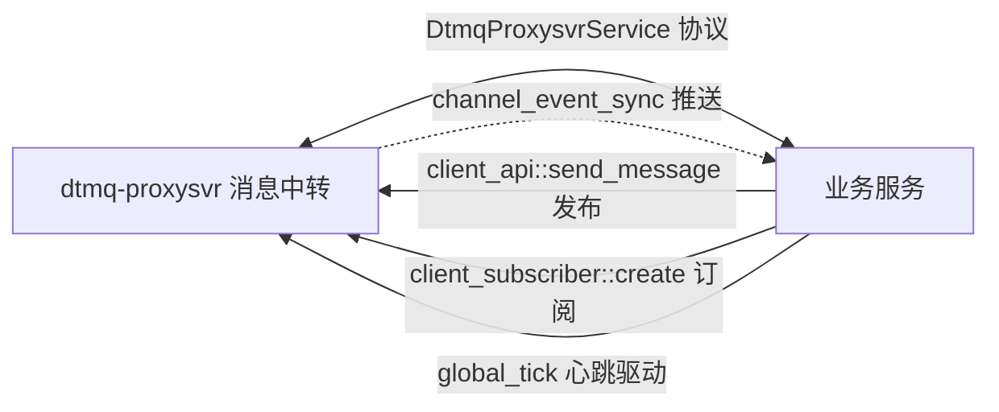

# WAL → DTMQ 迁移实施文档（orbit_server 战斗房间事件通道）

> 目的：把 `orbit_room_wal_handle` 当前基于 `atframe_utils::util::distributed_system::wal_publisher` 的
> **搭框实现**替换为 **DTMQ（分布式消息队列，`src/component/dtmq`）** 真实事件通道。
>
> - 关联文档：`battle_module_trimmed_design.md`（裁剪设计，步骤 3/6.5 中 WAL 搭框与 `TODO-USER` ①）
> - 参考接入：`src/lobbysvr`（工程内唯一已接入 DTMQ 客户端 SDK 的服务）
> - 代码基线：2026-08-07，`sample_solution` 分支

---

## 0. 结论先行（重要澄清）

1. **`src/cachesvr` 未接入 DTMQ**：经全量搜索（`*.cpp/h/proto/CMakeLists.txt`）确认 cachesvr 无任何
   `dtmq` / `mq_` / `wal_*` 引用；其 `watch / unwatch / set_expired` 是**缓存订阅推送模式**（`cache_group_manager` +
   `SSCacheWatchSync`），可作"订阅者生命周期管理"的设计参考，但不是 DTMQ 接入。
2. **工程内 DTMQ 客户端参考接入在 `src/lobbysvr`**：`dtmq-proxy-sdk` 组件 + `DtmqProxysvrNotifyService` 入站 +
   `rpc::dtmq::client_subscriber`（见第 1 章）。WAL→DTMQ 迁移以 lobbysvr 为样板。
3. **订阅模型会发生架构变化**：当前 WAL 是「gamesvr 经 SS 向 orbitsvr 订阅房间」，DTMQ 下应改为
   「gamesvr 直接以 DTMQ 订阅者订阅房间频道」；orbitsvr 只做**事件生产方**（send_message）。
   因此 `orbit_room_wal_handle` 的 `subscribe / unsubscribe / update_acknowledge` 会**降级为 noop（兼容）**
   或随协议移除（见第 3 章映射）。

---

## 1. DTMQ 参考接入点分析（lobbysvr，样板）

### 1.1 链路总览



### 1.2 接入点清单（lobbysvr）

| 接入点 | 文件/位置 | 作用 |
| --- | --- | --- |
| ① 组件依赖 | `src/lobbysvr/service/CMakeLists.txt`：`USE_COMPONENTS "dtmq-proxy-sdk"` | 链接 DTMQ 客户端 SDK（`rpc/dtmq/*`） |
| ② 入站协议生成 | 同文件：`generate_for_pb_add_ss_service("atframework.dtmq.DtmqProxysvrNotifyService" ...)` + `EXTERNAL_COMPONENT_PROTOCOLS "dtmq-protocol-proxy-pbdesc"`，`GENERATED_FLOW_NAME "...DtmqProxysvrNotifyService.lobbysvr"` | 生成 `handle_ss_rpc_dtmqproxysvrnotifyservice` + `task_action_channel_event_sync` |
| ③ 入站注册 | `src/lobbysvr/service/app/lobbysvr_main.cpp` init：`INIT_CALL_FN(handle::dtmq::register_handles_for_dtmqproxysvrnotifyservice)` | 注册 dtmq-proxysvr 推送处理 |
| ④ tick 驱动 | 同文件 tick：`rpc::dtmq::client_subscriber::global_tick(logic_server_get_current_tick_context())` | 驱动订阅者心跳/重连/待发数据 |
| ⑤ 订阅（消费方） | `src/lobbysvr/service/logic/chat/user_chat_manager.cpp`：构造 `DChannelIdKey{channel_type, channel_id}`（`channel_id` 用 `rpc::dtmq::make_*_channel_id` 辅助）→ `rpc::dtmq::client_subscriber::create(channel_key, subscriber_options{subscriber_key})` → `setup_subscriber_callback(...)` | 玩家/频道粒度订阅 |
| ⑥ 推送接收 | `src/lobbysvr/service/logic/dtmq/task_action_channel_event_sync.cpp`：`disable_response_message()`（stream）→ `rpc::dtmq::client_subscriber::global_receive_channel_event(ctx, get_request_node_id(), req_body)` | dtmq-proxysvr → 本服务的 `SSChannelEventSync`（增量消息/快照/订阅者通知） |
| ⑦ 发布（生产方） | `rpc::dtmq::client_api::send_message(ctx, channel_subscriber&& sender_info, DChannelIdKey, DChannelMessageDetail&&, ...)` | 向频道发消息 |

### 1.3 关键协议（`src/component/dtmq/protocol/proxy/protocol/pbdesc/dtmq_proxy.proto`）

- 服务：`DtmqProxysvrService`（subscribe / unsubscribe / send_message / update / destroy_channel / find_message / page_query_message / pull 等）
- 通知：`DtmqProxysvrNotifyService.channel_event_sync(stream SSChannelEventSync)` —— **订阅服务必须接入的推送通道**
- `SSChannelEventSync`：`channel_metadata` + `channel_runtime` + `channel_message[]`（增量）+ `channel_snapshot`（全量）+ `subscriber_keys[]`
- 消息体：`DChannelMessage{create_timepoint, expired_timepoint, sender_key, sequence, channel_type, detail, hash_code}`；
  `DChannelMessageDetail{oneof command: noop / update_custom_data / text / event(google.protobuf.Any) / reset_lock / destroy / create}`
  → **业务事件用 `event = Any(业务消息)` 承载**

### 1.4 关键 SDK 接口（`src/component/dtmq/sdk/proxy/rpc/dtmq/`）

- `dtmq_client_subscriber.h`：`client_subscriber::create(channel_key, subscriber_options{subscriber_key, auto_create_channel, with_private_data, event_callback_set})`；
  事件回调（`event_callback_on_receive_event_t` 等）；`global_receive_channel_event / global_tick / global_await_pending_heartbeat`
- `dtmq_client_api.h`：`send_message / find_message / page_query_message / get_target_server_id / has_dtmq_proxysvr` 等
- `dtmq_algorithm.h`：`make_unicast_channel_id / make_zone_broadcast_channel_id / make_world_broadcast_channel_id / make_world_partition_channel_id`

---

## 2. orbitsvr 当前 WAL 接入点分析

### 2.1 当前结构（搭框，`src/orbitsvr/service/logic/room/orbit_room_wal_handle.h/.cpp`）

- 发布者类型：`orbit_room_wal_publisher_type = atfw::util::distributed_system::wal_publisher<orbit_room_storage_type, orbit_room_wal_publisher_log_operator, orbit_room_wal_publisher_context, orbit_room*, orbit_room_wal_subscriber_type>`
  - 日志算子：`wal_log_operator<int64_t event_id, DOrbitRoomEventLog, EventCase getter, std::less<int64_t>, ...>`
  - 订阅者：`wal_subscriber<orbit_room_wal_subscriber_private_data{last_acknowledge_event_id}, DUserIDKey, player_key_hash_t, ...>`
- 业务接口（**内部全部为空 / 搭框**）：`alloc_event_id / get_last_allocated_event_id / add_event_log / broadcast_events / dump / subscribe / unsubscribe / update_acknowledge`

### 2.2 调用方（业务侧已全部接线，DTMQ 替换时调用方无需改动）

| 调用方 | 调用点 | 调用的 WAL 接口 |
| --- | --- | --- |
| `orbit_room::create` | 建房 → CLIENT_LOADING | `alloc_event_id` + `add_event_log(start_loading)` + `broadcast_events` |
| `orbit_room::on_client_start` | Client 就绪 → CLIENT_LOADED | `alloc_event_id` + `add_event_log(finish_loading)` + `broadcast_events` |
| `orbit_room::join_users`（异步 lambda） | user_init 回填 → USER_RUNNING | `alloc_event_id` + `add_event_log(user_init_success)` + `broadcast_events` |
| `orbit_room::on_user_finish` | 对局结束 → USER_FINISH | `alloc_event_id` + `add_event_log(user_finish)` + `broadcast_events` |
| `orbit_room::on_client_end` | 退出 → EXIT | `alloc_event_id` + `add_event_log(client_exit)` + `broadcast_events` |
| `orbit_room_manager::subscribe_room` | SS subscribe 入站 | `wal_handle->subscribe(ctx, user_key, ack)` |
| `orbit_room_manager::unsubscribe_room` | SS unsubscribe 入站 | `wal_handle->unsubscribe(ctx, user_key)` |
| `orbit_room_manager::heartbeat` | SS heartbeat 入站 | `wal_handle->update_acknowledge(ctx, user_key, ack)` |

- 事件目标：gamesvr（DTMQ 订阅者；原设计经 `LobbysvrService.orbit_room_event_sync` stream 推送，**2026-08-11 已删除该 SS 协议，完全由 DTMQ 接管**）
- 快照：`orbit_room::dump(DOrbitRoomSnapshotData&)` 已实现（`running_data` 含状态/时间/用户/已结束列表）

---

## 3. WAL → DTMQ 映射设计

### 3.1 概念映射

| WAL 概念（当前） | DTMQ 概念 | 说明 |
| --- | --- | --- |
| 房间 = 发布者 `orbit_room_wal_publisher_type` | 频道 `DChannelIdKey{channel_type, channel_id}` | **一个房间 = 一个频道**；`channel_id = room_key.client_id()` |
| 事件日志 `DOrbitRoomEventLog`（event_id 单调） | 频道消息 `DChannelMessage.detail.event = Any(DOrbitRoomEventLog)` | sequence 由 dtmq-proxysvr 分配，天然单调 |
| 事件 id `alloc_event_id()` | `SSChannelSendMessageRsp.message_sequence` | 本地不再分配（或仅作日志参考） |
| 订阅者 `DUserIDKey` + `last_acknowledge_event_id` | `client_subscriber`（**gamesvr 侧**）+ DTMQ heartbeat/`sync_point.last_sequence` 对账 | 订阅下沉到 gamesvr |
| 事件推送 `broadcast_events`（目标 gamesvr） | dtmq-proxysvr → 各订阅服务 `channel_event_sync` | orbitsvr 无需手动广播 |
| 快照 `dump(DOrbitRoomSnapshotData&)` | `DChannelSnapshot`（频道全量消息）+ `channel_metadata.custom_data` | 订阅者首订即获快照 |
| SS `subscribe / unsubscribe / heartbeat` | gamesvr 侧 `client_subscriber::create / 销毁 / 心跳` | orbitsvr 侧降级 noop（兼容）或协议移除 |

### 3.2 接口逐项落地（`orbit_room_wal_handle` 内部实现）

| 接口 | DTMQ 实现 | 说明 |
| --- | --- | --- |
| `alloc_event_id()` | **保留本地自增仅作日志参考**（事件落库 id 改以 DTMQ sequence 为准）；或直接返回 0 并在 `add_event_log` 里忽略 | DTMQ 不回填 event_id 前，房间事件内 `event_id` 字段可先留 0 |
| `add_event_log(ctx, DOrbitRoomEventLog&&)` | `rpc::dtmq::client_api::send_message(ctx, sender_info, channel_key, DChannelMessageDetail{event = pack(Any, event_log)}, auto_create_channel = true)` | 发送失败 → 记日志 + 房间走 `on_client_end`（EXIT） |
| `broadcast_events(ctx)` | **noop** | DTMQ 自动向频道订阅者推送增量 `channel_event_sync` |
| `dump(DOrbitRoomSnapshotData&)` | 保留房间侧 `orbit_room::dump` 生成快照；如需 DTMQ 侧下发，映射到 `channel_metadata.custom_data`（Any） | 订阅者首订可由 proxysvr 下发快照 |
| `subscribe(ctx, user_key, ack)` | **noop（兼容占位）**；新增注释：订阅已下沉 gamesvr 侧 DTMQ 客户端 | 若后续移除 SS subscribe，可删 |
| `unsubscribe(ctx, user_key)` | **noop（兼容占位）** | 同上 |
| `update_acknowledge(ctx, user_key, ack)` | **noop（兼容占位）** | 对账由 DTMQ heartbeat / `sync_point` 完成 |

> 说明：`orbit_room_wal_publisher_type` 及 `wal_subscriber` 相关类型在 DTMQ 落地后可**删除或整块注释**；
> 前提是先完成 §4.4 的调用方 noop 化与协议决策。

---

## 4. 实施步骤

### 4.0 前置（协议）

1. 新增 orbit 频道类型枚举（channel_type 是 `uint32`，chat 已用 `EN_CHAT_CHANNEL_TYPE_*`；建议在 `com.struct.orbit.proto` 或 `com.struct.dtmq.common.proto` 新增）：
   ```proto
   enum EnOrbitChannelType {
     EN_ORBIT_CHANNEL_TYPE_INVALID = 0;
     EN_ORBIT_CHANNEL_TYPE_ROOM = 1;  // 战斗房间事件频道
   }
   ```
2. channel_id 规则：直接用 `room_key.client_id()`（房间标识），无需新辅助函数；如需分区再仿 `make_world_partition_channel_id`。
3. `DOrbitRoomEventLog` 需支持 `google.protobuf::Any`（`pack / unpack`），无需额外协议字段。

### 4.1 orbitsvr 侧（本工程，生产方）

1. **CMake**（`src/orbitsvr/service/CMakeLists.txt`）：
   - `USE_COMPONENTS` 增加 `"dtmq-proxy-sdk"`
   - 增加（参照 lobbysvr）：
     ```cmake
     generate_for_pb_add_ss_service(
       "atframework.dtmq.DtmqProxysvrNotifyService"
       "${CMAKE_CURRENT_LIST_DIR}"
       TASK_PATH_PREFIX "logic"
       HANDLE_PATH_PREFIX "app"
       PROJECT_NAMESPACE "${PROJECT_NAMESPACE}"
       RPC_ROOT_DIR "${CMAKE_CURRENT_LIST_DIR}/sdk"
       SERVICE_DLLEXPORT_DECL GAME_SERVICE_API
       NO_RPC
       EXTERNAL_COMPONENT_PROTOCOLS "dtmq-protocol-proxy-pbdesc"
       INCLUDE_HEADERS "protocol/pbdesc/dtmq_proxy.pb.h"
       GENERATED_FLOW_NAME "atframework.dtmq.DtmqProxysvrNotifyService.orbitsvr")
     ```
2. **main**（`src/orbitsvr/service/app/orbitsvr_main.cpp`）：
   - `INIT_CALL_FN(handle::dtmq::register_handles_for_dtmqproxysvrnotifyservice)`（生成于 `app/handle_ss_rpc_dtmqproxysvrnotifyservice.atfw.gen.h`）
   - tick 增加 `rpc::dtmq::client_subscriber::global_tick(logic_server_get_current_tick_context())`
3. **`orbit_room_wal_handle` 内部替换**（生产方核心）：
   - 成员：`atfw::dtmq::DChannelIdKey channel_key_`（构造时 `channel_type=EN_ORBIT_CHANNEL_TYPE_ROOM, channel_id=client_id`）
   - `add_event_log`：`rpc::dtmq::client_api::send_message(...)`；`Any` pack `DOrbitRoomEventLog`；`sender_info.subscriber_key` 用 orbitsvr 标识（如 `atfw::util::log::format("orbit_server:{}", logic_config::me()->get_local_server_id())`）
   - `broadcast_events / subscribe / unsubscribe / update_acknowledge`：noop + `TODO-USER` 迁移注释（`subscribe*` 待协议决策）
   - 移除/注释 `orbit_room_wal_publisher_type` 相关定义与 `create_orbit_room_publisher`
   - `alloc_event_id`：保留自增（仅供日志/调试）
4. **错误处理**：`send_message` 返回非 0 → `FWLOGERROR` + `owner_->on_client_end(ctx, EN_ORBIT_ROOM_EXIT_REASON_UNKNOWN)`（与现有 start_client 失败一致）。
5. **SS subscribe/unsubscribe/heartbeat 决策（已选方案 B，2026-08-07）**：
   - 方案 B（已实施）：从 `orbit_service.proto` **移除** `subscribe / unsubscribe / heartbeat` 三个 RPC 及其消息；`manager` 对应方法、`task_action_subscribe/unsubscribe/heartbeat` 已删除；订阅/对账由 gamesvr 侧 DTMQ 客户端完成。

### 4.2 gamesvr 侧（消费方）—— ✅ 已在 lobbysvr 落地（2026-08-11）

> 原属用户（gamesvr 工程）职责，现已在工程内 lobbysvr 落地（参考 user_chat_manager）：

1. ✅ CMake（`src/lobbysvr/service/CMakeLists.txt`）：已接入 `dtmq-proxy-sdk` + `DtmqProxysvrNotifyService` 生成 + `INIT_CALL_FN` + `global_tick`；新增 `USE_COMPONENTS "orbit-common-protocol"`。
2. ✅ 玩家入房：新建 `src/lobbysvr/service/logic/orbit/user_orbit_manager`（挂载 `player`，`login_init` 初始化 `subscriber_key_`）：
   - `subscribe_room(room_key)`：`client_subscriber::create(room_channel_key, {subscriber_key})` + `set_local_private_data`，`channel_type=EN_ORBIT_CHANNEL_TYPE_ROOM, channel_id=room_key.client_id()`；**不立即激活推送回调**（对齐 user_chat_manager，首次 `get_snapshot` 时按需 `setup_subscriber_callback`）；
   - `event_callback_on_receive_raw_message` → `Any` unpack `DOrbitRoomEventLog` → 组装本地待推送数据（`room_client_id + event_logs`，2026-08-11 起不再依赖 `SSOrbitRoomEventSync`）；
   - `unsubscribe_room(room_key)`：销毁订阅者；
   - `get_snapshot(room_key)`：从本地缓存频道消息重建 `DOrbitRoomSnapshotData`，且首次拉取时激活推送回调（对齐 user_chat_manager）。
3. ✅ 全局推送：`user_orbit_manager::global_tick`（`lobbysvr_main` tick 已接入）处理待推送队列 → 玩家 session（**推送函数待客户端 orbit 同步协议，TODO**）。
4. ✅ SS `orbit_room_event_sync` 协议已删除（2026-08-11）：`SSOrbitRoomEventSync` 消息、`LobbysvrService.orbit_room_event_sync` RPC、`task_action_orbit_room_event_sync` 已移除，事件同步完全由 DTMQ 接管。
5. ✅ 玩家同时只能加入一个房间（2026-08-11）：`subscribe_room` 切换房间时自动取消旧房间订阅并清理其待推送数据。
6. ⏳ 遗留（用户侧）：玩家加入/离开房间业务处调用 `subscribe_room / unsubscribe_room`；客户端 orbit 同步协议 + 推送。

### 4.3 部署

- `build/publish/start_all.conf` 已含 `dtmq-proxysvr`（无需新增部署项）；确认 orbit 相关服务与 dtmq-proxysvr 同一 atproxy/etcd 环境。

### 4.4 迁移顺序（建议）

1. orbitsvr 接入 DTMQ SDK + NotifyService 入站 + `global_tick`（此时不改业务，先验证连通）。
2. `orbit_room_wal_handle` 实现 `add_event_log → send_message`，其余接口 noop。
3. 冒烟：CLI `orbit-create-room / orbit-join-room / orbit-user-finish` → dtmq-proxysvr 侧可见房间频道消息（`find_message / page_query_message` 或日志）。
4. ✅ gamesvr 侧订阅接入（已由 lobbysvr `user_orbit_manager` 落地，2026-08-11）。
5. 协议决策：SS subscribe/unsubscribe/heartbeat 保留 noop 或移除。
6. 清理：删除 `orbit_room_wal_publisher_type` / `wal_subscriber` 等遗留类型与 `atframe_utils` WAL 依赖。

---

## 5. 验证方式（冒烟）

1. 构建 + 部署（etcd、dtmq-proxysvr、orbit controller/agent、orbitsvr）。
2. orbitsvr 控制台：
   - `orbit-create-room <client-id> 1001 cn` → 房间创建、Client 拉起；
   - `orbit-join-room <user-id> <zone-id>` → user_init；
   - `orbit-user-finish <client-id> <user-id> <zone-id>` → 结束；
3. 对账：
   - 日志可见 `send_message` 成功 / 频道 sequence 递增；
   - dtmq-proxysvr 侧 `page_query_message`（或 `DtmqProxysvrService` 调试）可拉到房间频道消息（`Any(DOrbitRoomEventLog)` 事件序列：`start_loading → finish_loading → user_init_success → user_finish → client_exit`）；
   - gamesvr 订阅者收到 `channel_event_sync` 并驱动本地状态；
   - `orbit-list-rooms` 计数归零（EXIT 房间被 tick 移除）。

---

## 6. 风险与注意

- **DTMQ 依赖**：需要 `dtmq-proxysvr` 可用；`has_dtmq_proxysvr()` 为 false 时应跳过发送（降级日志）并考虑房间失败策略。
- **异步语义**：`send_message` 是异步 RPC，房间状态推进**不能依赖发送结果同步返回**（沿用现有 `async_invoke` 模式，失败异步处理）。
- **事件顺序**：DTMQ 频道消息 sequence 单调，但发送方多线程/重试时需保证事件按生成顺序入队（当前全部事件在单线程 tick/task 内产生，风险低）。
- **Any 注册**：`DOrbitRoomEventLog` 需在 Any 体系可用（protobuf 动态注册/静态注册），否则 unpack 失败。
- **订阅下沉**：SS `subscribe/unsubscribe/heartbeat` 与 DTMQ 订阅并存时语义重叠，需用户拍板（§4.1.5 方案 A/B），避免双通道不一致。
- **清理遗留**：落地后删除 `wal_publisher` 相关类型，避免与 DTMQ 双实现混淆；`orbit_room_wal_handle` 接口名保留（业务调用方零改动）。
